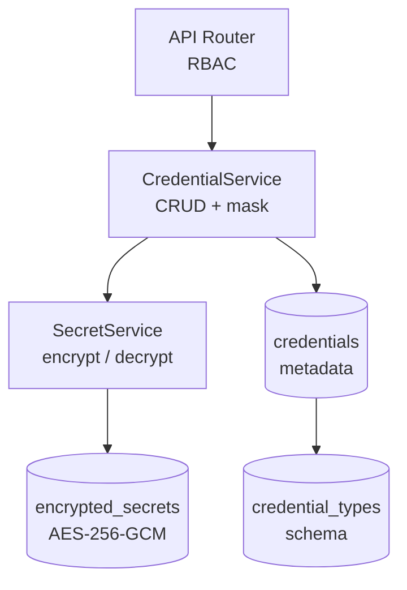

# Credentials

**Developer Guide — Understanding the Nexus credential system**

## Table of Contents

- [Overview](#overview)
- [Architecture](#architecture)
- [Credential Types](#credential-types)
- [RBAC](#rbac)
- [Encryption](#encryption)
- [Validation](#validation)
- [Workflow Integration](#workflow-integration)
- [Key Rotation](#key-rotation)
- [API Reference](#api-reference)

## Overview

The credential system provides secure storage and management of authentication secrets used by workflow nodes. Credentials are typed (each credential has a credential type that defines its field schema), encrypted at rest, and project-scoped.

Key properties:

- **Typed** — each credential conforms to a credential type schema that defines required fields, secret fields, and injector templates
- **Encrypted** — all field values (both secret and non-secret) are encrypted at rest via AES-256-GCM
- **Project-scoped** — credentials belong to a project and are isolated by project boundaries
- **Masked in responses** — on single-credential GET, secret fields are returned as `$encrypted$` and non-secret fields in cleartext; on list endpoints, all fields are masked (no decryption)

## Architecture



- **Router** (`src/syntara/credentials/router.py`) — HTTP endpoints with RBAC enforcement via PermissionChecker
- **CredentialService** (`src/syntara/credentials/services/credential_service.py`) — business logic, input validation, secret masking
- **SecretService** (`src/syntara/core/services/secret_service.py`) — encryption/decryption via SecretEncryptor (AES-256-GCM)
- **Preseed** (`src/syntara/credentials/lib/preseed.py`) — upserts 5 GA managed credential types at startup

## Credential Types

Credential types define the field schema and injector templates for credentials. GA ships with 5 managed (preseeded) types:

| Type | Fields | Auth Type | Purpose |
|------|--------|-----------|---------|
| HTTP Bearer Token | token(secret) | bearer | Bearer token API authentication |
| HTTP Basic Auth | username, password(secret) | basic | Username/password API authentication |
| Ansible Automation Platform | username, password(secret), oauth_token(secret) | aap | AAP Controller connectivity |
| LLM Provider | api_key(secret) | api_key | LLM service authentication |
| SSH Key | username, ssh_private_key(secret, multiline) | ssh | SSH key authentication (non-passphrase-protected) |

### Schema Structure

Each credential type has an `inputs` schema and an `injectors` template:

```json
{
  "inputs": {
    "fields": [
      {"id": "token", "label": "Token", "type": "string", "secret": true, "help_text": "..."}
    ],
    "required": ["token"]
  },
  "injectors": {
    "extra_vars": {"auth_type": "bearer", "bearer_token": "{{token}}"},
    "env": {},
    "file": {}
  }
}
```

Field properties:

- **id** — unique identifier, used as the key in credential inputs
- **type** — `string` or `boolean` (enforced at validation time)
- **secret** — if `true`, value is masked as `$encrypted$` in API responses
- **multiline** — if `true`, UI renders a textarea instead of a single-line input
- **choices** — optional list of allowed values (enforced at validation time)

### Managed vs Custom

- **Managed** (`managed: true`) — preseeded by the system, updated on startup via upsert. Cannot be deleted by users.
- **Custom** (`managed: false`) — created by users via API. Can be deleted.

Credential type endpoints are read-only for GA — authenticated users can list and view types, but cannot create, update, or delete them.

## RBAC

Credential access is controlled by Rego policy evaluation. Authorization is deny-by-default — requests are denied unless an explicit allow policy matches.

### Credential Actions

The credential system declares four resource actions, evaluated by the Rego evaluator at request time:

| Action | Description |
|--------|-------------|
| `credential:create` | Create a new credential in a project |
| `credential:read` | View credential metadata and masked fields |
| `credential:update` | Modify credential fields or reassign project |
| `credential:delete` | Permanently remove a credential |

Each action can be granted at two scopes:

- **System-scoped** — applies to credentials in all projects
- **Project-scoped** — applies only to credentials within the assigned project

Which roles grant which credential actions is managed by the authorization system (`role_conventions.py`). The credential system does not enforce roles directly — it declares resource:action pairs and delegates the decision to the Rego evaluator.

### Credential Type Endpoints

Credential type endpoints (`/credential_types`) require authentication only — no RBAC. Any authenticated user can list and view credential types.

### List Endpoint Scoping

The `GET /credentials` list endpoint uses `VisibilityFilter` to automatically filter results based on the requesting user's allowed projects. Users only see credentials in projects they have `credential:read` permission for. This filtering is transparent — no explicit project parameter is required.

### Secret Field Visibility

RBAC controls access to the credential resource, not individual fields. A user with `credential:read` permission sees all non-secret fields in cleartext and all secret fields masked as `$encrypted$`. There is no "reveal secret" permission — decrypted secret values are only available internally to the workflow engine during execution.

### Permission Checker Configuration

Each endpoint uses `PermissionChecker` with resource-aware configuration:

| Endpoint | Resource | Action | Additional Config |
|----------|----------|--------|-------------------|
| POST /credentials | credential | create | `body_project_field="project_id"` |
| GET /credentials | credential | read | `VisibilityFilter` (list scoping) |
| GET /credentials/{id} | credential | read | `resource_model=Credential, resource_id_param="credential_id"` |
| PATCH /credentials/{id} | credential | update | `resource_model=Credential, resource_id_param="credential_id"` |
| DELETE /credentials/{id} | credential | delete | `resource_model=Credential, resource_id_param="credential_id"` |
| GET /credentials/{id}/workflows | credential | read | `resource_model=Credential, resource_id_param="credential_id"` |

For `POST /credentials`, the `body_project_field="project_id"` config extracts the target project from the request body so the evaluator can check project-scoped create permissions.

For item endpoints (GET/PATCH/DELETE), the `resource_model` and `resource_id_param` config allows the checker to load the credential from the database and check its `project_id` against the user's project-scoped roles.

### Workflow Credential Access

When a workflow node references a credential via `credential_id` in its executor config, the workflow engine resolves the credential at execution time. The credential's decrypted fields are injected into the node's execution context via the injector template. This resolution bypasses RBAC — the authorization check happens at workflow design time (when the user selects the credential), not at execution time.

## Encryption

All credential field values are encrypted at rest using AES-256-GCM:

- **On create/update** — `SecretService.create_secret()` encrypts all input fields (both secret and non-secret) as a single JSON blob and stores the ciphertext in the `encrypted_secrets` table
- **On read** — `SecretService.retrieve_secret()` decrypts the blob; `CredentialService` masks secret fields as `$encrypted$` before returning
- **On list** — no decryption occurs; all fields are masked as `$encrypted$` for performance

### Encryption Key

The encryption key is configured via `APP_SECRET_ENCRYPTION_KEY` (hex-encoded 32-byte AES key). This key encrypts all credential secrets in the database.

### The `$encrypted$` Sentinel

- **In API responses**: secret fields are replaced with `$encrypted$` to indicate a value exists but is masked
- **In PATCH requests**: submitting `$encrypted$` for a field means "keep the existing value" — the field is not re-encrypted
- **In POST requests**: `$encrypted$` is rejected as invalid input (reserved sentinel)

## Validation

The `_validate_inputs()` function validates credential inputs against the credential type schema on both create and update:

| Check | Description |
|-------|-------------|
| Payload size | Serialized inputs must not exceed 64KB |
| Unknown fields | Fields not defined in the type schema are rejected |
| Sentinel on create | `$encrypted$` is rejected on create (reserved for PATCH) |
| Required fields | Missing required fields are rejected on create (skipped on PATCH — partial updates preserve existing values) |
| Choices | Fields with a `choices` constraint must have a value from the allowed list |
| Boolean type | Fields with `"type": "boolean"` must be actual boolean values (`true`/`false`), not strings or numbers |
| SSH key format | The `ssh_private_key` field is validated for correct key format (OpenSSH or PEM) and rejected if passphrase-protected |

## Workflow Integration

Credentials are consumed by workflow nodes through the injector resolution system:

1. A workflow node stores a `credential_id` in its executor config at design time
2. At execution time, the workflow engine resolves the credential by decrypting its stored fields
3. The `InjectorResolver` applies the credential type's injector template, replacing `{{field_id}}` placeholders with decrypted values
4. Resolved values are injected as `extra_vars`, `env` variables, or temporary file contents into the node's execution context
5. The `CredentialScrubber` sanitizes execution logs to prevent accidental secret leakage in activity output

### Credential Scrubbing

The `scrub_credentials()` function (`src/syntara/workflows/workflow_engine/utils/credential_scrubber.py`) replaces values at known credential field names in workflow execution output with `[REDACTED]`. This key-based scrubbing prevents secrets from appearing in activity logs, WebSocket streams, or API responses.

## Key Rotation

The key rotation CLI re-encrypts all stored credentials from an old encryption key to a new one.

**Key rotation requires application downtime** — the API server must be stopped during rotation to prevent race conditions with concurrent credential access. Typical duration is ~1-2 minutes for under 1,000 credentials.

### Procedure

1. **Back up the database** before rotation:
   ```bash
   pg_dump -U <user> syntara_api > nexus_backup_$(date +%Y%m%d_%H%M%S).sql
   ```

2. **Stop the API server** to prevent concurrent access.

3. **Run dry-run first**, then actual rotation:
   ```bash
   uv run python -m syntara.credentials.cli rotate-keys --old-key <hex> --new-key <hex> --dry-run
   uv run python -m syntara.credentials.cli rotate-keys --old-key <hex> --new-key <hex>
   ```

4. **Update `APP_SECRET_ENCRYPTION_KEY`** to the new key.

5. **Restart the API server.**

### CLI Options

- `--dry-run` — verify decryption/re-encryption without writing to the database
- `--batch-size N` — rows per commit batch (default: 50)
- Keys can also be provided via `APP_OLD_ENCRYPTION_KEY` / `APP_NEW_ENCRYPTION_KEY` environment variables

### How It Works

The CLI processes `encrypted_secrets` rows in paginated batches:

1. Attempts decryption with the old key
2. If the old key fails, tries the new key — if that succeeds, the row is already rotated and is **skipped**
3. Re-encrypts successfully decrypted rows with the new key
4. In dry-run mode, verifies the round-trip (decrypt with new key matches original plaintext)
5. Commits each batch within a transaction boundary

Progress reports three buckets: **rotated** (re-encrypted), **skipped** (already on new key), **failed** (neither key works). Key fingerprints are logged at startup so operators can confirm direction.

Exit codes: 0 (all rows on target key), 1 (some rows failed), 2 (fatal — bad keys or no DB connection).

### Interrupted Rotation Recovery

If rotation is interrupted (process killed, connection lost), credentials will be in a mixed state — some encrypted with the old key, some with the new key. No data is lost, but credentials encrypted with the wrong key will fail to decrypt until recovery is complete.

Re-running the CLI is safe and idempotent. Already-rotated rows are detected and skipped automatically. To recover, stop the API server and re-run in either direction:

- **Forward** (complete to new key): re-run with `--old-key <old> --new-key <new>` — already-rotated rows are skipped, exit code 0 when all rows resolve
- **Rollback** (revert to old key): run with `--old-key <new> --new-key <old>` — not-yet-rotated rows are skipped, exit code 0 when all rows resolve

After recovery, ensure `APP_SECRET_ENCRYPTION_KEY` matches whichever key all credentials are now encrypted with, then restart the API server.

## API Reference

### Credential Endpoints

| Method | Path | Operation | Auth |
|--------|------|-----------|------|
| POST | /api/v1/credentials | Create credential | RBAC: `credential:create` |
| GET | /api/v1/credentials | List credentials (project-scoped) | RBAC: `credential:read` + VisibilityFilter |
| GET | /api/v1/credentials/{id} | Get credential (secrets masked) | RBAC: `credential:read` |
| PATCH | /api/v1/credentials/{id} | Update credential | RBAC: `credential:update` |
| DELETE | /api/v1/credentials/{id} | Delete credential | RBAC: `credential:delete` |
| GET | /api/v1/credentials/{id}/workflows | Get referencing workflows | RBAC: `credential:read` |

All item endpoints (by ID) include project-scoped authorization — see [Permission Checker Configuration](#permission-checker-configuration) for how the credential's project is resolved.

### Project-Scoped Credential Endpoints

These endpoints operate within a specific project context, using a lightweight ownership check (no decryption or enrichment) to verify the credential belongs to the project.

| Method | Path | Operation | Auth |
|--------|------|-----------|------|
| POST | /api/v1/projects/{project_id}/credentials | Create credential in project | RBAC: `credential:create` |
| GET | /api/v1/projects/{project_id}/credentials | List credentials in project | RBAC: `credential:read` |
| GET | /api/v1/projects/{project_id}/credentials/{id} | Get credential (secrets masked) | RBAC: `credential:read` |
| PATCH | /api/v1/projects/{project_id}/credentials/{id} | Update credential | RBAC: `credential:update` |
| DELETE | /api/v1/projects/{project_id}/credentials/{id} | Delete credential | RBAC: `credential:delete` |
| GET | /api/v1/projects/{project_id}/credentials/{id}/workflows | Get referencing workflows | RBAC: `credential:read` |

The `POST` endpoint accepts a `ProjectCredentialCreate` body (no `project_id` field — it comes from the URL path). All other endpoints verify that the credential's `project_id` matches the URL before proceeding.

### Credential Type Endpoints

| Method | Path | Operation | Auth |
|--------|------|-----------|------|
| GET | /api/v1/credential_types | List credential types | Authentication only |
| GET | /api/v1/credential_types/{id} | Get credential type | Authentication only |
