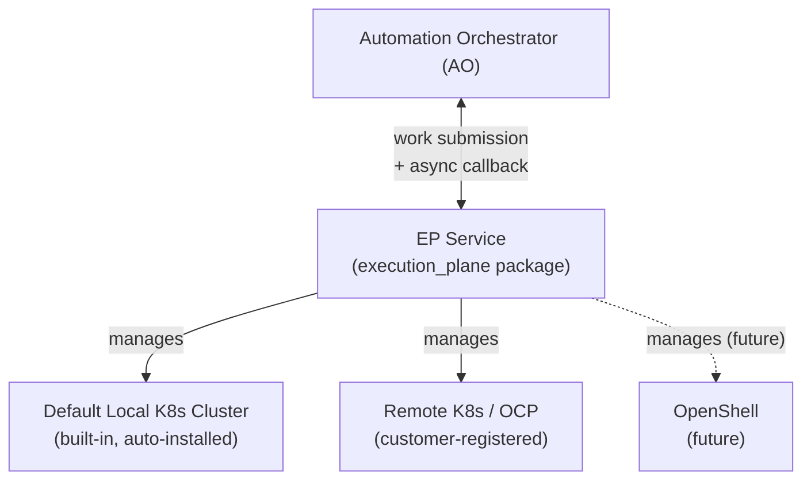
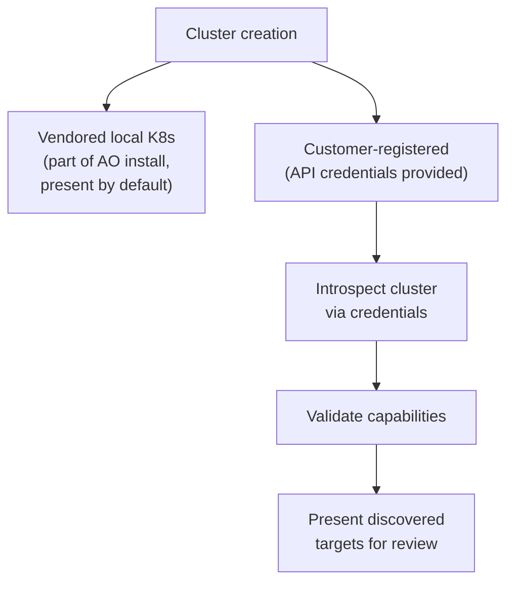
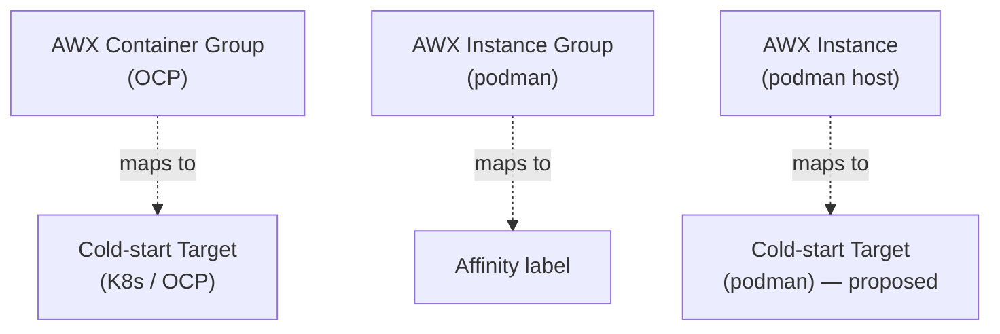
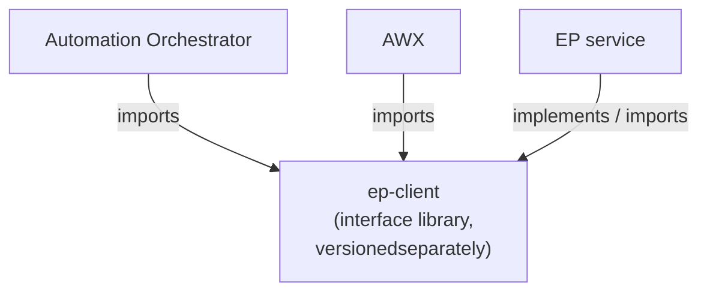

# Execution Plane: Cluster and Target Model

> **Design in progress.** This document captures emerging architecture — some sections reflect
> team consensus, others are clearly marked as extrapolation to advance discussion. Nothing here
> is final specification.
>
> **Tense convention:** Present tense describes what exists today in the codebase. Future tense
> ("will", "is intended to") describes agreed design direction that is not yet implemented.
> Extrapolation sections are explicitly marked.
>
> **Prerequisite reading:** [integration.md](./integration.md) — the current boundary crossings
> and the deliberate shortcuts in the existing implementation.

---

## 1. Starting point

The current branch establishes a foundation: `WorkItem`, `WorkStore`, and the EP worker poll
loop exist and work. The `Cluster` and `ExecutionTarget` models exist only as stubs. This
document maps the conceptual design that will fill those stubs — it is forward-looking design,
not a specification of what is built.

---

## 2. EP service: independence and deployment topology

The Execution Plane is intended to be a separately packaged service — not a module embedded
inside Automation Orchestrator (AO). Today it lives in the same repo with deliberate shortcuts
(see `integration.md`). This section describes the target architecture.

### What installs with AO

When AO is installed in a downstream product environment, two things will be auto-installed
alongside it:

1. **The EP service** — the `execution_plane` Python package, which will manage the execution
   plane: the Work Store, the worker process, and the API surface that AO submits work through.
2. **The default local Kubernetes cluster** — a built-in cluster, present after install, that
   the EP service manages by default.

These are distinct entities provisioned together in downstream. Dev environment behavior is TBD.
The 1-to-1 relationship is at the *service* level — one AO service to one EP service — and is
a permanent architectural constraint, not an MVP simplification. Each service may run multiple
replicas; a single AO service with several pods still pairs with a single EP service, which may
itself have several worker replicas.

### Relationship to AO

EP is intended to sit as a low-latency service *alongside* AO, not inside it. AO will submit
work to EP and wait for an async callback. EP will manage its own database, its own worker
processes, and its own cluster connections. The boundary crossings documented in [integration.md](integration.md)
are temporary shortcuts toward this topology.

### Independent versioning

EP and AO are intended to release at different cadences. The interface between them — the
schema constructs, submission contract, callback protocol — will need to be stable across
version combinations. The ep-client library (see §7) is the proposed bridge for this.

---

## 3. Clusters: gateway systems

A **Cluster** is an independent compute system. `Cluster.cluster_type` determines which
gateway API EP uses to reach it — the Kubernetes API server for K8s and OCP clusters,
OpenShell's own gateway surface for OpenShell clusters. The gateway is the cluster's API
surface; the WorkerManager holds that connection and dispatches work through it.

`ExecutionTarget.backend_type` selects the WorkerManager implementation, so a warm-pool
target and a cold-start target can coexist on the same cluster with entirely different
WorkerManager implementations — `cluster_type` establishes *how to connect*, `backend_type`
determines *how work runs*.

For the detailed database schema, lifecycle state machines, and registry/store pattern, see
[cluster-and-target-registries.md](cluster-and-target-registries.md).

| Cluster type | Gateway | Notes |
|---|---|---|
| Local K8s | Kubernetes API server | Built-in; vendored with AO install; always present |
| Remote K8s / OCP | Kubernetes API server | Customer-registered via API credentials |
| OpenShell | OpenShell gateway API | Future; gateway is OpenShell's own API surface |
| Bare metal | (separate epic) | Not in scope for this phase |

### Cluster creation paths

The vendored local cluster requires no user action — it exists after install.
Customer-registered clusters go through an onboarding flow: credentials in, introspection,
validation, target discovery. What the customer sees at the end of onboarding is a list of
execution targets to review and activate.

---

## 4. Execution Targets

An **Execution Target** is a specific execution configuration within a cluster. Where a
Cluster represents the gateway, an Execution Target represents *how* work runs inside
that cluster.

### Cold-start vs warm-pool

| | Cold-start | Warm-pool |
|---|---|---|
| Startup latency | Seconds (pod creation) | Milliseconds (pod already running) |
| Container image | Any image, per-invocation | Fixed, pre-provisioned |
| Volume mounts | Specified per-invocation | Fixed at Target definition (immutable) |
| Long-running workloads | Natural fit | Poor fit |
| EDA listeners | Natural fit | Poor fit |

Warm pool volume mounts are Target-level — fixed at provisioning time, not per-invocation.
A workload that needs to specify its own mounts must use cold-start. These requirements drive most workloads toward cold-start.
Warm pools remain a valid optimization for latency-sensitive, fixed-image workloads — but
they may represent a small fraction of actual usage.

The default cold-start target is automatically created for K8s-type clusters on
registration. It represents the lowest-privilege, highest-security baseline — no volume
mounts, no user-added secrets. User-created cold targets can add secrets and volume mounts
via CRUD with no background work required.

Warm targets can be created in the UI (K8s clusters only) or discovered via cluster
onboarding. Creation triggers background provisioning; the target carries an unavailable
status until the pool is ready.

Warm targets restrict CRUD — the only write operations are delete and deactivate. Any
configuration change requires a restart: the target transitions to unavailable, drains
in-flight work, then restarts. Pre-existing warm targets (discovered, not user-created)
follow the same restart lifecycle on configuration changes.

> The default target may not apply to OpenShell clusters, which have their own model.
> This is a minor detail to resolve when OpenShell support is added.

---

## 5. Execution Profiles: concepts (pre-design)

> **This section establishes conceptual shape only.** Affinity, matching, and capacity are
> not yet defined. Settling the concepts here is a prerequisite for the next planning phase,
> which will specify the mechanism once requirements across the supported cluster types are
> pinned down.

### Where the Profile lives

The **Execution Profile** belongs to the AO/AWX layer — not to the Execution Plane. EP
receives it as routing metadata attached to a work submission. EP does not own or store
profiles.

### Constraint types (to be defined)

A Profile carries constraints of varying strength — the exact mechanism is not yet
defined, but the conceptual shape:

- **Required affinity** — must match; no fallback. Example: a node pinned explicitly to a
  named warm Target, or a requirement for a specific capability that only one target class
  has.
- **Preferred affinity** — attempted first; falls back if no match. Example: prefer a
  warm pool for low latency; fall back to cold-start if none matches the profile.
- **Ordering hints** — shape the ranked list of candidate targets without hard-excluding
  any of them.

Volume mounts are **not** a hard cold-start requirement. A warm Target has fixed volume
mounts defined at provisioning time; a workload whose mount requirements match what a warm
Target provides can use it. Only workloads that need mounts the available warm targets
cannot satisfy are forced to cold-start. Long-running listeners are a cold-start fit by
nature, but that is a recommendation, not a structural constraint.

### The matching problem (to be defined)

Many properties may be specifiable at either the Profile level or the Target level. The
mechanism that brings them together — affinity labels, capacity expressions, name-based
selectors — is **not yet defined**. What is agreed:

- Matching should be label/name-based from the user's perspective
- Permissions are a known concern; the model is an explicit TODO

Defining affinity, matching, and capacity requires first pinning down what each supported
cluster type can actually express. See §8.

---

## 6. AWX integration

AWX has execution models that map into this architecture in different ways.

### Container groups (OCP)

AWX container groups run jobs on OpenShift. Each job can specify a different container
image — images are not fixed across runs. This is cold-start by nature and fits cleanly
into this model as a cold-start Execution Target.

The incompatibility with warm pools is immediate: if every job can specify a different
image, there is nothing to pre-warm. This is precisely the pattern that collapses the
warm-pool model at scale.

### Instance Groups and Instances (conventional / podman)

AWX's traditional execution model uses Instance Groups and Instances running on RHEL
hosts with podman.

| AWX concept | EP concept (proposed mapping) |
|---|---|
| Instance Group | Custom affinity label |
| Instance | Execution Target (cold-start, podman) |

Each Instance starts a new podman container per job — cold-start behavior. Whether
the traditional AWX Instance model is a priority to implement in the new system is not
yet decided. One possibility is that podman execution becomes a cluster type managed via
OpenShell rather than modeled directly. This remains open.

### ExecutionEnvironment model

AWX's `ExecutionEnvironment` model specifies the container image (and related settings)
for a job. The current ANSTRAT-1803 work presumes a similar concept on the EP side —
a model that carries container image reference and associated configuration. Where this
EP-side construct fits in the Cluster/Target hierarchy, and how it maps to the AWX
`ExecutionEnvironment`, is not yet fully determined. This is flagged as a question that
needs answering before AWX integration is fully specified.

---

## 7. Extrapolation: EP-client library

> **This section goes beyond current team consensus. It is included to advance the
> discussion, not to propose a decision.**

### The core tension: Profile and Target describe the same things

An **Execution Profile** (owned by AO/AWX) and an **Execution Target** (owned by EP) both
end up expressing the same fundamental properties: what container image to run, what volume
mounts to attach, what secrets to inject. They are the same conceptual configuration —
*this is what gets run* — but they live in different systems at different layers.

The divergence appears in *when* those properties are resolved:

- **Cold-start**: the Profile specifies image, mounts, and secrets at submission time; they
  are materialized when the pod is created. The Profile IS the execution configuration.
- **Warm Target**: a live pool already exists with those properties baked in at provisioning
  time. The Profile does not set them — it *matches* to a Target that already has them.

This is why matching is hard. In the warm-pool case, Profile fields need to compare against
Target fields to decide whether the pool satisfies the workload. In the cold-start case,
the same fields flow directly into the pod spec. The overlap is structural, not accidental.

**Why this matters across system boundaries**: Profile lives in AO/AWX; Target lives in EP.
These systems release independently. Any shared field definition — volume mount schema,
secret reference format, image specifier — must be agreed on across the boundary without
forcing lockstep releases.

A "shared library" is the obvious but bad answer — it becomes a dumping ground and creates
its own coupling.

### The ep-client proposal

An **ep-client** library exports only the interface: the shared schema constructs that
cross the AO/EP and AWX/EP boundaries — field types for image references, volume mounts,
secret references, affinity labels, and the submission/callback contract. Nothing else.

- AO imports ep-client to submit work and handle callbacks
- AWX imports ep-client to describe execution environments and profiles
- EP itself depends on ep-client as its own interface contract
- ep-client releases at its own cadence — slower than either EP or AO

Version compatibility: EP declares a minimum required ep-client version. As long as AO and
AWX are on a compatible ep-client version, neither needs to update when EP releases a new
version. The ep-client version is the stable handshake — not the EP release version.

This is not full decoupling — it does not mean EP and AO can diverge arbitrarily. It means
the *interface* changes less frequently than either implementation, and the ep-client version
is the unit of compatibility, not the EP release version.

---

## 8. Open questions

| Question | Notes |
|---|---|
| **Affinity, matching, capacity definition** | The most pressing design gap. Requires pinning down what each supported cluster type can express before the mechanism can be specified. This is the work that follows agreement on the concepts in this document. |
| Execution Profile cluster-type awareness | Does a Profile need to know what kind of cluster it's targeting? Goneri: K8s and bare metal express volume mounts differently. Alan's counterpoint: keep cluster-type awareness at the target level, not the profile. |
| ExecutionEnvironment placement | The current 1803 work presumes a container-image model on the EP side that maps to AWX's `ExecutionEnvironment`. Where this fits in the Cluster/Target hierarchy is not yet settled. |
| Podman-via-OpenShell | Is traditional podman execution absorbed into an OpenShell cluster type, modeled as its own cluster type, or deprioritized? |
| AWX Instance Group / Instance priority | Is implementing the traditional Instance model in EP a near-term priority, or scoped to a later phase? |
| Permissions system | How does Profile → Target matching interact with RBAC? Which users can create warm targets, assign profiles, or use restricted targets? |
| Cluster onboarding detail | Pending discussion with Ron, Matt, and Anastasia: the onboarding flow and target validation strategy. |
