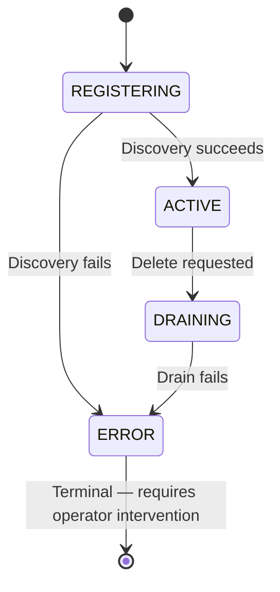
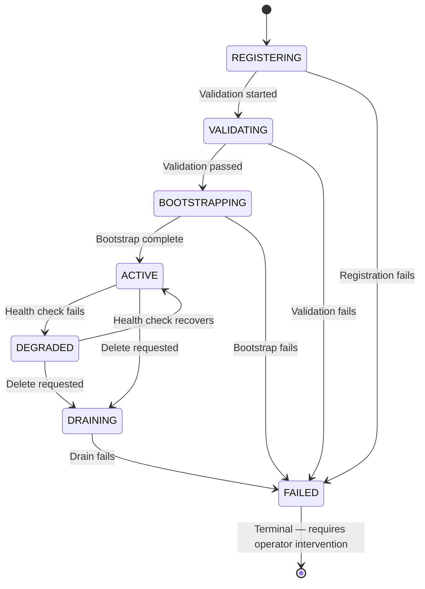
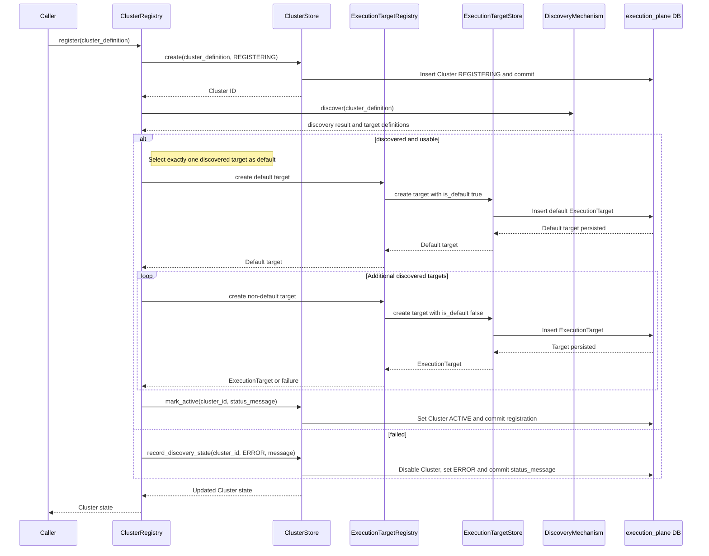
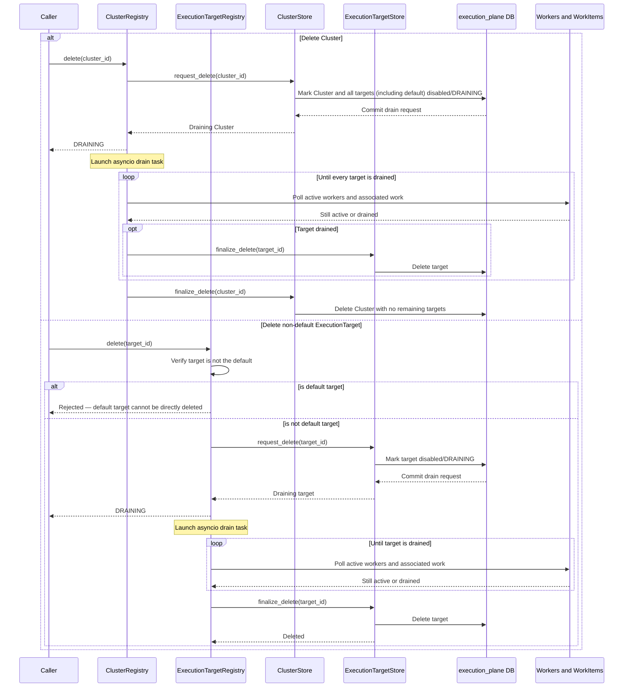
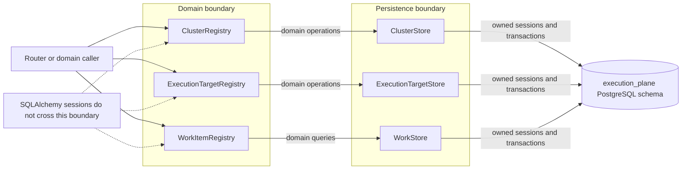

# Execution Plane: Cluster and Execution Target Registry Architecture

## Status and scope

This document defines the architectural model for Clusters and
ExecutionTargets in the Execution Plane. It describes the entities,
relationships, invariants, security boundary, persistence boundary, and
lifecycle operations. It is independent of a particular API, database
migration sequence, or external infrastructure provider.

The terminology follows AAP-92716 while using **Cluster** and
**ExecutionTarget** as the domain names. A Cluster is a logical compute
environment, such as an OpenShift installation, a RHEL machine pool, or
another supported environment. An ExecutionTarget is a concrete endpoint at
which work can be executed.

The architectural concepts and design rationale for these entities are described in
[cluster-and-target-model.md](cluster-and-target-model.md). This document specifies the
persistence model, registry/store boundaries, and operational invariants.

## Architectural principles

- A fully registered Cluster owns at least one ExecutionTarget. The ownership
  relationship is explicit in the database.
- Every fully registered Cluster has exactly one protected default target. The
  default target may be the Cluster's sole target.
- Eligibility and lifecycle are separate concerns. `enabled` controls whether
  a resource may participate in selection; lifecycle status records its
  operational state.
- Registries provide domain operations. Stores own database sessions,
  transactions, and persistence details. SQLAlchemy sessions do not cross the
  registry boundary.
- Deletion is a lifecycle transition followed by asynchronous drain and
  physical finalization. It is not an immediate cascade delete.
- Connectivity secrets are protected credentials, not ordinary metadata.
- Every execution-plane database model carries the same audit contract.

## Entities and relationships

### Cluster

`Cluster` is a table in the `execution_plane` schema.

| Field | Semantics |
|---|---|
| `id` | UUID primary key |
| `name` | Required, unique, human-readable name |
| `endpoint` | Cluster control-plane endpoint; unique across Clusters |
| `status` | `REGISTERING`, `ACTIVE`, `DRAINING`, or `ERROR` |
| `enabled` | Whether the Cluster may participate in selection or reconciliation |
| `status_message` | Optional human-readable lifecycle or error detail |
| `labels` | JSONB administration and routing metadata; never secret credentials |
| `api_key` | Protected credential used to authenticate to the Cluster |
| `created_by` | Actor or service identity that created the row |
| `created_at` | Creation timestamp |
| `updated_by` | Actor or service identity that last changed the row |
| `updated_at` | Last metadata or lifecycle update timestamp |

The Cluster `endpoint` identifies the control-plane endpoint. It is unique
across Clusters: two Clusters cannot represent the same endpoint.
The `api_key` is a protected credential. Raw credentials are write-only and
are never returned by normal reads, serialized into labels, written to logs,
or included in API responses.

`REGISTERING` represents a Cluster whose connectivity, dependencies, or target
configuration is not yet complete. `ACTIVE` means the Cluster is available to
participate in reconciliation and target selection. `DRAINING` prevents new
work and indicates graceful removal. `ERROR` is a terminal state: registration
or reconciliation failed; an `ERROR` Cluster is disabled and unavailable for
selection and requires operator intervention to resolve.
`status_message` records the associated human-readable detail.

#### Cluster lifecycle states



### ExecutionTarget

`ExecutionTarget` is a table in the `execution_plane` schema and belongs to
exactly one Cluster.

| Field | Semantics |
|---|---|
| `id` | UUID primary key |
| `cluster_id` | Non-null foreign key to `execution_plane.clusters.id` |
| `name` | User-facing target name |
| `backend_type` | Supported execution backend, such as `vanilla_k8s` or `openshell`. See [cluster-and-target-model.md](cluster-and-target-model.md) for the architectural relationship between `cluster_type` (gateway selection) and `backend_type` (WorkerManager implementation). |
| `endpoint` | Endpoint used for worker connectivity |
| `api_key` | Protected credential used to authenticate to the target |
| `status` | `REGISTERING`, `VALIDATING`, `BOOTSTRAPPING`, `ACTIVE`, `DEGRADED`, `DRAINING`, or `FAILED` |
| `enabled` | Eligibility/configuration gate |
| `is_default` | Whether this is the Cluster's protected default target |
| `status_message` | Optional human-readable lifecycle or error detail |
| `labels` | JSONB target metadata and routing labels; never secret credentials |
| `created_by` | Actor or service identity that created the row |
| `created_at` | Creation timestamp |
| `updated_by` | Actor or service identity that last changed the row |
| `updated_at` | Last metadata or lifecycle update timestamp |
| `last_ran_at` | Last time work ran on the target |

`backend_type` identifies the execution backend used by the target. Supported
backends include a vanilla Kubernetes API and an OpenShell gateway. In this
document, an execution backend or backend provider is the external system that
hosts work; it is distinct from the discovery mechanism used during Cluster
registration.

The target `api_key` follows the same protection rules as the Cluster
`api_key`. A target may have its own credential when the backend requires it;
the Cluster credential is not implicitly exposed through the target model.

#### ExecutionTarget lifecycle states



The relationship is one-to-many with a mandatory child:

```text
Cluster 1 ──────── 1..* ExecutionTarget
```

The `1..*` cardinality applies to a fully registered Cluster. A Cluster record
is created first in `REGISTERING` and may temporarily have no targets while
discovery is in progress. It cannot become `ACTIVE` until the first target has
been created as the protected default; additional targets are optional.

`WorkItem.execution_target_id` references the target selected for a claimed
work item. Administrative reads include draining records, while selection
queries require `enabled=True`, an `ACTIVE` status, and an `ACTIVE` Cluster.
Whether `DEGRADED` is eligible is a reconciler policy; it is not eligible by
default.

### WorkItem and audit contract

`WorkItem` remains the durable unit of work exchanged between Execution Plane Consumers (such as a Temporal worker) and the Execution Plane worker. Its existing lifecycle timestamps,
including `claimed_at`, `completed_at`, and `signaled_at`, describe work
processing and are distinct from audit timestamps.

Every execution-plane database model, including `WorkItem`, `Cluster`,
`ExecutionTarget`, and future persistence models, contains:

- `created_by`
- `created_at`
- `updated_by`
- `updated_at`

Create operations populate the creator fields. Lifecycle transitions and
worker-owned changes update `updated_by` and `updated_at`. System-initiated
actions, such as claiming a WorkItem, use a well-known `SYSTEM` UUID as the
`updated_by` value rather than an ambiguous null actor.

## Invariants

The database and stores enforce the following invariants:

1. Every ExecutionTarget has a non-null `cluster_id` referencing an existing
   Cluster.
2. Every `ACTIVE` Cluster has at least one ExecutionTarget.
3. Every `ACTIVE` Cluster has exactly one `is_default=True` target.
4. A partial unique index on `execution_targets.cluster_id` where `is_default`
   is true enforces uniqueness of the default target.
5. The default target cannot be updated or directly deleted through
   `ExecutionTargetRegistry`. It is removed only as part of a Cluster
   deletion, which removes all related targets.
6. A normal target update cannot change `cluster_id` or `is_default`.
7. A target is eligible for new work only when it and its Cluster are enabled
   and their lifecycle states permit selection.
8. A draining target cannot receive new work and cannot be physically deleted
   until its active work has completed.
9. A Cluster cannot be physically deleted while related targets remain.
10. Every Cluster has a unique `endpoint`. Two Clusters cannot represent the
    same endpoint.

The at-least-one-child invariant is represented by registration and lifecycle
logic; a simple foreign key cannot enforce it. `ClusterStore` always creates
the Cluster record in `REGISTERING` before discovery. `REGISTERING` may
therefore temporarily have no targets, and is unavailable for selection.
The default target is created through `ExecutionTargetRegistry`, and the
Cluster cannot become `ACTIVE` until that target exists.

## Registration and discovery operation

Registration is a domain operation orchestrated by `ClusterRegistry` and
persisted by `ClusterStore`. The registry owns the discovery workflow and
discovery-mechanism interaction; the store owns only persistence, transactions,
and lifecycle state changes.

At registration, `ClusterRegistry` first asks `ClusterStore` to create and
persist the Cluster in `REGISTERING`. It then invokes a discovery mechanism to
validate connectivity, discover configured targets, and determine which target
is the protected default. The discovery mechanism returns domain-level target
definitions and discovery state; it does not return ORM instances or receive
database sessions.

The discovery boundary is:

```text
ClusterRegistry
  -> ClusterStore.create(cluster_definition)
  -> ClusterDiscoveryMechanism.discover(cluster_definition)
  -> ExecutionTargetRegistry.create(cluster_id, target_definition)
  -> ExecutionTargetStore.create(...)
```

The registration sequence keeps persistence behind the store while leaving
workflow orchestration in the registry. The discovery mechanism returns domain
data and does not receive a database session. `ClusterRegistry` selects which
discovered target is the default and passes that designation to
`ExecutionTargetRegistry`; it does not create target records itself.



Discovery outcomes are `discovered` or `failed`. For a discovered
configuration, `ClusterRegistry` creates every target through
`ExecutionTargetRegistry`, including exactly one target with
`is_default=True`, and only then marks the Cluster `ACTIVE` through
`ClusterStore`. If one or more additional (non-default) targets fail to
register, the failures are logged and the Cluster still transitions to
`ACTIVE` provided the default target was created successfully; in this case
`status_message` records which targets could not be registered. If discovery
itself fails or the default target cannot be created, the existing Cluster is
updated with `enabled=False`, status `ERROR`, and a suitable
`status_message`; it is never made `ACTIVE`. `ERROR` is a terminal state.
In the MVP, the discovery mechanism may be a no-op and targets may be declared
manually, but every `ACTIVE` Cluster still has a protected default target.

## Deletion and draining operation

Deletion has two distinct phases: a transactional drain request and later
physical finalization.

### Cluster deletion

`ClusterRegistry.delete(cluster_id)` performs one transaction that:

1. Loads the Cluster and verifies its existence.
2. Handles repeated requests according to the API's idempotency convention.
3. Sets the Cluster to `enabled=False` and `status=DRAINING`.
4. Sets every associated target, including the default target, to
   `enabled=False` and `status=DRAINING`.
5. Updates audit fields and commits.

The request returns the Cluster in its draining state. It does not wait for
workers and does not physically delete database rows.

The following sequence shows both the Cluster-wide and individual target
lifecycles. In either case, disabling the target closes the selection path
before the registry waits for active work to finish.



The ClusterRegistry's drain operation finds draining Clusters, relies on target
eligibility filtering to prevent new work, and polls each target until the
target's active workers and associated work have completed naturally. For each
drained target it calls `ExecutionTargetStore.finalize_delete`. The Cluster is
deleted only after all related targets have been removed.

Drain polling runs as asyncio tasks initiated by `ClusterRegistry`. For a
Cluster deletion, one task per ExecutionTarget is launched and gathered; for an
individual target deletion, a single task is launched. On startup of the
Execution Plane, a recovery pass finds all Clusters and ExecutionTargets in
`DRAINING` and re-launches their drain tasks, following the same
startup-recovery pattern used by `_recover_undelivered` in `worker.py`.

If a drain operation fails irrecoverably, the affected Cluster or
ExecutionTarget transitions to `ERROR`. `ERROR` is a terminal state requiring
operator intervention to resolve.

### ExecutionTarget deletion

`ExecutionTargetRegistry.delete(target_id)` performs the target equivalent:

1. It rejects direct deletion of the protected default target. The default
   target is removed only as part of a Cluster deletion.
2. It marks the target `enabled=False` and `status=DRAINING` in a transaction.
3. It updates audit fields and returns or exposes the draining state.
4. It launches an asyncio drain task that polls until all active workers and
   associated work have completed naturally.
5. After the drained predicate is satisfied, it delegates physical deletion to
   `ExecutionTargetStore.finalize_delete` and exits.

The drained predicate is a worker/lifecycle concern and must account for the
WorkItem states and worker ownership semantics. Until the predicate is true,
the target remains in the database as an administrative record but is excluded
from selection.

## Persistence and registry boundaries

Registries are the domain-facing boundary; stores are the database-facing
boundary. A registry may coordinate discovery mechanisms and drain polling,
but only a store creates sessions, executes persistence operations, and commits
or rolls back transactions.



### Stores

`ClusterStore` and `ExecutionTargetStore` follow the `WorkStore` pattern:
they own their async engines and session factories, open short-lived sessions,
own commit/rollback behavior, expose domain operations rather than sessions,
and support asynchronous disposal/context-manager usage.

`ClusterStore` provides creation of the `REGISTERING` record, retrieval,
listing, Cluster status transitions, Cluster drain requests, and finalization
guarded by the no-children invariant. It does not select or invoke a discovery
mechanism and does not create ExecutionTargets.

`ExecutionTargetStore` provides target creation, retrieval, listing with
optional eligibility filtering, narrow metadata updates, drain requests, and
physical finalization. `finalize_delete` is callable only after the registry's
drain operation has established that the target is safe to remove.

### Registries

Registries are the domain-facing layer used by the router, discovery mechanism,
and drain consumers. They do not accept or expose SQLAlchemy sessions.

`ClusterRegistry` exposes registration, retrieval, administrative listing, and
graceful deletion. `ExecutionTargetRegistry` exposes manual target
registration, retrieval, administrative or eligible listing, narrow updates,
and graceful deletion. Both registries preserve lifecycle state in
administrative views while selection-oriented operations exclude unavailable
resources.

The current read-only `ExecutionTargetRegistry` in `services.py` is therefore
replaced or split so the domain registry owns this complete contract;
`WorkItemRegistry` remains separate.

## API and security boundary

The API distinguishes a delete request accepted into `DRAINING` from later
physical deletion. Administrative list responses include lifecycle state and
relationship identifiers, including draining resources. Selection-oriented
queries provide an explicit eligible-only view.

Connectivity endpoints may be returned to authorized callers. Raw `api_key`
values are never returned. APIs expose only a redacted status or equivalent
non-secret metadata. Credentials must also be excluded from logs, labels,
ordinary model serialization, and audit payloads.

The existing router is temporarily hosted by Syntara. The store and registry
boundaries are independent of that hosting arrangement so the Execution Plane
can later become a standalone service.

## Schema and operational considerations

The `execution_plane` schema contains the Cluster, ExecutionTarget, and
WorkItem tables. The schema must provide:

- a foreign key from `execution_targets.cluster_id` to `clusters.id`;
- a unique constraint on `clusters.endpoint`;
- a partial unique index for one default target per Cluster;
- indexes for Cluster names, Cluster endpoints, target membership, lifecycle
  status, enabled state, and eligible-target queries;
- audit columns on every database model;
- protected storage for target and Cluster `api_key` values.

The design does not prescribe whether the drained predicate is based solely on
terminal WorkItems, claimed workers, or an additional worker heartbeat. That
predicate is part of the worker lifecycle contract, but it must be strong
enough to ensure that finalization cannot race with active execution.

## Related context

- [AAP-92716](https://redhat.atlassian.net/browse/AAP-92716) describes the
  broader registry concept and lifecycle concerns.
- [`integration.md`](integration.md) documents the current temporary boundary
  crossings between Syntara and the Execution Plane.
