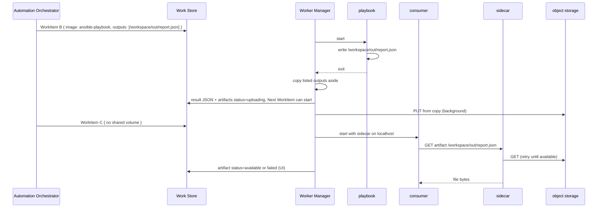

# Execution Plane: Collection of WorkItem execution results

This document is the **result-collection** contract: after a WorkItem
exits, copy named files off the container filesystem and upload them
so later nodes or the UI can fetch them **without** stuffing bytes
into `WorkItem.result`.

Sharing a live directory across successive WorkItems is a
**different** contract: the **workspace**. See
[data-sharing-with-workspace.md](data-sharing-with-workspace.md). A WorkItem can use both: it
writes under `/workspace` and also lists paths to collect when it
exits.

- Ticket: [AAP-94189](https://redhat.atlassian.net/browse/AAP-94189)
- Feature: [ANSTRAT-1803](https://redhat.atlassian.net/browse/ANSTRAT-1803)
- Parent epic: [AAP-82060](https://redhat.atlassian.net/browse/AAP-82060)
- Workspace contract: [data-sharing-with-workspace.md](data-sharing-with-workspace.md)

## What this document is

A first cut of how AO names **which files** to harvest from a finished
WorkItem, and how EP turns those paths into object-store **references**
on `WorkItem.result`.

Listed outputs are filesystem paths. They are not a workspace
snapshot (that PUT is the **whole** `/workspace` tree; see
[example 03](examples/03-data-sharing-with-workspace-object-store.md)).
They are not AO FileManager ([file-storage.md](../file-storage.md)).

## Two kinds of "result"

| Kind | Where it lives | Size |
|---|---|---|
| **Status JSON** | `WorkItem.result`, then the Completion Notifier / Temporal callback | Small. Today's `ScriptOutput` (return code, stdout, stderr). |
| **File artifacts** | Object storage | Large. `artifacts[]` on the result is UI metadata (`path`, `uri`, `status`, `size`), not the bytes. |

`WorkItem.result` stays a small JSON blob. Large files go to object
storage. Temporal payload limits make that split mandatory.

The WorkItem names **which files** to upload. That is enough. It does
not name a destination URI.

## Harvest, then unmount, then upload

After the container exits, the Worker Manager **copies listed paths
aside** (a spool), mints an object key for each, and **unmounts** any
workspace. The WorkItem can then complete. **Upload to object
storage (S3) runs in the background from that copy**, not from the
live volume. It does not delay AO triggering the next WorkItem. A
later WorkItem on the same workspace UUID can mount immediately
without tearing the PUT.

Each artifact on `WorkItem.result` has a `status` (`uploading` until
that PUT finishes, then `available` or `failed`) and a `size` in
bytes (from harvest). That metadata is for the UI. **Chaining does
not wait on it.** Temporal already completed.

```json
"data": {
  "outputs": [
    "/workspace/out/report.json",
    "/workspace/out/summary.txt"
  ]
}
```

```json
"result": {
  "output": { "...": "status JSON" },
  "artifacts": [
    {
      "path": "/workspace/out/report.json",
      "uri": "s3://orchestrator-files/artifacts/wi-7c1a/report.json",
      "status": "available",
      "size": 12480
    },
    {
      "path": "/workspace/out/summary.txt",
      "uri": "s3://orchestrator-files/artifacts/wi-7c1a/summary.txt",
      "status": "uploading",
      "size": 882
    }
  ]
}
```

Both objects are on the result as soon as the WorkItem completes.
`uri` is the minted key (stable from harvest). `size` is the file
size in bytes at harvest. `status` starts as `uploading`, then
`available` when that PUT succeeds, or `failed` when it errors.
PUTs can finish at different times; the snapshot above is mid-flight.

| Field | On the WorkItem | Meaning |
|---|---|---|
| `data.outputs[]` | payload, at submit | In-container file path to upload. No `uri`. |
| `result.artifacts[].path` | result, from complete | Same path, so AO and the sidecar can match. |
| `result.artifacts[].uri` | result, from complete | Object key minted at harvest. Sidecar GET-able only when `status` is `available`. UI may show it. |
| `result.artifacts[].status` | result, from complete | `uploading`, `available`, or `failed`. UI. Sidecar waits; AO does not. |
| `result.artifacts[].size` | result, from complete | File size in bytes, taken at harvest. |

AO does not pick object keys before submit. There is no `data.inputs`
list. `failed` means the PUT errored; the sidecar must not wait on
`uploading` forever.

Push happens even on failure when a listed file exists: partial
artifacts are often what the author needs. Whether a failed run still
uploads is an open question; leaning yes, with the JSON result still
`FAILED`. A listed path that the run never created is omitted from
`artifacts` (or recorded as missing — open question).

Status JSON does not go through S3. It stays on `WorkItem.result` as
today ([Work Store](work-store.md)). That JSON is what AO uses to
trigger the next WorkItem; it does not wait on the background PUT.

Omitted `outputs` means "none".

## How a later node gets the bytes

A later WorkItem that **shares the workspace** just reads the file on
disk. It does not need listed outputs for that. Listed outputs are
the path when the consumer **does not** share the volume (another
cluster, another namespace, or no workspace at all).

| Situation | How |
|---|---|
| **Same namespace** | GET an HTTP server on the **producer** WorkItem's sidecar. That sidecar outlives the activity container and exposes the harvested spool. Only reachable in that namespace. It can serve before the S3 PUT is `available`. |
| **Other cluster / other namespace** | The consumer activity calls a **localhost HTTP API** on **its** sidecar. That sidecar holds object-store credentials and GETs S3. It retries until `available` or `failed`. |

A CLI is a wrapper around those HTTP APIs, not a second protocol.
The activity image does not get S3 credentials.

The sidecar is the observer the Completion Notifier cannot be: the
next WorkItem is already running; the fetch blocks **inside the
container at first use**. Same-namespace traffic hits the producer
sidecar; cross-namespace traffic hits S3 through the consumer
sidecar. Do not add a dedicated HTTP-activity WorkItem per artifact
for this. HTTP and Git activities stay the path for AO-resolved
**inputs** (file id → URL, Git SHA) into a
[workspace](data-sharing-with-workspace.md).

The sidecar is a way to speed up copies before S3 is `available`.
The exact transport (routes, auth, OpenShell) needs a dedicated
follow-up; this document only names the contract: localhost HTTP,
credentials in the sidecar, not in the activity image.

## Payload shape

Illustrative keys only. Not the final field design. A WorkItem may
also carry `workspace`; that field is defined in
[data-sharing-with-workspace.md](data-sharing-with-workspace.md).

```json
{
  "selectors": {},
  "payload": {
    "activity": {
      "image": "registry.redhat.io/ao/ansible-playbook:1.0.0",
      "params": {
        "playbook": "site.yml"
      }
    },
    "data": {
      "outputs": [
        "/workspace/out/report.json",
        "/workspace/out/summary.txt"
      ]
    }
  }
}
```

## Who does what

```
AO
  submit WorkItem with data.outputs[] (in-container paths)
    → Work Scheduler → Worker Manager
          copy listed paths aside, mint keys, complete, unmount
          S3 PUT from copy (background)
          sidecar on later WorkItems → GET artifact (retry until available or failed)
        → Work Watcher
              WorkItem.result (JSON + artifacts[].uri, status, size)
        → Completion Notifier → AO
```

| Concern | Owner |
|---|---|
| Copy listed outputs aside, then unmount; S3 PUT from the copy (`status=uploading` → `available` or `failed`); does not gate the next WorkItem | Worker Manager |
| Write `artifacts[]` on `WorkItem.result` (UI); patch `status` when a PUT finishes or fails | Work Watcher / Work Store |
| Fetch listed outputs of a prior WorkItem when no shared volume | Same namespace: GET the producer sidecar HTTP server (spool). Else: consumer sidecar GETs S3 (holds credentials). |
| Inject artifact sidecar (producer HTTP server and/or consumer localhost client) | Worker Manager |

## Sequence (listed outputs, no shared workspace)



## Out of scope

| Omitted | Why |
|---|---|
| Workspace volume / snapshot | [data-sharing-with-workspace.md](data-sharing-with-workspace.md) |
| Placement / selectors | [labels.md](labels.md) |
| AO file upload, conversion, RBAC | [file-storage.md](../file-storage.md) |
| In-container activity SDK beyond curl/CLI to the sidecar | Separate SDK design. Sidecar HTTP is this contract. |
| Customer S3 IAM setup | Platform / credential work. Sidecar holds EP credentials; the activity image does not. |
| Streaming stdout as files | Still `WorkItem.result` / log plumbing |

## Open questions

1. **Sidecar transport.** Localhost HTTP is the contract. A CLI wraps
   that API. Exact routes, auth to the sidecar, and OpenShell (no
   sidecar) are implementation. Lean: HTTP on localhost, no S3 creds
   in the activity image. This deserves a dedicated follow-up.
2. **Failed runs and partial uploads.** Lean yes for listed
   `outputs`, so the author can inspect.
3. **Minted object-key scheme.** Work item id + basename is enough
   for uniqueness. Exact prefix (`artifacts/wi-…/`) is an
   implementation choice, not a payload field.
4. **Listed path missing after the run.** Omit from `artifacts`, or
   record an error for that path. Lean: omit, do not fail the whole
   upload list.

## Coordination

- **[data-sharing-with-workspace.md](data-sharing-with-workspace.md):** live `/workspace` across
  WorkItems. Listed outputs are harvested files, not that tree.
- **[Worker Manager](worker-manager.md):** copies `data.outputs`
  aside, unmounts, uploads from the copy in the background. Injects
  the artifact sidecar: HTTP server on the producer WorkItem (same
  namespace, serves the spool) and localhost client on consumers that
  must GET S3. That PUT does not delay the next WorkItem.
- **[Work Store](work-store.md):** `WorkItem.result` stays small JSON
  (run status plus `artifacts[]` UI metadata: minted `uri`, `status`
  `uploading` | `available` | `failed`, and `size` in bytes). Artifact
  bytes are not a JSONB column. EP patches `artifacts[].status` when a
  background PUT finishes or fails. Chaining does not poll this;
  the sidecar does.
- **[file-storage.md](../file-storage.md):** AO S3 for uploads. Listed
  output PUT/GET credentials stay in the sidecar. EP does not import
  `FileManager`.
- **AAP-92720 (Work Executor):** persist `payload.data`; validate
  output paths once a submission API exists.
- **Container SDK (AO / EP, separate design):** listed-output
  **fetch** is the Worker Manager sidecar: HTTP server on the producer
  WorkItem (same namespace) or localhost client to S3. Optional CLI
  wrapper. Harvest is copy-aside in the Worker Manager after exit, not
  an SDK inside the activity image.
