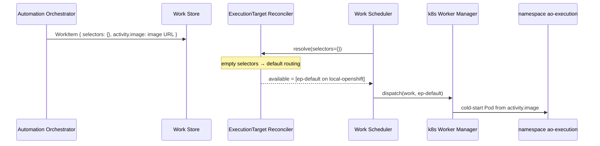

# Example: one workload, default Cluster, default ExecutionTarget

The simplest Execution Plane (EP) configuration: Automation Orchestrator
(AO) submits one workload, EP has one OpenShift Cluster, and that
Cluster has only its protected default ExecutionTarget.

- Ticket: [AAP-92721](https://redhat.atlassian.net/browse/AAP-92721)
- Feature: [ANSTRAT-1803](https://redhat.atlassian.net/browse/ANSTRAT-1803)
- Parent epic: [AAP-82060](https://redhat.atlassian.net/browse/AAP-82060)

## What this example is

A concrete inventory of the objects EP sees in the MVP cold-start path.
[Example 01](01-select-region-and-env.md) adds Cluster and namespace
selectors (`region`, `env`).
[Example 02](02-volume-mount.md) adds a workload that needs a volume
mount.
[Example 03](03-openshell-sandbox-policy.md) adds an OpenShell
ExecutionTarget and a sandbox policy on the payload.
[Example 04](04-no-matching-targets.md) is example 01 when no target
matches: the work fails (`NO_MATCHING_TARGETS`).

EP's unit of work is the submitted workload. EP does not read AO
workflow, node, project, or Execution Profile definitions. AO must
already have resolved those into the WorkItem that reaches EP.

Matching rules are in the
[ExecutionTarget Reconciler](../executiontarget-reconciler.md). Label
vocabulary is in [labels.md](../labels.md). Cluster and default-target
invariants are in
[cluster-and-target-registries.md](../cluster-and-target-registries.md).

## Incoming workload

AO submits a WorkItem. `selectors` is empty: AO sent no placement
constraints. `activity.image` is the container image AO already
resolved (here, `registry.redhat.io/ao/http-request:1.0.0`). It is
not a node-type alias such as `http_request`.

```json
{
  "selectors": {},
  "payload": {
    "activity": {
      "image": "registry.redhat.io/ao/http-request:1.0.0",
      "params": {
        "url": "https://google.ca"
      }
    }
  }
}
```

| Field | Meaning for EP |
|---|---|
| `selectors` | Placement constraints. Empty → [default routing](../executiontarget-reconciler.md#default-routing). |
| `payload.activity.image` | Container image reference. AO resolved it from the Extension (or a user override) before submit. EP does not look up an alias. |
| `payload.activity.params` | Input passed to the running container. |

The Worker Manager uses `payload.activity.image` to construct the pod.
It is not a required selector in this example. A required image
selector would exclude any default ExecutionTarget that does not
advertise that image. The default target is image-agnostic cold-start.

## Registered Cluster

One Cluster: the local OpenShift cluster the control plane is on.

```yaml
cluster:
  name: local-openshift
  cluster_type: openshift
  endpoint: https://api.cluster.local:6443
  status: active
  enabled: true
  labels:
    cluster: local-openshift
```

`cluster` is a natural label from provisioning, not a user-written
key.

## Default ExecutionTarget

Every active Cluster has exactly one protected default ExecutionTarget
(`is_default: true`). It may be the Cluster's sole target. It is a
Kubernetes namespace on this Cluster.

```yaml
# Illustrative keys only. Names such as endpoint, namespace, and labels
# are for readability and are not the final field design.
execution_target:
  name: ep-default
  cluster: local-openshift
  namespace: ao-execution
  backend_type: k8s
  endpoint: https://api.cluster.local:6443
  is_default: true
  status: active
  enabled: true
  labels: {}
```

Effective labels for matching are Cluster labels overlaid with
ExecutionTarget labels:

```text
{ cluster: local-openshift }
```

## What EP does

1. **Reconcile.** `selectors: {}` takes default routing. The only
   lifecycle-eligible default target is `ep-default` on
   `local-openshift`. Outcome: `MATCHED`, eligible set
   `{ep-default}`.
2. **Dispatch.** The Work Scheduler picks that target. The Worker
   Manager for `backend_type=k8s` cold-starts a pod in namespace
   `ao-execution`.
3. **Run.** The pod uses `payload.activity.image`.
   Container input is `payload.activity.params`.

```text
WorkItem
  selectors {}                 →  ep-default (is_default)
  payload.activity.image        →  container image
  payload.activity.params      →  container input
```



## Out of scope here

| Omitted | Why |
|---|---|
| Extra Clusters | [Example 01](01-select-region-and-env.md) |
| Extra ExecutionTargets / namespaces | [Example 01](01-select-region-and-env.md) |
| Non-empty `selectors` (`region`, `env`) | [Example 01](01-select-region-and-env.md) |
| Selectors that match nothing | [Example 04](04-no-matching-targets.md) |
| Other user labels (`gpu`, team) | Later examples |
| Volume mount | [Example 02](02-volume-mount.md) |
| OpenShell sandbox policy | [Example 03](03-openshell-sandbox-policy.md) |
| Warm pools | MVP is cold-start vanilla Kubernetes |
| AO workflow / node / Execution Profile rows | Not visible to EP |
