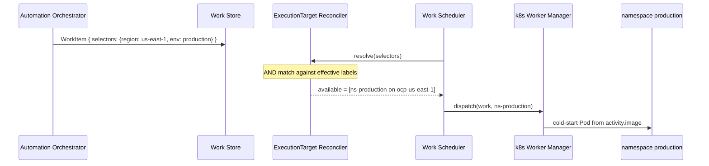

# Example: select a Cluster by region and a namespace by env

Builds on
[00-one-workload-default-target.md](00-one-workload-default-target.md).
The same workload
(`activity.image` = `registry.redhat.io/ao/http-request:1.0.0`) now
carries placement selectors. EP matches them against Cluster and
ExecutionTarget **labels** (tags).

- Ticket: [AAP-92721](https://redhat.atlassian.net/browse/AAP-92721)
- Feature: [ANSTRAT-1803](https://redhat.atlassian.net/browse/ANSTRAT-1803)
- Parent epic: [AAP-82060](https://redhat.atlassian.net/browse/AAP-82060)

## What this example is

EP still only sees the submitted WorkItem. AO has already resolved
whatever UI or Execution Profile produced these selectors; EP does not
re-derive them.

Work requires:

- a Cluster labelled `region=us-east-1`
- a namespace (ExecutionTarget) labelled `env=production`

Matching is exact AND against each target's **effective labels**
(Cluster labels, then ExecutionTarget labels). See
[labels.md](../labels.md) and the
[ExecutionTarget Reconciler](../executiontarget-reconciler.md).

Selectors are present, so [default routing](../executiontarget-reconciler.md#default-routing)
does **not** apply. A Cluster's protected default ExecutionTarget is
eligible only if it also satisfies every selector.

## Incoming workload

```json
{
  "selectors": {
    "region": "us-east-1",
    "env": "production"
  },
  "payload": {
    "activity": {
      "image": "registry.redhat.io/ao/http-request:1.0.0",
      "params": {
        "url": "https://google.ca"
      }
    }
  }
}
```

| Field | Meaning for EP |
|---|---|
| `selectors.region` | Must match a Cluster (or target) label `region=us-east-1`. Region is a fact of the whole Cluster. |
| `selectors.env` | Must match an ExecutionTarget label `env=production`. That target is a Kubernetes namespace. |
| `payload.activity.image` | Container image reference (unchanged from example 00). |
| `payload.activity.params` | Input passed to the running container. |

## Registered Clusters

Two OpenShift Clusters. `region` lives on the Cluster: it is true of
every namespace on that Cluster and does not need repeating on each
ExecutionTarget.

```yaml
clusters:
  - name: ocp-us-east-1
    cluster_type: openshift
    endpoint: https://api.us-east-1.example.com:6443
    status: active
    enabled: true
    labels:
      region: us-east-1

  - name: ocp-eu-west-1
    cluster_type: openshift
    endpoint: https://api.eu-west-1.example.com:6443
    status: active
    enabled: true
    labels:
      region: eu-west-1
```

## ExecutionTargets (namespaces)

Each Cluster still has a protected default target (`is_default: true`).
`ocp-us-east-1` also has a production namespace.

```yaml
# Illustrative keys only. Names such as endpoint, namespace, and labels
# are for readability and are not the final field design.
execution_targets:
  - name: ep-default
    cluster: ocp-us-east-1
    namespace: ao-execution
    backend_type: k8s
    endpoint: https://api.us-east-1.example.com:6443
    is_default: true
    status: active
    enabled: true
    labels: {}

  - name: ns-production
    cluster: ocp-us-east-1
    namespace: production
    backend_type: k8s
    endpoint: https://api.us-east-1.example.com:6443
    is_default: false
    status: active
    enabled: true
    labels:
      env: production

  - name: ep-default
    cluster: ocp-eu-west-1
    namespace: ao-execution
    backend_type: k8s
    endpoint: https://api.eu-west-1.example.com:6443
    is_default: true
    status: active
    enabled: true
    labels: {}
```

Effective labels (Cluster ∪ ExecutionTarget):

| Target | Effective labels | Matches `{region: us-east-1, env: production}`? |
|---|---|---|
| `ocp-us-east-1` / `ep-default` | `{region: us-east-1}` | no (missing `env`) |
| `ocp-us-east-1` / `ns-production` | `{region: us-east-1, env: production}` | **yes** |
| `ocp-eu-west-1` / `ep-default` | `{region: eu-west-1}` | no (wrong `region`, missing `env`) |

`region` is inherited from the Cluster. `env` is only on `ns-production`.

## What EP does

1. **Reconcile.** Selectors are non-empty, so default routing is
   skipped. Only `ns-production` on `ocp-us-east-1` satisfies both
   keys. Outcome: `MATCHED`, eligible set `{ns-production}`.
2. **Dispatch.** The Work Scheduler picks that target. The Worker
   Manager for `backend_type=k8s` cold-starts a pod in namespace
   `production` on `ocp-us-east-1`.
3. **Run.** The pod uses `payload.activity.image`.
   Container input is `payload.activity.params`.

```text
WorkItem
  selectors.region=us-east-1   →  Cluster ocp-us-east-1
  selectors.env=production     →  ExecutionTarget ns-production
  payload.activity.image        →  container image
  payload.activity.params      →  container input
```



The default ExecutionTarget on `ocp-us-east-1` is not mixed into the
eligible set. Required selectors that the default does not carry
exclude it. That is intended. If **no** target had matched, the
outcome would be `NO_MATCHING_TARGETS` and the work would fail; see
[example 04](04-no-matching-targets.md).

## Out of scope here

| Omitted | Why |
|---|---|
| Empty selectors / default routing | [Example 00](00-one-workload-default-target.md) |
| Selectors that match nothing | [Example 04](04-no-matching-targets.md) |
| Volume mount | [Example 02](02-volume-mount.md) |
| OpenShell sandbox policy | [Example 03](03-openshell-sandbox-policy.md) |
| Warm pools | MVP is cold-start vanilla Kubernetes |
| Preferred (soft) affinities | Out of MVP; matching is boolean |
| AO workflow / node / Execution Profile rows | Not visible to EP |
