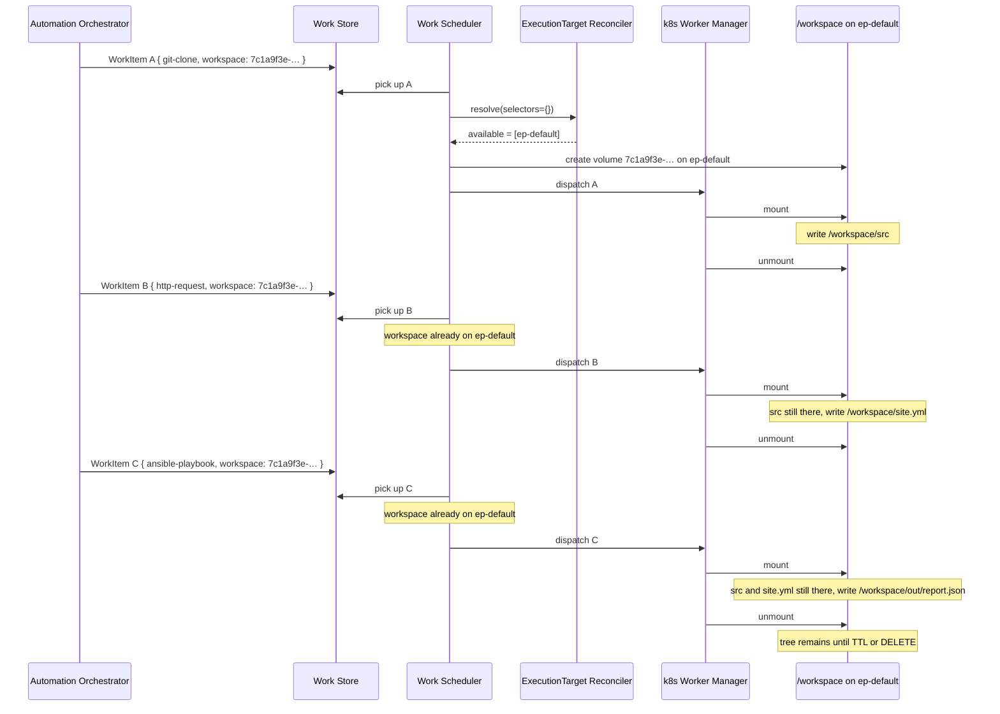

# Example: volume workspace, three WorkItems, `/workspace` stays

Builds on
[00-one-workload-default-target.md](00-one-workload-default-target.md).
Same Cluster, same default ExecutionTarget. AO shares one **workspace**
volume across three successive WorkItems. Each container mounts it at
`/workspace`. Files written by an earlier WorkItem are still there for
the next.

WorkItem A places with empty selectors ([default
routing](../executiontarget-reconciler.md#default-routing)). After EP
creates the volume on `ep-default`, B and C **reuse** that UUID. That
reuse is a **placement constraint**: they run on `ep-default` because
that is the ExecutionTarget associated with the workspace.

- Ticket: [AAP-94189](https://redhat.atlassian.net/browse/AAP-94189)
- Feature: [ANSTRAT-1803](https://redhat.atlassian.net/browse/ANSTRAT-1803)
- Parent epic: [AAP-82060](https://redhat.atlassian.net/browse/AAP-82060)
- Contract: [data-sharing.md](../data-sharing.md)

## What this example is

A concrete inventory of a **volume-based workspace** (Kubernetes PVC
on this target).

The three WorkItems run **one at a time** (ReadWriteOnce). After each
exits, the Worker Manager unmounts. The volume is not deleted. The
next WorkItem mounts the same UUID and sees the same tree.

```text
workspace id 7c1a9f3e-4b2d-41a8-9c1f-91c0d4e5a6b7
                          →  volume on ExecutionTarget ep-default
                          →  mounted at /workspace

AO execution
  WorkItem A  git-clone         →  writes /workspace/src
  WorkItem B  http-request      →  writes /workspace/site.yml
                               →  /workspace/src is still there
  WorkItem C  ansible-playbook  →  reads /workspace/src and site.yml
                               →  writes /workspace/out/report.json
```

## Workspace create

AO mints the UUID and puts it on the WorkItems. It does **not** create
the volume. It does not know the ExecutionTarget yet.

EP creates the volume **after** WorkItem A is matched, **before** it
is dispatched. Size is the ExecutionTarget default. EP refuses the
UUID if it already exists anywhere.

WorkItems B and C reuse that UUID. They do not create another volume.
Reuse pins them to `ep-default`, the ExecutionTarget that already
holds the workspace.

The WorkItems carry the UUID, not a PVC name.

## Incoming WorkItems

### WorkItem A — clone into `/workspace`

```json
{
  "selectors": {},
  "payload": {
    "activity": {
      "image": "registry.redhat.io/ao/git-clone:1.0.0",
      "params": {
        "uri": "git+https://gitlab.example.com/org/playbooks.git",
        "ref": "a1b2c3d4e5f6",
        "dest": "/workspace/src"
      }
    },
    "data": {
      "workspace": "7c1a9f3e-4b2d-41a8-9c1f-91c0d4e5a6b7"
    }
  }
}
```

### WorkItem B — download beside the clone

```json
{
  "selectors": {},
  "payload": {
    "activity": {
      "image": "registry.redhat.io/ao/http-request:1.0.0",
      "params": {
        "url": "https://files.example.com/files/abc123/site.yml",
        "dest": "/workspace/site.yml"
      }
    },
    "data": {
      "workspace": "7c1a9f3e-4b2d-41a8-9c1f-91c0d4e5a6b7"
    }
  }
}
```

B does not re-clone. `/workspace/src` is already on the volume from A.

### WorkItem C — playbook using both files

```json
{
  "selectors": {},
  "payload": {
    "activity": {
      "image": "registry.redhat.io/ao/ansible-playbook:1.0.0",
      "params": {
        "playbook": "/workspace/src/site.yml",
        "extra_vars_file": "/workspace/site.yml"
      }
    },
    "data": {
      "workspace": "7c1a9f3e-4b2d-41a8-9c1f-91c0d4e5a6b7"
    }
  }
}
```

C does not fetch. It reads what A and B left under `/workspace` and
writes `/workspace/out/report.json`.

| Field | Meaning for EP |
|---|---|
| `selectors` | Used for **A** (empty → default routing). Not how B and C pick a target. |
| `payload.activity.image` | Container image. Git, HTTP, and playbook are ordinary WorkItems. |
| `payload.activity.params` | Owned by that activity. `dest` / playbook paths under `/workspace` are the activity's. |
| `payload.data.workspace` | Workspace UUID. First use: create the volume on the matched ExecutionTarget. Reuse: placement constraint to the ExecutionTarget that holds that volume. |

There is no `data.inputs` list and no `payload.volume_mounts`.

## Registered Cluster and default ExecutionTarget

Same inventory as [example 00](00-one-workload-default-target.md).

```yaml
cluster:
  name: local-openshift
  cluster_type: openshift
  endpoint: https://api.cluster.local:6443
  status: active
  enabled: true
  labels:
    cluster: local-openshift
```

```yaml
# Illustrative keys only. Names such as endpoint, namespace, and labels
# are for readability and are not the final field design.
execution_target:
  name: ep-default
  cluster: local-openshift
  namespace: ao-execution
  backend_type: k8s
  endpoint: https://api.cluster.local:6443
  is_default: true
  status: active
  enabled: true
  labels: {}
```

The workspace volume lives on this target after A runs. Effective
labels for matching A are still only `{ cluster: local-openshift }`.
The workspace id is not a label. For B and C it is a placement
constraint: the Work Scheduler uses this ExecutionTarget.

## What is on `/workspace`

The directory outlives each container. Only the mount comes and goes.

| After | `/workspace` contains |
|---|---|
| WorkItem A exits | `src/` (clone of the pinned SHA) |
| WorkItem B exits | `src/` **and** `site.yml` |
| WorkItem C exits | `src/`, `site.yml`, **and** `out/report.json` |

If AO submits a fourth WorkItem with the same UUID, that tree is still
there until TTL (from last unmount) or `DELETE`.

## What EP does

**WorkItem A** (new UUID):

1. **Claim.** The Work Scheduler picks up the WorkItem from the Work
   Store.
2. **Reconcile.** `selectors: {}` takes default routing. Eligible set
   `{ep-default}`. The reconciler does not read `data.workspace`.
3. **Create.** The Work Scheduler now has an ExecutionTarget. It
   creates the volume on `ep-default` before dispatch.
4. **Dispatch.** The Work Scheduler sends the work to the Kubernetes
   Worker Manager for `ep-default`.
5. **Run.** That Worker Manager mounts workspace
   `7c1a9f3e-4b2d-41a8-9c1f-91c0d4e5a6b7` at `/workspace` and
   cold-starts a pod from `payload.activity.image`. On exit it
   unmounts. It does not delete the volume.

**WorkItems B and C** (reuse):

1. **Claim.** The Work Scheduler picks up the WorkItem from the Work
   Store.
2. **Pin.** The UUID already has a volume on `ep-default`. That is a
   **placement constraint**. The Work Scheduler uses that
   ExecutionTarget. It does not call the reconciler. It waits until
   no other WorkItem holds this UUID (ReadWriteOnce).
3. **Dispatch.** Same Worker Manager for `ep-default`.
4. **Run.** Same mount at `/workspace`. On exit, unmount. The volume
   stays.

```text
WorkItem A
  selectors {}                 →  ep-default (is_default)
  data.workspace (new)         →  create volume on ep-default → /workspace

WorkItem B, C
  data.workspace (reuse)       →  ep-default (workspace's ExecutionTarget)
  payload.activity.image       →  container image
  payload.activity.params      →  container input
```



## Out of scope here

| Omitted | Why |
|---|---|
| Empty selectors without a workspace | [Example 00](00-one-workload-default-target.md) |
| `region` / `env` placement | [Example 01](01-select-region-and-env.md) |
| Selectors that match nothing | [Example 05](05-no-matching-targets.md) |
| Listed `outputs` / sidecar / S3 artifacts | [data-sharing.md](../data-sharing.md) use-case 2 |
| Object-store workspace snapshot | [Example 03](03-data-sharing-with-workspace-object-store.md) |
| OpenShell sandbox policy | [Example 04](04-openshell-sandbox-policy.md). OpenShell has no volume attach. |
| Warm pools | Volume workspace is a cold-start mount in this example |
| AO workflow / node / Execution Profile rows | Not visible to EP |
