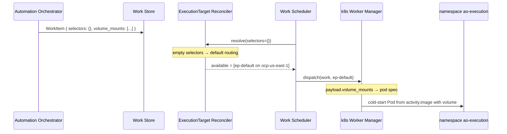

# Example: workload that needs a volume mount

Builds on
[00-one-workload-default-target.md](00-one-workload-default-target.md).
The same default Cluster and default ExecutionTarget run a workload
whose payload includes a volume mount.

- Ticket: [AAP-92721](https://redhat.atlassian.net/browse/AAP-92721)
- Feature: [ANSTRAT-1803](https://redhat.atlassian.net/browse/ANSTRAT-1803)
- Parent epic: [AAP-82060](https://redhat.atlassian.net/browse/AAP-82060)

## What this example is

EP still only sees the submitted WorkItem.

A volume mount is **execution**, not placement. The mount spec lives on
the work payload. The Worker Manager uses it when constructing the
pod. The reconciler does not read it, and there is no
`volume-mount` label or selector. See [labels.md](../labels.md):
volume mounts belong in the work payload / Worker Manager; a static
"can mount volumes" label is an open question, not MVP vocabulary.

Volume mounts are allowed only on **cold-start** ExecutionTargets, not
on warm pools. The Cluster's protected default target is always
cold-start. Empty selectors take [default routing](../executiontarget-reconciler.md#default-routing)
to that target, which is therefore where this work runs.

## Incoming workload

`selectors` is empty. `payload.volume_mounts` is the mount spec.
`activity.image` is still the container image.

```json
{
  "selectors": {},
  "payload": {
    "activity": {
      "image": "registry.redhat.io/ao/ansible-playbook:1.0.0",
      "params": {
        "playbook": "site.yml"
      }
    },
    "volume_mounts": [
      {
        "source": "playbook-bundle",
        "target": "/work/playbooks"
      }
    ]
  }
}
```

| Field | Meaning for EP |
|---|---|
| `selectors` | Empty → default routing. No volume-related key. |
| `payload.activity.image` | Container image reference. |
| `payload.activity.params` | Input passed to the running container. |
| `payload.volume_mounts` | What to attach, and where. Worker Manager only. |

## Registered Cluster

```yaml
cluster:
  name: ocp-us-east-1
  cluster_type: openshift
  endpoint: https://api.us-east-1.example.com:6443
  status: active
  enabled: true
  labels:
    region: us-east-1
```

## Default ExecutionTarget

No extra labels for volumes. Cold-start is the default target's role
(`is_default: true`), not a tag.

```yaml
# Illustrative keys only. Names such as endpoint, namespace, and labels
# are for readability and are not the final field design.
execution_target:
  name: ep-default
  cluster: ocp-us-east-1
  namespace: ao-execution
  backend_type: k8s
  endpoint: https://api.us-east-1.example.com:6443
  is_default: true
  status: active
  enabled: true
  labels: {}
```

Effective labels:

```text
{ region: us-east-1 }
```

`ns-production` from [example 01](01-select-region-and-env.md) may
exist on this Cluster. It is not selected: empty selectors do not mean
"match every target"; they take default routing only.

## What EP does

1. **Reconcile.** `selectors: {}` takes default routing. Eligible set
   `{ep-default}`. The reconciler never looks at
   `payload.volume_mounts`.
2. **Dispatch.** The Work Scheduler picks that target. The Worker
   Manager for `backend_type=k8s` cold-starts a pod in namespace
   `ao-execution`.
3. **Run.** The pod uses `payload.activity.image`. The
   Worker Manager attaches `playbook-bundle` at `/work/playbooks` from
   `payload.volume_mounts`. Container input is
   `payload.activity.params`.

```text
WorkItem
  selectors {}                    →  ep-default (is_default, cold-start)
  payload.activity.image           →  container image
  payload.volume_mounts           →  pod volume spec
  payload.activity.params         →  container input
```



Work that also sent `env=production` (example 01) would land on
`ns-production` instead. Attaching a volume there is a Worker Manager
concern (cold-start vs warm pool), not a reconciler match on a
`volume-mount` key.

## Out of scope here

| Omitted | Why |
|---|---|
| Empty selectors without a volume | [Example 00](00-one-workload-default-target.md) |
| `region` / `env` placement | [Example 01](01-select-region-and-env.md) |
| OpenShell sandbox policy | [Example 03](03-openshell-sandbox-policy.md) |
| `volume-mount` as a label or selector | Not in the EP vocabulary; [open question](../labels.md#open-questions) in labels.md |
| Warm-pool claim of an already-running pod | Volume mounts are cold-start only |
| Live volume or PVC availability | Not a selector |
| AO workflow / node / Execution Profile rows | Not visible to EP |
