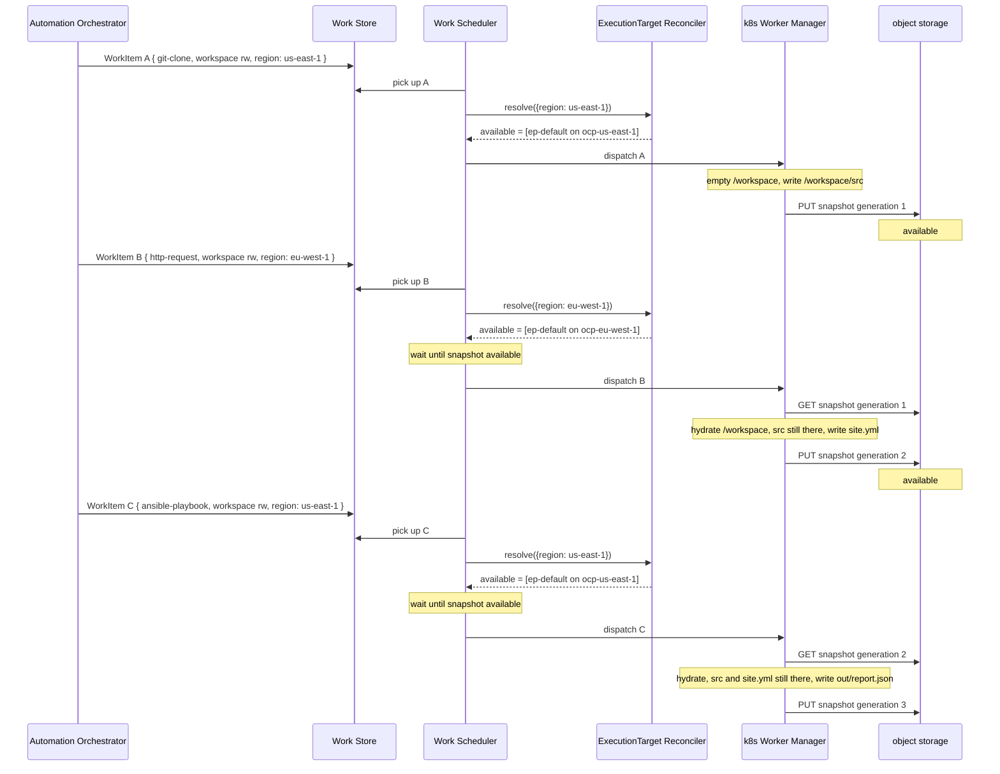

# Example: object-store workspace, three WorkItems, different targets

Builds on
[01-select-region-and-env.md](01-select-region-and-env.md)
and [02-data-sharing-with-workspace.md](02-data-sharing-with-workspace.md).
Same three activities (git clone, HTTP GET, playbook). The workspace
is an **object-store snapshot** of `/workspace`, not a volume.

WorkItem A places on `ocp-us-east-1`. After it exits, EP PUTs the
whole tree to S3. B places on `ocp-eu-west-1` and hydrates that
snapshot. C places back on `ocp-us-east-1` and hydrates the next
generation. Reuse is **not** a placement constraint: each WorkItem
still goes through the reconciler.

- Ticket: [AAP-94189](https://redhat.atlassian.net/browse/AAP-94189)
- Feature: [ANSTRAT-1803](https://redhat.atlassian.net/browse/ANSTRAT-1803)
- Parent epic: [AAP-82060](https://redhat.atlassian.net/browse/AAP-82060)
- Contract: [data-sharing.md](../data-sharing.md)

## What this example is

A concrete inventory of an **object-store workspace**. The snapshot is
the **whole tree**, not listed `outputs`. Any ExecutionTarget that can
reach the bucket can run the next WorkItem.

`access` is `rw` on all three (the default). Exclusive `rw` is serial:
one writer per generation. B does not start until A's snapshot is
`available`. C waits on B. `ro` and `copy` (parallel after a
generation is `available`) are out of scope here.

```text
workspace id 7c1a9f3e-4b2d-41a8-9c1f-91c0d4e5a6b7
                          →  snapshot s3://workspaces/7c1a9f3e-…/

AO execution
  WorkItem A  git-clone,    access=rw  →  ocp-us-east-1  →  writes /workspace/src
                                                               EP PUTs snapshot
  WorkItem B  http-request, access=rw  →  ocp-eu-west-1  →  hydrates, writes /workspace/site.yml
                                                               /workspace/src is still there
                                                               EP PUTs snapshot
  WorkItem C  playbook,     access=rw  →  ocp-us-east-1  →  hydrates, reads src and site.yml
                                                               writes /workspace/out/report.json
```

## Workspace create

AO mints the UUID and puts it on the WorkItems. There is **no
volume**. There is no create-on-target step.

The UUID names the snapshot prefix. WorkItem A starts with an empty
`/workspace`. After a `rw` exit, the Worker Manager PUTs the tree.
Later WorkItems hydrate `/workspace` from that snapshot, then write,
then PUT the next generation.

## Incoming WorkItems

Each WorkItem carries **selectors**. The workspace UUID does not pick
the ExecutionTarget.

### WorkItem A — clone into `/workspace` (us-east-1)

```json
{
  "selectors": {
    "region": "us-east-1"
  },
  "payload": {
    "activity": {
      "image": "registry.redhat.io/ao/git-clone:1.0.0",
      "params": {
        "uri": "git+https://gitlab.example.com/org/playbooks.git",
        "ref": "a1b2c3d4e5f6",
        "dest": "/workspace/src"
      }
    },
    "data": {
      "workspace": {
        "id": "7c1a9f3e-4b2d-41a8-9c1f-91c0d4e5a6b7",
        "access": "rw"
      }
    }
  }
}
```

No snapshot yet. `/workspace` is empty until the git activity writes.

### WorkItem B — download beside the clone (eu-west-1)

```json
{
  "selectors": {
    "region": "eu-west-1"
  },
  "payload": {
    "activity": {
      "image": "registry.redhat.io/ao/http-request:1.0.0",
      "params": {
        "url": "https://files.example.com/files/abc123/site.yml",
        "dest": "/workspace/site.yml"
      }
    },
    "data": {
      "workspace": {
        "id": "7c1a9f3e-4b2d-41a8-9c1f-91c0d4e5a6b7",
        "access": "rw"
      }
    }
  }
}
```

B does not re-clone. It cannot dispatch until A's snapshot is
`available`. Then it hydrates `/workspace` (including `src/`) on a
**different** cluster.

### WorkItem C — playbook using both files (us-east-1 again)

```json
{
  "selectors": {
    "region": "us-east-1"
  },
  "payload": {
    "activity": {
      "image": "registry.redhat.io/ao/ansible-playbook:1.0.0",
      "params": {
        "playbook": "/workspace/src/site.yml",
        "extra_vars_file": "/workspace/site.yml"
      }
    },
    "data": {
      "workspace": {
        "id": "7c1a9f3e-4b2d-41a8-9c1f-91c0d4e5a6b7",
        "access": "rw"
      }
    }
  }
}
```

C waits on B's snapshot, hydrates on `ocp-us-east-1`, and reads what A
and B left. Landing back on A's cluster does not use a volume pin; it
is selector matching again.

| Field | Meaning for EP |
|---|---|
| `selectors` | Placement for **every** WorkItem. Reuse of the UUID does not override this. |
| `payload.activity.image` | Container image. Git, HTTP, and playbook are ordinary WorkItems. |
| `payload.activity.params` | Owned by that activity. `dest` / playbook paths under `/workspace` are the activity's. |
| `payload.data.workspace.id` | Workspace UUID. Snapshot prefix, not a PVC. |
| `payload.data.workspace.access` | `rw` here. Serial writer. Omitted means `rw`. |

There is no `data.inputs` list and no `payload.volume_mounts`.

## Registered Clusters and ExecutionTargets

Two OpenShift Clusters. Each has only its protected default
ExecutionTarget. Same shape as [example 01](01-select-region-and-env.md),
without the extra production namespace.

```yaml
clusters:
  - name: ocp-us-east-1
    cluster_type: openshift
    endpoint: https://api.us-east-1.example.com:6443
    status: active
    enabled: true
    labels:
      region: us-east-1

  - name: ocp-eu-west-1
    cluster_type: openshift
    endpoint: https://api.eu-west-1.example.com:6443
    status: active
    enabled: true
    labels:
      region: eu-west-1
```

```yaml
# Illustrative keys only. Names such as endpoint, namespace, and labels
# are for readability and are not the final field design.
execution_targets:
  - name: ep-default
    cluster: ocp-us-east-1
    namespace: ao-execution
    backend_type: k8s
    endpoint: https://api.us-east-1.example.com:6443
    is_default: true
    status: active
    enabled: true
    labels: {}

  - name: ep-default
    cluster: ocp-eu-west-1
    namespace: ao-execution
    backend_type: k8s
    endpoint: https://api.eu-west-1.example.com:6443
    is_default: true
    status: active
    enabled: true
    labels: {}
```

Effective labels (Cluster ∪ ExecutionTarget):

| Target | Effective labels | Matches A `{region: us-east-1}` | Matches B `{region: eu-west-1}` | Matches C `{region: us-east-1}` |
|---|---|---|---|---|
| `ocp-us-east-1` / `ep-default` | `{region: us-east-1}` | **yes** | no | **yes** |
| `ocp-eu-west-1` / `ep-default` | `{region: eu-west-1}` | no | **yes** | no |

The workspace id is not a label and does not pin B or C.

## What is on `/workspace`

The local directory dies with the container. The snapshot is what
survives.

| After | Snapshot contains |
|---|---|
| WorkItem A snapshot `available` | `src/` (clone of the pinned SHA) |
| WorkItem B snapshot `available` | `src/` **and** `site.yml` |
| WorkItem C snapshot `available` | `src/`, `site.yml`, **and** `out/report.json` |

A later WorkItem with the same UUID hydrates that tree on whatever
ExecutionTarget its selectors match, until AO `DELETE`s the id.

## What EP does

**WorkItem A** (no snapshot yet):

1. **Claim.** The Work Scheduler picks up the WorkItem from the Work
   Store.
2. **Reconcile.** `selectors.region=us-east-1`. Eligible set
   `{ep-default on ocp-us-east-1}`. The reconciler does not read
   `data.workspace`.
3. **Dispatch.** Kubernetes Worker Manager for that target.
4. **Run.** Empty `/workspace`. Git activity writes `src/`.
5. **Snapshot.** On `rw` exit, the Worker Manager PUTs the whole tree.
   Status becomes `available`. That PUT **does** gate B.

**WorkItems B and C** (reuse, not a pin):

1. **Claim.** The Work Scheduler picks up the WorkItem from the Work
   Store.
2. **Reconcile.** B matches `ocp-eu-west-1`. C matches `ocp-us-east-1`
   again. The existing snapshot does not change the eligible set.
3. **Wait.** Do not dispatch until the previous generation is
   `available`.
4. **Dispatch.** Worker Manager for the matched target.
5. **Hydrate and run.** GET the snapshot into `/workspace`, then run
   the activity. On `rw` exit, PUT the next generation.

```text
WorkItem A
  selectors.region=us-east-1   →  ocp-us-east-1 / ep-default
  data.workspace (rw, new)     →  empty /workspace → PUT snapshot

WorkItem B
  selectors.region=eu-west-1   →  ocp-eu-west-1 / ep-default
  data.workspace (rw, reuse)   →  wait, hydrate, write, PUT snapshot

WorkItem C
  selectors.region=us-east-1   →  ocp-us-east-1 / ep-default
  data.workspace (rw, reuse)   →  wait, hydrate, write, PUT snapshot
```



## Out of scope here

| Omitted | Why |
|---|---|
| Volume workspace (same UUID pins the ExecutionTarget) | [Example 02](02-data-sharing-with-workspace.md) |
| Empty selectors / default routing | [Example 00](00-one-workload-default-target.md) |
| `env=production` namespace | [Example 01](01-select-region-and-env.md) |
| Selectors that match nothing | [Example 05](05-no-matching-targets.md) |
| OpenShell sandbox policy | [Example 04](04-openshell-sandbox-policy.md). Snapshot hydrate is how OpenShell can share `/workspace`. |
| `ro` / `copy` in parallel | [data-sharing.md](../data-sharing.md). After a generation is `available`, many `ro` or `copy` WorkItems may run. |
| Listed `outputs` / sidecar / S3 artifacts | [data-sharing.md](../data-sharing.md) use-case 2. Listed files, not the whole tree. |
| Snapshot format (tar vs prefix) | Open question in [data-sharing.md](../data-sharing.md) |
| AO workflow / node / Execution Profile rows | Not visible to EP |
