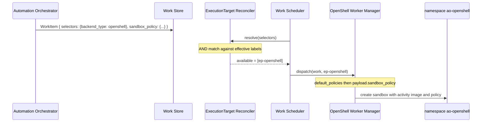

# Example: OpenShell ExecutionTarget and sandbox policy

Builds on
[00-one-workload-default-target.md](00-one-workload-default-target.md)
and [01-select-region-and-env.md](01-select-region-and-env.md).
The Cluster still has a protected default Kubernetes target. OpenShell
is a second ExecutionTarget, so work must **select** it. The workload
also carries a sandbox policy.

- Ticket: [AAP-92721](https://redhat.atlassian.net/browse/AAP-92721)
- Isolation Policy: [AAP-92726](https://redhat.atlassian.net/browse/AAP-92726)
- Feature: [ANSTRAT-1803](https://redhat.atlassian.net/browse/ANSTRAT-1803)
- Parent epic: [AAP-82060](https://redhat.atlassian.net/browse/AAP-82060)

## What this example is

EP still only sees the submitted WorkItem.

`ep-openshell` is not the Cluster default (`is_default` stays on the
Kubernetes target). Empty selectors would take [default
routing](../executiontarget-reconciler.md#default-routing) to
`ep-default`. To land on OpenShell, AO sends a selector that matches a
label on that target.

`backend_type` remains a discrete field: it selects
`WorkerManagerOpenShell` **after** the target is chosen. Work matching
does not read that field. [labels.md](../labels.md) allows the value
to be **copied onto labels** when work needs to select on it. That
copy is the selector in this example (`backend_type=openshell`).

A sandbox policy is still **execution**, not placement:

| Part | Where it lives | Why |
|---|---|---|
| Pick OpenShell | Work **selector** `backend_type=openshell` vs target **label** | `ep-openshell` is not the default. |
| OpenShell runtime | ExecutionTarget `backend_type: openshell` | Discrete field. Selects the Worker Manager. |
| Default sandbox policy | ExecutionTarget `default_policies` | Baseline applied to every sandbox on this target. |
| Extra sandbox policy | Work **payload** | Worker Manager applies it on top of the target defaults. The reconciler does not read it. |

The policy document in the payload uses OpenShell's native fields
(filesystem, network). Whether AO later owns a separate DSL is an
open question on AAP-92726. This example does not invent one.

## Incoming workload

Selectors are non-empty, so default routing does not apply.
`payload.sandbox_policy` is extra policy on top of `ep-openshell`'s
`default_policies`.

```json
{
  "selectors": {
    "backend_type": "openshell"
  },
  "payload": {
    "activity": {
      "image": "registry.redhat.io/ao/agentic:1.0.0",
      "params": {
        "prompt": "Summarize https://example.com/status"
      }
    },
    "sandbox_policy": {
      "version": 1,
      "filesystem_policy": {
        "include_workdir": true,
        "read_only": ["/usr", "/lib", "/etc"],
        "read_write": ["/tmp"]
      },
      "network_policies": {
        "status_page": {
          "name": "status-page",
          "endpoints": [
            {
              "host": "example.com",
              "port": 443,
              "protocol": "rest",
              "enforcement": "enforce",
              "access": "full"
            }
          ]
        }
      }
    }
  }
}
```

| Field | Meaning for EP |
|---|---|
| `selectors.backend_type` | Must match an ExecutionTarget label `backend_type=openshell`. |
| `payload.activity.image` | Container image reference. |
| `payload.activity.params` | Input passed to the running sandbox. |
| `payload.sandbox_policy` | Extra OpenShell policy, on top of the target's `default_policies`. Worker Manager only. |

`sandbox_policy` is omitted from `WorkRequirements` selector matching.

## Registered Cluster

Same OpenShift Cluster as the earlier examples. One Cluster can host
both `k8s` and `openshell` ExecutionTargets.

```yaml
cluster:
  name: ocp-us-east-1
  cluster_type: openshift
  endpoint: https://api.us-east-1.example.com:6443
  status: active
  enabled: true
  labels:
    region: us-east-1
```

## ExecutionTargets

The protected default remains vanilla Kubernetes. OpenShell is a
second target. Its discrete `backend_type` is copied onto `labels` so
work can select it. `default_policies` is the baseline sandbox policy
for that target; the work payload may add extra constraints.

```yaml
# Illustrative keys only. Names such as endpoint, namespace, labels,
# and default_policies are for readability and are not the final
# field design.
execution_targets:
  - name: ep-default
    cluster: ocp-us-east-1
    namespace: ao-execution
    backend_type: k8s
    endpoint: https://api.us-east-1.example.com:6443
    is_default: true
    status: active
    enabled: true
    labels: {}

  - name: ep-openshell
    cluster: ocp-us-east-1
    namespace: ao-openshell
    backend_type: openshell
    endpoint: https://openshell.us-east-1.example.com
    is_default: false
    status: active
    enabled: true
    labels:
      backend_type: openshell
    default_policies:
      version: 1
      filesystem_policy:
        include_workdir: true
        read_only: ["/usr", "/lib", "/etc"]
        read_write: ["/tmp"]
      network_policies: {}
```

Effective labels (Cluster ∪ ExecutionTarget):

| Target | Effective labels | Matches `{backend_type: openshell}`? |
|---|---|---|
| `ocp-us-east-1` / `ep-default` | `{region: us-east-1}` | no (missing `backend_type`) |
| `ocp-us-east-1` / `ep-openshell` | `{region: us-east-1, backend_type: openshell}` | **yes** |

`region` is inherited from the Cluster. Extra labels do not affect the
match.

## What EP does

1. **Reconcile.** Selectors are non-empty, so default routing is
   skipped. Only `ep-openshell` has `backend_type=openshell`. Outcome:
   `MATCHED`, eligible set `{ep-openshell}`.
2. **Dispatch.** The Work Scheduler picks that target.
   `PlacementResolver.worker_manager_for(target)` looks up
   `WorkerManagerOpenShell` from the discrete field
   `backend_type: openshell`.
3. **Run.** That Worker Manager creates the sandbox at
   `ep-openshell.endpoint` in namespace `ao-openshell`, using
   `payload.activity.image`. It applies
   `ep-openshell.default_policies`, then `payload.sandbox_policy` as
   extra constraints. Container input is `payload.activity.params`.

```text
WorkItem
  selectors.backend_type=openshell  →  ep-openshell (label)
  payload.activity.image             →  container image
  ep-openshell.default_policies     →  baseline OpenShell policy
  payload.sandbox_policy            →  extra OpenShell policy (Worker Manager)
  payload.activity.params           →  sandbox input

ExecutionTarget.backend_type=openshell  →  WorkerManagerOpenShell
```



`ep-default` is not mixed into the eligible set. Required selectors
that the default does not carry exclude it. That is intended.

## Out of scope here

| Omitted | Why |
|---|---|
| Empty selectors / default routing | [Example 00](00-one-workload-default-target.md) |
| `region` / `env` placement | [Example 01](01-select-region-and-env.md) |
| Selectors that match nothing | [Example 04](04-no-matching-targets.md) |
| Volume mount | [Example 02](02-volume-mount.md) |
| Isolation Policy DSL vs native OpenShell YAML | Open question on AAP-92726 |
| `PolicyFilter` as the way to pick OpenShell | AAP-92726; this example uses a selector |
| AO workflow / node / Execution Profile rows | Not visible to EP |
