# Execution Plane

Design document for the Execution Plane — the subsystem that routes, provisions, and dispatches workflow task node workloads to isolated compute workers.

Reference: [ANSTRAT-1803](https://redhat.atlassian.net/browse/ANSTRAT-1803) — Workflow Automation: Execution Plane (MVP: On-Cluster OpenShift).

## Logical Components

The Execution Plane comprises the following logical components, shown in three focused views.

**Critical path** — durable submission, scheduling, execution, and completion:

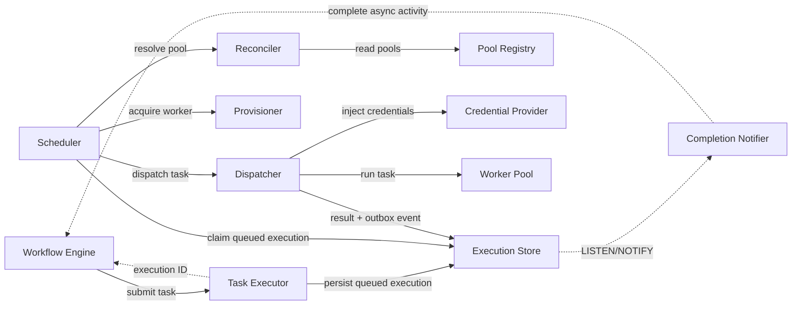

**Pool selection and provisioning** — how the Scheduler picks a pool and obtains a worker:

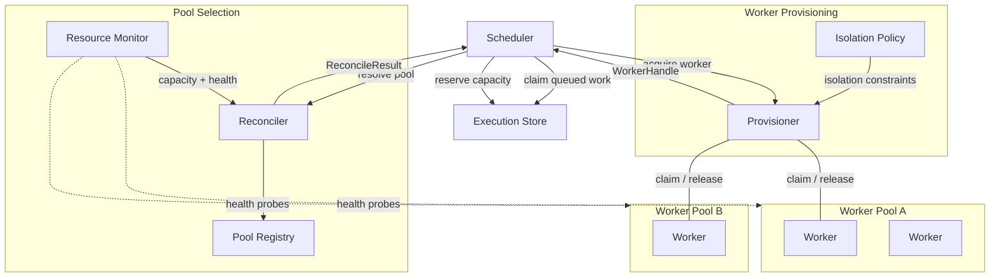

**Task dispatch** — how a task reaches a claimed worker:

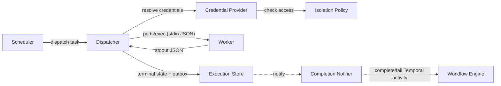

### Task Executor

The Task Executor is the API entry point into the Execution Plane. The Workflow Engine submits a task and receives an execution ID after the task has been durably accepted. The request does not remain open while the task waits for capacity or runs.

**Responsibilities:**
- Authenticate and authorize the caller
- Validate the task definition, deadline, worker profile, and payload limits
- Idempotently persist a queued `Execution` and its completion target
- Return the execution ID without waiting for scheduling or task completion
- Expose cancellation and status lookup for recovery and administration
- Retain a transitional synchronous endpoint that submits through the same durable path

**Interface:**
- `submit_task(task_definition, completion_target, idempotency_key) -> execution_id`
- `cancel_execution(execution_id) -> cancellation_status`
- `get_execution(execution_id) -> execution_status` — recovery and administrative use, not the normal completion path
- The task definition includes: task payload (inputs, parameters), affinity labels, workload type (action/agentic), connectivity requirements, credential references, resource requirements (CPU, memory, timeout)

The Workflow Engine uses Temporal asynchronous activity completion. Its submission activity calls `raise_complete_async()` after the Task Executor accepts the task, leaving durable Temporal state without occupying an activity worker or holding an HTTP connection.

### Scheduler

The Scheduler owns capacity-aware assignment and back-pressure. It consumes durable queued executions rather than holding waiting tasks in API processes.

**Responsibilities:**
- Claim queued executions using transactional locking
- Apply project quotas, priority, aging, and per-workflow concurrency limits
- Ask the Reconciler for eligible pools
- Atomically reserve capacity and create a fenced execution attempt
- Use the Provisioner to acquire a worker and the Dispatcher to start the attempt
- Retry retryable provisioning failures with bounded exponential backoff and jitter
- Publish aggregated demand for pool autoscaling
- Release reservations when provisioning fails or an attempt becomes terminal

Scheduler replicas are stateless. PostgreSQL row locks, unique constraints, and atomic state transitions coordinate assignment between replicas.

### Execution Store

The Execution Store is the durable source of truth for queued executions, attempts, capacity reservations, terminal results, and completion outbox events. PostgreSQL provides transactional coordination; Redis may cache capacity snapshots but is not authoritative for execution ownership.

### Completion Notifier

The Completion Notifier delivers terminal results to callers without caller-side status polling.

When the Dispatcher records success or failure, the same PostgreSQL transaction updates the execution and inserts an outbox event. It also calls `pg_notify` with the outbox ID. A Completion Notifier maintains a PostgreSQL `LISTEN` connection, claims the event, and completes or fails the corresponding Temporal asynchronous activity.

The notification is a low-latency wake-up, not the source of truth. On startup or reconnection the notifier drains undelivered outbox rows, so a missed notification cannot lose a completion. Duplicate delivery is safe: an already-terminal Temporal activity is treated as delivered.

### Worker

The smallest granular compute unit. A Worker executes a single workflow task node within a sandboxed container. Each Worker is ephemeral — created for a task, destroyed after completion.

**Responsibilities:**
- Execute the dispatched task within its Execution Environment container
- Report task status (running, completed, failed) back to the Dispatcher
- Enforce resource limits (CPU, memory, timeout) as defined by its configuration

**Key attributes:**
- Compute requirements (CPU, memory, storage)
- Applied Isolation Policy
- Injected credentials
- Lifecycle state (pending, running, succeeded, failed, terminated)

### Worker Pool

A logical grouping of Workers representing a deployment target — for example, an OpenShift cluster or namespace. A Worker Pool is the unit at which administrators configure capacity, connectivity, and placement policy. It is the singular logical Execution Plane in which Workers can be provisioned.

**Responsibilities:**
- Define the boundary within which Workers are provisioned
- Advertise capacity, connectivity metadata, and health to the Resource Monitor
- Support label-based selection by the Reconciler

**Key attributes:**
- Container image (OCI image reference specified at registration time — e.g. `quay.io/org/worker:latest` — with optional registry credentials)
- Labels (key/value pairs for affinity matching)
- Connectivity metadata (reachable network endpoints, segments, geographies)
- Capacity limits (max concurrent Workers, resource quotas)
- Provisioner type (which Provisioner implementation manages this pool)
- Status (online, degraded, offline)

### Reconciler

Selects a Worker Pool in which to provision a Worker for a given task node. The Reconciler evaluates task requirements against available Worker Pools, considering labels, connectivity, capacity, and isolation constraints. It returns a structured result that tells the Scheduler both what matched and why anything did not.

**Responsibilities:**
- Match task node affinity labels against Worker Pool labels
- Evaluate connectivity requirements (can the pool reach the endpoints this task needs?)
- Consult the Resource Monitor for available capacity
- Apply Isolation Policy constraints (e.g. agentic workloads excluded from certain pools)
- Return a structured `ReconcileResult` (not just a list) that classifies pools by outcome

**Inputs:**
- Task node label selectors and affinity rules
- Task node connectivity requirements
- Workload type (deterministic action vs. agentic)
- Resource Monitor data (capacity, health, connectivity metadata)

**Structured result:**

The Reconciler returns a `ReconcileResult` that partitions pools into three categories and provides an overall outcome. This gives the Scheduler enough information to assign immediately, retain the durable queue entry, or fail it as unschedulable.

```python
class ReconcileResult:
    available_pools: list[PoolWithCapacity]    # labels match, capacity available — can run now
    exhausted_pools: list[PoolAtCapacity]      # labels match, but all workers busy
    ineligible_pools: list[PoolIneligible]     # labels/isolation/connectivity mismatch (with reason)
    outcome: ResolveOutcome  # MATCHED | CAPACITY_EXHAUSTED | NO_MATCHING_POOLS
```

| Outcome | Meaning | Scheduler action |
|---|---|---|
| `MATCHED` | At least one pool has capacity | Proceed with provisioning |
| `CAPACITY_EXHAUSTED` | Pools match but all are full | Keep the execution queued and publish demand for the Pool Autoscaler |
| `NO_MATCHING_POOLS` | No pool matches labels/isolation/connectivity | Fail immediately — scaling won't help |

### Provisioner

Creates a Worker within the selected Worker Pool. The Provisioner is an abstraction over the underlying infrastructure — different implementations handle different pool types (OpenShift pods, OpenShell sandboxes, Agent Sandbox, etc.).

**Responsibilities:**
- Acquire a Worker from the target pool (the mechanism — Lease claiming, sandbox creation, etc. — is determined by the Provisioner Backend)
- Apply Isolation Policy constraints (namespace isolation, network policies, seccomp profiles)
- Configure resource limits per the Worker definition
- Report provisioning status (success, failure, timeout)
- Apply an absolute desired pool capacity calculated by the Pool Autoscaler. Individual task submissions never increment pool size directly.

**Key design constraint:** The Provisioner interface is implementation-agnostic. New provisioner types (e.g. OpenShell, RHEL execution nodes) can be added without rearchitecting the interface.

### Dispatcher

Delivers the workflow task payload to a provisioned Worker and manages the task execution lifecycle.

**Responsibilities:**
- Inject credentials into the Worker via the Credential Provider
- Deliver the task payload (inputs, parameters, Execution Environment configuration)
- Monitor task execution (heartbeats, timeouts)
- Persist terminal task output and a completion outbox event atomically
- Handle task failure, retry, and cancellation signals
- Attach and validate the execution attempt's fencing token

### Resource Monitor

Observes and reports the state of all Worker Pools and their Workers. Provides the data layer that feeds the Reconciler's placement decisions and the administrator's topology view.

**Responsibilities:**
- Probe Worker Pool health (liveness, readiness)
- Track per-pool resource availability (compute capacity, active workload count)
- Collect connectivity metadata (what endpoints each pool can reach)
- Expose metrics for administrator dashboards and topology views
- Detect and report degraded or offline pools

### Credential Provider

Securely injects credentials into Workers at dispatch time. Enforces workload-type isolation — agentic workers must not receive automation credentials, and vice versa.

**Responsibilities:**
- Resolve which credentials a task node requires based on its configuration
- Enforce credential access policies based on workload type and Isolation Policy
- Inject credentials into the Worker's environment securely (not persisted to disk, not logged)
- Support credential rotation without Worker restart

### Isolation Policy

Defines the security and governance boundaries applied to Workers based on workload type. Separates deterministic action workloads from agentic AI workloads to reflect their distinct trust requirements.

**Responsibilities:**
- Classify workloads by type (deterministic action vs. agentic AI)
- Define isolation level per workload type (namespace isolation, network policies, resource constraints)
- Restrict credential access by workload type
- Inform the Provisioner of required container security context (seccomp, AppArmor, capabilities)
- Provide the Reconciler with pool eligibility constraints

**MVP scope:** Container isolation + namespace separation within OpenShift. The interface accommodates future policy-based sandboxing (e.g. OpenShell) without rearchitecting.

## Worker Pool Registration

The sections above describe **runtime** behaviour — how the Scheduler selects a registered pool, provisions a worker, and dispatches a task. This section covers the **registration** lifecycle: how a new Worker Pool is introduced to the Execution Plane, bootstrapped on its target infrastructure, and made available to the Reconciler.

Registration is an administrator action, performed once per cluster. It is separate from, and prerequisite to, runtime task execution.

### Registration Model

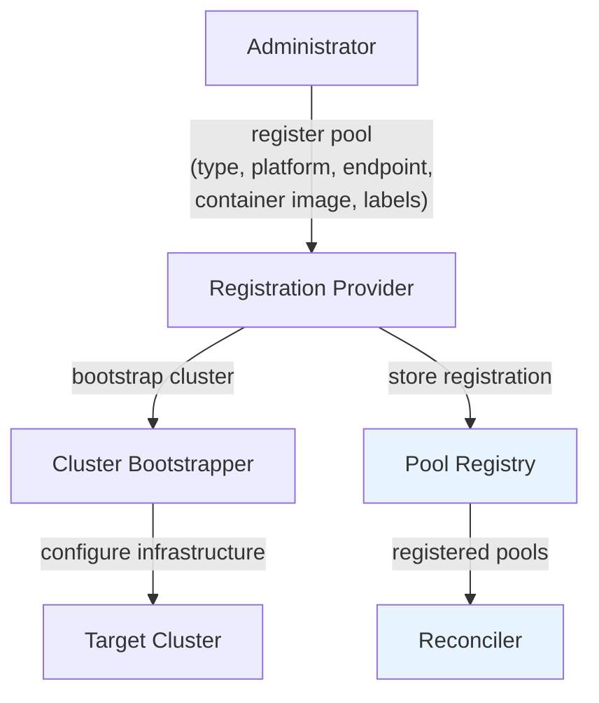

### Registration Provider

Accepts a pool registration request from an administrator and orchestrates the registration lifecycle: validate the request, bootstrap the target infrastructure, and store the registration in the Pool Registry.

**Responsibilities:**
- Validate the registration request (endpoint reachability, credentials, platform compatibility)
- Delegate infrastructure bootstrapping to the Cluster Bootstrapper
- Store the completed registration in the Pool Registry
- Support updating an existing registration (e.g. changing labels, resizing capacity)
- Support deregistering a pool (drain workers, tear down bootstrapped resources, remove from registry)

**Registration request includes:**
- Pool name and description
- Cluster endpoint (API server URL, kubeconfig, or connection details)
- Platform type (OpenShift, RHEL)
- Provisioner backend (see below)
- Container image (OCI image reference — e.g. `quay.io/org/worker:latest`) and optional registry credentials for image pull
- Labels (key/value pairs for affinity matching)
- Connectivity metadata (reachable network endpoints)
- Capacity limits (max concurrent workers, resource quotas)
- Credentials for cluster access (service account token, certificate, SSH key)

**Container image:** The container image is a required field when registering a pool. It defines the software stack that workers in the pool run (Python packages, Ansible collections, system libraries). The image may be specified directly as an OCI registry path, or in future it may be derived implicitly — for example, by selecting an extension for which the pool provides workers. The mechanism by which an extension maps to a container image is outside the scope of the Execution Plane; the Execution Plane requires only that a concrete OCI image reference is available at registration time. The Cluster Bootstrapper uses this image reference in the worker PodSpec when bootstrapping the pool's infrastructure.

### Provisioner Backend

Each pool is registered with a provisioner backend that determines the runtime technology used to manage workers. The Provisioner's `acquire`/`release` interface abstracts over the underlying implementation — whether a backend maintains a warm pool of pre-provisioned workers or creates a fresh sandbox per task is internal to the backend. The Scheduler and Dispatcher treat all backends identically: acquire a worker, dispatch the task, release or recycle the worker when the task completes.

| Backend | Provisioning Model | Description |
|---|---|---|
| **Vanilla Kubernetes** | Warm pool (MVP) | Deployment maintains N replica worker pods. Workers claimed via Kubernetes Lease, released on task completion. |
| **OpenShell** | Per-task sandbox | NVIDIA policy-based sandboxing. Sandbox created per task, destroyed after. |
| **Agent Sandbox** | Warm pool | K8s-native CRD-managed pools. Pre-provisions pods via SandboxWarmPool CRD. |
| **Substrate** | Per-task sandbox | Custom substrate runtime. Sandbox created per task. |

### Platform

Each pool is registered against a target platform that determines the infrastructure capabilities and bootstrapping steps.

| Platform | MVP | Description |
|---|---|---|
| **OpenShift** | Yes | On-cluster or remote OpenShift cluster. Supports namespaces, SCCs, Routes, NetworkPolicies. |
| **RHEL** | No (future) | Standalone RHEL host. Supports Podman-based container execution. Delivered via [ANSTRAT-2338](https://redhat.atlassian.net/browse/ANSTRAT-2338). |

### Cluster Bootstrapper

Configures the target infrastructure to support worker provisioning. What the bootstrapper does depends on the platform and provisioner backend combination. The bootstrapper is an abstraction — each combination has its own implementation.

**Responsibilities:**
- Create or validate the target namespace on the cluster
- Deploy RBAC resources (ServiceAccount, Role, RoleBinding) for the scheduler/provisioner
- Install and configure the provisioner backend runtime (if required)
- Deploy worker Deployment/ReplicaSet using the registered container image (for warm-pool backends)
- Configure network policies and security context constraints
- Validate that the cluster is ready to accept workers
- Report bootstrap status (success, partial, failed)

**Bootstrapping by backend:**

| Backend | Platform | Bootstrap Actions |
|---|---|---|
| Vanilla Kubernetes | OpenShift | Create namespace, deploy RBAC, deploy worker Deployment (using registered container image), configure readiness/liveness probes |
| OpenShell | OpenShift | Create namespace, deploy RBAC, install OpenShell operator (Helm), configure SCCs, deploy compute driver |
| Agent Sandbox | OpenShift | Create namespace, deploy RBAC, install Agent Sandbox operator, create SandboxWarmPool CRD (using registered container image) |
| Vanilla Kubernetes | RHEL | Configure Podman runtime, deploy agent binary, establish connectivity to control plane |

### Pool Registry

Stores all registered Worker Pool configurations and makes them available to the Reconciler at runtime.

**Responsibilities:**
- Persist pool registrations (database-backed)
- Provide the Reconciler with the current set of registered and healthy pools
- Track registration status (registering, bootstrapping, active, degraded, deregistering)
- Store the pool's provisioner backend type so the Scheduler can select the correct `ProvisionerBackend` implementation at runtime

### Registration Lifecycle

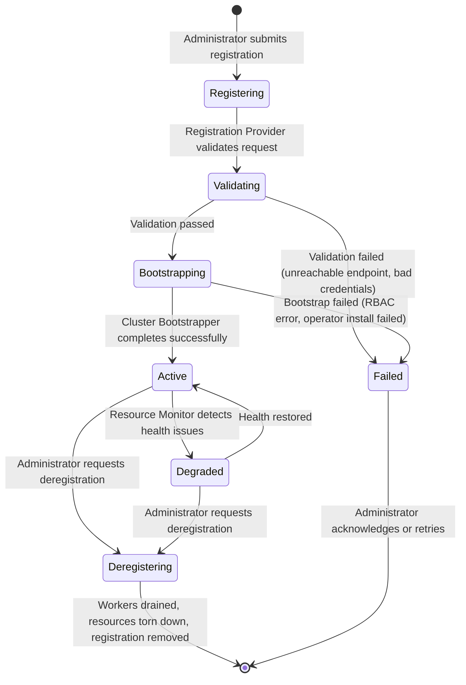

### Registration Sequence

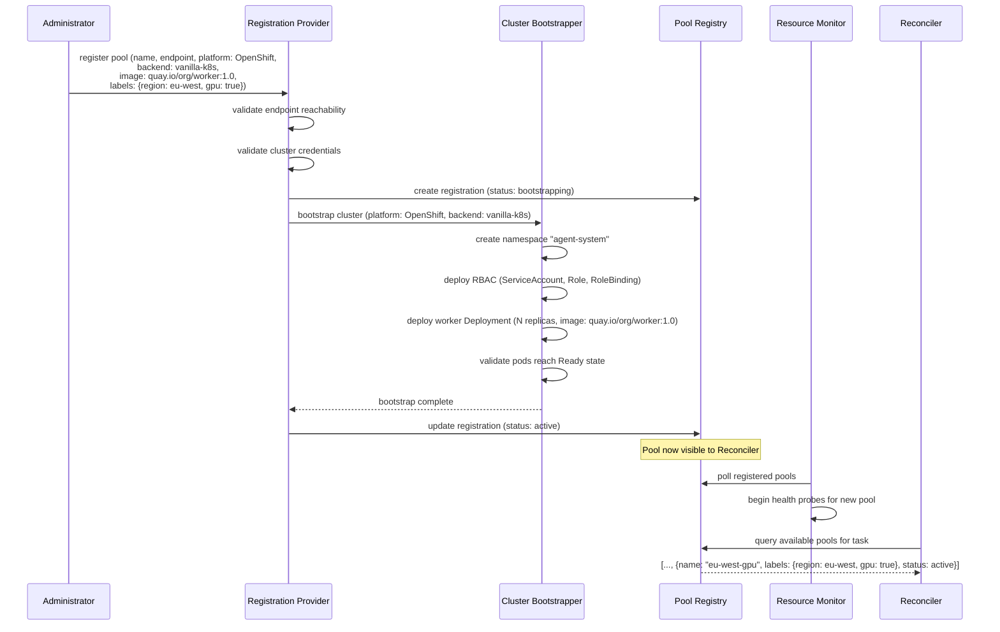

### Deregistration

Removing a pool is a controlled process: drain active workers, tear down bootstrapped resources, and remove the registration.

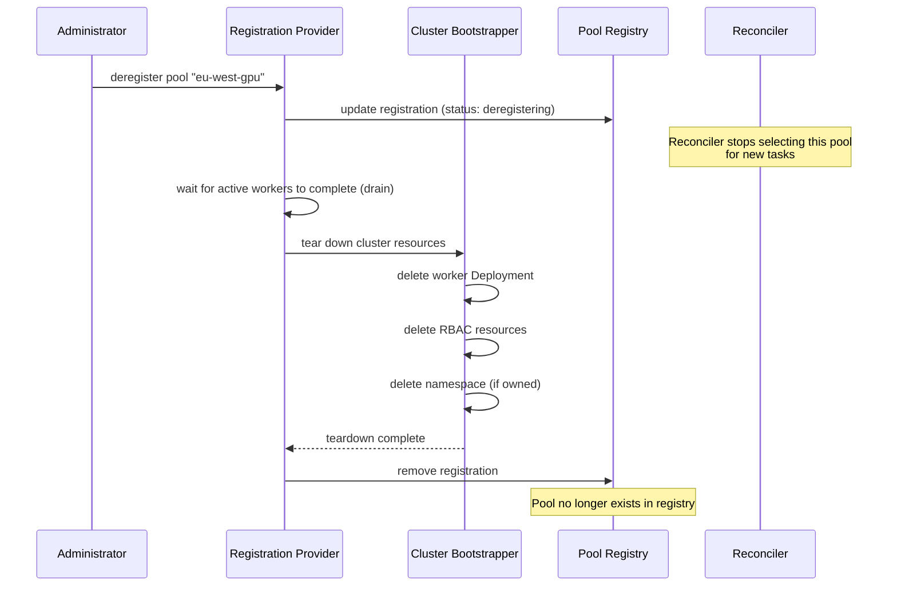

## Sequence Diagrams

### Task Execution: Happy Path

The complete flow separates durable submission from scheduling and execution. The Workflow Engine's Temporal activity returns from its worker process after submission by calling `raise_complete_async()`. Temporal keeps the activity durably pending until the Completion Notifier completes or fails it.

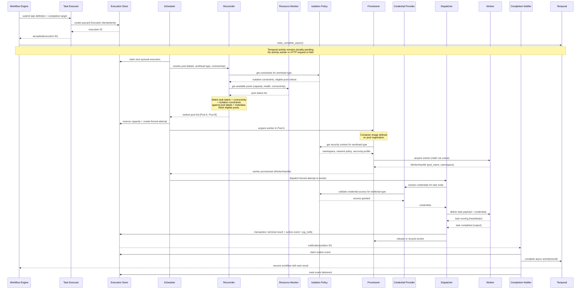

### Task Execution: Critical Path (Simplified)

The essential sequence through the critical path, omitting supporting concerns such as Isolation Policy and Resource Monitor.

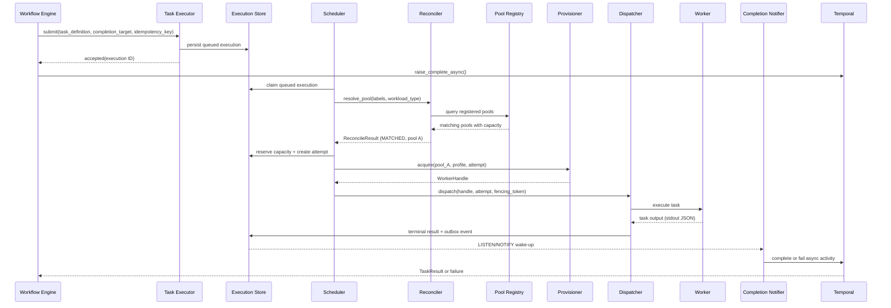

### Completion Callback: Failure and Recovery

Completion delivery combines a durable transactional outbox with PostgreSQL `LISTEN/NOTIFY`. The Dispatcher never calls Temporal inside the transaction that records the result, and the Scheduler has no dependency on Temporal.

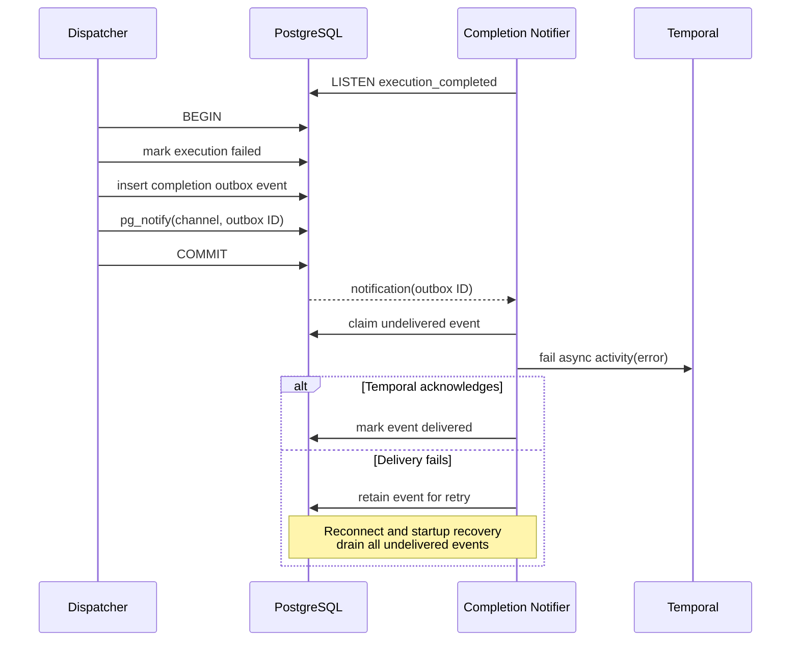

PostgreSQL delivers the notification only after commit, giving the normal path callback-like latency. Notifications are not durable, so the outbox remains authoritative. The Completion Notifier drains pending rows when it starts or reconnects and may run a low-frequency reconciliation sweep as a final safeguard. Duplicate completion is idempotent: if Temporal reports that the activity is already terminal, the event is marked delivered.

### Reconciliation: Pool Selection Logic

Detail of how the Reconciler evaluates candidate pools. The Scheduler calls the Reconciler; the Workflow Engine is not involved.

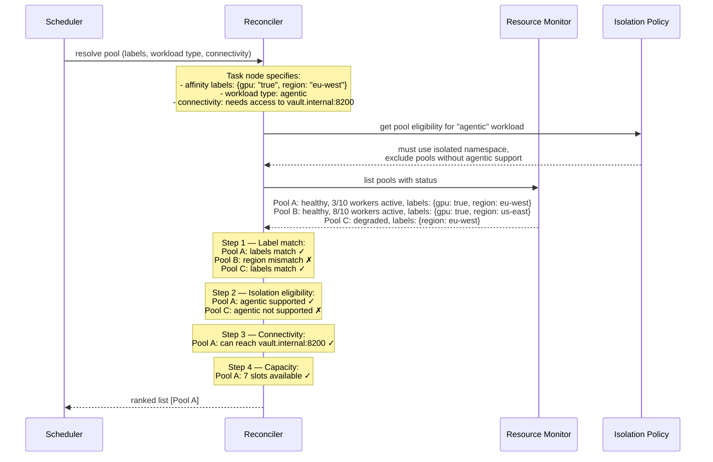

### Provisioning Failure and Fallback

What happens when provisioning fails in the selected pool. The Scheduler handles retry and fallback durably — the Workflow Engine remains suspended on its asynchronous Temporal activity.

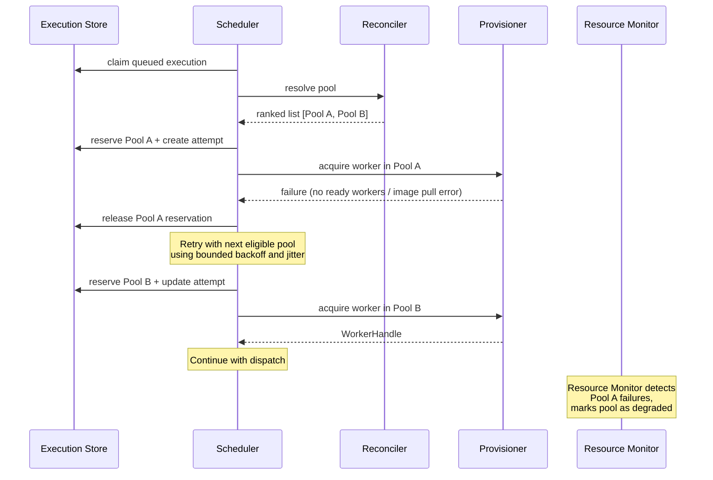

### Worker Lifecycle

The lifecycle of a Worker within a warm-pool backend (e.g. Vanilla Kubernetes). Workers are pods managed by a Kubernetes Deployment. The Provisioner claims and releases them via Leases; Kubernetes handles pod replacement if one fails.

```mermaid
stateDiagram-v2
    [*] --> Idle: Pod started by Deployment (warm pool)
    Idle --> Claimed: Provisioner acquires Lease
    Claimed --> Running: Dispatcher executes task via pods/exec
    Running --> Succeeded: Task completed successfully
    Running --> Failed: Task error or timeout
    Running --> Terminated: Cancellation signal received
    Succeeded --> Idle: Provisioner releases Lease
    Failed --> Idle: Provisioner verifies clean release
    Terminated --> [*]: Provisioner recycles worker
    Idle --> [*]: Pod deleted (scale-down or node drain)
    Claimed --> [*]: Ownership uncertain; recycle worker
```

### Credential Injection with Isolation

How credentials are scoped by workload type.

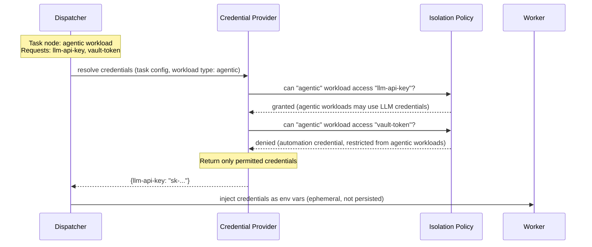

### Back-Pressure: Capacity Exhaustion and Scale-Up

Shows the flow when all matching Worker Pools are at capacity. The execution remains in the durable queue, and aggregated demand drives the Pool Autoscaler. No caller request or Task Executor process waits or polls for capacity.

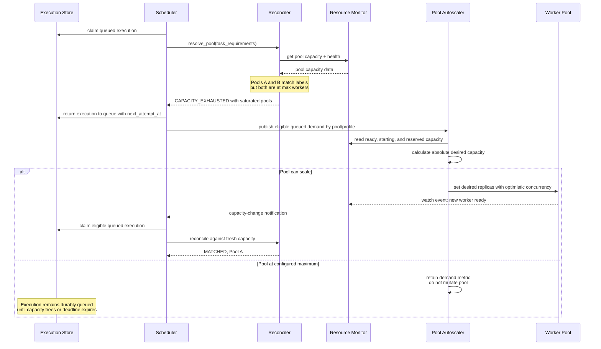

**Design decisions:**

- **Reconciler detects, Scheduler decides.** The Reconciler remains a pure query. The Scheduler owns durable queue state, retry timing, fairness, and assignment.
- **Aggregated autoscaling.** The Pool Autoscaler computes an absolute desired capacity from eligible queue depth, reservations, running attempts, startup latency, and configured limits. Individual tasks never request `replicas +1`.
- **Event-driven wake-up.** Resource watch events wake the Scheduler when capacity changes. `next_attempt_at` provides bounded retry recovery with jitter rather than a hot polling loop.
- **Deadlines remain authoritative.** An execution whose deadline expires in the queue is failed durably and delivered through the normal completion outbox.

## Entity Relationships

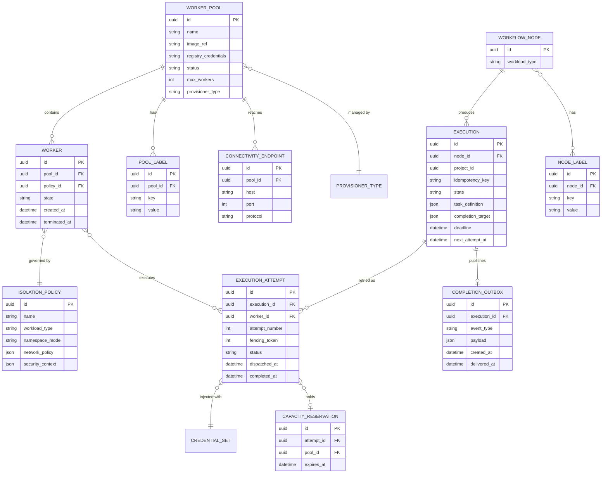

## MVP Scope (On-Cluster OpenShift)

Per the July 2026 planning decisions ([ANSTRAT-1803](https://redhat.atlassian.net/browse/ANSTRAT-1803) comments):

| Component | MVP Scope |
|---|---|
| Task Executor | Idempotent asynchronous submission, cancellation, and administrative status lookup; synchronous compatibility endpoint delegates to the durable path |
| Scheduler | Durable queue consumption, fairness, reconciliation, atomic capacity reservation, provisioning, and dispatch |
| Execution Store | PostgreSQL-backed executions, attempts, reservations, results, and completion outbox |
| Completion Notifier | PostgreSQL `LISTEN/NOTIFY` wake-up plus durable outbox delivery to Temporal asynchronous activities |
| Worker | OpenShift pod within the control plane cluster |
| Worker Pool | Single on-cluster pool (same namespace or dedicated namespace) |
| Reconciler | Global affinity only; project/workflow/node-level affinity deferred. Returns structured `ReconcileResult` with outcome (`MATCHED` / `CAPACITY_EXHAUSTED` / `NO_MATCHING_POOLS`) |
| Provisioner | OpenShift pod provisioner (Kubernetes API). Implementation-agnostic `acquire`/`release` interface with safe worker recycle disposition |
| Dispatcher | Deliver fenced attempts, collect results, and atomically persist terminal state plus completion event |
| Resource Monitor | Pod/agent list view for administrators |
| Credential Provider | Credential injection scoped by workload type |
| Isolation Policy | Container isolation + namespace separation (no OpenShell/policy-based sandboxing) |
| Pool Autoscaler | Calculate absolute desired capacity from aggregated queued demand and configured pool limits |

### Future Phases

- **[ANSTRAT-2337](https://redhat.atlassian.net/browse/ANSTRAT-2337):** External OpenShift cluster execution through an outbound, authenticated Pool Agent connection
- **[ANSTRAT-2338](https://redhat.atlassian.net/browse/ANSTRAT-2338):** External RHEL execution (hop nodes and execution nodes on RHEL)
- Per-project, per-workflow, and per-node affinity rules
- Policy-based sandboxing (OpenShell integration)
- EE build tooling (extending ansible-builder or new tool)

## Security Questions

1. `WORKER_POOL.registry_credentials` is a plain string column — are these stored as cleartext in PostgreSQL or referenced from an external secret store?
2. Credentials are injected as env vars in warm pool workers that get reused across tasks. What removes the previous task's credentials before the next dispatch?
3. `pods/exec` gives the Dispatcher shell access to worker pods. Is this RBAC scoped to specific pods, or blanket exec across the namespace?
4. Is image signature verification (cosign, Notary) required before a pool is registered or a worker pod launched?
5. The fencing token is a guessable integer. What prevents a compromised worker from submitting a result with a forged token for a different attempt?
6. NetworkPolicy enforcement depends on the CNI plugin. Does the Cluster Bootstrapper validate that the target cluster actually enforces it?
7. The SDP requires "tighter isolation than deterministic automation" for agentic workloads, but the MVP uses container isolation only. What hardening is applied beyond default OpenShift SCCs?
8. Pool registration accepts long-lived cluster credentials (SA tokens, certificates, SSH keys). Where are these stored after registration, and is there a rotation policy?
9. Is there a submission-layer rate limit, or can a misbehaving consumer flood the Execution Store before the Scheduler's project quotas take effect?
10. Are security-sensitive events (credential injection, pool registration, failed auth, worker lifecycle) captured in an audit log?
