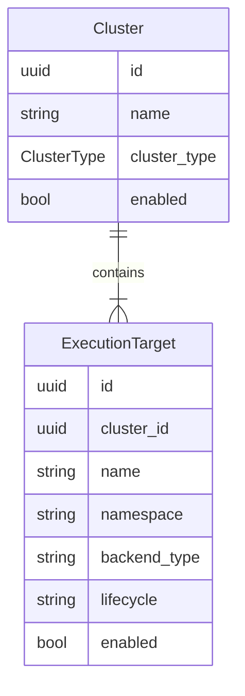
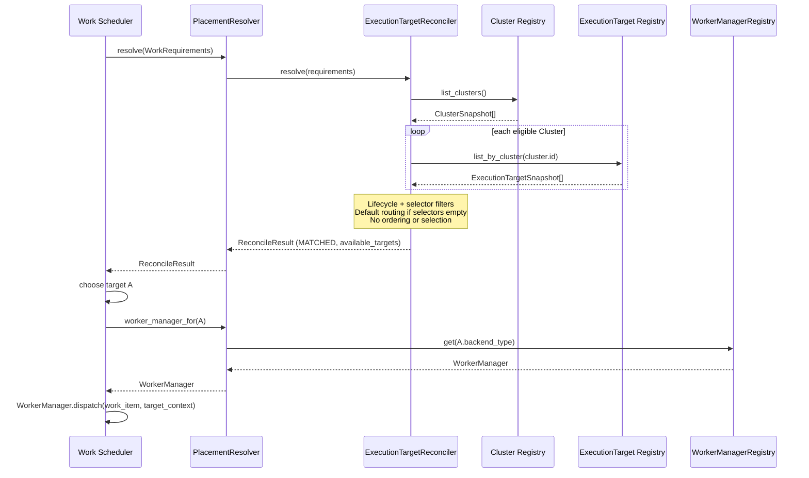
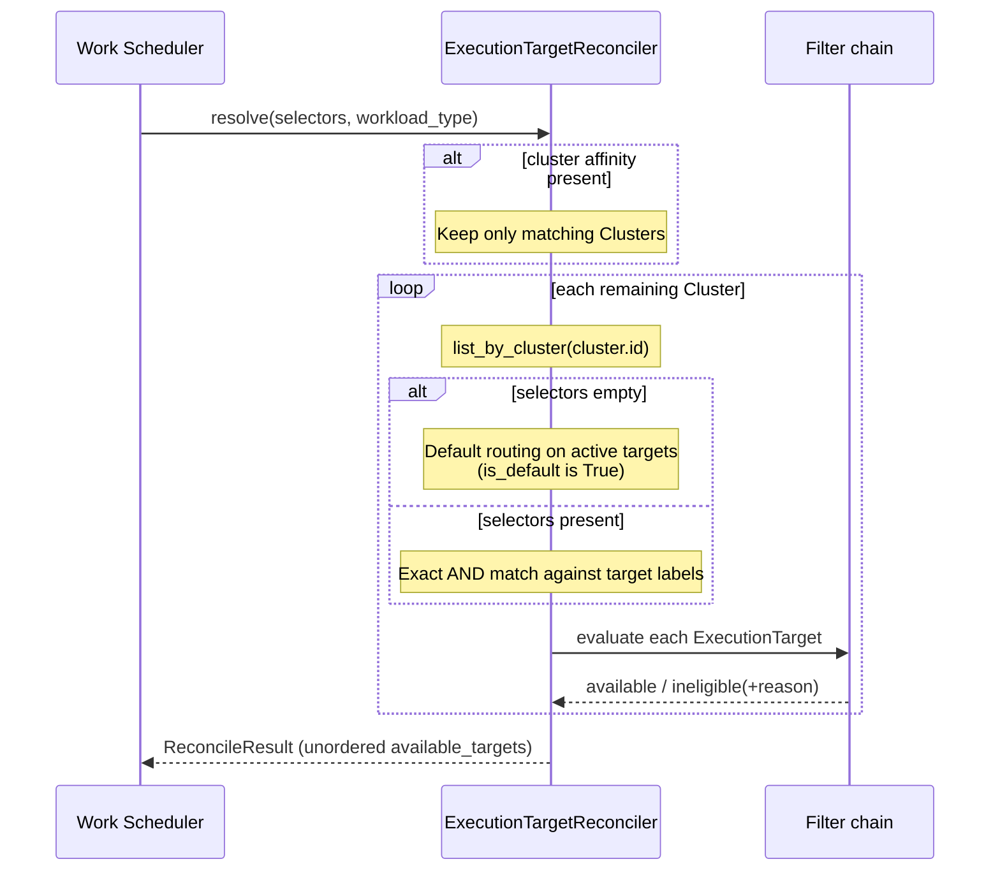

# Execution Plane: ExecutionTarget Reconciler

Architectural technical design for the ExecutionTarget Reconciler — the
component that resolves which ExecutionTarget should execute a given work
item.

- Ticket: [AAP-92721](https://redhat.atlassian.net/browse/AAP-92721)
- Feature: [ANSTRAT-1803](https://redhat.atlassian.net/browse/ANSTRAT-1803)
- Parent epic: [AAP-82060](https://redhat.atlassian.net/browse/AAP-82060)

This document was originally titled Pool Reconciler. The scheduling unit is
an ExecutionTarget, not a Worker Pool. The ticket name is unchanged.

## What this document is

The design the ExecutionTarget Reconciler implementation must follow. It
covers the Cluster / ExecutionTarget model, the nested enumeration of
registered clusters then targets, the selector model, matching algorithm,
default routing, multiple matches, no-match error propagation, Worker
Manager resolution, and the extension points for health-based and
policy-based filtering.

It does not implement the Work Scheduler, Cluster Registry, ExecutionTarget
Registry, Resource Monitor, or Isolation Policy. Those stories consume or
replace the interfaces defined here.

## Context

The Work Scheduler claims a work item from the Work Store, then asks the
ExecutionTarget Reconciler where that work should run. The reconciler reads
registered Clusters, then the ExecutionTargets on each Cluster, matches the
work item's selector labels against that configuration, and returns a
structured result: the **set of eligible ExecutionTargets**. It does not
order that set or pick a winner.

For MVP, eligibility is selector matching plus ExecutionTarget lifecycle
state (only active targets are eligible). Health-based exclusion
([AAP-92724](https://redhat.atlassian.net/browse/AAP-92724) Resource Monitor)
and policy-based filtering ([AAP-92726](https://redhat.atlassian.net/browse/AAP-92726)
Isolation Policy) are deferred; their interfaces are reserved so they can
land without breaking changes.

The reconciler is a **pure query**. It does not claim workers, mutate work
items, or retry. The Work Scheduler ([AAP-92722](https://redhat.atlassian.net/browse/AAP-92722))
owns durable queue state, retry timing, and assignment.

### Cluster and ExecutionTarget

A **Cluster** is a compute environment the Execution Plane can reach.
An **ExecutionTarget** is a place on that Cluster where work may run.
One Cluster can host ExecutionTargets of more than one runtime.

Cluster type and ExecutionTarget type are different axes. They must
not be collapsed onto one field:

| Object | Field | Example values | Meaning |
|---|---|---|---|
| Cluster | `cluster_type` (`ClusterType`) | `openshift`, `rhel` | Host platform we connect to |
| ExecutionTarget | `backend_type` | `k8s`, `openshell`, `agent_sandbox` | Runtime on that Cluster; selects the Worker Manager |

The relationship is **one Cluster to many ExecutionTargets**:

```
Cluster  cluster_type=openshift
  ├── ExecutionTarget  ep-default     backend_type=k8s
  ├── ExecutionTarget  ep-gpu         backend_type=k8s  (labels: gpu=true)
  └── ExecutionTarget  ep-openshell   backend_type=openshell
Cluster  cluster_type=rhel
  └── ExecutionTarget  default        backend_type=agent_sandbox
```



The reconciler never treats ExecutionTargets as a flat global list. It
always:

1. Enumerates registered Clusters (optionally filtered by a cluster affinity
   selector on the work item).
2. For each remaining Cluster, enumerates that Cluster's ExecutionTargets.
3. Filters those ExecutionTargets.

Cluster Registry persistence and the foreign key are owned by
[AAP-92716](https://redhat.atlassian.net/browse/AAP-92716). This story
depends on the query Protocols below, not on the table shapes.

### Requirements addressed

| Requirement | Acceptance | How this component addresses it |
|---|---|---|
| R7 | AC-9, AC-11, AC-12 | Selector-based routing; default routing when no selectors are specified |
| R10 | AC-9, AC-10 | Work is not routed to ExecutionTargets that are not in an active lifecycle state |
| R28 | AC-2, AC-12 | Work is routed only to ExecutionTargets whose labels satisfy the work's requirements |

MVP affinity is **global labels only**. How Automation Orchestrator derives
those labels from projects, workflows, or nodes is an AO concern, not an EP
concern. The EP only matches `WorkRequirements` selectors against Cluster
and ExecutionTarget configuration.

Typical MVP topology is one Cluster (the local OpenShift cluster) with one
or more namespaces as ExecutionTargets.

## Process model

The ExecutionTarget Reconciler is a **co-located library** in the
execution-plane worker process, not a remote service. The Cluster Registry
and ExecutionTarget Registry may become remote later; reconciliation logic
stays local.

The Work Scheduler must never contain backend-type routing logic. How a
resolved ExecutionTarget becomes a callable Worker Manager is closed as
follows.

### Recommended coupling

```
Work Scheduler
  → PlacementResolver.resolve(requirements)
       → ExecutionTargetReconciler.resolve(...)  # eligible set, no pick
  → scheduler chooses target from available_targets
  → PlacementResolver.worker_manager_for(target)
       → WorkerManagerRegistry.get(target.backend_type)  # local instances only
  → worker_manager.dispatch(work_item, target_context)
```

`ExecutionTargetReconciler.resolve()` returns Cluster and ExecutionTarget
metadata only. It does **not** return a `WorkerManager` instance. Worker
Manager objects are not serializable and would make the reconciler unusable
if the registries are remote.

`PlacementResolver` is a thin local facade used by the scheduler. It calls
the reconciler, then looks up a locally registered Worker Manager by the
ExecutionTarget `backend_type` **after** the scheduler has chosen an
ExecutionTarget from the eligible set. The scheduler receives something
it can call directly without knowing the backend type. It does not inherit
a preferred target from the reconciler.

This is the co-located resolver option from AAP-92721, split so the
reconciler remains a pure query (as in the conceptual Execution Plane
architecture).

## Inputs

The reconciler does not take a `WorkItem` row. Work Store / Work Executor may
later persist selectors on `WorkItem`; the reconciler only needs a DTO:

```python
class WorkRequirements:
    selectors: dict[str, str]          # empty → default routing
    workload_type: str | None = None   # unused in MVP matching; reserved for Isolation Policy
```

This avoids a Work Store schema change in AAP-92721.

A Cluster affinity selector, when present, is just another key in
`selectors`. The reconciler uses it to drop Clusters before listing
ExecutionTargets. Remaining keys are matched against ExecutionTarget labels.

## Cluster and ExecutionTarget views

[AAP-92716](https://redhat.atlassian.net/browse/AAP-92716) owns the
persistent Cluster and ExecutionTarget tables. The reconciler depends on
Protocols and snapshot DTOs, not on those tables' concrete models.

```python
class ClusterType(StrEnum):
    OPENSHIFT = "openshift"
    RHEL = "rhel"

class ClusterSnapshot:
    id: uuid.UUID
    name: str
    labels: dict[str, str]  # e.g. region, cluster identifier
    cluster_type: ClusterType
    enabled: bool

class ExecutionTargetSnapshot:
    id: uuid.UUID
    cluster: ClusterSnapshot  # backref; always populated
    name: str
    namespace: str          # backend-specific location (e.g. Kubernetes namespace)
    backend_type: str       # k8s, openshell, agent_sandbox; selects the Worker Manager
    labels: dict[str, str]
    lifecycle: str          # see Lifecycle filter
    enabled: bool

class ClusterRegistry(Protocol):
    async def list_clusters(self) -> Sequence[ClusterSnapshot]: ...

class ExecutionTargetRegistry(Protocol):
    async def list_by_cluster(
        self, cluster_id: uuid.UUID
    ) -> Sequence[ExecutionTargetSnapshot]: ...
```

`list_clusters()` returns registered Clusters. `list_by_cluster()` returns
that Cluster's ExecutionTargets. Every `ExecutionTargetSnapshot` carries
its `ClusterSnapshot` (`target.cluster`). Targets of the same Cluster share
one ClusterSnapshot instance. The reconciler applies eligibility filters
in process; the registries are not required to pre-filter by selector.

Until AAP-92716 lands Cluster as a first-class row, an adapter may expose a
single implicit Cluster (the local OpenShift / Kubernetes cluster) wrapping
the existing `ExecutionTarget` rows (`labels`, `backend_type`, `status`,
`enabled`, and a namespace). `TargetStatus.ACTIVE` is eligible;
`enabled is False` is ineligible. Swap the adapter for the real registries
without changing `ExecutionTargetReconciler`.

## Core operation: Resolve

```python
class ExecutionTargetReconciler:
    def __init__(
        self,
        clusters: ClusterRegistry,
        targets: ExecutionTargetRegistry,
        filters: Sequence[EligibilityFilter],
    ) -> None: ...

    async def resolve(self, requirements: WorkRequirements) -> ReconcileResult: ...
```

Algorithm:

1. `clusters.list_clusters()`
2. If `requirements.selectors` include a Cluster affinity key, keep only
   Clusters whose `id`, `name`, or `labels` satisfy that key. Drop
   `enabled=False` Clusters.
3. For each remaining Cluster, `targets.list_by_cluster(cluster.id)`
4. Run the filter chain on each ExecutionTarget; partition into available /
   ineligible
5. If `requirements.selectors` is empty, apply default routing on the
   lifecycle-eligible set
6. Otherwise keep only selector-matching ExecutionTargets
7. Set `outcome` from whether `available_targets` is empty. Do not sort or
   select among the available set.

No I/O besides the two registries. No mutation of work items, Clusters, or
ExecutionTargets.

## Selector model

Key-value labels on the work item, matched against key-value labels on the
ExecutionTarget (and, for Cluster affinity, on the Cluster). MVP semantics
are **exact match, AND of all requested keys** (Kubernetes-style equality
selectors).

Work selectors `{k: v}` match an ExecutionTarget if and only if **every**
requested key exists on the target with that exact value. Extra target
labels are allowed. A missing key or a different value is a mismatch.

Cluster affinity keys are consumed in step 2 of Resolve and are not
re-required on the ExecutionTarget.

No `In` / `NotIn` / existence operators for MVP.

| Work selectors | ExecutionTarget labels | Match? |
|---|---|---|
| `{gpu: "true"}` | `{gpu: "true", region: "eu"}` | yes |
| `{gpu: "true", region: "eu"}` | `{gpu: "true"}` | no (missing key) |
| `{gpu: "true"}` | `{gpu: "false"}` | no |
| `{gpu: "true"}` | `{}` | no |

Empty selectors are **not** this rule. They take the default-routing path
below. Empty selectors do not mean "match every label set."

## Default routing

Every Cluster has a default ExecutionTarget (field
`ExecutionTarget.is_default=True`). That target is the cold-start fallback for
the Cluster.

When `requirements.selectors` is empty:

1. Enumerate Clusters, then ExecutionTargets, as in Resolve.
2. Consider only ExecutionTargets that pass the lifecycle filter (active and
   enabled) on eligible Clusters.
3. If any of those targets has the field `is_default` set `True`, those
   are the only default candidates.
4. Otherwise every lifecycle-eligible ExecutionTarget is a candidate (MVP:
   usually one namespace on the local Cluster).

When selectors are present, only ExecutionTargets that match **all** requested
keys are eligible. Non-matching cluster defaults are **not** mixed into that
set. Cold-start fallback is a Work Scheduler concern (AAP-92722): it may
retry with empty selectors, or otherwise choose a cluster default after
claim/provision fails.

If no lifecycle-eligible ExecutionTarget exists on any considered Cluster,
the outcome is `NO_MATCHING_TARGETS`.

## Lifecycle filter

Only ExecutionTargets in lifecycle **`active`** with `enabled=True`, on an
`enabled=True` Cluster, are eligible for scheduling.

| Lifecycle | Eligible? | Notes |
|---|---|---|
| `active` | yes | and `enabled=True` on both Cluster and ExecutionTarget |
| `registering` | no | not ready |
| `validating` | no | ExecutionTarget stand-in state |
| `bootstrapping` | no | ExecutionTarget stand-in state |
| `degraded` | no | excluded now so R10 holds without a Resource Monitor |
| `failed` | no | |
| `deregistering` | no | drain; Reconciler must stop selecting the target |
| `deregistered` | no | |
| `enabled=False` | no | administrative disable (Cluster or ExecutionTarget) |

When AAP-92724 lands, a health filter may refine `degraded` (for example
allow it with reduced capacity). Until then, degraded is ineligible.

## Multiple matches

Selector matching is boolean: an ExecutionTarget either satisfies every
requested key or it does not. Extra labels do not make a target more
eligible. The reconciler therefore **does not order** `available_targets`
and **does not pick** a `selected_target`.

All eligible ExecutionTargets are equivalent from this component's point of
view. Name sort, least-loaded, round-robin, and try-order on claim failure
belong to the Work Scheduler (AAP-92722) or later Resource Monitor data
(AAP-92724). None of those policies belong here for MVP.

Callers must treat `available_targets` as a set. List order in the result
is unspecified.

A future health filter (AAP-92724) may mark an ExecutionTarget
`IneligibilityReason.CAPACITY_EXHAUSTED`. That reason is not produced in
MVP (no capacity signal). Capacity exhaustion must not fail the work item;
the scheduler keeps it queued.

## Structured result

The reconciler returns a structured result that tells the scheduler both
what matched and why anything did not. This is enough to assign immediately,
keep the work queued, or fail it as unschedulable.

```python
class ResolveOutcome(StrEnum):
    MATCHED = "matched"
    NO_MATCHING_TARGETS = "no_matching_targets"

class IneligibilityReason(StrEnum):
    LIFECYCLE = "lifecycle"
    DISABLED = "disabled"
    SELECTOR_MISMATCH = "selector_mismatch"
    CAPACITY_EXHAUSTED = "capacity_exhausted"  # reserved for AAP-92724
    HEALTH = "health"                         # reserved for AAP-92724
    POLICY = "policy"                         # reserved for AAP-92726

class IneligibleTarget:
    target: ExecutionTargetSnapshot
    reason: IneligibilityReason

class ReconcileResult:
    available_targets: list[ExecutionTargetSnapshot]
    ineligible_targets: list[IneligibleTarget]
    outcome: ResolveOutcome
```

`available_targets` is an unordered set of equally eligible
ExecutionTargets (a list only because it is easy to serialize). The
Cluster is not a separate element of the result: it is
`target.cluster`. Callers that need the Cluster (`cluster_type`,
connection) use that backref; `backend_type` and location stay on the
ExecutionTarget. There is no `EligibleTarget` wrapper;
unlike `IneligibleTarget`, an eligible snapshot has no extra fields.
The result is not grouped as Cluster → [targets]: eligibility is per
ExecutionTarget, and grouping would imply a hierarchy the scheduler
does not use.

`outcome` is `MATCHED` when `available_targets` is non-empty, otherwise
`NO_MATCHING_TARGETS`. It does not encode why targets were rejected; that is
`IneligibilityReason`.

| Outcome | Meaning | Scheduler action |
|---|---|---|
| `MATCHED` | At least one ExecutionTarget is eligible now | Choose any available target; retry others on claim/provision failure |
| `NO_MATCHING_TARGETS` | No ExecutionTarget is eligible now | If any ineligible reason is `CAPACITY_EXHAUSTED`, keep the work queued (scaling may help). Otherwise fail; scaling will not help. |

### Ineligibility reasons

| `IneligibilityReason` | Meaning |
|---|---|
| `LIFECYCLE` | ExecutionTarget is not `active` |
| `DISABLED` | Cluster or ExecutionTarget is administratively disabled |
| `SELECTOR_MISMATCH` | Requested selectors are not a subset of ExecutionTarget labels (after Cluster affinity is applied) |
| `CAPACITY_EXHAUSTED` | Labels match but the target has no spare capacity. Reserved for Resource Monitor (AAP-92724). Scheduler must re-queue, not fail. |
| `HEALTH` | Reserved for Resource Monitor (AAP-92724) |
| `POLICY` | Reserved for Isolation Policy (AAP-92726) |

### Error propagation

`resolve()` does **not** raise on no match. No-match is an outcome, not an
exception. The scheduler distinguishes unschedulable work from capacity
exhaustion by reading `ineligible_targets` reasons. Placement lookup of an
unregistered `backend_type` is a **configuration error**, distinct from
`NO_MATCHING_TARGETS`.

## Extension points

Filters are injected at construction. Adding health or policy later is a
constructor argument, not an interface change.

```python
class FilterVerdict(StrEnum):
    ELIGIBLE = "eligible"
    INELIGIBLE = "ineligible"

class EligibilityFilter(Protocol):
    name: str
    async def evaluate(
        self,
        cluster: ClusterSnapshot,
        target: ExecutionTargetSnapshot,
        requirements: WorkRequirements,
        ) -> tuple[FilterVerdict, IneligibilityReason | None]:
        # INELIGIBLE carries an IneligibilityReason
        ...
```

Built-in chain, in order:

| Order | Filter | This story | Later |
|---|---|---|---|
| 1 | `LifecycleFilter` | implemented | — |
| 2 | `SelectorFilter` | implemented; skipped on the default-routing path | — |
| 3 | `HealthFilter` | no-op pass-through | AAP-92724 |
| 4 | `PolicyFilter` | no-op pass-through | AAP-92726 |

A denying filter (ineligible) stops further evaluation of that
ExecutionTarget. Remaining targets continue through the chain. A disabled
Cluster skips its ExecutionTargets entirely.

`workload_type` on `WorkRequirements` is ignored by MVP filters and is the
input Isolation Policy will use.

## Worker Manager resolution

```python
class WorkerManagerRegistry:
    def register(self, backend_type: str, manager: WorkerManager) -> None: ...
    def get(self, backend_type: str) -> WorkerManager: ...  # raises if missing
```

```python
class PlacementResolver:
    def __init__(
        self,
        reconciler: ExecutionTargetReconciler,
        worker_managers: WorkerManagerRegistry,
    ) -> None: ...

    async def resolve(self, requirements: WorkRequirements) -> ReconcileResult: ...

    def worker_manager_for(self, target: ExecutionTargetSnapshot) -> WorkerManager: ...
```

`resolve()` returns the `ReconcileResult` only. On `MATCHED`, the scheduler
chooses a target from `available_targets`, then calls
`worker_manager_for(target)` to get a `WorkerManager`.
`target_context` includes the ExecutionTarget location (for example a
Kubernetes namespace). On `NO_MATCHING_TARGETS`, the scheduler decides
(including whether `CAPACITY_EXHAUSTED` means re-queue).

The Worker Manager is looked up from the ExecutionTarget's `backend_type`
(`WorkerManagerK8S`, `WorkerManagerOpenShell`, `WorkerManagerAgentSandbox`,
and later others), not from the Cluster. Cluster `cluster_type` is only
the host platform (`openshift`, `rhel`). One OpenShift Cluster can have
both `k8s` and `openshell` ExecutionTargets; they do not share a Worker
Manager.

This story does not implement k8s or OpenShell Worker Managers. Changing
`WorkerManager.dispatch` to accept target context is documented for
AAP-92722 / AAP-92421 and is out of scope here.

## Sequence

Happy path (critical path only; Resource Monitor and Isolation Policy omitted):



Target selection detail:



## Package layout

Implementation lives in the execution-plane package so it can run without
Syntara `BaseService` (this is not an HTTP domain service).

```
backend/execution-plane/src/execution_plane/execution_target_reconciler/
  types.py          # WorkRequirements, ClusterSnapshot, ExecutionTargetSnapshot, ReconcileResult, ...
  protocols.py      # ClusterRegistry, ExecutionTargetRegistry, EligibilityFilter
  exceptions.py
  matching.py       # exact-AND selector match
  filters.py        # Lifecycle, Selector, no-op Health/Policy
  reconciler.py
  placement.py      # PlacementResolver + WorkerManagerRegistry
  adapters.py       # implicit single-Cluster adapter until AAP-92716
backend/execution-plane/tests/execution_target_reconciler/
```

Tests must mirror the source domain
(`backend/tools/ci/verify_test_structure.py`). Import from defining modules;
do not re-export from `__init__.py`.

## Out of scope

- Work Scheduler loop, claim/retry, `pg_notify` (AAP-92722)
- Wiring `worker.py` off in-process `execute_script` (valid until the
  scheduler exists)
- Cluster / ExecutionTarget Registry CRUD, migrations, auto-provisioning
  (AAP-92716)
- New REST endpoints or OpenAPI changes
- `WorkItem.selectors` column (Work Executor / Work Store)
- Real Resource Monitor probes or Isolation Policy DSL
- Changing `WorkerManager.dispatch` beyond documenting target context for
  later stories

## Coordination

- **AAP-92716 (Pool / Cluster Registry):** persist `Cluster` with a one-to-many
  foreign key to `ExecutionTarget`. Share `ClusterRegistry` /
  `ClusterSnapshot` and `ExecutionTargetRegistry` /
  `ExecutionTargetSnapshot` field names (cluster: name, labels,
  cluster_type, enabled; target: cluster backref, name, namespace,
  backend_type, labels, lifecycle, enabled) so the implicit-cluster
  adapter can be deleted when the real registries land.
- **AAP-92715 / AAP-92720 (Work Store / Work Executor):** if selectors are
  persisted on `WorkItem`, map them into `WorkRequirements`; do not couple
  the reconciler to the row type.
- **AAP-92722 (Work Scheduler):** consume `PlacementResolver`; choose among
  `available_targets` (no order is implied). On claim/provision failure, try
  another available target or fall back to a cluster default. On
  `NO_MATCHING_TARGETS`, re-queue if any ineligible reason is
  `CAPACITY_EXHAUSTED`; otherwise fail.
- **AAP-92724 / AAP-92726:** replace the no-op health and policy filters
  without changing `ExecutionTargetReconciler.resolve`.
