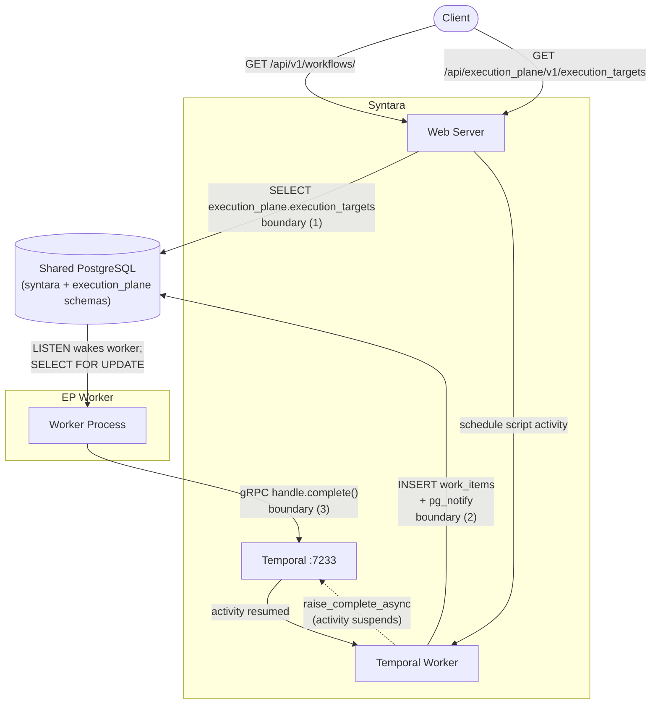
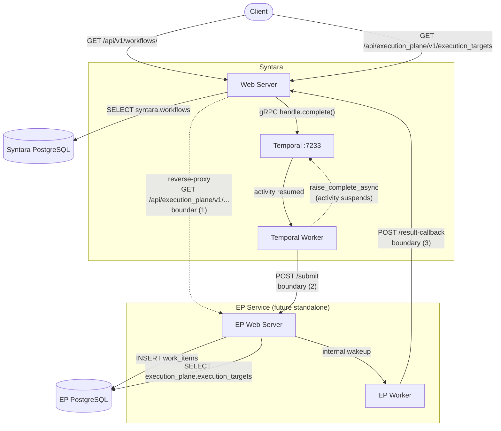

# Execution Plane: Current Integration and Future Service Boundary

## What this document is

A record of the deliberate shortcuts taken to ship the Execution Plane (EP)
worker without introducing a new HTTP service, and an explicit map of what
those shortcuts will become when the EP becomes standalone.

Every place in the codebase where Syntara directly touches the
`execution_plane` database schema carries a reference to this document. That
comment is a breadcrumb: if you are reading it, you have found a boundary
crossing that must be replaced before EP can run as an independent service.

---

## Architecture diagrams

### Current boundary crossings (intentional shortcuts)

Each is a deliberate shortcut that avoids inter-service complexity (service discovery, auth, TLS, retry logic) at the cost of tight coupling. Each must be replaced when EP becomes standalone.

| # | What it does |
|---|---|
| 1 | EP's web router ([`router.py`](https://github.com/syntara-orchestration/syntara/tree/devel/backend/execution-plane/src/execution_plane/router.py)) — temporarily served by Syntara's web server ([`main.py`](https://github.com/syntara-orchestration/syntara/tree/devel/backend/src/syntara/api/main.py)); imports `SyntaraRouter`, `PermissionChecker`, and `get_db` from syntara; reads `execution_plane.*` tables |
| 2 | [`ep_dispatch_activity.py`](https://github.com/syntara-orchestration/syntara/tree/devel/backend/src/syntara/workflows/workflow_engine/activities/ep/ep_dispatch_activity.py) — Writes `WorkItem` row, issues `pg_notify`, stores Temporal task token for EP worker's gRPC callback |
| 3 | [`worker.py`](https://github.com/syntara-orchestration/syntara/tree/devel/backend/execution-plane/src/execution_plane/worker.py) — EP worker calls `handle.complete()` — a gRPC call directly into Syntara's Temporal; requires network access to Temporal :7233 |
| 4 | [`integration_service.py`](https://github.com/syntara-orchestration/syntara/tree/devel/backend/src/syntara/integrations/services/integration_service.py) — Syntara calls `ClusterSyncService` (via `ClusterRegistry`) when Integration (type=openshift) is created/updated/deleted; never reads `execution_plane.clusters` directly |

---

> [!CAUTION]
> Do not add Syntara code that **reads** from or **joins** `execution_plane` schema tables.
> Do not add new `execution_plane` schema writes from Syntara without updating this document.

### Current state

The EP router is temporarily mounted inside the Syntara web server. Work is
submitted by writing directly to the shared database rather than calling an API.

---

### Future state: EP as an independent service

This diagram is **[speculative]**, the exact
mechanism for routing and auth is still open. Although this shows a reverse-proxy,
`/api/execution-plane/` is a temporary path and may move to a different path or host when EP becomes a standalone service.

Status of the system boundaries in this hypothetical state:

| Current | Future |
|---|---|
| Boundary (1): EP router mounted in Syntara web server | Syntara reverse-proxies `/api/execution_plane/v1/...` to the EP web server [speculative]; auth remains Syntara's responsibility, so EP does not import Syntara's auth dependencies |
| Boundary (2): `INSERT work_items` + `pg_notify` | `POST /submit` — Syntara hands work to the EP web server; EP manages its own DB writes and worker wakeup internally |
| Boundary (3): gRPC `handle.complete()` direct to Temporal | EP no longer calls Temporal directly; EP worker `POST`s the result to a Syntara callback endpoint and Syntara calls `handle.complete()` |
| Boundary (4): Syntara calls `ClusterRegistry.register()` for cluster creation on Integration CRUD | `POST /ep-api/v1/clusters/`, `PATCH /ep-api/v1/clusters/{id}`, `DELETE /ep-api/v1/clusters/{id}` — Syntara calls EP API instead of calling internal registry methods directly |

---

## API Key Security for Cluster Synchronization

When Syntara creates a cluster via `ClusterSyncService`, the API key is extracted from the resolved credential (decrypted via `SecretService`) and passed to `ClusterRegistry.register()`. The credential's full decrypted dict is never logged; only non-sensitive fields like endpoint and integration ID are logged. All exceptions during credential resolution or cluster sync are caught and logged without the api_key value.
