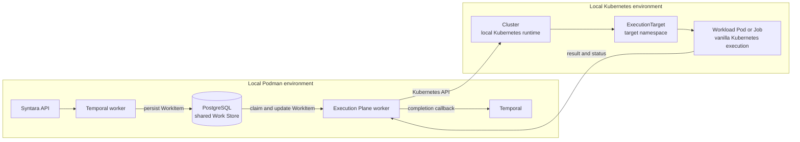
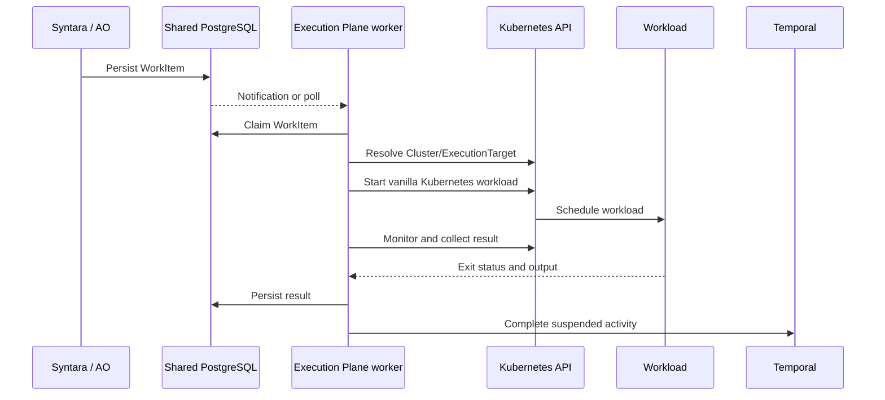
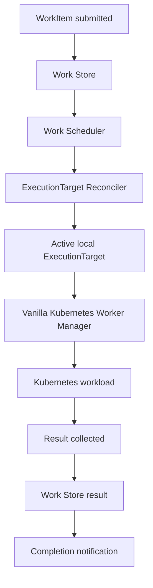
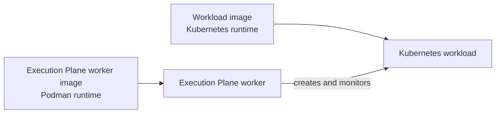
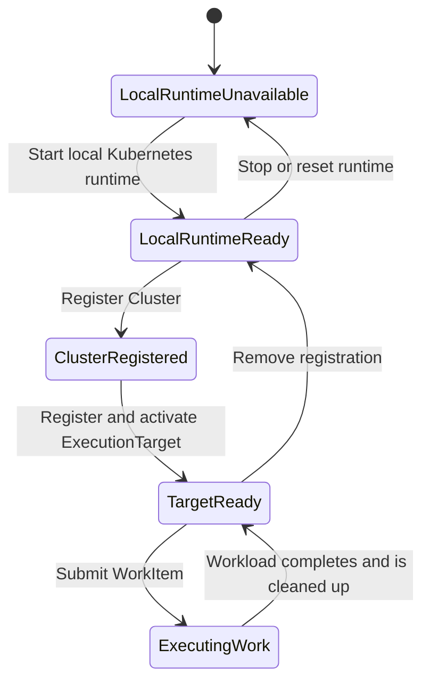

# Execution Plane: Local Kubernetes Development Environment

## Purpose

This document describes the local development environment for exercising the
Execution Plane against a real Kubernetes-backed `Cluster` and
`ExecutionTarget`.

The environment keeps Syntara and the Execution Plane worker running through
their existing Podman-based development workflow. A local Kubernetes runtime
acts as the external compute environment that the Execution Plane connects to
and uses for vanilla Kubernetes work execution.

This work is tracked by the [Execution Plane: Development environment
Epic](https://redhat.atlassian.net/browse/AAP-94152), under the parent
[Workflow Automation — Execution Plane](https://redhat.atlassian.net/browse/ANSTRAT-1803)
feature.

## Goals

The local environment should make it possible to:

- run Syntara and the Execution Plane worker in the existing Podman workflow;
- provision or start a local Kubernetes runtime;
- represent that runtime as an Execution Plane `Cluster`;
- represent a Kubernetes namespace or equivalent execution boundary as an
  `ExecutionTarget`;
- route WorkItems to the vanilla Kubernetes Worker Manager;
- execute the WorkItem in a Kubernetes workload;
- collect the result through the existing Work Store and completion path; and
- exercise success, failure, timeout, cleanup, and restart behavior locally.

The local Kubernetes runtime is a development dependency and test target. It
is not intended to become the hosting environment for the Syntara API or the
Execution Plane worker as part of this effort.

## Runtime topology

The intended topology has two execution environments:

1. Podman hosts Syntara, Temporal, PostgreSQL, and the Execution Plane worker.
2. A local Kubernetes runtime hosts the Cluster/ExecutionTarget workload
   environment and the Kubernetes workloads created by the Worker Manager.

## Integration boundaries

The shared database remains the interface between Syntara and the Execution
Plane for this development environment. No new Execution Plane HTTP service
is required.

The boundaries are deliberately narrow:

- Syntara owns workflow orchestration and submits durable WorkItems.
- PostgreSQL owns the shared Work Store and lifecycle state.
- The Execution Plane owns target selection, dispatch coordination, result
  persistence, and completion notification.
- Kubernetes owns workload placement and execution inside the registered
  Cluster/ExecutionTarget.
- Temporal remains the completion mechanism for the current Syntara
  integration.

## Cluster and ExecutionTarget representation

The local Kubernetes runtime is registered as an Execution Plane `Cluster`.
The development target is registered as an `ExecutionTarget` associated with
that Cluster. The target identifies the vanilla Kubernetes backend and the
execution boundary in which Workloads run.

The local setup must provide at least one active target, including a default
target for WorkItems that do not provide routing selectors. Additional targets
may be added later to exercise selector-based routing or multiple Kubernetes
execution boundaries.

The registration and lifecycle behavior follows the Cluster and
ExecutionTarget model described in
[`cluster-and-target-registries.md`](cluster-and-target-registries.md):

- the Cluster is unavailable until it is registered and usable;
- the ExecutionTarget is unavailable until it is active;
- disabled or draining resources do not receive new work; and
- deletion is a drain followed by physical cleanup.

## Work execution path

The local environment is intended to validate the path from a WorkItem to a
real Kubernetes workload.

The local environment does not define a separate scheduling or routing model.
It provides a concrete Kubernetes-backed target for the Execution Plane
components already described by the Execution Plane architecture.

## Workload images

The image used for Kubernetes workloads is independent from the Syntara and
Execution Plane worker images.

For local development, the workload image may be:

- built locally and made available to the local Kubernetes runtime; or
- pulled from a container registry such as `quay.io`.

The environment should make the image choice configurable without changing
the Cluster/ExecutionTarget model or the Worker Manager contract. The image
must conform to the execution contract required by the vanilla Kubernetes
backend and expose enough status and output for the Worker Manager to collect
the WorkItem result.

The image used by the Execution Plane worker itself remains the existing
Podman image. These are separate concerns:

## Environment lifecycle

The development workflow has four conceptual stages:

The lifecycle should be repeatable. A developer should be able to reset the
local Kubernetes state, re-register the Cluster/ExecutionTarget, and run the
same WorkItem validation again without relying on state from a previous run.

## Relationship to existing Execution Plane work

This development environment enables integration of the implementation work
tracked under [AAP-82060](https://redhat.atlassian.net/browse/AAP-82060).
In particular, it provides a concrete local target for
[AAP-93615](https://redhat.atlassian.net/browse/AAP-93615), the cold-start
vanilla Kubernetes Worker Manager.

It also coordinates with the existing Execution Plane work for:

- [AAP-92715 — Work Store](https://redhat.atlassian.net/browse/AAP-92715)
- [AAP-92716 — Cluster/ExecutionTarget registries](https://redhat.atlassian.net/browse/AAP-92716)
- [AAP-92721 — Pool/ExecutionTarget Reconciler](https://redhat.atlassian.net/browse/AAP-92721)
- [AAP-92722 — Work Scheduler](https://redhat.atlassian.net/browse/AAP-92722)
- [AAP-92727 — Registration Provider](https://redhat.atlassian.net/browse/AAP-92727)
- [AAP-92728 — Cluster Bootstrapper](https://redhat.atlassian.net/browse/AAP-92728)

The development-environment work should validate and connect those components
where appropriate; it should not create competing versions of their domain
contracts.

## Non-goals

This approach does not require:

- moving Syntara into Kubernetes;
- moving the Execution Plane worker into Kubernetes;
- exposing the Execution Plane through a new HTTP service;
- replacing the shared PostgreSQL Work Store boundary;
- committing to one specific local Kubernetes distribution permanently; or
- requiring all workload images to come from one registry.

The local runtime choice, image source, and bootstrap mechanism should remain
replaceable as long as they provide the same usable Cluster/ExecutionTarget
for Execution Plane integration testing.

## Success criteria

The environment is successful when a developer can:

1. Start the existing Podman-based Syntara and Execution Plane services.
2. Start or provision the supported local Kubernetes runtime.
3. Register the local runtime as a Cluster with an active default
   ExecutionTarget.
4. Submit a WorkItem through the existing Syntara path.
5. Observe the WorkItem execute through the vanilla Kubernetes backend.
6. Verify the result reaches the Work Store and the waiting consumer.
7. Repeat the flow after a clean local reset.
8. Exercise the documented failure and cleanup behavior.
