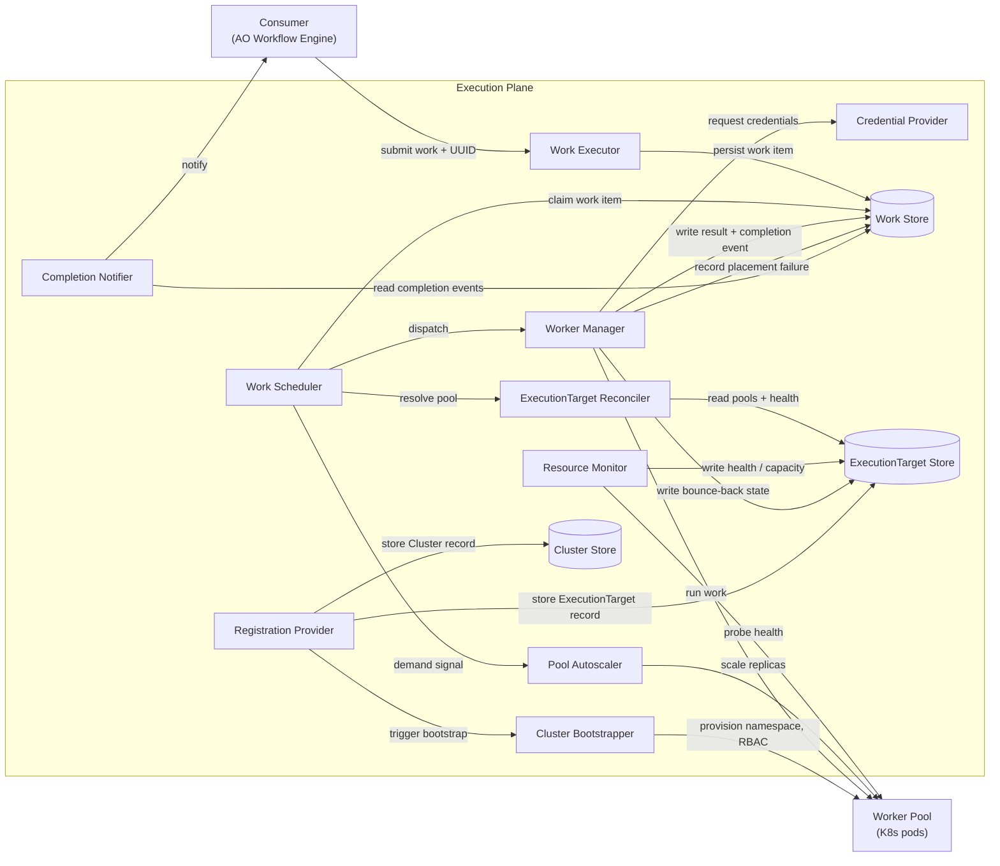
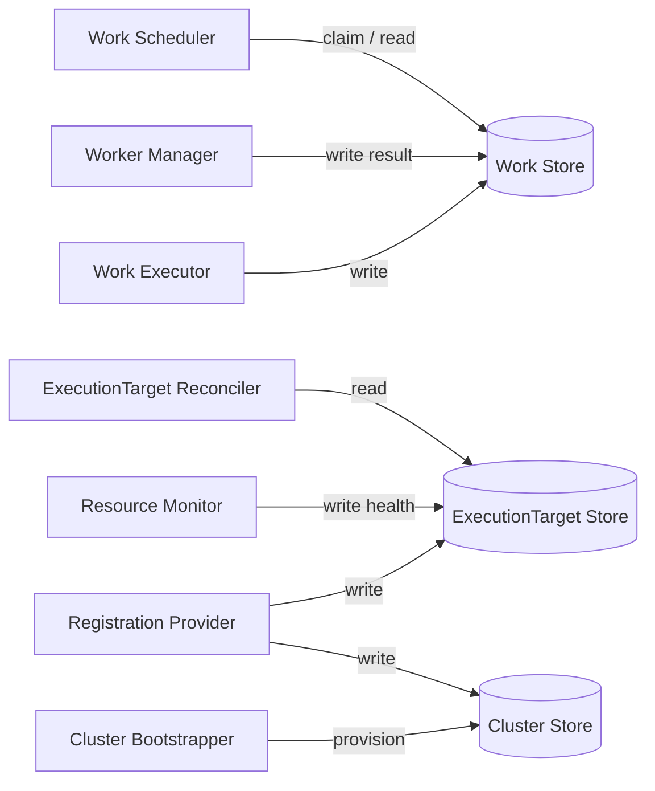

# Execution Plane: Logical Components

This is an echo of the component decomposition from the ANSTRAT-1803 System Design Plan:
[ansible/handbook#1664](https://github.com/ansible/handbook/pull/1664).

---

## Component interactions

---

## Logical units

- **[Work Executor](work-executor.md)**
  - In: work submission from consumer, including a caller-generated UUID and isolation policy
  - Out: `WorkItem` persisted to [`WorkStore`](work-store.md). The ID is caller-owned — the consumer generates it before submitting.

- **[Work Store](work-store.md)**
  - In: `WorkItem`s from Work Executor; results and completion events from Worker Manager
  - Out: claimable `WorkItem`s to Work Scheduler; completion events to Completion Notifier

- **Work Scheduler**
  - In: claimed `WorkItem` from [`WorkStore`](work-store.md); `ReconcileResult` from `ExecutionTarget` Reconciler
  - Out: dispatch to Worker Manager; demand signal to Pool Autoscaler

- **ExecutionTarget Reconciler**
  - In: `WorkRequirements` (selectors, isolation policy) from Scheduler; pool snapshots + health from `ExecutionTargetStore`
  - Out: ranked `ExecutionTarget`s (`ReconcileResult`). Pure query — no writes, no side effects.

- **ExecutionTarget Store**
  - In: pool registrations from Registration Provider; health and capacity updates from Resource Monitor
  - Out: pool snapshots to `ExecutionTarget` Reconciler. Currently the `ExecutionTarget` table in Postgres.

- **Resource Monitor**
  - In: health probes from Worker Pool
  - Out: health and capacity written to `ExecutionTargetStore`. No state of its own.

- **Pool Autoscaler**
  - In: demand signal from Work Scheduler or Worker Manager
  - Out: replica count adjustment to Worker Pool

- **[Worker Manager](worker-manager.md)**
  - In: `WorkItem` + `ExecutionTarget` from Scheduler
  - Out: result and completion event written to [`WorkStore`](work-store.md); bounce-back state written to `ExecutionTargetStore` on K8s rejection. Obtains an `ExecutionTarget`, injects credentials, runs the work, collects output.

- **Credential Provider**
  - In: credential scope (from isolation policy on the `WorkItem` or the `ExecutionTarget`) + request from Worker Manager
  - Out: credentials injected into the worker for the duration of execution only

- **Worker Pool**
  - In: work dispatched by Worker Manager; scale adjustments from Pool Autoscaler; bootstrap from Cluster Bootstrapper
  - Out: execution results; health data probed by Resource Monitor. K8s backend: see [kubernetes-backend.md](kubernetes-backend.md).

- **Completion Notifier**
  - In: completion event from [`WorkStore`](work-store.md)
  - Out: async notification to consumer (e.g. Temporal signal callback)

- **Registration Provider**
  - In: administrator registration action
  - Out: pool record written to `ExecutionTargetStore`; bootstrap delegated to Cluster Bootstrapper

- **Cluster Bootstrapper**
  - In: registration from Registration Provider
  - Out: provisioned K8s resources (namespace, ServiceAccount, RBAC) that become the Worker Pool

---

## State holders

Both durable data stores are Postgres in the current branch. A third store,
`ClusterStore`, is anticipated.

| Store | What it holds | Technology |
|---|---|---|
| Work Store | `WorkItem` records — queue, results, completion events | Postgres (current branch) |
| ExecutionTarget Store | `ExecutionTarget` records — lifecycle, health, capacity | Postgres (current branch) |
| Cluster Store | `Cluster` records — created on provisioning | Postgres (anticipated) |
