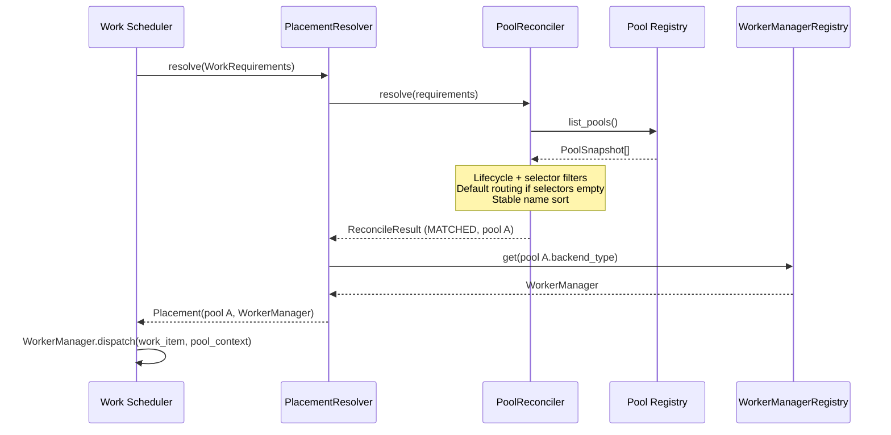
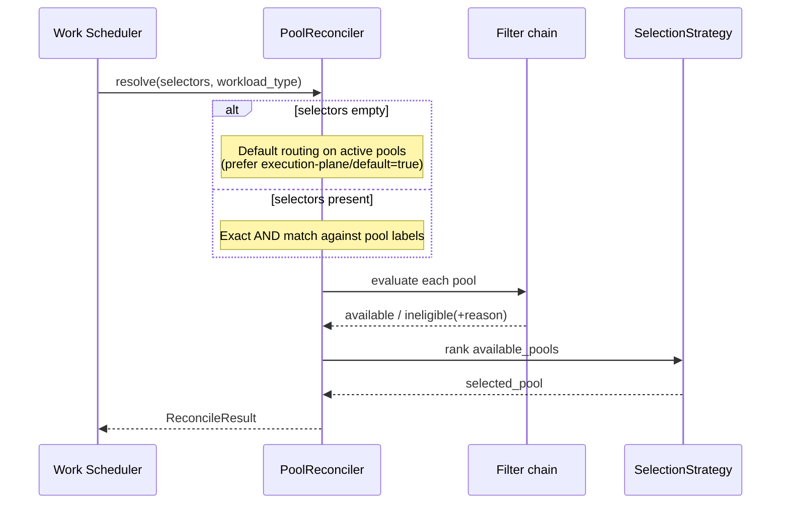

# Execution Plane: Pool Reconciler

Architectural technical design for the Pool Reconciler — the component that
resolves which Worker Pool should execute a given work item.

- Ticket: [AAP-92721](https://redhat.atlassian.net/browse/AAP-92721)
- Feature: [ANSTRAT-1803](https://redhat.atlassian.net/browse/ANSTRAT-1803)
- Parent epic: [AAP-82060](https://redhat.atlassian.net/browse/AAP-82060)

## What this document is

The design the Pool Reconciler implementation must follow. It covers the
selector model, matching algorithm, default routing, multi-match strategy,
no-match error propagation, Worker Manager resolution, and the extension
points for health-based and policy-based filtering.

It does not implement the Work Scheduler, Pool Registry, Resource Monitor, or
Isolation Policy. Those stories consume or replace the interfaces defined
here.

## Context

The Work Scheduler claims a work item from the Work Store, then asks the Pool
Reconciler where that work should run. The reconciler reads pool definitions
from the Pool Registry, matches the work item's selector labels against pool
configuration, and returns a structured result.

For MVP, eligibility is selector matching plus pool lifecycle state (only
active pools are eligible). Health-based exclusion ([AAP-92724](https://redhat.atlassian.net/browse/AAP-92724)
Resource Monitor) and policy-based filtering
([AAP-92726](https://redhat.atlassian.net/browse/AAP-92726) Isolation Policy)
are deferred; their interfaces are reserved so they can land without breaking
changes.

The reconciler is a **pure query**. It does not claim workers, mutate work
items, or retry. The Work Scheduler ([AAP-92722](https://redhat.atlassian.net/browse/AAP-92722))
owns durable queue state, retry timing, and assignment.

### Requirements addressed

| Requirement | Acceptance | How this component addresses it |
|---|---|---|
| R7 | AC-9, AC-11, AC-12 | Selector-based routing; default routing when no selectors are specified |
| R10 | AC-9, AC-10 | Work is not routed to pools that are not in an active lifecycle state |
| R28 | AC-2, AC-12 | Work is routed only to pools whose labels satisfy the work's requirements |

MVP affinity is **global labels only**. Per-project, per-workflow, and
per-node affinity are future work (ANSTRAT-1803). Typical MVP topology is a
single on-cluster pool.

## Process model

The Pool Reconciler is a **co-located library** in the execution-plane worker
process, not a remote service. The Pool Registry may become remote later;
reconciliation logic stays local.

The Work Scheduler must never contain backend-type routing logic. How a
resolved pool becomes a callable Worker Manager is closed as follows.

### Recommended coupling

```
Work Scheduler
  → PlacementResolver.resolve(requirements)
       → PoolReconciler.resolve(...)         # pure, serializable result
       → WorkerManagerRegistry.get(backend)  # local instances only
  → worker_manager.dispatch(work_item, pool_context)
```

`PoolReconciler.resolve()` returns pool metadata only. It does **not** return
a `WorkerManager` instance. Worker Manager objects are not serializable and
would make the reconciler unusable if the registry is remote.

`PlacementResolver` is a thin local facade used by the scheduler. It calls
the reconciler, looks up a locally registered Worker Manager by the selected
pool's `backend_type`, and returns both. The scheduler receives something it
can call directly without knowing the backend type.

This is the co-located resolver option from AAP-92721, split so the
reconciler remains a pure query (as in the conceptual Execution Plane
architecture).

## Inputs

The reconciler does not take a `WorkItem` row. Work Store / Work Executor may
later persist selectors on `WorkItem`; the reconciler only needs a DTO:

```python
class WorkRequirements:
    selectors: dict[str, str]          # empty → default routing
    workload_type: str | None = None   # unused in MVP matching; reserved for Isolation Policy
```

This avoids a Work Store schema change in AAP-92721.

## Pool view

[AAP-92716](https://redhat.atlassian.net/browse/AAP-92716) owns the persistent
pool table. The reconciler depends on a Protocol and a snapshot DTO, not on
that table's concrete model.

```python
class PoolSnapshot:
    id: uuid.UUID
    name: str
    labels: dict[str, str]
    lifecycle: str          # see Lifecycle filter
    backend_type: str       # e.g. vanilla_k8s, openshell
    enabled: bool

class PoolRegistry(Protocol):
    async def list_pools(self) -> Sequence[PoolSnapshot]: ...
```

Until the Pool Registry lands, an `ExecutionTargetPoolRegistry` adapter maps
the existing `ExecutionTarget` rows (`labels`, `backend_type`, `status`,
`enabled`) onto `PoolSnapshot`. `TargetStatus.ACTIVE` is eligible;
`enabled is False` is ineligible. Swap the adapter for the real registry
without changing `PoolReconciler`.

`list_pools()` returns registered pools. The reconciler applies eligibility
filters in process; the registry is not required to pre-filter by selector.

## Core operation: Resolve

```python
class PoolReconciler:
    def __init__(
        self,
        registry: PoolRegistry,
        filters: Sequence[EligibilityFilter],
        strategy: SelectionStrategy,
    ) -> None: ...

    async def resolve(self, requirements: WorkRequirements) -> ReconcileResult: ...
```

Algorithm:

1. `registry.list_pools()`
2. Run the filter chain on each pool; partition into available / ineligible
3. If `requirements.selectors` is empty, apply default routing on the
   lifecycle-eligible set, then the selection strategy
4. Set `outcome` and `selected_pool`

No I/O besides the registry. No mutation of work items or pools.

## Selector model

Key-value labels on the work item, matched against key-value labels on the
pool. MVP semantics are **exact match, AND of all requested keys**
(Kubernetes-style equality selectors).

Work selectors `{k: v}` match a pool if and only if **every** requested key
exists on the pool with that exact value. Extra pool labels are allowed. A
missing key or a different value is a mismatch.

No `In` / `NotIn` / existence operators for MVP.

| Work selectors | Pool labels | Match? |
|---|---|---|
| `{gpu: "true"}` | `{gpu: "true", region: "eu"}` | yes |
| `{gpu: "true", region: "eu"}` | `{gpu: "true"}` | no (missing key) |
| `{gpu: "true"}` | `{gpu: "false"}` | no |
| `{gpu: "true"}` | `{}` | no |

Empty selectors are **not** this rule. They take the default-routing path
below. Empty selectors do not mean "match every label set."

## Default routing

When `requirements.selectors` is empty:

1. Consider only pools that pass the lifecycle filter (active and enabled).
2. If any of those pools has label `execution-plane/default=true`, those
   are the only default candidates.
3. Otherwise every lifecycle-eligible pool is a candidate (MVP: usually one
   on-cluster pool).
4. Apply the multi-match strategy to produce `selected_pool`.

If no lifecycle-eligible pool exists, the outcome is `NO_MATCHING_POOLS`.

## Lifecycle filter

Only pools in lifecycle **`active`** with `enabled=True` are eligible for
scheduling.

| Lifecycle | Eligible? | Notes |
|---|---|---|
| `active` | yes | and `enabled=True` |
| `registering` | no | not ready |
| `validating` | no | `ExecutionTarget` stand-in state |
| `bootstrapping` | no | `ExecutionTarget` stand-in state |
| `degraded` | no | excluded now so R10 holds without a Resource Monitor |
| `failed` | no | |
| `deregistering` | no | drain; Reconciler must stop selecting the pool |
| `deregistered` | no | |
| `enabled=False` | no | administrative disable |

When AAP-92724 lands, a health filter may refine `degraded` (for example
allow it with reduced capacity). Until then, degraded is ineligible.

## Multi-match strategy

The reconciler returns the **full ranked set** of eligible pools plus a
single `selected_pool` for callers that want one.

MVP strategy: **stable sort by pool name** (deterministic, no extra state).

Least-loaded needs Resource Monitor data. Round-robin needs scheduler-side
state. Neither belongs in this component for MVP.

The Work Scheduler (AAP-92722) should walk `available_pools` in rank order if
provision or claim fails on `selected_pool`. The reconciler does not perform
that fallback.

A future health filter (AAP-92724) may mark a pool
`IneligibilityReason.CAPACITY_EXHAUSTED`. That reason is not produced in
MVP (no capacity signal). Capacity exhaustion must not fail the work item;
the scheduler keeps it queued.

## Structured result

The reconciler returns a structured result that tells the scheduler both
what matched and why anything did not. This is enough to assign immediately,
keep the work queued, or fail it as unschedulable.

```python
class ResolveOutcome(StrEnum):
    MATCHED = "matched"
    NO_MATCHING_POOLS = "no_matching_pools"

class IneligibilityReason(StrEnum):
    LIFECYCLE = "lifecycle"
    DISABLED = "disabled"
    SELECTOR_MISMATCH = "selector_mismatch"
    CAPACITY_EXHAUSTED = "capacity_exhausted"  # reserved for AAP-92724
    HEALTH = "health"                         # reserved for AAP-92724
    POLICY = "policy"                         # reserved for AAP-92726

class IneligiblePool:
    pool: PoolSnapshot
    reason: IneligibilityReason

class ReconcileResult:
    available_pools: list[PoolSnapshot]
    ineligible_pools: list[IneligiblePool]
    selected_pool: PoolSnapshot | None
    outcome: ResolveOutcome
```

`outcome` is `MATCHED` when `available_pools` is non-empty, otherwise
`NO_MATCHING_POOLS`. It does not encode why pools were rejected; that is
`IneligibilityReason`.

| Outcome | Meaning | Scheduler action |
|---|---|---|
| `MATCHED` | At least one pool is eligible now | Proceed with the selected (or next) pool |
| `NO_MATCHING_POOLS` | No pool is eligible now | If any ineligible reason is `CAPACITY_EXHAUSTED`, keep the work queued (scaling may help). Otherwise fail; scaling will not help. |

### Ineligibility reasons

| `IneligibilityReason` | Meaning |
|---|---|
| `LIFECYCLE` | Pool is not `active` |
| `DISABLED` | Pool is administratively disabled |
| `SELECTOR_MISMATCH` | Requested selectors are not a subset of pool labels |
| `CAPACITY_EXHAUSTED` | Labels match but the pool has no spare capacity. Reserved for Resource Monitor (AAP-92724). Scheduler must re-queue, not fail. |
| `HEALTH` | Reserved for Resource Monitor (AAP-92724) |
| `POLICY` | Reserved for Isolation Policy (AAP-92726) |

### Error propagation

`resolve()` does **not** raise on no match. No-match is an outcome, not an
exception. The scheduler distinguishes unschedulable work from capacity
exhaustion by reading `ineligible_pools` reasons. Placement lookup of an
unregistered `backend_type` is a **configuration error**, distinct from
`NO_MATCHING_POOLS`.

## Extension points

Filters are injected at construction. Adding health or policy later is a
constructor argument, not an interface change.

```python
class FilterVerdict(StrEnum):
    ELIGIBLE = "eligible"
    INELIGIBLE = "ineligible"

class EligibilityFilter(Protocol):
    name: str
    async def evaluate(
        self, pool: PoolSnapshot, requirements: WorkRequirements
        ) -> tuple[FilterVerdict, IneligibilityReason | None]:
        # INELIGIBLE carries an IneligibilityReason
        ...
```

Built-in chain, in order:

| Order | Filter | This story | Later |
|---|---|---|---|
| 1 | `LifecycleFilter` | implemented | — |
| 2 | `SelectorFilter` | implemented; skipped on the default-routing path | — |
| 3 | `HealthFilter` | no-op pass-through | AAP-92724 |
| 4 | `PolicyFilter` | no-op pass-through | AAP-92726 |

A denying filter (ineligible) stops further evaluation of that pool.
Remaining pools continue through the chain.

`workload_type` on `WorkRequirements` is ignored by MVP filters and is the
input Isolation Policy will use.

## Worker Manager resolution

```python
class WorkerManagerRegistry:
    def register(self, backend_type: str, manager: WorkerManager) -> None: ...
    def get(self, backend_type: str) -> WorkerManager: ...  # raises if missing
```

```python
class PlacementResolver:
    def __init__(
        self,
        reconciler: PoolReconciler,
        worker_managers: WorkerManagerRegistry,
    ) -> None: ...

    async def resolve(self, requirements: WorkRequirements) -> Placement: ...
```

On `MATCHED`, `Placement` is `(selected_pool, worker_manager, pool_context)`.
On `NO_MATCHING_POOLS`, the facade returns the `ReconcileResult` only; the
scheduler decides (including whether `CAPACITY_EXHAUSTED` means re-queue).

This story does not implement vanilla Kubernetes or OpenShell Worker
Managers. Registering a test double is enough. Changing
`WorkerManager.dispatch` to accept pool context is documented for
AAP-92722 / AAP-92421 and is out of scope here.

## Sequence

Happy path (critical path only; Resource Monitor and Isolation Policy omitted):



Pool selection detail:



## Package layout

Implementation lives in the execution-plane package so it can run without
Syntara `BaseService` (this is not an HTTP domain service).

```
backend/execution-plane/src/execution_plane/pool_reconciler/
  types.py          # WorkRequirements, PoolSnapshot, ReconcileResult, ...
  protocols.py      # PoolRegistry, EligibilityFilter, SelectionStrategy
  exceptions.py
  matching.py       # exact-AND selector match
  filters.py        # Lifecycle, Selector, no-op Health/Policy
  strategy.py       # stable sort by name
  reconciler.py
  placement.py      # PlacementResolver + WorkerManagerRegistry
  adapters.py       # ExecutionTargetPoolRegistry (temporary)
backend/execution-plane/tests/pool_reconciler/
```

Tests must mirror the source domain
(`backend/tools/ci/verify_test_structure.py`). Import from defining modules;
do not re-export from `__init__.py`.

## Out of scope

- Work Scheduler loop, claim/retry, `pg_notify` (AAP-92722)
- Wiring `worker.py` off in-process `execute_script` (valid until the
  scheduler exists)
- Pool Registry CRUD, migrations, auto-provisioning (AAP-92716)
- New REST endpoints or OpenAPI changes
- `WorkItem.selectors` column (Work Executor / Work Store)
- Real Resource Monitor probes or Isolation Policy DSL
- Changing `WorkerManager.dispatch` beyond documenting pool context for
  later stories

## Coordination

- **AAP-92716 (Pool Registry):** share `PoolRegistry` / `PoolSnapshot` field
  names (name, labels, lifecycle, backend_type) so the adapter can be
  deleted when the real registry lands.
- **AAP-92715 / AAP-92720 (Work Store / Work Executor):** if selectors are
  persisted on `WorkItem`, map them into `WorkRequirements`; do not couple
  the reconciler to the row type.
- **AAP-92722 (Work Scheduler):** consume `PlacementResolver`; walk
  `available_pools` on provision failure. On `NO_MATCHING_POOLS`, re-queue
  if any ineligible reason is `CAPACITY_EXHAUSTED`; otherwise fail.
- **AAP-92724 / AAP-92726:** replace the no-op health and policy filters
  without changing `PoolReconciler.resolve`.
