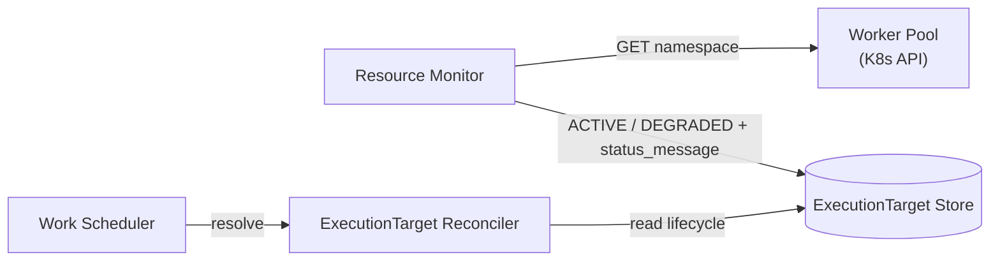

# Execution Plane: Resource Monitor

Architectural technical design for the Resource Monitor — the component that
probes registered compute and writes health into the ExecutionTarget Store
so the ExecutionTarget Reconciler can exclude unavailable targets.

- Ticket: [AAP-92724](https://redhat.atlassian.net/browse/AAP-92724)
- Feature: [ANSTRAT-1803](https://redhat.atlassian.net/browse/ANSTRAT-1803)
- Parent epic: [AAP-82060](https://redhat.atlassian.net/browse/AAP-82060)
- SDP: [ansible/handbook#1664](https://github.com/ansible/handbook/pull/1664)

## What this document is

The design the Resource Monitor implementation must follow for the Kubernetes
MVP. It covers probe semantics, what “capacity” means (and does not mean) on
Kubernetes, how health is persisted, how `HealthFilter` consumes it, and what
is deferred to RHEL and later stories.

It does not implement the Work Scheduler, Worker Manager bounce-back, Isolation
Policy, or a RHEL probe. Those stories consume or replace the interfaces
defined here.

## Context

The Work Scheduler claims a work item, then asks the
[ExecutionTarget Reconciler](executiontarget-reconciler.md) where that work
should run. For MVP, eligibility is selector matching plus lifecycle state.
Health-based exclusion is reserved on `HealthFilter` and
`IneligibilityReason.HEALTH` / `CAPACITY_EXHAUSTED`. This story replaces the
no-op health filter with a real signal.

The Resource Monitor is a **writer**. It probes infrastructure and updates the
ExecutionTarget Store. It has no durable state of its own beyond what it
persists on Cluster / ExecutionTarget rows. The reconciler remains a **pure
query**.

See [logical_components.md](logical_components.md) for how it fits the
decomposition.

### Requirements addressed

| Requirement | Acceptance | How this component addresses it |
|---|---|---|
| R10 | AC-9, AC-10 | Kubernetes health probes mark unreachable targets `DEGRADED`; `HealthFilter` excludes them from scheduling |
| R8 | AC-7 | Unhealthy is a filter outcome (`HEALTH`), not a dropped work item. Re-queue vs fail is a Work Scheduler concern ([AAP-92722](https://redhat.atlassian.net/browse/AAP-92722)) |
| R11 | AC-10 | `status` and `status_message` on ExecutionTarget are already returned by `GET /api/execution_plane/v1/execution_targets`. A dedicated topology UI is out of scope |

AC-9 also asks for “compute capacity and current workload state.” On Kubernetes
this story implements **reachability and namespace existence**, not remaining
cluster CPU/memory. See [Capacity on Kubernetes](#capacity-on-kubernetes).

## Kubernetes MVP scope

This implementation is **health-only** and **Kubernetes-only**.

| In | Out |
|---|---|
| OpenShift / `vanilla_k8s` ExecutionTargets | `ClusterType.RHEL` probes ([ANSTRAT-2338](https://redhat.atlassian.net/browse/ANSTRAT-2338)) |
| API reachability and namespace existence | Remaining node CPU/memory, Metrics Server, ResourceQuota, node allocatable |
| `TargetStatus.ACTIVE` ↔ `DEGRADED` | `CAPACITY_EXHAUSTED`, `pool_size`, `current_jobs` |
| `HealthFilter` denying `DEGRADED` with `HEALTH` | Allowing degraded targets “with reduced capacity” |
| Process-owned loop in the EP worker (same pattern as Drain Monitor) | Worker Manager bounce-back ([AAP-93615](https://redhat.atlassian.net/browse/AAP-93615)) |
| Existing list API exposing `status` / `status_message` | Frontend topology view |

RHEL support lands later as a second `TargetProbe` implementation behind the
same protocol. Do not special-case RHEL inside the Kubernetes probe.

## Capacity on Kubernetes

In AAP Controller, remaining capacity is a real number (forks on an execution
node) used for routing. Kubernetes does not expose an equivalent for an
ExecutionTarget:

- Node allocatable is cluster-wide, often needs extra RBAC, and is shared with
  every other workload on the cluster.
- Metrics Server (`metrics.k8s.io`) is optional.
- ResourceQuota is optional and not always configured on the target namespace.
- Kubernetes is designed to accept work and leave it Pending, not to advertise
  spare slots to an external scheduler.

The Resource Monitor **must not** scrape remaining CPU, remaining memory, node
allocatable, or quota and treat the result as Execution Plane capacity. That
is not a later enhancement of the same probe; it is a different product
decision.

Elastic Kubernetes capacity belongs to:

1. The Kubernetes scheduler (Pending is a valid cluster state).
2. **Reactive bounce-back** in the Worker Manager: unschedulable or
   resource-pressure rejection → backoff on that target. That is
   [AAP-93615](https://redhat.atlassian.net/browse/AAP-93615), not this story.

This story **does not emit** `IneligibilityReason.CAPACITY_EXHAUSTED`. Until
there is a number the Execution Plane trusts, that reason would be fiction.
The scheduler contract is unchanged: `CAPACITY_EXHAUSTED` means re-queue
(scaling may help); this slice only produces `HEALTH`.

An **EP-owned** concurrency cap (`max_concurrent` vs in-flight `WorkItem`s) is
our bookkeeping, not Kubernetes capacity. It is a follow-up after the Work
Scheduler exists and needs backpressure. Do not add `pool_size` /
`current_jobs` columns in this story.

RHEL later can implement a Controller-like remaining-capacity probe behind the
same `TargetProbe` protocol.

## What a healthy Kubernetes target means

For MVP, a target is healthy when:

1. The Cluster API is reachable with the stored Cluster credentials.
2. The ExecutionTarget namespace exists.
3. The credential is still authorized for that namespace (HTTP 403 is
   unhealthy, not “out of capacity”).

It does **not** mean spare CPU, spare memory, or “this cluster can take N more
jobs.”

Probe: `GET /api/v1/namespaces/{target.namespace}` using the **Cluster**
`endpoint` and `api_key`, not `ExecutionTarget.endpoint`. Target endpoints may
be `local://…` (bootstrap / in-process executor); the Cluster row is the
control-plane connection.

| Result | Meaning | Persist |
|---|---|---|
| 200 | Namespace exists and credentials work | Count a success toward `ACTIVE` |
| 404 | Namespace gone | Count a failure; `status_message` explains missing namespace |
| 401 / 403 | Auth or RBAC failure | Count a failure; `status_message` explains authorization |
| Timeout / connection error | API unreachable | Count a failure; `status_message` explains reachability |

Do not log or persist the API key. `status_message` is operator-facing and
must stay free of secrets.

### What to skip

Leave status unchanged (do not probe):

- `ClusterType.RHEL` — no backend yet.
- Non-HTTP Cluster endpoints (`local://execution-plane`) so the current
  in-process script executor stays `ACTIVE`.
- ExecutionTargets not in `ACTIVE` or `DEGRADED`. Do not revive `FAILED`,
  `DRAINING`, `REGISTERING`, `VALIDATING`, or `BOOTSTRAPPING`.

Disabled targets may be skipped to reduce load; administrative disable is
already `IneligibilityReason.DISABLED`.

## Component design



The monitor is a process-owned asyncio loop in the EP worker, started next to
the Drain Monitor from `run_worker()`. Cancellation in `finally` matches the
drain monitor. Target drain semantics are in
[cluster-and-target-registries.md](cluster-and-target-registries.md).

Suggested layout:

```
backend/execution-plane/src/execution_plane/resource_monitor/
  monitor.py      # loop, hysteresis, persist
  probes.py       # TargetProbe protocol, KubernetesNamespaceProbe, SkipProbe
  client.py       # Kubernetes API client from Cluster.endpoint + api_key
backend/execution-plane/tests/resource_monitor/
```

### Probe protocol

RHEL later implements another class. The Kubernetes probe must not grow
`if cluster_type == rhel` branches.

```python
class ProbeResult:
    healthy: bool
    message: str | None  # never include credentials

class TargetProbe(Protocol):
    async def probe(self, cluster: Cluster, target: ExecutionTarget) -> ProbeResult: ...
```

`SkipProbe` (or equivalent) covers RHEL and `local://` endpoints: return a
result that the monitor treats as “do not update.”

### Kubernetes client

Cluster `api_key` is already stored in two shapes:

- Bearer token (OpenShift `oc whoami --show-token` via the EP dev CLI).
- Kubeconfig blob (local Kind / minikube via the EP dev CLI).

The client factory must accept both. Add `kubernetes` (or `kubernetes_asyncio`)
to execution-plane dependencies. Keep the probe behind the protocol so unit
tests never talk to a cluster.

This client factory is intentionally shared: the vanilla Kubernetes Worker
Manager will need the same construction from Cluster credentials. Do not bury
it inside the probe as a private helper that the Worker Manager cannot import.

`ClusterStore.get()` currently redacts `api_key`. The monitor loop needs
`include_secret=True` (same pattern as `ExecutionTargetStore.get`).

#### TLS

- Use the system CA bundle by default.
- If the credential is a kubeconfig, use its certificate-authority data.
- Do not default to `insecure-skip-tls-verify`. An explicit setting for local
  Kind is acceptable if required.

### Persistence

Reuse `TargetStatus.DEGRADED` / `ACTIVE` and `status_message`. Do not add
capacity columns.

Add a store method, for example
`record_health(target_id, *, healthy, message, updated_by)`:

- Only transition `ACTIVE ↔ DEGRADED`.
- Refuse to overwrite `DRAINING`, `FAILED`, or registration states.
- Never log or persist the API key.

Use a dedicated actor UUID for `updated_by` (same idea as
`BOOTSTRAP_ACTOR_ID`) so health writes are not attributed to a fake user.

Hysteresis avoids flapping on a single timeout:

- N consecutive failures → `DEGRADED` (default 3).
- M consecutive successes → `ACTIVE` (default 2).

Counters may be in-memory for MVP. They are lost on process restart; the next
probes re-establish the state. Defaults live on `EPSettings` with the probe
interval (for example 30s) and a probe timeout shorter than the interval.

One target failure must not abort the scan of remaining targets.

### In-flight work

When a target becomes `DEGRADED`, leave work that is already `DISPATCHED` /
running. The monitor only affects **new** placement. Drain remains the delete
path. See [cluster-and-target-registries.md](cluster-and-target-registries.md).

## HealthFilter

Filter order stays lifecycle → selector → health → policy.
`ExecutionTargetReconciler.resolve()` does not change.

Today `LifecycleFilter` treats `degraded` as `LIFECYCLE`, so `HealthFilter`
never runs. Change that so health owns degraded:

| Lifecycle | `LifecycleFilter` | `HealthFilter` |
|---|---|---|
| `active` | pass | pass |
| `degraded` | **pass** | **deny `HEALTH`** |
| `registering` / `failed` / `draining` / … | deny `LIFECYCLE` | not reached |

Do not allow `degraded` with “reduced capacity.” There is no reduced-capacity
number on Kubernetes.

`ExecutionTargetSnapshot.lifecycle` already carries status. No new snapshot
fields are required.

### Scheduler contract (AAP-92722)

`resolve()` still does not raise on no match. The scheduler reads
`ineligible_targets` reasons:

| Reason | Recommended scheduler action | Produced in this story? |
|---|---|---|
| `CAPACITY_EXHAUSTED` | Re-queue (scaling may help) | No |
| `HEALTH` | Re-queue with backoff (API blip, expired token — often temporary) | Yes |
| `LIFECYCLE` / `DISABLED` / `SELECTOR_MISMATCH` | Fail as unschedulable | Unchanged |

`HEALTH` as “fail immediately” would drop work that can run once the API
recovers. Re-queue vs fail is owned by the Work Scheduler, not this component.
Until AAP-92722 lands, producing `HEALTH` is still the correct filter contract.

## Implementation order

1. This document (the contract reviewers hold the code to).
2. Store: `include_secret` on Cluster reads used by the monitor; `record_health`
   with the transition guards.
3. Kubernetes client factory + namespace probe. Unit tests with a fake client:
   success, 404 namespace, 401/403, timeout, skip `local://` and RHEL.
4. Monitor loop + hysteresis, started from `worker.py`.
5. Reconciler: allow `degraded` in `LifecycleFilter`; `HealthFilter` denies with
   `HEALTH`. Update existing filter tests.
6. Cross-links in sibling execution-plane docs if they still call the health
   filter a no-op.

## Testing

Unit tests are the bar. Do not require Kind or OpenShift in CI for this story.

- Probe: HTTP outcomes listed above; skip rules.
- `record_health`: legal `ACTIVE ↔ DEGRADED` transitions; ignored writes on
  `DRAINING` / `FAILED`.
- Hysteresis: N failures before `DEGRADED`, M successes before `ACTIVE`; a
  single timeout does not flip.
- Filters: `degraded` is `HEALTH`, not `LIFECYCLE`; `active` still eligible;
  `failed` still `LIFECYCLE`.
- Monitor loop: one failing target does not prevent probing the next; shutdown
  cancels cleanly.

## Out of scope

- RHEL probes ([ANSTRAT-2338](https://redhat.atlassian.net/browse/ANSTRAT-2338))
- `CAPACITY_EXHAUSTED`, `pool_size`, Metrics Server, node allocatable, ResourceQuota
- Worker Manager bounce-back ([AAP-93615](https://redhat.atlassian.net/browse/AAP-93615))
- Work Scheduler consumption of `HEALTH` ([AAP-92722](https://redhat.atlassian.net/browse/AAP-92722)) — this story only produces the reason
- Isolation Policy ([AAP-92726](https://redhat.atlassian.net/browse/AAP-92726))
- Frontend topology view
- Kind / OpenShift integration tests unless a cluster is already in CI
- Changing `WorkerManager.dispatch`

## Coordination

- **[AAP-92721](https://redhat.atlassian.net/browse/AAP-92721) ExecutionTarget Reconciler:** replace the no-op `HealthFilter` without changing `resolve()`. Allow `degraded` through `LifecycleFilter`.
- **[AAP-92716](https://redhat.atlassian.net/browse/AAP-92716) Cluster / ExecutionTarget registries:** `ACTIVE → DEGRADED` is already on the target state diagram in [cluster-and-target-registries.md](cluster-and-target-registries.md). `record_health` is the writer for that edge.
- **[AAP-92722](https://redhat.atlassian.net/browse/AAP-92722) Work Scheduler:** on `NO_MATCHING_TARGETS`, re-queue when any reason is `HEALTH` or `CAPACITY_EXHAUSTED`; fail on selector/lifecycle misses. `CAPACITY_EXHAUSTED` is reserved until a trusted capacity signal exists.
- **[AAP-93615](https://redhat.atlassian.net/browse/AAP-93615) vanilla Kubernetes Worker Manager:** reuse the Kubernetes client factory; own reactive placement rejection. Do not duplicate bounce-back in the Resource Monitor.
- **[labels.md](labels.md):** live health is not a label. Do not encode reachability as `healthy=true`.
- **Local development:** [kubernetes-local-development.md](kubernetes-local-development.md) registers a real kubeconfig-backed Cluster. That path is what the namespace probe exercises. The `local://` bootstrap Cluster is skipped on purpose.
