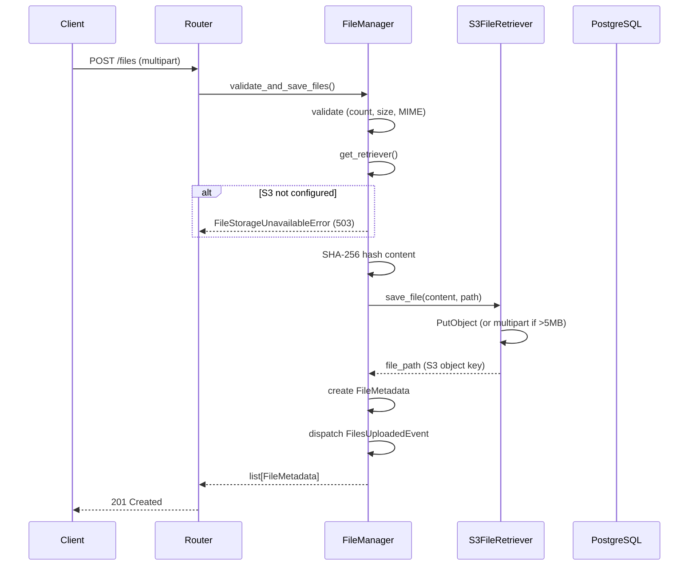

# File Storage

**Developer Guide — Understanding the Syntara file storage system**

## Table of Contents

- [Overview](#overview)
- [Architecture](#architecture)
- [Configuration](#configuration)
- [File Lifecycle](#file-lifecycle)
- [Integrity and Audit](#integrity-and-audit)
- [Health and Observability](#health-and-observability)
- [Graceful Degradation](#graceful-degradation)
- [API Reference](#api-reference)
- [Error Reference](#error-reference)
- [Related Documentation](#related-documentation)


---

## Overview

The file storage system provides persistent, S3-compatible storage for agent context files. Files uploaded to workflows are stored in an S3-compatible backend (ODF/NooBaa, AWS S3, Ceph, or any S3-compatible endpoint) and remain accessible across all replicas and pod restarts.

Key properties:

- **S3-only** — all file storage uses the S3-compatible protocol exclusively. Local filesystem storage has been removed from the codebase
- **Install-time configuration** — S3 is configured via environment variables at install time
- **Graceful degradation** — if S3 is not configured, the application starts normally but file upload endpoints return `503`. No hard failure at boot
- **SHA-256 integrity** — content hash is computed on upload and verified on every download. Mismatches emit an audit event and raise `FileIntegrityError`
- **Indefinite retention** — files persist indefinitely. There is no automatic cleanup or TTL-based expiration. Files are tied to workflow versions and must remain accessible for historical auditing. Storage cleanup is handled externally by administrators via S3 bucket lifecycle policies
- **Multipart cleanup** — the only automated cleanup removes abandoned multipart uploads (incomplete uploads older than a configurable threshold)

## Architecture

```mermaid
graph TD
    A[API Router<br>POST /files<br>GET /files/metadata<br>GET /files/&#123;file_id&#125;/download] --> B[FileManager<br>singleton]
    B --> C[S3FileRetriever<br>boto3 client]
    C --> D[(S3 / ODF<br>NooBaa)]
    B --> E[(PostgreSQL<br>FileMetadata)]
    F[Storage Status Endpoint<br>GET /files/storage_status] --> G[check_file_storage_health]
    G --> C
    H[Frontend<br>useFileStorageStatus] --> F
    H --> I[Settings Banner]
    H --> J[FileUpload<br>disabled state]
```



| Component | Purpose | Location |
|-----------|---------|----------|
| **Router** | HTTP endpoints for upload, download, list, delete | `src/syntara/files/router.py` |
| **FileManager** | Lazy singleton; validates files, delegates to S3FileRetriever, generates FileMetadata | `src/syntara/files/file_manager.py` |
| **S3FileRetriever** | boto3 client wrapper; save, load, delete, health check, multipart upload | `src/syntara/files/retrievers/s3.py` |
| **BaseRetriever** | Abstract base class defining the retriever interface | `src/syntara/files/retrievers/base.py` |
| **FileMetadata** | SQLModel for file metadata (id, filename, path, size, mime_type, content_hash, status) | `src/syntara/files/models/file_metadata.py` |
| **FileStorageSettings** | Pydantic settings for S3 env vars | `src/syntara/core/config/base.py` |
| **Health** | Startup validation and runtime health probes | `src/syntara/files/health.py` |
| **useFileStorageStatus** | React hook; queries `/files/storage_status`, returns `isConfigured` boolean | `frontend/.../hooks/useFileStorageStatus.ts` |

## Configuration

### Environment Variables

S3 credentials are injected via K8s Secrets in production, mounted as environment variables by the platform administrator.

| Variable | Description | Default |
|----------|-------------|---------|
| `APP_S3_ENDPOINT_URL` | S3-compatible endpoint URL (ODF, AWS, Ceph) | `None` (unconfigured) |
| `APP_S3_BUCKET_NAME` | S3 bucket name | `orchestrator-files` |
| `APP_S3_REGION` | S3 region | `us-east-1` |
| `APP_S3_ACCESS_KEY_ID` | S3 access key | `None` (required when S3 is configured) |
| `APP_S3_SECRET_ACCESS_KEY` | S3 secret key | `None` (required when S3 is configured) |
| `APP_S3_VERIFY_SSL` | Verify TLS certificate for S3 endpoint | `true` |
| `APP_S3_CA_BUNDLE` | Path to CA bundle for S3 endpoint TLS verification | `None` (optional) |
| `APP_S3_USE_PATH_STYLE` | Use path-style S3 addressing (`endpoint/bucket/key`) | `true` |

`APP_S3_USE_PATH_STYLE` defaults to `True` because ODF/NooBaa and Ceph RADOS Gateway require path-style addressing. Set to `False` for AWS S3, which uses virtual-hosted style (`bucket.endpoint/key`).

### Local Development

Local dev uses a `moto` server (official `motoserver/moto` Docker image) in `podman-compose.yml` to provide an S3-compatible endpoint. The `.env.example` file has defaults pointing to the local moto instance:

```
APP_S3_ENDPOINT_URL=http://localhost:5555
APP_S3_BUCKET_NAME=orchestrator-files
APP_S3_REGION=us-east-1
APP_S3_ACCESS_KEY_ID=testing
APP_S3_SECRET_ACCESS_KEY=testing
APP_S3_VERIFY_SSL=false  # local dev only — must be true in production
APP_S3_USE_PATH_STYLE=true
```

`make dev` auto-creates the S3 bucket on the moto server at startup. If moto is not running, the app starts without S3 and file uploads are disabled.

## File Lifecycle

### Upload Flow



Steps:

1. **Validation** — file count, individual size, total size, and MIME type are checked against `FileUploadSettings` limits
2. **Retriever check** — `FileManager.get_retriever()` returns the S3FileRetriever or raises `FileStorageUnavailableError` (503)
3. **Storage** — file content is saved to S3 via `S3FileRetriever.save_file()`. Files larger than 5 MB use multipart upload
4. **Metadata** — a `FileMetadata` record is created with the S3 object key, SHA-256 hash, MIME type, size, and `pending_conversion` status
5. **Audit** — `FilesUploadedEvent` is dispatched (success or failure)
6. **Cleanup on failure** — if any file in a batch fails, all previously saved files in that batch are deleted from S3

### Download Flow

1. `FileMetadata` is loaded from the database
2. `S3FileRetriever.load_file()` retrieves the content from S3
3. SHA-256 hash is recomputed and compared to the stored `content_hash`
4. If hashes match, content is returned. If not, `FileIntegrityFailedEvent` is dispatched and `FileIntegrityError` is raised
5. `FileDownloadedEvent` is dispatched on success

### Document Conversion

Uploaded files (PDF, DOCX, etc.) are converted to markdown for use as agent context. Conversion runs **asynchronously** — the POST `/files` response returns before any conversion activity begins.

After upload, the router dispatches conversion by starting a `BUILTIN_WORKFLOW_DOCUMENT_CONVERSION` Temporal workflow via `exec_service.create_execution_by_name()`. If Temporal is unavailable, the dispatch is skipped with a logged warning and the file stays in `pending_conversion` indefinitely (source: `src/syntara/files/router.py:182-203`).

**Status state machine:**

```
PENDING_CONVERSION → CONVERTING → CONVERTED
                               ↘ CONVERSION_FAILED
```

**Conversion steps** (inside the Temporal activity, `DocumentConversionTask.convert()`):

1. Upload sets `status = PENDING_CONVERSION`; router dispatches the Temporal workflow
2. Activity starts: `DocumentConversionService` loads the file from S3 via `FileManager.get_retriever()` and sets `status = CONVERTING`
3. Content is converted to markdown by the appropriate converter (selected by MIME type via `ConverterRegistry`)
4. Converted markdown is saved back to S3 as a separate object (`orchestrator-{file_id}-content.md`)
5. `FileMetadata.converted_content_path` is updated and `status = CONVERTED`
6. `FileConvertedEvent` is dispatched; on failure, `status = CONVERSION_FAILED`

### Multipart Cleanup

The only automated cleanup handles abandoned multipart uploads (incomplete uploads that were never finalized). `get_multipart_cleanup_worker()` runs periodically and aborts multipart uploads older than `file_multipart_cleanup_threshold_hours` (default: 24 hours).

## Integrity and Audit

### SHA-256 Integrity

Every file upload computes a SHA-256 hash of the content and stores it in `FileMetadata.content_hash`. On every download, the hash is recomputed and verified. Mismatches dispatch a `FileIntegrityFailedEvent` and raise `FileIntegrityError`. Legacy files without a stored `content_hash` skip verification.

### Audit Events

| Event | When | Key Fields |
|-------|------|------------|
| `FilesUploadedEvent` | After upload (success or failure) | file_count, total_size_bytes, file_details, error |
| `FileDownloadedEvent` | After download | file_id, filename, mime_type, size_bytes, storage_backend, error_type |
| `FileIntegrityFailedEvent` | SHA-256 mismatch on download | file_id, filename, storage_backend, expected_hash, actual_hash |
| `FileConvertedEvent` | After document conversion | file_id, filename, mime_type, size_bytes, conversion_state, conversion_time_ms |
| `FileCleanedUpEvent` | After multipart cleanup | files_deleted, multipart_uploads_aborted (summary-level event) |

Audit events are dispatched via `AuditEventDispatcher.dispatch()` and flow through the audit framework (`src/syntara/files/audit/`).

## Health and Observability

### Health States

The storage status endpoint (`GET /api/v1/files/storage_status`) reports a `status` field:

| State | Meaning |
|-------|---------|
| `ok` | S3 is configured and reachable (HeadBucket succeeds) |
| `degraded` | S3 is configured but health check failed (transient error) |
| `unconfigured` | `APP_S3_ENDPOINT_URL` is not set; file uploads disabled |
| `error` | Health check threw an unexpected exception |

Object storage is deliberately **absent** from the readiness probe (`GET /healthz/ready`). It is not a
hard dependency — an unconfigured or degraded S3 backend only disables file uploads while the rest of
the API serves normally — so it must never take a replica out of rotation. Its status is reported by
`GET /api/v1/files/storage_status` instead.

### Startup Validation

At boot, `validate_file_storage_at_startup()` checks S3 connectivity:

- If S3 is not configured: logs a warning, app starts normally
- If S3 is configured but unreachable: logs a warning, app starts normally
- If S3 is configured and reachable: logs success

The app never hard-fails at startup due to S3. This lets developers work on non-file features without running moto.

### Frontend Integration

The `useFileStorageStatus` React hook polls `GET /api/v1/files/storage_status` every 5 minutes (`refetchInterval`, paused while the tab is backgrounded) and exposes `{ isConfigured, isLoading }`. The interval is what makes the gate self-correcting in both directions — uploads re-enable after storage recovers and disable if it breaks — without requiring a reload:

- **Settings page** — shows a PatternFly `Alert` warning banner when S3 is unconfigured: "File uploads are disabled. Contact your platform administrator to configure S3 storage."
- **Workflow builder** — disables the file upload section in `AIAgentNodeForm` with a tooltip explaining the S3 requirement
- **Fail-open default** — `isConfigured` defaults to `true` while loading or on error, so the UI doesn't flash a false warning

### S3 Client Resilience

The boto3 client uses adaptive retry (`max_attempts=3`, exponential backoff) for transient S3 errors. All S3 exceptions (`ClientError`, `EndpointConnectionError`, `NoCredentialsError`) are caught and returned as RFC 9457 error responses (502).

## Graceful Degradation

When S3 is not configured (`APP_S3_ENDPOINT_URL` is not set):

1. **FileManager** initializes with `_retriever = None` and logs a warning
2. **`FileManager.get_retriever()`** raises `FileStorageUnavailableError`
3. **Error handler** maps `FileStorageUnavailableError` to a `503 Service Unavailable` RFC 9457 response
4. **Health endpoint** returns `file_storage: "unconfigured"`
5. **Frontend** shows the Settings banner and disables file upload controls

The `FileManager` is a lazy singleton — it is instantiated on the first call to `get_file_manager()`, not at import time. This prevents crashes when S3 env vars are missing during module import (e.g., in test environments or CLI tools that don't need file storage).

## API Reference

| Method | Path | Description | Auth |
|--------|------|-------------|------|
| `POST` | `/api/v1/files` | Upload files (multipart form, `project_id` in form body) | `files:upload` |
| `GET` | `/api/v1/files/metadata` | Batch file metadata retrieval (`file_ids` query param, max 10) | `files:download` |
| `GET` | `/api/v1/files/{file_id}/download` | Download file content | `files:download` |

The router prefix is `/files` (auto-discovered under `/api/v1`). `project_id` is a form field in the upload body (`UploadFilesBody.project_id`), not a URL path parameter. RBAC is enforced via `PermissionChecker` with the `form_project_field` option.

## Error Reference

Exception-to-HTTP-status mapping (source: `src/syntara/files/error_handlers.py`, `src/syntara/files/exceptions.py`):

| Exception | HTTP Status | Meaning |
|-----------|-------------|---------|
| `FileValidationError` | 400 | File count, size, or MIME type rejected |
| `FileContentNotFoundError` | 404 | File ID not found in metadata store |
| `FileIntegrityError` | 500 | SHA-256 hash mismatch on download |
| `FileError` | 502 | Generic S3 or retriever error |
| `FileStorageUnavailableError` | 503 | S3 not configured (`APP_S3_ENDPOINT_URL` unset) |

All responses follow the RFC 9457 Problem Details format (see [Error Handling Strategy](error-handling-strategy.md)).

## Related Documentation

- [audit.md](audit.md) — audit event framework, `AuditEventDispatcher`, event schema
- [authorization.md](authorization.md) — RBAC, `PermissionChecker`, `VisibilityFilter`
- [error-handling-strategy.md](error-handling-strategy.md) — RFC 9457 pattern, exception hierarchy
- [docs/standards/access-control.md](standards/access-control.md) — project-scoped access control
