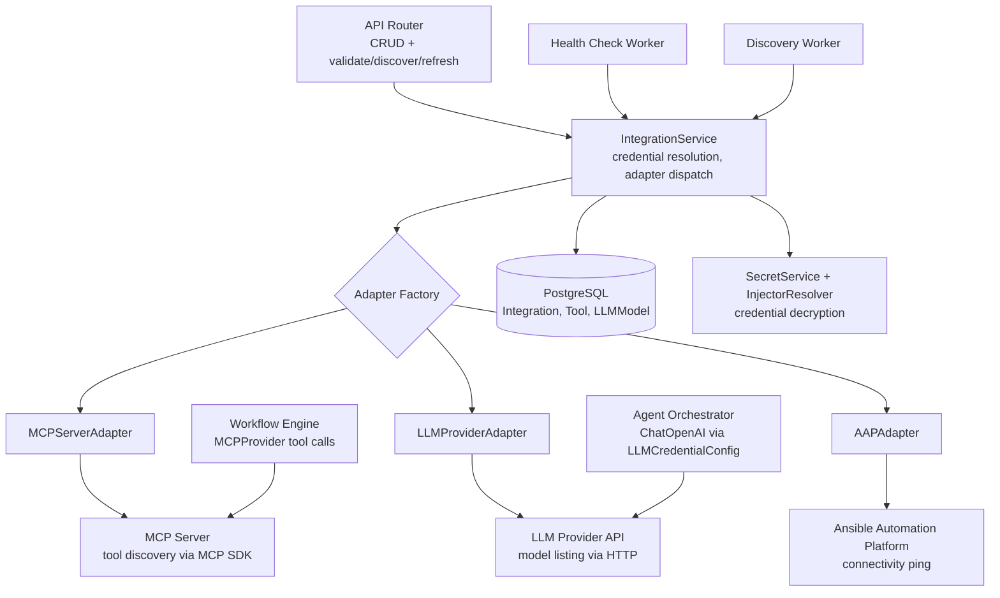
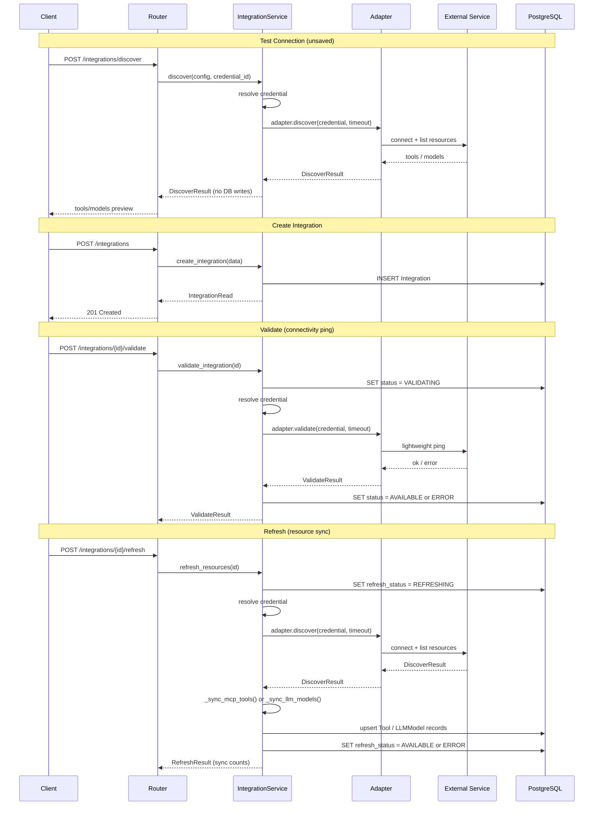
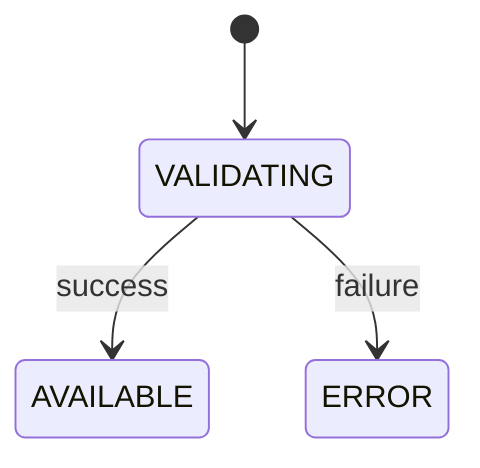
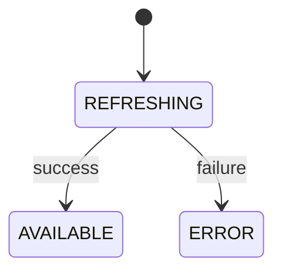

# Integrations

Integrations connect the application to external services — MCP servers, LLM providers, and Ansible Automation Platform instances — providing the tools, models, and automation endpoints that workflows consume at execution time.

> For field-level details, see `Integration` in `models/integration.py` and per-type configuration classes in `models/integration_configuration.py`. This doc covers the architectural patterns and design decisions.

## Architecture



Key properties:

- **Three integration types** — MCP servers provide tools, LLM providers provide models, AAP instances provide automation endpoints
- **Adapter protocol** — each type implements a common two-method protocol (`validate` + `discover`) via a registry-based factory
- **Two credential roles** — management credentials for admin-controlled health checks and discovery; execution credentials for workflow-time operations
- **Project scoping** — integrations are either globally visible or restricted to assigned projects
- **Periodic health checks and discovery** — background workers revalidate integrations and re-discover resources on configurable intervals
- **Hard deletes** — integrations, tools, and LLM models are permanently removed on delete (no soft-delete). CASCADE rules propagate to associated tools, models, and project assignments
- **Graceful degradation** — adapter errors are caught and returned as structured results, never raised

| Type | Discovered Resources |
|------|---------------------|
| `mcp_server` | Tools (name, description, parameters) |
| `llm_provider` | Models (id, name, capability profile) |
| `ansible_automation_platform` | None (connectivity check only) |

## Configuration Schema

Each integration type has a single configuration class — `MCPServerConfigurationInput`, `LLMProviderConfiguration`, and `AAPConfiguration`. The same class is used for create/patch input, the database model, and read responses. Discovered resources (tools, models) are stored as separate `Tool` and `LLMModel` records rather than embedded in the configuration, so there is no need for separate input and full variants.

The three configuration types are unified as a discriminated union on the `integration_type` literal field. All configuration types inherit `IntegrationSecurityMixin`, which provides shared TLS fields (`allow_http`, `insecure_skip_tls_verify`, `ca_certificate`). The defaults encourage secure configurations — HTTPS and verified certificates — while accommodating self-signed certificates via a custom CA field. A model validator nullifies `ca_certificate` when `insecure_skip_tls_verify` is `True`, since a custom CA is meaningless when verification is disabled.

See `IntegrationSecurityMixin` in `models/integration_configuration.py` for field definitions and validators.

## Integration Lifecycle



### Status Transitions

**Integration status** (set by validate):



`last_validated_at` is set only after the check completes, not during the `VALIDATING` transition.

**Refresh status** (set by refresh, independent of validation status):



`last_refreshed_at` is set only after the sync completes. `refresh_error` is cleared on success and populated on failure.

### Project Scoping

Integrations are either `global` (visible to all projects, no junction table rows) or `project`-scoped (visible only to explicitly assigned projects via the `IntegrationProjectAssignment` junction table). Both FKs use CASCADE deletes — deleting an integration or project cleans up assignments automatically.

Read endpoints use a two-layer visibility check: `integration:read` gates access (403 if no access at all), then `integration:read-all` determines scope (unrestricted vs project-scoped filtering via `VisibilityFilter`). See `router.py` for endpoint definitions.

## Credential Resolution

### Two Credential Roles

Integrations use two distinct credential roles with different scopes:

| Credential | Stored on | Used for |
|---|---|---|
| **Management credential** | `Integration.management_credential_id` | Health checks (`validate`, `refresh`), tool/model discovery only |
| **Execution credential** | `IntegrationConnectionConfig` (per workflow node) | MCP tool calls and LLM invocations during workflow execution |

The system does not reference the management credential during workflow execution or fall back to it. Execution credentials are independently selected by the workflow designer from credentials available in the workflow's project. A user may choose the same credential object for both roles, but the system treats them as separate references — there is no implicit fallback. If no execution credential is configured for an integration, tool calls are made unauthenticated.

Credential requirements vary by integration type. LLM providers and AAP instances always require a management credential — health checks and discovery cannot run without one. MCP servers support unauthenticated connections, so a management credential is only needed when the server itself requires authentication.

Each integration type requires a specific credential type (e.g., MCP servers require HTTP Bearer Token, LLM providers require LLM Provider credentials). This is enforced at create and patch time. See `ALLOWED_CREDENTIAL_TYPES` in `integration_service.py`.

### Resolution Flow

The service layer resolves credentials before calling the adapter (adapters never resolve credentials themselves). This is a two-step process:

1. **Decrypt** — `SecretService.retrieve_secret(credential.secret_id)` → raw plaintext field values
2. **Resolve injectors** — `InjectorResolver.resolve(credential_type.injectors, decrypted_inputs)` → `ResolvedInjectors` with `extra_vars` mapping semantic field names (like `bearer_token` or `llm_api_key`) to values

### Execution-Time Credential Resolution

At workflow execution time, credentials follow a different path than management-time resolution:

- **MCP tools** — `InvocationExecutor._make_mcp_credential_resolver` resolves the execution credential from `IntegrationConnectionConfig` to a bearer token string via `resolve_mcp_bearer_token()`
- **LLM invocations** — credentials are threaded through the agent orchestrator call chain via `LLMCredentialConfig`, a frozen model carrying `api_key`, `base_url`, `model`, `provider_hint`, and TLS settings. Each service that needs an LLM creates its own `ChatOpenAI` instance using these shared credentials

## Adapter System

The adapter system supports the administrative side of managing integrations — testing connections during creation, discovering available tools and models, and running periodic health checks. Adapters are not involved in workflow execution; at runtime, the workflow engine and agent orchestrator connect to external services directly using their own clients and execution credentials.

### Adapter Protocol

Each integration type implements the `IntegrationAdapter` protocol with two methods: `validate()` (lightweight connectivity ping) and `discover()` (connect and return discovered resources).

**Why Protocol over ABC:** No shared adapter behavior exists. Each adapter makes different HTTP calls with different auth mechanisms. Each constructor takes its specific configuration type, so `self._config.base_url` is typed without narrowing.

### Factory

A module-level registry maps `IntegrationType` to adapter constructors. Each adapter module registers itself at import time via `register_health_check_adapter()`. The integration router imports adapter modules to trigger registration. See `ValidateResult`, `DiscoverResult`, and `HealthCheckErrorType` in `adapters/protocol.py` for result type definitions.

## Integration Types

### MCP Server

The application supports the MCP 2025-11-25 specification via the MCP SDK v1.x (transitive dependency of `langchain-mcp-adapters`). The transport is Streamable HTTP — stdio-based servers are not supported.

**`validate()`** performs a lightweight connectivity check using the MCP SDK's `streamable_http_client` — establishes a JSON-RPC 2.0 session (initialize + ping). **`discover()`** delegates to `MCPProvider.refresh_tools()`, ensuring a single code path for both the unsaved-connection wizard and the refresh sync.

**Tool Sync** (`_sync_mcp_tools`): On refresh, new tools are created as `AVAILABLE`/`enabled`, existing tools get their description and parameters updated, and tools no longer returned by the server are marked `status = MISSING` (their `enabled` flag is unchanged). This preserves references from existing workflows so the orchestrator can still attempt them, while signaling that the tool is no longer available upstream.

### LLM Provider

The LLM adapter delegates to provider-specific implementations via `LLMProviderBase`. Currently all functional providers (`openai`, `red_hat_ai`, `custom`) use `OpenAICompatibleProvider` — any service exposing the OpenAI-compatible `/v1/models` API. Each provider implementation defines how to construct URLs, build auth headers, and parse the models response.

**Validate vs Discover:** `validate()` makes a single request without parsing the body (HTTP success = healthy). `discover()` makes paginated requests (up to 10 pages) and parses each response into `DiscoveredLLMModel` objects.

**Model Sync** (`_sync_llm_models`): Follows the same pattern as MCP tool sync — models no longer returned by the provider are left in place (not deleted), preserving referential integrity with workflows. Each integration can have one model marked as default (`is_default = True`) — setting a new default automatically clears the previous one.

**Model Capability Profiles:** Each `LLMModel` has a `profile` JSONB column populated from LangChain's `_MODEL_PROFILES` registries via `lookup_model_profile()` — an in-memory-only, `@lru_cache`-decorated lookup with no network calls. It handles `provider/model` format (e.g., `anthropic/claude-opus-4-8` from OpenRouter) by stripping the provider prefix, and degrades gracefully if LangChain packages are missing. See `ModelCapabilityProfile` in `models/llm_model.py` for profile fields.

**Agent Orchestrator Consumption:** At execution time, `get_openrouter_llm()` (legacy name — supports any OpenAI-compatible endpoint) constructs a LangChain `ChatOpenAI` instance from `LLMCredentialConfig`. When custom TLS settings are present, a custom `httpx.AsyncClient` is injected.

### Ansible Automation Platform

The AAP integration stores the API URL and TLS configuration. It does not discover sub-resources — AAP objects (job templates, inventories, organizations) are browsed at workflow-design time through separate proxy endpoints using execution credentials.

**Design Decisions:**
- **Static credential authentication.** The adapter uses `aap_oauth_token` (Bearer) if present, falling back to `aap_username` + `aap_password` (Basic Auth). No support for short-lived tokens, token refresh, or OIDC — this is a known limitation.
- **Single endpoint.** Uses `/api/gateway/v1/me/` (not `/ping/`) because `/ping/` doesn't require authentication and cannot validate the management credential.
- **No refresh.** `discover()` delegates to `validate()` — calling refresh on an AAP integration returns `IntegrationRefreshNotSupportedError` (422).

## TLS and Security

All adapters, the AAP proxy, and the agent orchestrator share `build_integration_httpx_verify()` (in `src/syntara/core/lib/tls_utils.py`) which maps `IntegrationSecurityMixin` fields to `httpx.AsyncClient` verification:

| `insecure_skip_tls_verify` | `ca_certificate` | Result |
|---|---|---|
| `True` | any | `False` (disables all TLS verification) |
| `False` | PEM string | `ssl.SSLContext` with the custom CA loaded |
| `False` | `None` | `True` (system default trust store) |

MCP server URLs are additionally validated via `validate_safe_url()` (from LangChain) before connection, blocking SSRF against cloud metadata endpoints. Private IP ranges and localhost are permitted to support internal MCP servers.

## Health and Observability

### Periodic Health Checks

A background worker (`run_health_checks()`) periodically revalidates integrations. It selects enabled integrations whose `last_validated_at` is NULL or older than the health check interval (never-checked first), processes them in batches with per-integration error isolation, and calls the full adapter validate flow. Configuration is via runtime settings (`integrations.health_check_interval_seconds`, `integrations.health_check_batch_size`), changeable without restart.

### Periodic Discovery

A companion worker (`run_resource_discovery()`) periodically re-discovers tools and models using the same selection, batching, and error-isolation patterns as health checks. While health checks perform a lightweight ping, discovery performs a full resource sync — connecting to each integration, fetching its current tool or model list, and upserting records in the database. This keeps local inventories in sync without requiring manual refresh. Configuration is via runtime settings (`integrations.discovery_interval_seconds`, `integrations.discovery_batch_size`), changeable without restart.

Both workers run as a synthetic service user via `make_service_user()`.

## Extending

### Adding a New Integration Type

Files to touch:

1. **`models/integration_configuration.py`** — create a single `{Type}Configuration` class (inheriting `IntegrationSecurityMixin`). Add it to the configuration type unions.
2. **`adapters/{type_name}.py`** — implement `IntegrationAdapter` protocol. Both methods must handle all exceptions internally and return result types. Register at module level via `register_health_check_adapter()`.
3. **`router.py`** — add a `noqa: F401` import to trigger adapter registration at startup.
4. **`adapters/protocol.py`** — if discovering a new resource kind, add a `Discovered{Resource}` model and field to `DiscoverResult`.
5. **`services/integration_service.py`** — update `ALLOWED_CREDENTIAL_TYPES` (and `CREDENTIAL_REQUIRED_TYPES` if the new type requires a management credential).
6. **Alembic migration** — adding a new `IntegrationType` enum value requires a migration since the enum is stored as a Postgres enum column via `postgres_enum_column`.

### Adding a New LLM Provider

Files to touch:

1. **`models/integration_configuration.py`** — add value to `LLMProviderHint` enum. Update `validate_base_url_required_for_provider` if the provider has a fixed URL.
2. **`adapters/providers/{name}.py`** — implement `LLMProviderBase` (URL construction, auth headers, response parsing). Key decisions: auth mechanism, fixed vs user-provided URL, response format mapping.
3. **`adapters/llm_provider.py`** — register in `_PROVIDER_CONSTRUCTORS`.
4. **OpenAPI spec** — add enum value, run `make api-spec-bundle` and `make gen-contracts`.

### Current Limitations

- **No diff detection on descriptions.** Tool sync overwrites descriptions on every refresh without checking for changes.
- **Anthropic and Gemini LLM providers partially implemented.** Backend provider implementations handle discovery (model listing with pagination, auth headers, and response parsing) and are registered in `_PROVIDER_CONSTRUCTORS`, but sending prompts to these providers is not yet implemented — discovery is only the first part of the integration. The frontend create form also excludes them. Only OpenAI-compatible providers (OpenAI, Red Hat AI, Custom) are fully supported end-to-end.
- **MCP 2026-07-28 spec not supported.** Current implementation targets MCP 2025-11-25 via MCP SDK v1.x. Upgrade requires MCP SDK v2 and a compatible `langchain-mcp-adapters` release.


## File Layout

```
src/syntara/integrations/
├── adapters/
│   ├── protocol.py              # IntegrationAdapter protocol, result types, HealthCheckErrorType
│   ├── factory.py               # Registry + create_health_check_adapter()
│   ├── mcp_server.py            # MCP adapter — validate via MCP SDK, discover via MCPProvider
│   ├── llm_provider.py          # LLM adapter — validate/discover via provider-specific HTTP
│   ├── aap.py                   # AAP adapter — validate via /api/gateway/v1/me/
│   └── providers/               # LLM provider-specific implementations
│       ├── base.py              # LLMProviderBase abstract class
│       ├── openai_compatible.py # OpenAI, Red Hat AI, Custom (Bearer auth)
│       ├── anthropic.py         # Anthropic (adapters only, not yet supported/enabled)
│       └── google.py            # Google/Gemini (adapters only, not yet supported/enabled)
├── models/
│   ├── integration.py           # Integration table, CRUD schemas, scope, project assignment
│   ├── integration_configuration.py  # Config types, IntegrationSecurityMixin, LLMProviderHint
│   └── llm_model.py             # LLMModel table, ModelCapabilityProfile
├── services/
│   ├── integration_service.py   # CRUD, validate, discover, refresh, tool/model sync
│   ├── llm_model_service.py     # LLMModel CRUD
│   ├── health_check.py          # Periodic batch revalidation worker
│   ├── resource_discovery.py    # Periodic batch resource discovery worker
│   └── model_profile_lookup.py  # In-memory model capability lookup from LangChain registries
├── lib/
│   └── credential_resolver.py   # resolve_mcp_bearer_token(), fetch_credential_with_type()
├── audit/                       # Audit event types — see audit.md
├── router.py                    # Integration + model endpoints
├── exceptions.py                # Domain exceptions — see error_handlers.py for HTTP mapping
└── error_handlers.py            # RFC 9457 error responses

src/syntara/tool_manager/          # Tool records discovered from MCP integrations
├── models/tool.py               # Tool table (integration_id FK, namespaced_name, status)
└── lib/providers/mcp/           # MCPProvider — MCP SDK client for tool discovery and execution
```

## Related Documentation

- [credential.md](credential.md) — credential system, AES-256-GCM encryption, injector templates
- [audit.md](audit.md) — audit event framework, `AuditEventDispatcher`, event schema
- [authorization.md](authorization.md) — OPA/Rego RBAC+ABAC, `PermissionChecker`, `VisibilityFilter`
- [error-handling-strategy.md](error-handling-strategy.md) — RFC 9457 pattern, exception hierarchy
- [runtime-settings.md](runtime-settings.md) — database-backed runtime settings (health check interval, max completion tokens)
- [workflow-engine/agentic-node.md](workflow-engine/agentic-node.md) — AI agent node, LLM provider interaction at execution time
- [workflow-engine/aap-nodes.md](workflow-engine/aap-nodes.md) — AAP job template and workflow job template execution
- [standards/access-control.md](standards/access-control.md) — project-scoped access control
