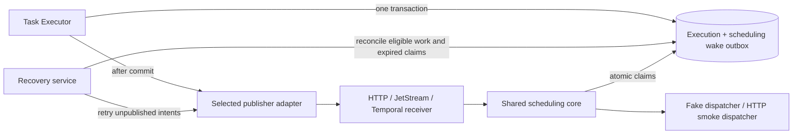

# Scheduler wake-up: recommendations and PoC implementation handoff

Date: 2026-09-09. Status: implementation specification; no PoCs or benchmarks
have been implemented or run as part of preparing this document.

## 1. Objective and agreed boundaries

Build three comparable proofs of concept for waking the Execution Plane
Scheduler after the Task Executor durably accepts work:

1. An internal HTTP wake-up endpoint.
2. NATS JetStream notifications.
3. A dedicated Temporal wake-up workflow.

Use one store, scheduling core, workload generator, failure harness, and report
format. Change the transport adapter, not the scheduling algorithm. Produce a
recommendation backed by correctness, recovery, latency, throughput, and
operational-cost evidence. More than one option may remain suitable.

The user's decisions from the investigation are:

- Only Scheduler wake-up is in scope. Completion notification back to the
  caller/Temporal is out of scope, including the design's completion outbox.
- PostgreSQL `LISTEN/NOTIFY` and `pg_notify` are excluded.
- A notification means "there may be eligible work; examine the store." It
  does not assign a particular execution to a Scheduler.
- The Execution Store is authoritative for work and ownership.
- Evaluate Temporal, but prefer an execution plane that can operate without it.
- New infrastructure is permitted; it must justify its cost.
- Task Executor/Scheduler co-location versus separate deployment is undecided.
- There is no agreed latency SLO or production scale target yet. Benchmark
  settings below are experimental defaults, not product requirements.
- Each PoC must demonstrate failure recovery, competing Scheduler replicas,
  and latency metrics. Evaluate with and without periodic store recovery.

Do not implement the full production execution plane, pool registration,
Reconciler, autoscaler, credentials service, or completion callback protocol.
Use fake capacity and dispatch implementations for the primary experiments.
Finish with a narrow integration check against the existing HTTP executor.

## 2. Evidence, current code, and provisional recommendation

The governing architectural reference is
[execution-plane.md on feature/ANSTRAT-1803](https://github.com/manstis/syntara/blob/feature/ANSTRAT-1803/backend/docs/execution-plane.md).
It separates durable submission, store-based scheduling, worker dispatch, and
completion. This PoC retains that separation. Its scheduling outbox below is
an additional proposed mechanism, not the document's completion outbox.

The September 8 sync discussed low initiation-to-start latency, avoiding
repeated reconstruction of scheduling state, and an internal notification
channel with PostgreSQL remaining shared state. An API did not necessarily
mean HTTP; HTTP is one concrete candidate for that channel.

The inspected checkout was `/Users/ahetheri/syntara_workarea/syntara`, branch
`devel`, HEAD `73d7f3b0f6aa2bfe364aa89503d68c14070be013`. Recheck its state
before implementation. Relevant existing code:

- [Dynamic workflow](../src/syntara/workflows/workflow_engine/dynamic_workflow.py):
  `_resolve_node_parameters`, `_resolve_and_inject_credentials`,
  `_dispatch_node_to_executor`, and `_execute_executor_node` prepare and
  invoke node activities.
- [HTTP activity](../src/syntara/workflows/workflow_engine/activities/http_request_activity.py):
  performs the actual `httpx` request, validation, authentication, error
  classification, and output mapping today.
- [Temporal worker](../src/syntara/workflows/workflow_engine/services/temporal_worker.py):
  registers the graph workflow and node activities in the same Worker.
- [Credential codec](../src/syntara/workflows/workflow_engine/codecs/credential_codec.py):
  encrypts sensitive Temporal payloads. Existing enrichment includes decrypted
  credentials; do not copy those into a new durable queue or wake envelope.
  Follow the proposed dispatch-time credential resolution boundary instead.
- [Audit outbox worker](../src/syntara/audit/outbox/worker.py): an existing
  `SKIP LOCKED` example, not code to reuse wholesale. Its export/drop policy
  and transaction boundaries are unsuitable defaults for scheduling recovery.
- [Standalone HTTP executor](../src/syntara/http_executor/__main__.py) and
  [Receptor bridge plan](../samples/execution-plane-receptor-kubeapi/PLAN.md):
  downstream worker protocol/transport work, not a scheduling implementation.

The existing workflow-level `Execution` model is not the new queued task
execution proposed here. Keep the experimental task records separate.

Temporal can be evaluated without moving graph interpretation into the
Scheduler: a new, small Temporal workflow can request a scheduling pass over
already accepted work. Do not consume the existing user-workflow queue or
reconstruct user workflow definitions in this adapter.

| Candidate | Why build it | Main cost or limitation |
| --- | --- | --- |
| HTTP + recovery | Provisional MVP preference: a small explicit internal contract | Volatile receipt; lost signals require store recovery; routing may skew |
| JetStream + recovery | Durable notification delivery with independent execution-plane runtime | Broker operations, storage, replication, acknowledgment handling |
| Temporal + recovery | Test reuse of existing durable orchestration infrastructure | Additional workflow/activity processing and Temporal dependency |

These preferences are hypotheses. Do not report estimated latency as measured
performance or declare a winner before running the shared tests.

## 3. Reliability model

Two failure windows must be visible in the implementation and results:

```text
Task Executor: commit queued task -> crash -> wake-up never published
Receiver:      accept wake-up     -> crash -> store never examined
```

JetStream and Temporal can retain a notification after accepting it. Neither
makes its acceptance atomic with an earlier application-PostgreSQL commit.
Sending before commit instead introduces a wake-before-visible-row race.

Use this common reference path:



Required invariants:

- A successful submission is durable in PostgreSQL even if notification fails.
- Idempotent submission produces one task, not another task per retry.
- Repeated hints and transport redelivery are harmless to ownership.
- At most one current, unexpired owner/fencing token is valid per execution.
- Expired ownership can be recovered. Old owners cannot complete or renew it.
- No transaction stays open while publishing, contacting Temporal/NATS, doing
  HTTP I/O, or waiting for a worker.
- A scheduling pass is bounded. A backlog larger than one pass must continue
  without requiring a new submission.
- Capacity availability, retry eligibility, and startup can trigger scheduling
  even when no new submissions arrive.
- A missed hint may delay work in recovery-enabled mode, but cannot leave it
  permanently stranded once infrastructure recovers.

One valid owner at a time is not an exactly-once guarantee for external HTTP
side effects. The real HTTP smoke task must use an idempotent GET. Fencing a
database write cannot undo a request that an expired process already sent.

## 4. Placement, files, and dependencies

Implement an isolated sample at `backend/samples/scheduler-wakeup/`:

```text
scheduler-wakeup/
  README.md
  Makefile
  compose.poc.yml
  Containerfile
  alembic.ini
  migrations/
  config/                         # broker and benchmark configurations
  k8s/                            # namespace-scoped manifests
  scheduler_wakeup_poc/
    __main__.py                   # CLI and process roles
    settings.py
    contracts.py
    models.py
    store.py
    submission.py
    scheduler.py
    recovery.py
    metrics.py
    faults.py
    adapters/
      local.py
      http.py
      jetstream.py
      temporal_client.py
      temporal_workflow.py
      temporal_activities.py
    dispatchers/
      fake.py
      http_executor.py
    benchmark.py
    report.py
  tests/
    unit/
    integration/
    scenarios/
```

Use Python 3.13, asyncio, SQLModel, SQLAlchemy async sessions, asyncpg,
FastAPI/httpx, temporalio, and prometheus-client from the backend environment.
Add `nats-py` as an optional PoC dependency; resolve and record an exact tested
version in the lockfile. Use no experimental Temporal API requiring a server
upgrade. At inspection, the root Compose file used Temporal Server 1.25.1,
PostgreSQL 15, and the working backend lockfile contained temporalio 1.31.0.
Verify that actual combination during implementation; record any change.

The sample uses its own disposable database, `scheduler_wakeup_poc`, and a
sample-only Alembic tree/metadata. This isolates experimental tables from
application migrations; it does not propose another production application
database. Inject its session factory into every component, including background
and Temporal activities. Never fall back to Syntara's production DB settings.
Use SQLModel for the sample's API and database models and generate migrations
from those models. Follow the repository's custom-SQL migration conventions.

Add forwarding `scheduler-wakeup-poc-*` targets to `backend/Makefile`.
Use the root `podman-compose.yml` plus `compose.poc.yml` as an overlay, with a
separate Compose project and uniquely named `poc-*` services/volumes. Wrappers
must select only the required PoC services explicitly; never run an unqualified
`up` against the merged file and inadvertently launch the application stack.
Include a dedicated persistent Temporal test service for the Temporal adapter.
Do not use a time-skipping or in-memory server for performance/restart tests.

The sample serves a separate FastAPI app. Keep its API schema with the sample;
do not add these experimental routes to the production app or frontend SDK.
Expose a sample OpenAPI export target. If later work adds production routes,
normal `make gen-contracts` requirements apply.

At startup, the environment wrapper first starts infrastructure, runs the
sample migrations as a one-shot job, registers the run's queues and transport
resources, and then starts application roles. The standalone migration target
is idempotent and can be rerun. In cluster manifests use the same initialization
ordering. Readiness must not succeed before the required tables and queue
registrations exist.

The checkout already contained user changes to `backend/uv.lock` and untracked
HTTP-executor/Receptor-prototype directories. Preserve them. Do not reset,
overwrite, or silently substitute the sibling `syntara-http-executor` checkout.
Read applicable AGENTS files before implementing and run `make install` before
code checks/tests as required by the repository.

## 5. Contracts and records

### 5.1 Shared notification interface

Define these as typed Python contracts. Use SQLModel for serialized models and
`typing.Protocol` for the service interfaces. `queue` is a run-scoped logical
queue, such as `poc.<run_uuid>.default`, not a preselected worker pool.

```python
class WakeHint(SQLModel):
    version: Literal[1] = 1
    event_id: UUID
    queue: str

class PublishReceipt(SQLModel):
    acceptance: Literal["volatile", "durable"]
    transport_ref: str | None = None

class WakePublisher(Protocol):
    async def publish(self, hint: WakeHint) -> PublishReceipt: ...

class Claim(SQLModel):
    execution_id: UUID
    attempt_id: UUID
    queue: str
    fencing_token: int
    owner_id: str
    lease_expires_at: datetime

class PassResult(SQLModel):
    claimed_count: int
    deferred_count: int
    immediate_more: bool
    next_due_at: datetime | None

class ExecutionStore(Protocol):
    async def enqueue(self, request: SubmitTask) -> Submission: ...
    async def claim_ready(self, queue: str, owner: str, limit: int) -> list[Claim]: ...
    async def renew(self, claim: Claim) -> bool: ...
    async def complete(self, claim: Claim, result: dict) -> bool: ...
    async def recover_expired(self, queue: str, limit: int) -> int: ...

class Scheduler(Protocol):
    async def run_pass(self, queue: str) -> PassResult: ...
```

The event ID identifies a notification, not a task assignment. The receiver may
coalesce hints. There is no requirement for exactly-once notification delivery
or a particular replica to handle a particular task. Do not suppress a hint
solely because its event ID was seen before if its previous handling did not
finish. Database eligibility is always rechecked.

Reject unsupported versions or malformed envelopes. Log and count protocol
errors. For valid messages, transient DB/transport failures remain retryable.
Never acknowledge invalid input as successful scheduling. Broker poison
messages go to an explicit error record before their delivery is terminated;
they do not enter an infinite redelivery loop.

### 5.2 Submission and administrative APIs

`POST /poc/v1/executions` takes:

```json
{
  "queue": "poc.<run_uuid>.default",
  "idempotency_key": "submission-000001",
  "task": {"kind": "fake", "duration_ms": 10},
  "not_before": null,
  "deadline": null
}
```

Return `201` for a new task or `200` for the same idempotent request, with
`execution_id` and `state`. Reusing a key with a different canonical request
returns `409`. Scope uniqueness to `(queue, idempotency_key)`. Store a request
hash so comparison is consistent. Reject unknown queues and invalid task
definitions before writing. Queue/task state is committed before returning.

`not_before` defaults to immediately eligible; `deadline` defaults to no deadline
for benchmarks. Deadline behavior is enabled explicitly in its test. Handle
commit-acknowledgment uncertainty through idempotent retries.

`GET /poc/v1/executions/{id}` exposes task/attempt state for diagnostics.
`PUT /poc/v1/queues/{queue}/capacity` configures the fake capacity limit and
emits a new wake intent on an availability increase. Cancellation tests use
`POST /poc/v1/executions/{id}/cancel`, with an atomic eligibility/ownership
transition. These are harness APIs, not proposed production contracts.

### 5.3 Minimum database model

Use UUID identifiers, timezone-aware timestamps, and DB time for eligibility,
lease expiry, and recovery decisions. Keep the following tables in the sample
database; task, attempt, reservation, and outbox changes share transactions.

| Table | Required contents and constraints |
| --- | --- |
| `poc_execution` | ID, queue, idempotency key/hash, task JSON, state, created timestamp, next-attempt timestamp, optional deadline, current owner/attempt/token/lease, result. Unique queue/key. |
| `poc_attempt` | Attempt ID, execution ID, monotonically increasing fence, owner, started/lease/finished timestamps, terminal reason. Unique execution/fence; partial unique execution where attempt is unfinished. |
| `poc_wake_outbox` | Event ID, queue, optional originating execution ID for diagnostics only, not-before, publication state, publication lease owner/token/expiry, tries, next-publication timestamp, accepted timestamp, last safe error. |
| `poc_pool` | One fake pool per queue, optional capacity limit, reserved count. Null limit means unlimited capacity. |
| `poc_reservation` | Attempt ID, pool ID, released timestamp. At most one unreleased reservation per active attempt. |

Execution states are `queued`, `claimed`, `succeeded`, `failed`, and `cancelled`.
A queued deadline expiry becomes `failed` with reason `deadline_exceeded`;
attempt expiry is an attempt terminal reason followed by execution requeue,
not a successful task outcome. These states are sample-local. Expose the
transition reason separately from transport failures in diagnostics.

Create partial indexes for queued eligible executions ordered by
`(queue, next_attempt_at, created_at, id)`; active lease expiry; due unpublished
outbox records; and queued deadlines. Use bounded queries and capture query
plans. Do not reconstruct the entire queue or fetch all task payloads on each
hint. No project quota/priority policy is added in this PoC: order eligible
tasks by `next_attempt_at`, `created_at`, and `id` consistently for all adapters.

Keep diagnostic events in append-only per-process JSONL files, not an extra
transactional audit row per benchmark stage. Export authoritative task and
attempt snapshots after each run for correctness verification.

## 6. Shared scheduling, publication, and recovery algorithms

### 6.1 Submission and publication

Within one transaction, insert the execution and one wake intent. A duplicate
submission returns the existing execution and nudges publication of its
outstanding intent. It must not create another execution or resurrect terminal
work. New eligibility transitions can create new wake events with new IDs.

After commit, schedule the immediate publication attempt in a supervised local
task. This is an optimization; it is not the only recovery mechanism. Return
the submission response without waiting for scheduling or worker completion.
Future-dated intents arm a one-shot local timer instead of publishing early.

Both immediate publishers and recovery publishers acquire the same short
outbox lease before sending. Commit that lease transaction, perform transport
I/O, then mark accepted using a guarded update on the publication lease token.
An acknowledgment-lost retry reuses the event ID. A stale publisher cannot
mark a newly leased event accepted. Do not mark accepted before transport
acceptance. Retain failed intents with capped exponential backoff and jitter;
do not permanently drop them after an arbitrary number of retries.

`accepted` means volatile acceptance for HTTP/local and durable transport
acceptance for JetStream/Temporal. It does not mean the task was claimed or
completed. Keep this distinction in metrics and reports.

### 6.2 Scheduling pass and ownership

Each Scheduler replica has a stable process-instance owner ID, one active
scheduling pass at a time, and supervised dispatch tasks. A pass claims at
most 32 tasks; task execution never occupies the scheduling-loop semaphore.

Bound the dispatch registry to 128 in-flight claims per process. Before opening
a claim transaction, obtain local dispatch credits for up to the claim batch;
wait asynchronously for a credit if none is free. This wait holds no DB
connection or transaction. Release unused credits after the claim and release
used credits when dispatch finishes or is abandoned. Apply a 2 s local-credit
wait timeout, surfaced as retryable local backpressure with backoff, not as an
empty queue. A full-batch drain can thus resume when dispatch frees credits
without a fresh external submission. Apply this gate to every adapter and to
recovery processes; record time waiting for it separately from DB time.

For the unlimited-capacity benchmark, claim queued, due, non-expired tasks
using `FOR UPDATE SKIP LOCKED`, and atomically update the execution, create an
attempt, and assign its fence and lease before committing. For finite-capacity
tests, reserve capacity in the same transaction. Choose one lock order across
claim, completion, and recovery: pool row first, then executions in ID order,
then attempts/reservations. The unlimited path must not serialize all claims
through a pool row. Do not claim an unbounded backlog into one process.

The finite-capacity fixture models waiting as follows: if the pool has no free
slots, the pass makes no claims and returns `immediate_more=false`; eligible
work remains queued. The transition from no free slots to available slots
creates an immediate wake intent in the same transaction as releasing capacity.
Increasing capacity through the administrative API does the same. No new task
submission is needed. Fake pool placement is fixed by queue; production pool
selection is out of scope.

A provisioning-retry fixture, separate from capacity waiting, records
`next_attempt_at=now+retry_delay` and a wake intent with that not-before value.
Time-dependent eligibility still needs a timer or recovery query: a timestamp
does not wake a process by itself.

After commit, start the fake dispatch tasks. Return `immediate_more=true` when
another pass may make immediate progress. A full batch is sufficient to request
another bounded pass; a finite pool with no free slots is not. Yield between
passes. It is acceptable to make one final empty query. `SKIP LOCKED` can also
observe no rows while another transaction holds them; do not interpret this as
a global proof that no queued work exists. Recovery covers a later rollback.

`complete` and `renew` succeed only for the current attempt, owner, fencing
token, non-terminal execution, and an unexpired lease. Completion records the
result and releases capacity atomically. Every release is idempotent. An old
owner gets a negative result, increments a stale-owner metric, and must not
change task state or counters.

Recovery marks an expired attempt finished, releases its reservation once,
returns non-terminal work to queued state, and inserts a fresh wake intent in
one transaction. The next claim increments the fence. Cancellation and deadline
expiry finish the active attempt and release reservations similarly. These
transitions must race safely with late completion.

### 6.3 Recovery modes

`RECOVERY=on` starts two recovery service replicas. They use transactional
claims and bounded queries, not leader election or session-scoped advisory
locks. Every sweep retries due/unpublished or publication-lease-expired intents,
recovers expired execution claims, identifies eligible queues, and schedules
passes using the shared core. The latter may run directly in the recovery
process when the notification transport is unavailable. Label such claims
`trigger_source=recovery`, expose their resource cost, and apply the same pool
limits and fencing. Do not call them normal transport-delivered claims.

`RECOVERY=off` disables both periodic outbox scanning and periodic execution
scanning. Keep one-time startup recovery, one-shot timers already armed by a
live process, and native transport retries enabled. Record every such trigger
source. Startup processing runs on receiver/recovery-service readiness; an
ordinary request must not secretly scan the whole queue.

For the isolated publication-gap test, finish all startup scans first, pause
the Task Executor after commit but before spawning publication, kill it, and
leave it down. Keep the other processes alive and send no further submissions.
This prevents startup/new-traffic recovery from hiding the gap.

Expected result: all three direct-publication adapters can strand this task
with `RECOVERY=off`. Record that as a demonstrated limitation, not a passing
production guarantee. Broker delivery recovery alone does not fix publication
that never happened. An unexpected recovery must be attributed to its actual
trigger in the trace.

Use one-shot timers for known `not_before`/retry times. On startup load pending
future intents and arm timers. If a timer-owning process dies and stays down,
another healthy process does not magically inherit its timer; the enabled
sweep must cover this. Test this failure explicitly. Timers are not a hidden
periodic scan in the disabled mode.

### 6.4 Experimental defaults

| Setting | Default |
| --- | --- |
| Claim batch | 32 |
| Concurrent scheduling passes | 1 per Scheduler/recovery process |
| In-flight dispatch claims | 128 per process; 2 s local-credit wait timeout |
| Fake execution duration | 10 ms, configurable |
| Fake pool capacity | Unlimited normally; 32 for finite-capacity tests |
| Execution lease / renewal | 10 s / every 2 s while dispatch is active |
| Publication lease | 10 s |
| Publication timeout | 2 s |
| Publication retry | Initial 100 ms, exponential x2, cap 5 s, full jitter |
| Recovery sweep | 5 s plus up to 10% positive jitter; vary 1/5/30 s |
| Recovery processes | 2 when enabled |
| Recovery page size | 32; continue pages while due backlog remains |
| Database statement timeout | 2 s for scheduling/publication transactions |
| DB pool | 5 connections per process, max overflow 0; record total budget |
| Provisioning retry fixture | One transient failure, then due after 2 s |
| Fault observation window | 60 s after dependencies become available |

Treat pool-acquisition timeouts and failed DB operations as transient; never
report a failed query as an empty queue. On DB failure, back off and retry the
pending scheduling request rather than entering a tight loop.

## 7. PoC A: HTTP notifier

### Interface and acknowledgment

```http
POST /internal/v1/scheduler/wake
Content-Type: application/json

{"version":1,"event_id":"<uuid>","queue":"poc.<run_uuid>.default"}
```

Return `202` with `{"acceptance":"volatile"}` only after setting the receiver's
pending flag. Return `422` for an invalid envelope; return `503` if the process
cannot accept wake-ups. A `202` never promises a durable claim.

Run one Uvicorn process per Scheduler pod/container. The endpoint and scheduling
loop must share that process. Do not put a many-process HTTP server in front of
a process-local event and assume its siblings share the flag.

Maintain a pending flag per configured queue. Handler validation, event setting,
and response must not perform task execution. The drain loop follows:

```text
await event.wait()
event.clear()                 # before reading the queue
repeat bounded run_pass(queue), yielding between passes
until immediate_more is false
# A notification received during the pass leaves event set for the next loop.
```

On a pass error, keep/re-arm pending work and retry with backoff. Do not clear a
newly received notification after an empty query. Bound the queue registry to
configured queues; arbitrary hints cannot allocate unlimited in-memory state.

### Deployment and tests

The main comparison uses separate Task Executor and Scheduler processes, HTTP
keep-alive, and a service/load-balancer address. Compose uses a small round-robin
proxy; Kubernetes uses a ClusterIP Service. Pin and record proxy settings.
Inspect per-replica claim distribution: persistent connections may concentrate
traffic. Force notifications to two or more replicas in a dedicated contention
test even if the load balancer naturally selects only one.

Add a local adapter that sets the same event when both roles share a process.
Run it as a co-location reference, not as evidence about HTTP/network latency.
Do not silently fall back to local events in a split deployment.

HTTP-specific required tests: lost response; receiver kill immediately after
`202`; hint arriving during the final empty pass; persistent-connection skew;
multiple queues; more than 32 tasks from a single wake-up; finite-capacity
backlog resuming after a release. The recovery-enabled receiver-kill case must
succeed through a surviving recovery process, even if the killed replica stays
down and its outbox record was already marked accepted.

## 8. PoC B: NATS JetStream notifier

### Configuration and interface

Use one run-scoped stream and one shared durable consumer per run:

```text
Stream:        POC_WAKE_<run_uuid_without_hyphens>
Subjects:      execution.scheduler.wake.poc.<run_uuid>.*
Publish:       execution.scheduler.wake.<queue>
Payload:       WakeHint JSON
Nats-Msg-Id:   <event_id>
Consumer:      scheduler-wakeups
```

Configure file storage, WorkQueue retention, explicit acknowledgments,
`DeliverAll`, `AckWait=5s`, and no delivery-attempt cap for valid hints. All
Scheduler replicas bind to the same durable consumer; do not create one
consumer per replica and accidentally turn the test into broadcast.

Use replication factor 1 for local functional tests and factor 3 on three
servers for broker-failover evidence. Record storage volumes, replica placement,
server/client versions, and fsync settings. Do not imply survival of total
storage loss from a successful process-restart test. Use a bounded stream with
discard-new behavior, initially 256 MiB: rejection/backpressure is visible and
retryable rather than silently evicting undelivered hints. Disable age expiry
for the experiment and retain consumer state until run cleanup.

Await JetStream publication acknowledgment before returning a durable
`PublishReceipt` or marking the outbox accepted. Include the stream sequence
in the receipt/trace. Publisher deduplication reduces duplicate storage within
its configured window, but DB claim correctness must work beyond that window.
Set and record a 10-minute deduplication window for the initial tests.

### Consumer handling

Keep a blocking fetch for one message outstanding per replica. A message must
be handled as soon as it arrives; do not wait for a larger batch to fill.
Fetch timeout is normal idle behavior, not a scheduling error or a DB poll.

On receipt, repeatedly run the shared bounded scheduling pass for the hinted
queue. Keep the message unacknowledged until `immediate_more=false`.
While handling, send in-progress acknowledgments every 2 s so a legitimate
drain does not expire its 5 s acknowledgment window. Retry transient DB errors
with backoff; a crashed consumer stops progress acknowledgments and allows
another replica to receive redelivery.

When immediate work is exhausted or capacity is unavailable, acknowledge.
Deferred work must remain represented in the store, with the common capacity
release/retry mechanism responsible for its next wake-up. A receipt must not
be acknowledged merely because it was placed into a volatile local queue.

Required extra tests: consumer kill before ack; ack loss after handling;
publisher timeout after broker acceptance; duplicate hints outside the dedup
window; all consumers disconnected during publication; broker leader loss;
stream-full publication rejection; consumer restart without recreating the
durable; capacity wait without continuous broker redelivery/hot DB queries.

## 9. PoC C: Temporal notifier

### Client and workflow interface

Use an ordinary workflow per wake event with a regular activity for each
bounded scheduling pass. The shared store/scheduler must not import Temporal.

```text
Workflow type: SchedulerWake
Workflow ID:   scheduler-wake/<event_id>
Task queue:    execution-plane-wakeups-<run_uuid>
Input:         WakeHint
Activity:      run_scheduling_pass(queue) -> PassResult
```

The publisher uses `Client.start_workflow`, not `execute_workflow`, and returns
a durable receipt after server acceptance. Use a deterministic Workflow ID,
`REJECT_DUPLICATE` reuse policy, and treat an already-started conflict as
acceptance of the same hint. Record the workflow/run IDs. Configure history
retention longer than the benchmark/failure campaign and record it; Temporal
ID deduplication is not a permanent database uniqueness guarantee.

Instantiate a dedicated Temporal worker fleet with the PoC workflow/activity
only, separate from user-workflow workers. The activity receives the injected
PoC scheduler/store, uses the same process scheduling semaphore, and performs
one pass. It must hand committed claims to the process's supervised dispatcher
registry before returning; if it dies between commit and handoff, lease recovery
handles those claims. Dispatch registry ownership is independent of the short
activity lifetime.

### Workflow behavior

```text
loop:
    result = await execute_activity(run_scheduling_pass, queue, retry_policy)
    if not result.immediate_more:
        return
    if 128 scheduling passes completed in this run:
        continue_as_new(hint)
```

Database access and dispatch remain in the activity. Workflow code contains
only deterministic control flow. No user graph parsing, credential resolution,
or real node execution belongs in this workflow.

Start-to-close timeout is 10 s per scheduling-pass activity; heartbeat every
2 s, with a 5 s heartbeat timeout. Heartbeats cover time waiting for the local
semaphore as well as a DB pass. Do not heartbeat indefinitely after a dependency
has failed; let the activity fail/retry. Use retry backoff from 100 ms to 5 s,
x2, with unlimited attempts for transient infrastructure errors. Treat invalid
queue/envelope errors as non-retryable and record them for inspection. Normal
pass execution is bounded by the DB timeouts above.

The workflow completes once immediate work is drained or capacity prevents
progress. Delayed retries and future capacity release use the common mechanisms.
Do not complete a workflow just after setting a volatile local wake flag: the
activity must actually perform its scheduling pass.

Configure the worker to accept concurrent activities, with the shared semaphore
limiting actual scheduling passes to one per process. Start with 8 concurrent
activities and 8 concurrent workflow tasks per process; record these settings.
Continue-As-New prevents a continuously busy drain from growing one history
without bound. Handle only the remaining drain responsibility on continuation;
do not replay committed task ownership decisions in workflow code.

Required extra tests: duplicate start after response loss; worker kill during
activity; retry after claim commit; retained closed Workflow ID; server restart
with persistent storage; Continue-As-New under sustained load; concurrent normal
Syntara workflow traffic sharing the Temporal server. Confirm that retries do
not occupy an existing user's workflow queue or create duplicate valid owners.

Do not start with a global Signal-With-Start coordinator. That is a documented
follow-up if measured per-event workflow overhead warrants coalescing/sharding;
it is not a fourth required implementation in this handoff.

## 10. Fault harness and acceptance tests

Provide named pause points that emit `fault_ready` and wait for explicit
release. A test driver must kill the target process with SIGKILL or cut its
connection while paused. Graceful shutdown alone is not a crash test. Keep
fault control disabled in normal benchmark runs.

| Pause/fault point | What must be demonstrated |
| --- | --- |
| `submit.after_commit_before_publish` | The isolated gap remains visible with recovery off; recovery on rescues the queued task without new traffic. |
| `publish.after_accept_before_outbox_update` | Replay of the same hint is safe after publisher death or response loss. |
| `http.after_event_set_before_response` | Ambiguous HTTP receipt can be retried safely. |
| `http.after_response_before_pass` | An accepted volatile hint can be lost; surviving recovery rescues work. |
| `receiver.after_receive_before_pass` | JetStream redelivery or Temporal activity retry processes accepted notifications after receiver loss. |
| `claim.before_commit` | Transaction rollback leaves tasks claimable; no leaked reservation. |
| `claim.after_commit_before_dispatch` | Expired claims are requeued; a new fence is issued. |
| `dispatch.before_complete` | A paused old owner resumed after expiry cannot complete or renew; only the new owner changes state. |
| `receiver.after_pass_before_ack` | Duplicate handling after ack/result loss preserves ownership and capacity counts. |
| `timer.after_arm` | Death of the sole timer owner cannot strand due work in recovery-on mode. |
| `http.before_wait_after_empty_pass` | A concurrent hint is not erased by flag-clearing order. |

Also cover:

- 100 duplicate submissions with one idempotency key, including two Task
  Executors racing; changed input with the same key returns `409`.
- Deliver the same hint concurrently to multiple Scheduler replicas and release
  their claim barriers together. Use independent processes and DB connections.
- Submit 1,000 tasks while receivers are paused, deliver just one hint, then
  stop submissions. All eligible backlog must drain with recovery off; do not
  let other outbox events accidentally wake the receiver during this test.
- Start with capacity zero, submit tasks, then increase capacity to 32 without
  new submissions. Verify progress and bounded idle query rate.
- Fail provisioning once; no incoming traffic; verify progress when the stored
  retry becomes due. Repeat with the timer owner killed.
- Release a finite pool's final reservation, cancel a queued task, and expire
  a deadline while replicas contend. Check counters and terminal state.
- Hold execution locks, let another pass skip them, then roll back. Recovery-on
  must find the rows; report any recovery-off liveness gap explicitly.
- Restart/partition transports and PostgreSQL, lose acknowledgments, restore
  service, and verify recovery. Keep the original process down in a failover
  variant. Include a PostgreSQL/PgBouncer transaction-pooling test without
  LISTEN connections or session-dependent locking.
- Terminate one or all replicas, scale receivers back up, and verify startup
  ordering: establish subscriptions/readiness, reconcile, then accept normal
  traffic. Emit trace events for each stage.

The report must classify every scenario as `PASS`, `FAIL`,
`EXPECTED_LIMITATION`, or `NOT_RUN` and provide the trigger that caused recovery.
An expected limitation is not evidence of production suitability. Never treat
a timed-out scenario as a skipped test or remove its stranded tasks from totals.

For the defaults, recovery-on scenarios must settle within 60 s after required
infrastructure is restored. This is a test deadline, not a production recovery
SLO. If configured sweep/backoff/lease settings make that impossible, derive
and print a larger bound before the run rather than increasing it after failure.

Validate at run end: every accepted submission has an authoritative outcome;
no execution has overlapping valid ownership intervals; no stale write succeeded;
no duplicate valid fake-dispatch acceptance occurred for the same attempt;
active reservations match active attempts; no negative/over-limit pool counts;
and no eligible work remains stranded in a recovery-on scenario. A recovered
execution may legitimately have multiple sequential attempts.

## 11. Benchmark design and reporting

### Workload matrix

Use an open-loop generator driven by intended arrival times, not a client that
waits for each response before scheduling the next request. Measure generator
lag and mark a run invalid if the generator cannot sustain offered load.

| Dimension | Initial values |
| --- | --- |
| Adapters | HTTP, JetStream, Temporal; local as an additional reference |
| Task Executor replicas | 1, 4 |
| Scheduler replicas | 1, 4, 8 |
| Recovery | off; on with 1/5/30 s sweeps |
| Arrival shape | One task after 5 s idle; sustained 10/100/1,000 submissions/s; burst of 1,000 |
| Capacity | Unlimited; 32; zero then 32 |
| Fake task duration | 10 ms initially; 100 ms capacity-pressure follow-up |
| Queue distribution | One queue; four queues; 90% traffic on one of four queues |
| Run length | 30 s warm-up, 120 s measurement, up to 60 s drain |
| Repetitions | 3 per selected configuration, fixed reported seeds |

Do not execute the whole Cartesian product immediately. First run the default
split-deployment configuration (1 producer, 4 schedulers, 5 s recovery,
unlimited capacity) for all transports. Then vary replica count, recovery
interval, burst/idle shape, and capacity one dimension at a time. Finally run
the 4-producer/8-scheduler configuration and increase sustained load by x2
until backlog grows or resources saturate. Keep those saturation runs separate
from normal-load percentile comparisons.

Keep application resources, claim logic, pool limits, task payloads, and DB
settings the same. Transport-specific extra processes/resources are measured
as a cost, not hidden outside the budget. Start with 1 CPU/512 MiB per producer,
scheduler, and recovery container, then record actual throttling/memory. Record
DB, broker, proxy, and Temporal server allocations separately. Use the same
hardware and alternate candidate order between repetitions.

Use no batching delay in the initial publisher. If later tests coalesce hints,
apply the same coalescing window to every publisher and report it as a separate
experiment. Consumer semantics still differ and must be stated.

### Metrics and timestamp definitions

Emit correlated JSONL events with run, queue, execution/attempt/event IDs,
process owner, wall-clock and monotonic timestamps, stage, and trigger source.
IDs belong in traces, not Prometheus labels. Use bounded metric labels such as
adapter, role, recovery mode, stage, and outcome.

Required stages: request started; insertion observed; commit acknowledged;
publication attempted/accepted; hint received; scheduling pass started; row
first considered; claim committed; fake dispatch accepted; terminal transition;
outbox retry; lease recovery; and stale update rejected.

Report these separately:

- Request-to-submission-acknowledgment latency.
- Commit-acknowledgment-to-first-scheduling-consideration latency per task.
- Commit-acknowledgment-to-successful-claim latency per task.
- Publish-attempt-to-receipt and receipt-to-scheduling-pass latency per hint.
- DB insertion-to-first-consideration/claim timestamps, explicitly including
  transaction time; do not label insertion time as exact commit time.
- Claim-to-dispatch and dispatch-to-result latency for the integration check.
- Recovery latency after each fault/dependency restoration.

Use monotonic clocks for intervals within one process. Cross-process wall-clock
differences require synchronized hosts and a recorded uncertainty estimate.
Keep DB timestamps as another common-clock measurement, but note that the DB
statement timestamp precedes its commit. A sweep can discover a committed row
before the producer receives commit acknowledgment: retain and annotate that
ordering instead of clamping negative acknowledgment-relative measurements to
zero. Producer-death samples may lack commit acknowledgment; report their
DB-clock/recovery measurements separately, not as invented normal-path samples.

For each latency report p50/p95/p99/max, sample count, and the number of missing
outcomes. Compare both intended-arrival latency and successful-request latency
so queuing and coordinated omission are visible. Include throughput, submitted/
accepted/claimed/terminal counts, oldest eligible queue age, stranded count,
empty query rate, queries per claim, lock waits, database connection use,
publication retries, redeliveries, CPU/memory, and claims per replica.

Attribute DB work by process role. Include recovery-service queries and the
Temporal server's persistence load as separate measured categories. Count
readiness/metrics queries separately so they are not confused with scheduling
polls. Report all normal versus recovery-triggered claims independently.

Persist these artifacts per run:

```text
manifest.json           # commit, dirty diff hash, versions/digests, config, hardware, seeds
events-<owner>.jsonl    # raw correlated event records
metrics.csv            # sampled resource/runtime metrics
executions.jsonl       # final authoritative state
attempts.jsonl          # ownership/fencing history
latencies.csv          # derived samples with stage and clock basis
fault-results.json     # scenario classifications, recovery triggers, unmet invariants
report.md              # comparison tables, plots, observations, recommendation
```

Do not merge runs with different settings into one percentile. Keep raw
artifacts sufficient to recompute summaries. Produce plots with standard
plotting tools if they clarify throughput/latency and recovery distributions.

## 12. Required commands and implementation sequence

These are target interfaces to implement, not commands available yet. Run them
from the repository root after implementation. Each wrapper must print its
resolved project/run ID, services, adapter, and recovery configuration.

```bash
make -C backend install

make -C backend scheduler-wakeup-poc-up ADAPTER=http RECOVERY=on
make -C backend scheduler-wakeup-poc-migrate
make -C backend scheduler-wakeup-poc-test ADAPTER=http RECOVERY=on
make -C backend scheduler-wakeup-poc-faults ADAPTER=http RECOVERY=on
make -C backend scheduler-wakeup-poc-bench ADAPTER=http PROFILE=default
make -C backend scheduler-wakeup-poc-report
make -C backend scheduler-wakeup-poc-down

make -C backend scheduler-wakeup-poc-up ADAPTER=http RECOVERY=off
make -C backend scheduler-wakeup-poc-faults ADAPTER=http RECOVERY=off
make -C backend scheduler-wakeup-poc-report
make -C backend scheduler-wakeup-poc-down
```

The same commands must accept `ADAPTER=jetstream` and `ADAPTER=temporal` without
editing code. `poc-up` also accepts `PRODUCERS`, `SCHEDULERS`, and `SWEEP_SECONDS`.
`poc-bench` accepts `PROFILE=idle|burst|default|replicas|capacity|saturation`.
`poc-faults` accepts `SCENARIO=<name>` to rerun one failure deterministically.
Persist the current run ID in a sample artifact directory so successive Make
invocations refer to the same environment; reject mismatched adapter/config
rather than silently testing against a previous run.

Changing recovery mode must reconfigure the actual services: an off-mode
campaign has no running periodic recovery processes. The harness must verify
that fact before proceeding. Use a fresh run ID and fresh queue/transport
namespace for every campaign; keep prior artifacts available for comparison.

`poc-down` stops only the named PoC project and preserves results and volumes.
Any clean/reset target must require an explicit PoC run/project identifier and
remove only that run's disposable resources. Never reset application data or
delete the user's HTTP-executor/Receptor files. Do not launch tests against a
configured non-PoC database.

Implement in this order:

1. Add the sample layout, contracts, settings, models, generated migrations,
   injected DB sessions, fake dispatcher, and command wrappers. Verify database
   isolation and basic idempotent submission.
2. Implement atomic claims/reservations, fence/lease checks, capacity release,
   future eligibility, outbox publication leasing, recovery services, and
   trace/fault hooks. Unit-test transitions and use real PostgreSQL for races.
3. Implement HTTP and the local reference. Complete the shared fault suite and
   initial HTTP benchmarks. This validates the harness before another runtime
   is added.
4. Implement JetStream using exactly the same core. Add broker-specific tests,
   then run the shared suite and benchmarks. Add the replicated broker profile
   before claiming broker failover support.
5. Implement the Temporal publisher/workflow/activity and dedicated workers.
   Verify the SDK/server combination and persistent server restart. Run the
   shared suite and benchmarks, then the ordinary-workflow interference case.
6. Add namespace-scoped Kubernetes manifests for the same processes. Test HTTP
   Service behavior and process/pod failover. Local Compose results alone do
   not establish cluster network or multi-node availability behavior.
7. Run the HTTP-executor smoke path for each adapter, compare artifacts, and
   write the decision report with remaining limitations and recommended next
   production design work.

Run repository-required code checks after implementation, including formatting,
lint, type checking, and applicable tests. The sample's test target must
explicitly discover its tests; do not assume backend test-directory discovery
covers tests under samples. Unit tests may mock transports; ownership and fault
tests require real PostgreSQL and the selected transport. Do not use Temporal
time-skipping in latency benchmarks. Report infrastructure-dependent tests that
could not run as `NOT_RUN` with a concrete cause.

## 13. HTTP worker integration and deployment limits

The fake dispatcher is the benchmark default. It sleeps for the configured
duration, then attempts a fenced completion through the store. Keep its dispatch
registry alive independently of HTTP requests, broker handlers, and Temporal
activities. Its final records prove scheduling/ownership behavior, not external
side-effect exactly-once semantics.

For the smoke path, use a warm container/pod running an idle command and start
`python -m syntara.http_executor` via exec. Send one JSON object plus newline,
close stdin, and parse exactly one JSON result from stdout. Capture stderr and
process/exec status separately. Use the existing executor/protocol rather than
modifying its validation/authentication behavior for this PoC.

Use `GET https://example.com` or an explicitly configured public test endpoint.
The current executor blocks loopback/private destinations; do not disable those
checks merely to use an internal benchmark endpoint. External response latency
is not part of the wake-up benchmark. If egress is unavailable, report the smoke
check as not run and retain the fake-dispatch results.

Local functional smoke can use container exec. The cluster smoke uses
Kubernetes `pods/exec` and the existing bridge implementation if it is available;
the existing PLAN file alone does not prove that bridge is implemented. Report
direct Kubernetes exec versus Receptor-bridged exec explicitly. Do not broaden
this task into building the entire Receptor transport if it is missing.

Bind local test services to loopback. Cluster manifests use a dedicated test
namespace and narrowly scoped service accounts. Authenticate internal service
connections using the existing S2S facilities where reusable; expose no fault
control endpoints outside the test environment. Record TLS/auth configuration
for each measured profile. Transport-only development runs without TLS must not
be compared to TLS-enabled results as if they have identical configuration.

Actual production authz, secret handling, pool placement, and arbitrary task
execution are not specified by this sample. The sample wake envelope contains
no task payload, credentials, or Temporal user-workflow completion token.

## 14. Decision criteria and deferred alternatives

Choose based on correct ownership and demonstrated recovery first, then measured
tail latency, sustained throughput, database load, recovery delay, deployment
complexity, and total resource cost. Establish production SLOs after presenting
the measurements; do not invent a pass/fail millisecond target retrospectively.

- Prefer HTTP if its measured latency/distribution and bounded recovery are
  adequate. Explain whether a production implementation still needs a separate
  scheduling outbox or whether queue reconciliation alone justifies simplifying
  that reference design. Do not omit it from only one baseline benchmark.
- Prefer JetStream if its delivery/failover/distribution benefits justify the
  additional broker. Do not claim that it eliminates store reconciliation or
  makes publication atomic with task insertion.
- Prefer Temporal only if measured benefits outweigh runtime coupling and
  additional orchestration/persistence cost. Keep the adapter optional.

The initial implementation requires all three adapters. Deferred alternatives:

- Redis Pub/Sub could be an additional advisory adapter, but has at-most-once
  delivery. Existing Syntara Redis conventions treat Redis as ephemeral and do
  not establish it as a durable work queue.
- Raw sockets/ZeroMQ may be evaluated if profiling identifies HTTP overhead
  worth optimizing. They do not independently solve the database/publication gap.
- A sharded Temporal Signal-With-Start coordinator is a follow-up to measured
  per-event workflow overhead; specify its sharding and history handling then.
- A polling-only control can be added as a measurement reference, clearly
  distinguished from the proposed event-driven normal path.
- Strict absence of periodic store recovery requires a further durability
  design. PostgreSQL logical decoding/CDC of a transactional outbox is one
  possible investigation, requiring replication configuration, permissions,
  WAL/slot monitoring, failover handling, and compatible customer databases.
  It is outside the three required PoCs. Native broker/Temporal long polling
  is not periodic application-database scanning.

Implementation is complete when all adapters are runnable through the same
commands, required fault cases have explicit outcomes, repeatable raw benchmark
artifacts and a comparison report exist, and the smoke-path status is recorded.
If required infrastructure is unavailable, state which evidence remains missing;
do not label the entire investigation validated from unit tests alone.

## 15. Sources and handoff checklist

Primary references supporting the investigation:

- [Execution Plane design](https://github.com/manstis/syntara/blob/feature/ANSTRAT-1803/backend/docs/execution-plane.md).
- [PostgreSQL SELECT / row locking](https://www.postgresql.org/docs/current/sql-select.html):
  `SKIP LOCKED` supports competing queue consumers but returns an inconsistent
  view of locked rows; durable ownership requires additional state transitions.
- [NATS JetStream concepts](https://docs.nats.io/concepts/jetstream) and
  [pull consumers](https://docs.nats.io/learn/jetstream/pull-consumers): persisted
  notifications, shared consumers, explicit acknowledgments and redelivery.
- [Temporal Python client](https://docs.temporal.io/develop/python/client/temporal-client),
  [message passing](https://docs.temporal.io/develop/python/workflows/message-passing),
  [activity execution](https://docs.temporal.io/activity-execution), and
  [Workflow IDs](https://docs.temporal.io/workflow-execution/workflowid-runid).
- [Redis Pub/Sub](https://redis.io/docs/latest/develop/pubsub/) and the repository's
  [Redis conventions](standards/redis.md).
- [Debezium PostgreSQL connector](https://debezium.io/documentation/reference/stable/connectors/postgresql.html)
  and [outbox router](https://debezium.io/documentation/reference/stable/transformations/outbox-event-router.html)
  for the deferred CDC direction.

Local meeting sources are under
`/Users/ahetheri/notes/automation_orchestration/anstrat_1803/meeting_notes/`:

- `Execution Plane sync - 2026_09_08 14_26 BST - Notes by Gemini.md`, especially
  transcript 00:10:09–00:17:44. Prefer the transcript over ambiguous generated
  summaries; it discusses responsiveness beyond polling, internal notifiers,
  Temporal, shared state, and future deployment topology.
- `2026-09-08-execution-plane-architecture-design.md` and the September 2–3
  workshop notes provide context for component boundaries and worker pools.

Instructions for the implementing engineer/model:

- Read this document fully, applicable AGENTS files, and the current design.
- Preserve the user's changes and recheck paths/versions before starting.
- Implement the shared harness and all three adapters; do not stop at a transport
  demo that only delivers a message.
- Keep the completion-notifier investigation and production rollout out of scope.
- Use the explicit recovery-off limitations as test findings, not as reasons to
  hide polling or weaken recovery-on acceptance criteria.
- Maintain the command interface and raw artifact format so each candidate can
  be reproduced and compared without another design conversation.
- Mark intentional departures from these experimental defaults in the report,
  with their reason and effect on comparability.
