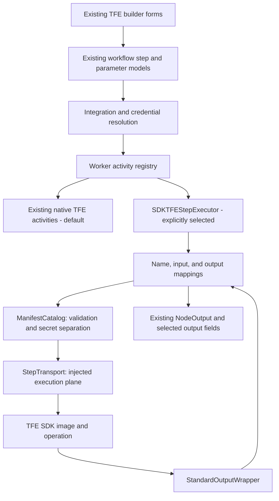

# TFE workflow / step SDK execution bridge

The existing builder and workflow JSON keep their native TFE contracts. A worker
can select an SDK-backed executor through dependency injection without changing
activity names, saved workflows, or downstream output expressions. Native
execution remains the default. No image is launched or registered automatically.

## Existing implementation inventory

The TFE implementation spans these layers:

| Layer | Existing files and responsibilities |
| --- | --- |
| API integration | `src/syntara/integrations/adapters/tfe.py` validates connectivity; integration models/configuration/factory select `terraform_enterprise`; `e8a1b2c3d4f5_add_terraform_enterprise_enums.py` adds database enum values. |
| API client | `src/syntara/terraform/client.py` owns REST calls, read retries, and mutation ambiguity. `errors.py`, `presets.py`, `run_modes.py`, and `telemetry.py` own domain rules. |
| Workflow contracts | `src/syntara/workflows/workflow_engine/models/tfe_types.py` defines 28 parameter/output contracts. Workflow model unions and `ActivityName`/`NodeType` enumerate them. |
| Schema publication | `src/syntara/schemas/workflows/v2/executors/tfe_*.schema.json`, `catalog/node_type_catalog.json`, workflow definitions, and generated OpenAPI/contracts expose the saved step shapes. |
| Resolution / execution | `integration_resolution_activity.py` resolves the TFE endpoint, organization, and TLS settings. Credential resolution supplies `_resolved_credentials.extra_vars.bearer_token`. `tfe_common.py` and `tfe_activities.py` implement activities registered in `activities/registry.py`. |
| Builder | `frontend/.../builder/registry/nodes/registerTerraformNode.ts` registers the category and subtypes. `node-forms/TerraformNodeForm.tsx`, `components/TFEIntegrationSelector.tsx`, `utils/tfeHelpers.ts`, and `node-details/TerraformTaskDetails.tsx` edit and display the saved fields. Integration configuration routes manage the connection. |
| Existing coverage | Backend `test_tfe_create_workspace.py` and `test_tfe_variable_and_run.py`, Terraform domain tests, frontend registry/helper/form tests. The pre-existing untracked form test is not modified. |

The bridge does not replace these UI or API schemas with SDK manifests. Doing so
would break existing saved parameter names and output expressions. The manifest
is the runtime extension contract, while the existing schemas remain the
workflow contract.

## New boundaries



- `step_nodes/contracts.py` has reusable `ManifestCatalog`, `StepInvocation`,
  `StepResult`, and `StepTransport` contracts. It does not import the SDK or
  inspect a sibling checkout. Schema references never trigger remote retrieval.
- `terraform/step_bindings.py` explicitly maps all 28 saved node types to SDK
  manifest names and native parameter/output models. For example,
  `tfe_update_workspace` maps to `tfe_update_workspace_settings`.
- `terraform/step_mapping.py` translates presets, run modes, attribute field
  names, `artifact` → `archive_base64`, `comment` → `body`, and installation IDs.
  It normalizes JSON:API results back into the existing workflow outputs.
- `terraform/step_executor.py` supplies the SDK implementation of
  `TFEStepExecutor`. It consumes resolved credentials, validates envelopes,
  preserves run-action prechecks, and translates failures to existing TFE errors.
- `activities/tfe_dispatch.py` builds worker-local Temporal callables with the
  original activity names. `build_activity_registry(tfe_executor=...)` merges
  these into the full registry. No workflow field selects executable code or
  changes a global backend.

## Connecting an execution plane

Worker bootstrap code can load approved manifests from deployment configuration
and inject a transport implementation:

```python
from syntara.step_nodes.contracts import ManifestCatalog
from syntara.terraform.step_executor import SDKTFEStepExecutor
from syntara.workflows.workflow_engine.activities.registry import build_activity_registry

catalog = ManifestCatalog(approved_manifest_dicts)
executor = SDKTFEStepExecutor(catalog, transport)
registry = build_activity_registry(tfe_executor=executor)

# Pass registry as activity_registry to the existing TemporalWorkerService
# constructor (or start_worker factory), alongside its normal
# temporal_address, namespace, and task_queue arguments.
```

`transport` implements one asynchronous method:

```python
async def execute(self, invocation: StepInvocation) -> Mapping[str, Any]:
    # Select invocation.image and invocation.entrypoint using approved policy.
    # Send invocation.payload() to the runtime over the chosen execution plane.
    # Return the decoded JSON StandardOutputWrapper.
    ...
```

Invocation metadata contains node name, version, image, entrypoint, and execution
timeout. `payload()` contains only `inputs`, `credentials`, and
`workflow_context`, matching the SDK container adapter. The executor enforces
`executionTimeout` around dispatch. The transport must also terminate/cancel
remote work appropriately; cancelling an await does not prove a remote mutation
was rolled back. No automatic mutation retry is introduced.

Do not log or persist the invocation. Credential fields are excluded from its
representation, schema-marked `secret`/`is_secret` values move out of plain
inputs, and the bearer token goes into `credentials.token`. Image publication,
registry authorization, endpoint policy, credential resolution, container
provisioning, and remote cancellation remain execution-plane responsibilities.

The transport is deliberately injected rather than implementing a Podman shell
command inside the Temporal worker. No SDK package dependency or container
runtime choice is imposed on Syntara by this abstraction.

## Compatibility boundaries

The native path remains unchanged. On the SDK path:

- All 28 operation names and ordinary inputs have contract tests against the
  generated SDK manifests. Full runtime parity is not implied by input compatibility.
- Existing output field names and `NodeOutput.dump(outputs)` selection remain.
- Variable values and state outputs marked sensitive are excluded from workflow
  outputs. Run actions inspect the current action flags before dispatching a
  mutation. VCS linking resolves the installation owner before qualifying the
  repository name.
- SDK `StatusCode != 0` is a failure, never a successful workflow result.
  Malformed replies and mismatched operation names also fail. Remote error text
  is not propagated into Temporal failure history because it may contain secrets.
- The current SDK envelope lacks structured remote error categories. SDK read
  failures become non-retryable `TRANSIENT` errors; mutation failures become
  non-retryable `OUTCOME_UNKNOWN`. A later SDK contract can expose richer codes
  without changing the workflow-facing executor interface.
- Integration-specific CA certificates / TLS verification overrides, native
  `wait_for_completion`, server-side project/status list filters, and moving a
  workspace to an implicit default project are rejected before SDK dispatch.
  Use native execution for these until the SDK supports the same semantics.
- The SDK's missing-state response and optional plan lookup behavior differ from
  native execution: missing state can fail instead of returning `has_state=false`,
  and a failed plan lookup can fail the status step. Lists currently return one
  page. These are explicit parity gaps, not implicit fallback to a second
  execution backend after a potentially successful mutation.

No API route, catalog persistence, generic manifest-rendered form, production
transport, or deployment switch is introduced here. Those integrations can now
use this boundary without rewriting the TFE activities or saved workflows.

## Validation

From `backend/`, install required development dependencies with `make install`.
Then run the isolated bridge and existing activity tests:

```bash
SYNTARA_TFE_MANIFEST_DIR=/path/to/syntara-step-sdk/nodes/terraform-enterprise/manifests \
  uv run pytest tests/unit/terraform/test_step_executor.py \
  tests/unit/workflows/workflow_engine/activities/test_tfe_create_workspace.py \
  tests/unit/workflows/workflow_engine/activities/test_tfe_variable_and_run.py \
  -q --no-cov
```

The 28 external-artifact input tests skip if `SYNTARA_TFE_MANIFEST_DIR` is absent;
all in-repository transport, security, and native-registry tests still run.
Manifests can be supplied as a CI artifact rather than a sibling checkout.
