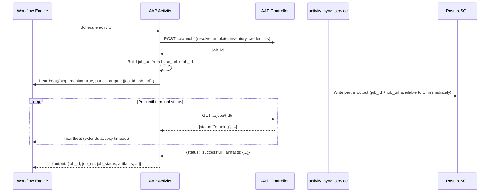

# AAP Job Template and Workflow Job Template Nodes

## Overview

The AAP nodes launch and monitor jobs on an Ansible Automation Platform controller. Both node types (`aap_job_template` and `aap_workflow_job_template`) follow the same fire-and-poll execution pattern with early output delivery via Temporal heartbeats.

For configuration fields, see `AAPJobTemplateExecutorParameters` and `AAPWorkflowJobTemplateExecutorParameters` in `workflow_engine/models/workflow_definition.py`. For output fields, see `AAPJobTemplateOutput` and `AAPWorkflowJobTemplateOutput` in the same file.

## Execution Pattern: Fire and Poll



### Why Fire-and-Poll (Not Webhooks)?

AAP lacks an outbound webhook/callback mechanism to notify Temporal of job completion. For the general rationale behind fire-and-poll (vs. async completion), see [Workflow Engine Overview — Execution Patterns](workflow-engine-overview.md#execution-patterns). The detailed mechanics — heartbeat-based early output, two-phase probe, and poll loop — are specific to AAP and documented below.

Poll interval is configurable via `aap_poll_interval_seconds`.

## Early Output via Heartbeat

The most important design pattern in these nodes: **job ID and job URL are available to the UI before the AAP job finishes.**

Immediately after launch (before polling begins), the activity sends a Temporal heartbeat with `partial_output`:

```python
partial_output = {"job_id": job_id, "job_url": job_url}
activity.heartbeat({HEARTBEAT_STOP_MONITOR: True, HEARTBEAT_PARTIAL_OUTPUT_KEY: partial_output})
```

The `activity_sync_service`'s **describe probe** detects this heartbeat and writes the partial output to the `ActivityExecution` record. This is a two-phase probe:

1. **Phase 1**: Detect activity STARTED state → update DB status to RUNNING
2. **Phase 2**: Detect `HEARTBEAT_STOP_MONITOR` flag → extract `partial_output` and persist to DB as `SyntheticPartialOutput`

Once the probe sees `stop_monitor: true`, it exits — the activity continues sending heartbeats to Temporal during polling (to extend the activity timeout), but the sync service no longer needs to probe.

**Why this matters**: Users can click through to the AAP job output page to monitor progress while the node is still running. Without early output, they'd have to wait for the entire job to complete before seeing the job URL.

### Job URL Format

`build_aap_job_url()` in `aap_common.py` constructs: `{base_url}/execution/jobs/{job_type}/{job_id}/output`

Where `job_type` is `playbook` (job templates) or `workflow` (workflow job templates).

## Resource Resolution

Both node types support referencing AAP resources by ID or by name. Name-based references are resolved to IDs at launch time via AAP API calls:

- **Template**: `_resolve_job_template_id()` / `_resolve_workflow_job_template_id()`
- **Inventory**: `_resolve_inventory_id()` (optional)
- **Instance group**: `_resolve_instance_group_id()` (job templates only)
- **Credentials**: name-to-ID resolution (job templates only)
- **Labels**: name-to-ID resolution with **auto-creation** for missing labels

Name-based lookups require `organization_name` for disambiguation — validated by `AAPResourceReferenceMixin._validate_id_or_name_reference()`.

All config fields support template expressions (e.g., `${trigger.host}`), resolved by the workflow engine before the activity executes.

## Authentication

AAP nodes require an **AAP integration** (`integration_id` on the node config) for URL and TLS settings, and a **Nexus credential** (`credential_id`) for auth headers/token. Without an integration, the node fails with `ConfigError: "AAP integration not configured. Attach an AAP integration to this node."`

## Cancellation Propagation

When a Nexus execution is cancelled, the Temporal activity receives `CancelledError`. The `handle_cancellation()` function in `aap_common.py`:

1. Detects `activity.is_cancelled()`
2. Sends `POST /api/controller/v2/{job_type}/{job_id}/cancel/` to AAP (best-effort — failure is logged, not retried)
3. Raises `CancelledError` to terminate the activity

**Why best-effort?** The AAP job may have already completed, or the AAP controller may be unreachable. Either way, the Nexus execution should transition to CANCELLED regardless of whether the AAP cancellation succeeded.

## Error Handling

### Failed AAP Jobs

When an AAP job reaches a terminal failure status (`failed`, `error`, `canceled`), the activity raises a **non-retryable** `ApplicationError` with the structured output (including `job_id`, `job_url`, `job_status`) as error details. This means:

- The job URL is accessible even when the node fails — users can click through to AAP for debugging
- The error is non-retryable because the job ran and failed — Temporal retry won't help

### Transient Errors During Polling

HTTP 5xx or connection errors during the poll loop are **absorbed** — logged and retried on the next poll cycle. Only persistent failures or timeouts cause the activity to fail. This is different from launch-phase errors, where HTTP status determines retryability (see [Retry Policies](retry-policies.md)).

## Differences Between Node Types

| Aspect | `aap_job_template` | `aap_workflow_job_template` |
|--------|-------------------|----------------------------|
| AAP resource | Job Template (single playbook) | Workflow Job Template (DAG of jobs) |
| Job-specific config | `verbosity`, `job_type`, `forks`, `job_slicing`, `diff_mode`, `instance_group`, `credentials` | `scm_branch` |
| Resource resolution | Supports inventory, instance group, and credential name-to-ID resolution | No inventory/instance group/credential overrides |

Both node types use the same terminal status set (`AAP_JOB_TERMINAL_STATUSES` in `aap_common.py`), which includes `canceled`, `failed`, `error`, and `successful`. The execution pattern, authentication, polling, heartbeat, and cancellation logic are identical — shared via `aap_common.py`.

## Key Files

| File | What it does |
|------|-------------|
| `workflow_engine/activities/aap_job_template_activity.py` | Job template activity: config validation, launch, poll, output |
| `workflow_engine/activities/aap_workflow_job_template_activity.py` | Workflow job template activity (same pattern) |
| `workflow_engine/activities/aap_common.py` | Shared: `resolve_aap_auth()`, `poll_until_complete()`, `handle_cancellation()`, `build_aap_job_url()` |
| `workflow_engine/models/workflow_definition.py` | `AAPJobTemplateExecutorParameters`, `AAPWorkflowJobTemplateExecutorParameters`, output models |
| `schemas/workflows/v2/executors/aap_job_template.schema.json` | JSON Schema for config validation |
| `schemas/workflows/v2/executors/aap_workflow_job_template.schema.json` | JSON Schema for config validation |
