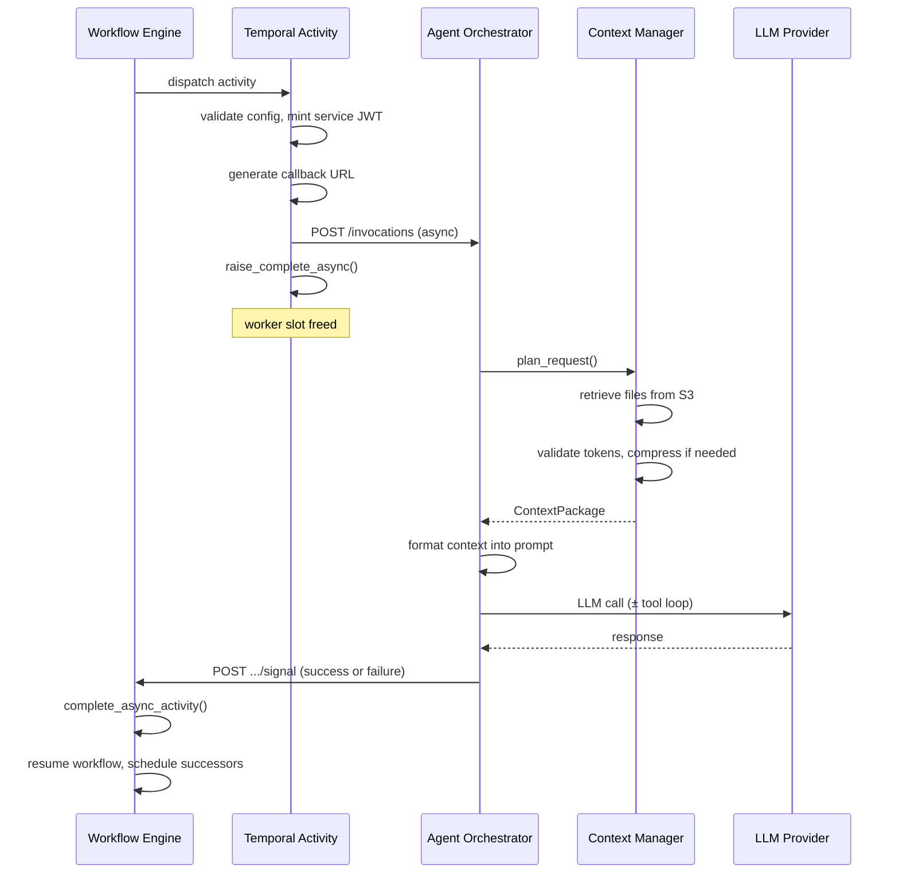
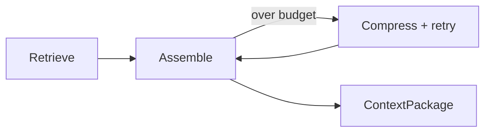

# Agentic Node (AI Agent)

The agentic node dispatches a prompt to the Agent Orchestrator service. It is **map-dispatched** (the engine looks up `NodeType.AGENTIC` in `_EXECUTOR_ACTIVITY_MAP` like any other executor), but uses the engine's **async completion** pattern — the activity dispatches the prompt and returns immediately, and the Agent Orchestrator signals the result back later via callback. This combination is unusual: most map-dispatched nodes complete synchronously within their Temporal activity.

For the shared async-completion mechanics, see [Workflow Engine Architecture](workflow-engine-overview.md#why-async-completion-via-signals-approval-agentic-wait).

## How It Works



1. The activity validates the prompt (non-empty, under `workflow_engine.max_prompt_length` — 100,000 chars by default) and validates config via `AgenticExecutorParameters.model_validate()`
2. A callback URL is generated (`POST /executions/{execution_id}/activities/{activity_id}/signal`) via `generate_activity_signal_url()` (`utils/url.py`); see [S2S Certificate Authentication](../s2s-cert-authentication.md) for how internal service calls are authenticated
3. Metadata is assembled (workflow_id, activity_id, credential_id, tool selections, response_schema, integration_connections) and the Agent Orchestrator is invoked via `AgentOrchestratorClient.invoke_agent_async()`, which POSTs to `/invocations`
4. `activity.raise_complete_async()` is called — the Temporal activity remains in STARTED state and the worker slot is released
5. The orchestrator loads the invocation, resolves LLM credentials, and runs the **Retrieve → Assemble** context pipeline (see [Context Window Management](#context-window-management) below). The assembled context is appended to the prompt with `--- CONTEXT ---` delimiters
6. The `GenericAgent` sends the enhanced prompt to the LLM. If tools are available, a LangGraph tool-call loop runs until the LLM stops requesting tools
7. On success, `WorkflowSignalClient.send_success_signal()` POSTs the result to the callback URL. On failure, `send_failure_signal()` fires on a best-effort basis (see [Design Decisions](#design-decisions))
8. The signal endpoint calls `ExecutionService.handle_activity_callback()` → `TemporalExecutionService.complete_async_activity()` → `handle.complete(result)`, and the engine resumes, applies output mapping, and schedules successors

All pre-invocation failures (empty/oversized prompt, unreachable orchestrator, validation errors) are **non-retryable** — retrying after dispatch would risk a duplicate agent invocation. Post-dispatch failures are handled by the orchestrator's own logic and signaled back via the callback.

## Context Window Management

When the orchestrator receives an invocation, it runs a **Retrieve → Assemble** pipeline before calling the LLM. This happens inside `ContextManagerPlanner.plan_request()`.



**Retrieve.** `RetrieverService` fans out to retriever backends (currently `UploadedFileRetriever`). Each uploaded file's pre-converted markdown is loaded from S3 in parallel, capped at 20 concurrent loads. Documents are scored for relevancy against the prompt, and a configurable similarity threshold (`retriever_llm_similarity_threshold`, default 0.7) filters low-relevance content.

**Assemble.** `AssemblerService` first validates the assembled tokens against the per-user rolling-window token budget via `TokenValidationService.validate_and_record()` (row-level locking prevents races). If the budget check passes, content proceeds without compression regardless of size. If `TokenLimitExceededError` is raised, the internal compression retry loop begins: `CompressorService` makes a binary decision — if tokens fit within `context_manager.max_total_tokens` (default 4,000) the content passes through, otherwise the entire document set is summarized via an LLM call. The assembler retries up to `context_manager.compression_loop` times (default 3), raising `ContextAssemblyError` if all retries are exhausted. The final `ContextPackage` is ephemeral (in-memory only, never persisted).

The `OrchestratorAgent._format_context_prompt()` appends the assembled context to the user's original prompt:

```
{original_prompt}

--- CONTEXT ---
## {key}
{value}
--- END CONTEXT ---
```

Token counting uses `tiktoken` with model-specific encoding for supported OpenAI models (gpt-4, gpt-3.5-turbo, gpt-4-turbo, gpt-4o), falling back to `gpt-4` encoding for unsupported models. Results are cached with `@lru_cache(maxsize=1024)`.

## File Upload Lifecycle

Files flow through an asynchronous pipeline from upload to agent context:

1. **Upload.** `POST /files` validates files (size ≤ 10 MB, count ≤ 10, allowed MIME types: PDF, Word, plain text, markdown) using content-based detection via `python-magic`. Originals are stored on S3 and `FileMetadata` records created in the database
2. **Convert.** A Temporal workflow converts each file to markdown via `DocumentConversionService`. Registered converters: `PDFConverter`, `MSWordConverter`, `MarkdownConverter`, `TextConverter`. Converted content is stored as `orchestrator-{file_id}-content.md` on S3. Status transitions: `PENDING_CONVERSION` → `CONVERTING` → `CONVERTED` (or `CONVERSION_FAILED`)
3. **Reference.** The workflow author adds `file_ids` (up to 10 UUIDs) to the agentic node config. These are stored in `AgenticExecutorParameters.file_ids` and forwarded to the orchestrator as invocation context
4. **Load at execution.** `UploadedFileRetriever` validates all files are `CONVERTED`, loads converted markdown from S3 in parallel, and wraps each as a `RelevantDocument(relevancy_score=1.0)`
5. **Fail-fast on unconverted files.** If any files have a status other than `CONVERTED` (including `CONVERSION_FAILED`), the `UploadedFileRetriever` raises a `DocumentRetrievalError` immediately — the retrieval does not proceed with partial context

## Structured Output

When `response_schema` is set, the `GenericAgent` uses one of two strategies depending on whether tools are involved:

- **Without tools**: `llm.with_structured_output(response_schema, method="json_mode")` constrains the LLM to produce JSON matching the schema directly
- **With tools**: The standard tool-call loop runs first, then a separate extraction LLM call reformats the result into the schema

If structured output fails, execution falls back to standard (unstructured) output. The schema is wrapped in `OpaqueResponseSchema` (similar to `SecretStr`) to prevent it from appearing in logs.

## MCP Tool Integration

The `tool_selection_strategy` and `tool_selections` parameters control which MCP tools the agent can use:

- `OrchestrationService._get_tools()` creates a `ToolSynchronizer` to discover available tools, then filters by strategy: `ALL` (all enabled tools), `SELECTED` (only tools whose UUID is in `tool_selections`), `NONE` (no tools)
- The LangGraph graph topology is `ORCHESTRATOR → GENERIC_AGENT → TOOLS → GENERIC_AGENT → … → END`. The tool-call loop continues until the LLM stops requesting tools
- MCP credentials are resolved at execution time: `_make_mcp_credential_resolver()` builds a lookup from `integration_connections`, resolving each integration's `bearer_token` from the encrypted credential store. Credentials are never placed in the LangGraph state

## Live Status During Execution

The agentic activity sends `HEARTBEAT_STOP_MONITOR: True` immediately at dispatch to tell the `ActivitySyncService` to stop probing for status. Because the activity remains in STARTED state after `raise_complete_async()` until the orchestrator calls back, the sync service's normal poll-based monitoring is not useful — status is instead driven by the signal callback. For details on the three-tier live status pipeline, see [Workflow Engine Architecture — Three-Tier Live Status Sync](workflow-engine-overview.md#three-tier-live-status-sync-temporal--db--redis--websocket).

## Design Decisions

**Credentials are passed by reference, not by value.** `credential_id` is forwarded to the Agent Orchestrator as metadata; the decrypted API key is never placed in the invocation context. The orchestrator resolves the credential itself, at execution time, via the Nexus Credentials API.

**Prompts land in Temporal history — don't put secrets in them.** Because activity arguments are recorded in Temporal's durable event history, credentials, API keys, or PII should never be interpolated directly into a prompt string. Use `credential_id` (or `integration_connections`) instead, and reference already-resolved upstream data via expressions.

**No retry policy.** The agentic node uses `NodeSettingsNoRetry` — it supports `timeout`, `disabled`, and `continue_on_failure`, but deliberately excludes retry policies. `resolve_retry_policy()` returns `RetryPolicy(maximum_attempts=1)`. Retrying after dispatch would risk duplicate agent invocations, and post-dispatch failures are handled by the orchestrator's own logic.

**All pre-dispatch failures are non-retryable.** Every `except` branch before `raise_complete_async()` either raises `ApplicationError(non_retryable=True)` or re-raises `CancelledError` (which Temporal treats as inherently non-retryable). This is safe because `raise_complete_async()` raises `BaseException` (not `Exception`), so the `except Exception` handlers only fire on genuine pre-invocation failures.

**Failure signals are best-effort.** `WorkflowSignalClient.send_failure_signal()` swallows all exceptions to prevent cascading failures — if the orchestrator fails and the signal also fails, the activity times out via Temporal's `start_to_close_timeout`, which is the safety net.

**`tool_selection_strategy` defaults to unset, not `"NONE"`.** The model default is `None` (no strategy declared); `"NONE"` is a distinct explicit value meaning "no tools." At runtime both are treated identically (no tools available), but the type distinction (`Literal["ALL", "NONE", "SELECTED"] | None`) allows the model layer to express whether the field was explicitly set.

**Response schema validation includes security hardening.** `validate_response_schema_structure()` rejects `$ref` (SSRF prevention) and detects ReDoS-vulnerable regex patterns. It reuses the same `validate_json_schema_definition()` function as webhook `input_schema` validation for consistency.

**File content is converted at upload time, not at execution time.** Conversion (PDF → markdown, Word → markdown) runs asynchronously via a Temporal workflow triggered at upload. At execution time, the orchestrator loads pre-converted markdown from S3 — no document parsing on the hot path.

**Context compression is all-or-nothing.** The `CompressorService` either passes through unchanged or summarizes the entire document collection. There is no per-document selective compression — the binary decision keeps the pipeline simple and predictable.

**Integration connections override management credentials at execution time.** Each `IntegrationConnectionConfig` pairs an `integration_id` with a `credential_id`, allowing the workflow author to substitute a different credential for a specific integration during this execution. Integrations not listed are treated as unauthenticated — the management credential is reserved for tool discovery and health checks and is never used during workflow execution. Credential UUIDs are passed, not secrets.

Parameters are defined by `AgenticExecutorParameters` in `workflow_definition.py`; see that model (or the JSON Schema under `schemas/workflows/v2/executors/`) for the current field list rather than a copy here.

## Accessing Results

Downstream nodes access agentic output via the expression system: `${node_id.output}` for the response content, `${node_id.tool_calls}` for tool calls made during execution, and `${node_id.structured_output_metadata}` for fallback strategy details. See `AgenticOutput` in `workflow_definition.py` for the full output shape. Output mapping applies the same way as for any other executor node.

## Related Documentation

- [Workflow Engine Architecture](workflow-engine-overview.md) — shared dispatch and async-completion mechanics
- [Expression System](expression-system.md) — how `${...}` expressions inject data into prompts
- [Credentials](../credential.md) — credential system for LLM API keys
- [Node Settings](node-settings.md) — timeout and retry tiers (`NodeSettingsNoRetry`)
- [Retry Policies](retry-policies.md) — why the agentic node is excluded from the retry tier
