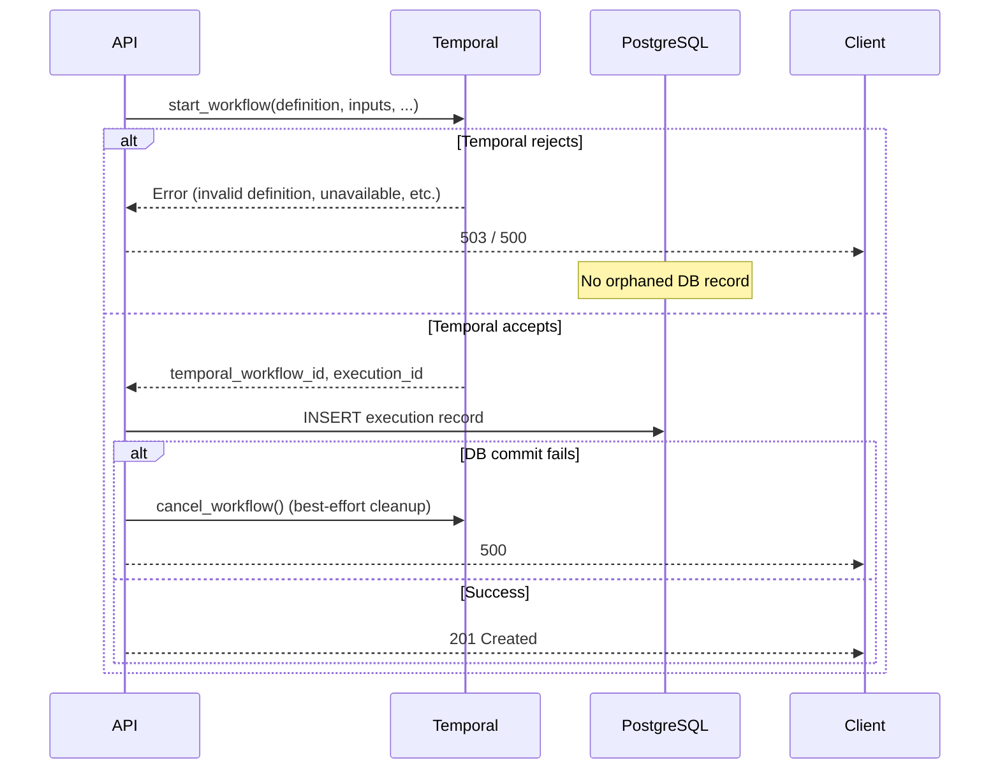
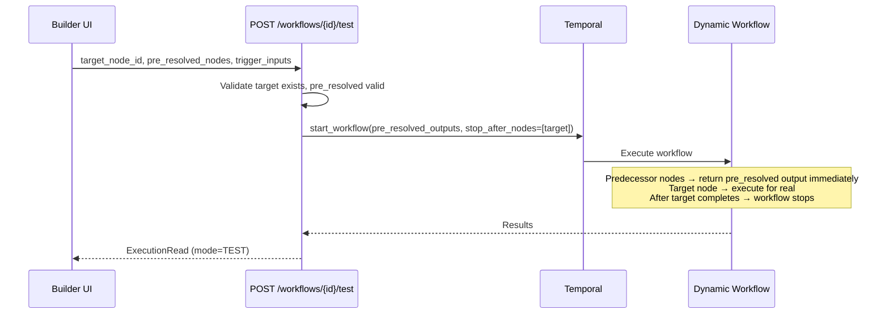

# Manual Run and Testing

## Overview

This document covers how workflow executions are created — both full runs and single-node test executions — focusing on the two-phase creation pattern and how test executions use mocked data to isolate individual nodes.

For field-level details, see `ExecutionCreate` and `TestExecutionCreate` in `workflows/models/execution.py`.

## Two-Phase Execution Creation

All execution creation (manual run, trigger-initiated, retry, test) follows the same pattern:

**Why Temporal-first?** If we wrote to the DB first and Temporal rejected the workflow, we'd have an orphaned execution record in `PENDING` state that never progresses. By starting Temporal first, we guarantee every DB record has a corresponding Temporal workflow. The reverse failure (Temporal running but DB write fails) is handled by best-effort cancellation of the orphaned Temporal workflow.

## Test Execution (Single Node)

Test execution lets users run a single node in isolation with mocked predecessor data, without leaving the workflow editor.

### How It Works

### Pre-Resolved Nodes: How Mocking Works

For the mechanics of how pre-resolved nodes are skipped during execution and how control-flow routing works with mock data, see [Execution Runtime](../execution-runtime.md). The key points specific to test executions:

- `_validate_pre_resolved_nodes()` enforces that control-flow nodes (condition, loop, approval) include `control.next_port` in their mock data
- `execute_target=false` adds the target node itself to `pre_resolved_outputs` with empty data — useful for populating upstream data without running an expensive or side-effect-producing node

### Why Test Executions Use Current Version (Not Published)

Test executions always use `Workflow.current_version` (the latest canvas state), not the published version. The `is_enabled` check is also intentionally skipped — users need to test nodes in disabled or draft workflows during development.

## Key Files

| File | What it does |
|------|-------------|
| `workflows/services/execution_service.py` | `create_execution()`, `create_test_execution()`, `_start_temporal_and_create_execution()` |
| `workflows/models/execution.py` | `ExecutionCreate`, `TestExecutionCreate`, `PreResolvedNodeOutput` models |
| `workflows/workflow_engine/models/workflow_definition.py` | `resolve_trigger_node()` |
| `workflows/router.py` | `test_workflow_node()` endpoint (POST /workflows/{id}/test) |
| `workflows/executions_router.py` | `create_execution()` endpoint (POST /executions) |
