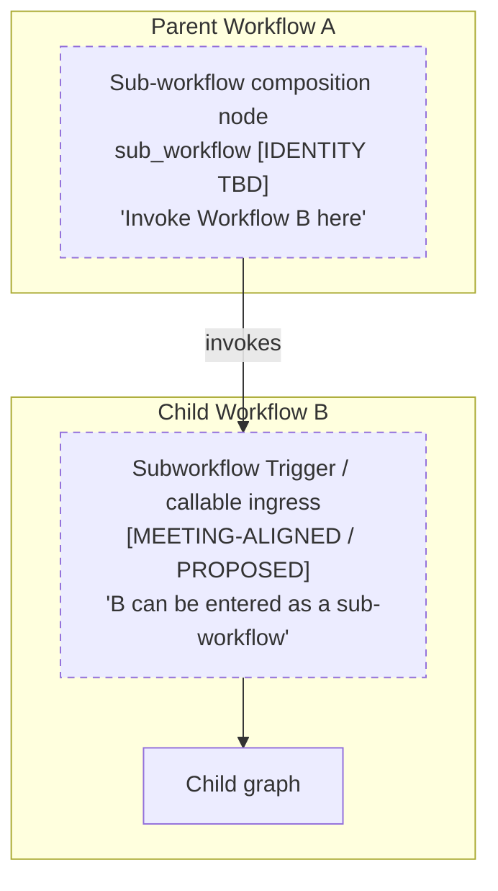
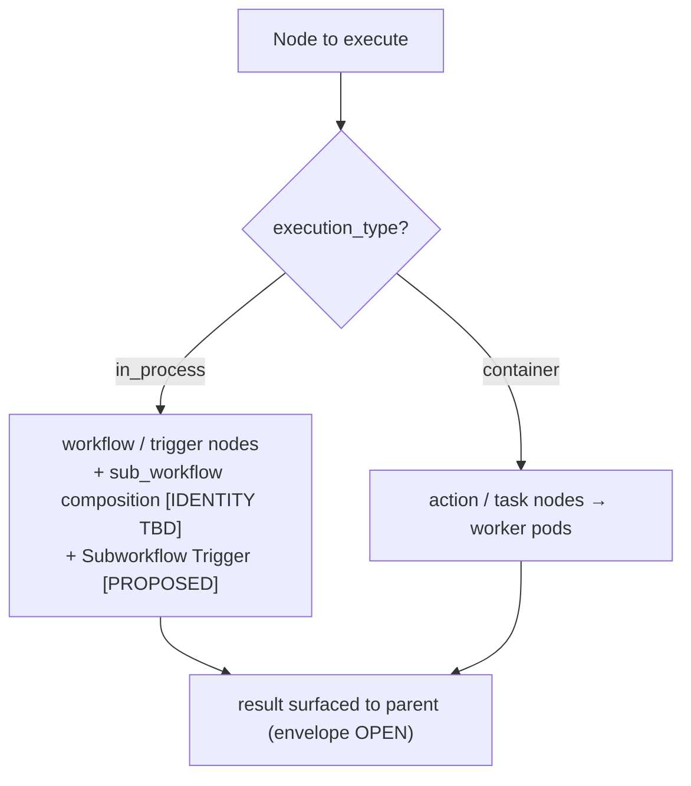
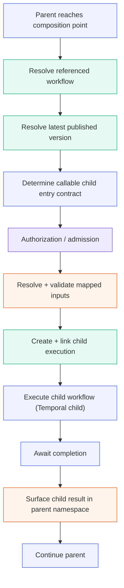
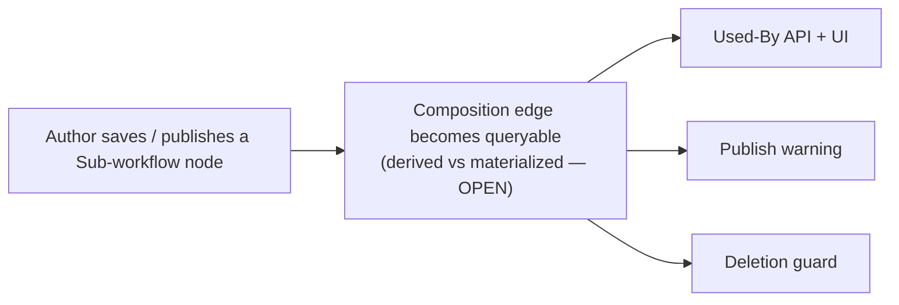
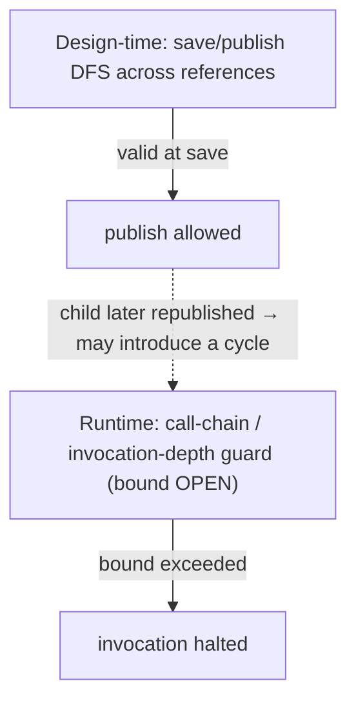
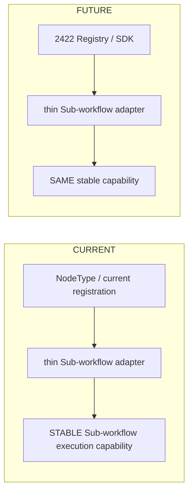

# Sub-workflow Node Architecture

The Sub-workflow Node lets an Automation Orchestrator workflow invoke another published workflow as a composable, reusable unit. This document defines the composition model (a parent-side composition point and a child-side invocation boundary), the runtime execution flow, and the versioning, dependency, and authorization semantics that make composition safe.

This design aligns with the emerging ANSTRAT-2422 Node SDK model where practical, while keeping the core 2347 runtime capability independent of unfinished SDK representation details. 2347 owns the Product and runtime composition capability; 2422 is the emerging framework/registry/SDK direction. Unfinished 2422 contracts do not automatically become 2347 contracts.

> **Feature:** ANSTRAT-2347 — Workflow Automation: Sub-workflow Node
> **Parent outcome:** ANSTRAT-2291 — Post-GA Adoption & Market Competitiveness
> **SDK direction (WIP dependency):** ANSTRAT-2422 — Automation Orchestrator Node SDK
> **Status:** Working architecture baseline — items marked OPEN are intentionally unresolved. The full evidence report and decision registers are maintained by the feature team outside this repository.

## Source hierarchy

In decreasing authority: (1) the ANSTRAT-2347 SDP / Acceptance Criteria (Product source of truth); (2) current `origin/devel` Syntara code (verified implementation facts); (3) the ANSTRAT-2347 PoC (PoC evidence only); (4) the Sep 9 2026 architecture meeting (**meeting alignment**, not approved architecture); (5) the ANSTRAT-2422 architecture doc/branch (**WIP dependency / design direction**, not an authoritative 2347 contract); and completed research spikes (e.g. AAP-91261) where relevant.

Each section below is marked by what it describes: **[PRODUCT]** (contract), **[CODE]** (verified current code), **[POC]**, **[MEETING-ALIGNED]**, **[2422-WIP]**, **[PROPOSED]**, or **[OPEN]**.

## Decision Status

| Topic | Status | Basis |
|---|---|---|
| Synchronous child invocation | **DECIDED / Product** | SDP AC |
| Always-latest published version | **DECIDED / Product** | SDP AC (AAP-91264) |
| Reference vs Embed modes | **DECIDED / Product** | SDP AC (Embed = AAP-91282) |
| Used-By, publish warning, deletion guard | **DECIDED / Product** | SDP AC (AAP-91271/76/77/78/79) |
| Callable / runnable as capabilities | **DECIDED / Product** (AC-7/AC-8) | SDP AC (AAP-91270) |
| Distinguishable child invocation source | **MEETING-ALIGNED** | Sep 9 notes |
| Dedicated Subworkflow Trigger representation | **PROPOSED / OPEN** | Sep 9 ("Needs Further Discussion") |
| Parent composition node durable identity | **OPEN** | AAP-91262 |
| Authoritative child input schema location | **OPEN** (leaning Subworkflow Trigger) | AAP-91261 follow-on |
| Output envelope & field names | **OPEN / 2422 alignment** | — |
| Retry semantics | **OPEN** (AC-4a vs DEC-004) | AAP-91316 |
| Child-workflow start idempotency / ID scheme | **OPEN** (coupled to retry) | DEC-004 / AAP-91316 |
| Cancellation-propagation behavior | **OPEN** | DEC-001 |
| Cycle protection (two layers) | **PROPOSED architecture** | — |
| Exact nesting depth / timeout values | **OPEN** (architecture/perf) | AAP-92254 |
| Callable/runnable representation | **Product intent + architecture clarification** | AAP-91270 |
| Dependency persistence mechanism & timing | **OPEN** | DEC-002 / DEC-008 |

## What this document deliberately does not freeze yet

- the exact parent NodeType string / persisted identity;
- the exact child Subworkflow Trigger persisted identity and configuration model;
- multiple Subworkflow Trigger support in v1;
- a `workflow_id + trigger_id` (ingress-scoped) reference model;
- the exact output envelope and field names;
- retry semantics;
- the child-workflow idempotency / ID scheme (coupled to retry);
- cancellation-propagation behavior;
- fixed depth / timeout values;
- finalized callable/runnable database fields;
- SDK manifest / descriptor details.

## Architecture Principles

1. **Composition Over Duplication.** A workflow author references an existing published workflow instead of copying its logic. The referenced workflow stays a first-class, independently-maintained asset; the parent gets its behavior by invocation, not duplication. **[PRODUCT]**

2. **Always-Latest Published.** A Reference-mode sub-workflow resolves its target to the target's **latest published version** at each invocation. Publishing a new version of a child updates every parent that references it, with no edit to the parent. **[PRODUCT]**

3. **Synchronous, Linked Composition.** The parent invokes the child as a **child workflow execution**, waits for its terminal result before continuing, and surfaces that result into the parent's namespace. **[PRODUCT]** The parent↔child relationship is also used for audit correlation **[PRODUCT]**; the lineage-link shape and cancellation-propagation behavior are design concerns, not yet decided **[PROPOSED / OPEN — DEC-001]**.

4. **Distinguishable Invocation.** A sub-workflow invocation should be distinguishable from a manual run, so invocation-source clarity, debugging, and permission gating are possible. **[MEETING-ALIGNED]** *(The mechanism that achieves this is an open decision — see §2.2.)*

5. **Reuse the Engine's Primitives.** Composition is built from mechanisms the engine already has — workflow-plane control nodes and child workflow executions — not a new execution class, keeping the feature on well-trodden, replay-safe paths. **[CODE]** + **[PROPOSED]**

6. **Safe by Construction.** Referenced-workflow lifecycle protection (deletion blocked while referenced), execute-permission enforcement before any child starts, and dependency visibility (every composition edge queryable) are required. **[PRODUCT]** Runtime recursion/depth protection provides an additional safety boundary; the exact depth policy remains open. **[PROPOSED]**

## 1. Product Capability

### 1.1 Reference vs Embed **[PRODUCT]**

| Mode | What it is | Runtime relationship |
|------|-----------|----------------------|
| **Reference** | The parent references a target workflow and invokes it at runtime; the child always resolves to its latest published version. | Live parent↔child execution link. **This document.** |
| **Embed** | A design-time copy of a published workflow's nodes onto the parent canvas, as editable copies (AAP-91282). | None — after copy, the nodes are ordinary parent nodes. |

Embed is a builder-side transform with no runtime execution path; the rest of this document describes **Reference mode**.

### 1.2 Requirements with architectural weight **[PRODUCT]**

Synchronous composition, always-latest resolution, downstream availability of the child's result, execute-permission before invocation, callable/runnable capabilities, and dependency safety (Used-By / publish warning / deletion guard) are Product requirements. How each is represented in code is addressed (and, where unresolved, left open) in the sections below. Missing Product requirements are not inferred here.

## 2. Conceptual Model: Two Roles

Sub-workflow composition has two distinct architectural roles. They are **not** the same node and should not be collapsed into one persisted identity unless architecture explicitly decides otherwise.

```text
Parent Workflow A

[Sub-workflow Composition Node]        ← parent-side: "Invoke Workflow B here."
         |
         | invokes
         v

Child Workflow B

[Subworkflow Trigger / callable ingress]  ← child-side: "B can be entered as a sub-workflow through this contract."
         |
         v
      Child graph
```

### Diagram 1 — Two roles



### 2.1 Parent-side composition point **[OPEN identity]**

A control-plane node in the parent that says "invoke Workflow B here." Its durable node identity is **not yet decided** (AAP-91262). This document uses `sub_workflow` as a neutral placeholder: `[PLACEHOLDER — FINAL NODE IDENTITY TBD]`.

### 2.2 Child-side invocation boundary **[MEETING-ALIGNED / PROPOSED]**

The Sep 9 meeting reached strong alignment that sub-workflow invocation must be **distinguishable from Manual invocation**. The same notes explicitly record "Subworkflow Trigger Architecture and Configuration — Needs Further Discussion."

> **[MEETING-ALIGNED / PROPOSED]** A distinguishable child-side Subworkflow Trigger is the leading architecture direction. The final representation — and its relationship to workflow-wide "runs as a subworkflow" settings — remains under cross-team alignment. The persisted node type, any SDK registration mechanism, and the configuration model are **not** final.

### 2.3 Why they are distinct

The parent node is a *caller*; the child ingress is an *entry contract*. Conflating them would, for example, make the parent's node identity depend on the child's trigger representation. Keeping them separate lets each evolve under its own open decision.

### 2.4 Where this stands today: current vs PoC vs target

To prevent any reader from assuming `subworkflow_trigger` or a Reference-mode composition node already exists in production, the evolution is explicit:

```text
CURRENT PRODUCTION  [CODE]
  Parent workflow
        |
        X   no production Reference-mode Sub-workflow composition capability
  Child workflow
        |
  Existing trigger mechanisms only (manual / webhook / EDA / scheduled)

POC / RESEARCH  [POC]  — evidence only, NOT final architecture
  Parent
  [Sub-workflow placeholder]
        |
        v
  Child entry selection via triggers[0] fallback   (order-dependent; §4.4)

TARGET DIRECTION  [PROPOSED / MEETING-ALIGNED]  — representation OPEN
  Parent
  [Sub-workflow composition point]        (identity TBD — §2.1)
        |
        v
  [distinguishable child invocation boundary]   (mechanism OPEN — §2.2)
        |
        v
  Child graph
```

Nothing in "Target direction" is implemented in production today; `triggers[0]` is PoC/research behavior, not a chosen mechanism.

## 3. Placement in the Platform (Taxonomy) **[2422-WIP proposal]**

Where practical, the two roles align with the emerging 2422 category model: a control-plane composition node and a trigger-category child ingress, both running in-process (no isolated runtime to provision). The child *workflow* may itself contain container-backed `action`/`task` nodes, dispatched to the execution plane as usual; composition adds no container of its own. This alignment is a **proposal toward 2422 compatibility**, not a 2422 contract 2347 is bound by.



## 4. Child Invocation Contract

Two different kinds of data must not be conflated: the **business invocation contract** the parent author sees, and the **internal execution context** the orchestrator manages.

### 4.1 Caller / business invocation schema **[OPEN — leaning Subworkflow Trigger]**

The author-facing contract: "what inputs does Child B expose?" This is domain data, e.g.:

```text
customer_id
region
environment
```

Where this contract is *technically declared* is an open architecture question; a dedicated Subworkflow Trigger, if adopted, is the natural candidate to own the authoritative Reference-mode invocation schema (§2.2). It is not finalized.

### 4.2 Internal execution context **[PROPOSED — not public inputs]**

Orchestration metadata the engine manages, **not** a user-authored input contract:

```text
parent_execution_id
actor identity
resolved child published version
invocation depth
request / correlation id
```

Fields such as `parent_execution_id`, recursion depth, timeout, and context-propagation controls belong here (or to node settings / platform configuration), **not** to the public Subworkflow Trigger input schema, unless Product/approved architecture says otherwise.

### 4.3 Input mapping **[POC / AAP-91261]**

The AAP-91261 spike findings hold: input mappings are **node-local**; a model like `input_mapping: dict[str, Any]` is reasonable; the existing `${...}` expression machinery can be reused; and **child-required inputs do not automatically mutate the parent workflow's workflow-level input contract**. The behavior of *extra or unmapped* inputs is governed by the child's schema validation — it is not assumed harmless, and its exact semantics follow the input-schema decision (§4.1). Three questions stay separate:

```text
What inputs does Child B expose?   → invocation schema (§4.1)
Where is that contract declared?    → architecture / possibly Subworkflow Trigger + SDK
Where does Parent A's user map them?→ Product UX on the Sub-workflow node
```

### 4.4 Entry-point selection **[POC]**

The PoC uses `triggers[0]` to pick the child's entry point. This is a **PoC/current fallback only**: it is order-dependent and not a durable contract-selection mechanism. Existing trigger types differ in input-schema capability, which is part of why a dedicated Subworkflow Trigger (§2.2) is attractive as the authoritative ingress — but that is not yet decided.

## 5. Output Handling **[OPEN / 2422 alignment]**

**[PRODUCT]** The child's result must be available to downstream parent nodes.

**[OPEN]** The exact durable output envelope is not prescribed by 2347 ACs. ANSTRAT-2422 currently proposes a `StandardOutputWrapper` (`Result`, `StatusCode`, `StatusMessage`, `ErrorMessage`), but that is **[2422-WIP]** and must not be frozen as the 2347 contract. Persisted field names (`Result`, `outputs`, `output`, `child_status`, …) are not frozen until aligned.

**[POC / AAP-91261]** Reusing dotted-path expression resolution for child outputs is a valid spike finding. Note, however, that any concrete accessor we publish *is itself a commitment*: writing `${subwf.Result.*}` already commits to a field named `Result`. A genuine compatibility seam would therefore have to surface child output through an indirection that does **not** bake a field name into author-visible expressions (for example, resolving a logical "child result" reference that maps onto whichever envelope is finally chosen). Until such a seam is designed and agreed, no claim that the accessor "protects us from future SDK changes" holds.

## 6. Runtime Execution Flow (the stable architectural core) **[PROPOSED on CODE]**

This sequence is the stable core of the feature and is designed to survive migration from the current node framework to ANSTRAT-2422 (§12).



Responsibility lanes:

| Step | Responsibility |
|------|----------------|
| Reach composition point; determine entry contract; execute & await child; continue | **Temporal workflow logic** (deterministic, replay-safe) |
| Resolve referenced workflow; resolve latest published version; create + link child execution | **Database work** (read sessions not held across the child-start RPC, per the existing scheduled-launch pattern) |
| Resolve + validate mapped inputs; surface child result | **Activity / backend-service work** |
| Authorization / admission | **Authorization / policy boundary** — callable-as-subworkflow admission **and** execute-permission, both before the child starts |

Child-workflow start must be **replay-safe and idempotent under Temporal replay**: replaying the parent must not create a second child execution. **[PROPOSED invariant]** The concrete idempotency strategy (e.g. a derived child workflow id) is **not frozen here** — it is coupled to the unresolved retry semantics (§7), because an invocation *retry* may or may not be intended to start a new child execution. **[OPEN — DEC-004]**

## 7. Failure, Retry & Idempotency **[OPEN — AC-4a vs DEC-004]**

Three failure domains must be distinguished and **not** collapsed:

- **Activity retries** — retry of a single backend activity (the engine's existing model is a whitelist of transient conditions).
- **Invocation retries** — re-attempting the *invocation* of a child.
- **Child workflow failure** — the child ran and finished in a failed state.

`continue_on_failure` is a **separate** concern from retry: it controls whether downstream parent nodes run after a failure; it does not retry anything.

**Duplicate-child-side-effect risk is real, and it is a different problem from replay.** Replay-idempotency (§6) prevents a *replayed* parent from creating a duplicate child; it does **not** by itself prevent **duplicate business side effects** when a retry *intentionally* re-runs a child that already performed side effects. Deterministic IDs are not a solution to the second problem.

**Status.** SDP **AC-4a currently requires `retry_policy` to work on Sub-workflow nodes**, while **DEC-004 / AAP-91316 (retry semantics) remains open**. No final retry contract is selected here — in particular, whether an invocation retry *reuses* or *replaces* the child execution is open. **[OPEN]**

ANSTRAT-1779 (retry-from-failure / stalled-workflow detection) is a **retry/resilience-related dependency**; this document does not assert that 1779 "owns" sub-workflow retry absent explicit documentation.

## 8. Versioning & Dependency Safety

### 8.1 Always-latest resolution **[PRODUCT]**

Each invocation resolves the child's current published version. A workflow has at most one published version at a time; publishing a new child version is immediately picked up by every referencing parent.

### 8.2 Dependency must be queryable **[PRODUCT]**

Product requires that every composition edge (parent references child) is **queryable as a workflow dependency**, supporting:

- **Used-By view** — which workflows reference this one (detail page + list count);
- **Publish warning** — when publishing a workflow that is referenced by sub-workflow nodes;
- **Deletion guard** — deleting a workflow is **blocked** while actively referenced.

### 8.3 Persistence mechanism & timing **[OPEN]**

Whether dependency data is **derived** from workflow definitions or **materialized** in a dedicated index, and whether it is written at **draft** or **publish** time, is an open architecture decision (DEC-002 / DEC-008). That choice sets how strict and how timely the deletion guard and warnings are.



### 8.4 Version drift — needs a runtime correctness boundary

Because Reference mode always resolves the *latest published* child (§8.1), design-time validation alone **cannot** guarantee compatibility. Concretely:

```text
Parent A is validated against Child B v3.
Later, B v4 is published with a new required input.
A executes — without ever being reopened in the builder.
```

So drift handling has two distinct layers:

- **Design time — early compatibility feedback.** When an author edits the parent, the builder surfaces the child's *current* contract and flags mappings that no longer fit; publish warnings flag parents affected by a child change. This catches drift early but cannot catch a child republished *after* the parent was last edited.
- **Runtime — correctness / safety boundary.** At invocation, the engine validates the mapped inputs against the **actually resolved latest published child contract**. When they are incompatible, the architecture requires a **clear, actionable failure** (surfaced as an invocation error with the specific contract mismatch) rather than a silent or misleading partial run. **[PROPOSED]**

The exact validation implementation (where it runs, how mismatches are reported) remains an architecture decision and is not over-specified here.

## 9. Authorization & Lifecycle Safety

### 9.1 Capabilities first **[PRODUCT]**

Two Product capabilities (AC-7/AC-8):

```text
Can this workflow be invoked as a sub-workflow?   → callable-as-subworkflow
Can this workflow be started independently?        → runnable-independently
```

A workflow may be **callable-only** (a controlled reusable workflow that cannot be independently launched), **runnable-only**, or both. **[PRODUCT]** Exposing reusable units without exposing their internals was discussed as the product rationale for the callable-only case **[MEETING-ALIGNED MA-6]**, but that framing is rationale, not a stated requirement of the callable-only behavior itself.

### 9.2 Representation **[OPEN]**

Whether these capabilities are represented as workflow-level settings, as available trigger types, or a combination, is under Product/architecture alignment. The child-ingress discussion (§2.2) may change the representation without changing Product intent; they are not presented here as finalized database fields.

### 9.3 Execute-permission **[PRODUCT]**

Independently of admission, the invoking actor must hold execute-permission on the child before child execution starts. **[PRODUCT]** The platform already provides an RBAC/authorization substrate **[CODE]**; the concrete RBAC/Rego policy contract and enforcement seam for sub-workflow invocation are being resolved by the AuthZ spike (AAP-91260). **[OPEN]**

### 9.4 Child-metadata disclosure — security invariant **[PROPOSED security invariant]**

Distinct from the UX (§11): the architecture requires that **child metadata used for input/output discovery is exposed only through the applicable authorization boundary** — an author who lacks the relevant permission on the child must not obtain the child's internal contract through the composition surface. This is a security invariant; the *way* it is surfaced to the user is a UX choice (§11), not part of the invariant.

## 10. Cycle & Depth Protection **[PROPOSED; depth number OPEN]**

The proposed architecture uses two complementary protection layers:

```text
Design-time:  save/publish DFS across workflow references
Runtime:      call-chain / invocation-depth guard
```

The two layers are complementary because a dependency graph that is acyclic at save time **can become cyclic after a referenced child is later republished** — so a runtime guard is the backstop the static check cannot provide.



The architecture requires runtime recursion/cycle protection; the **maximum allowed nesting depth is an open architecture/performance decision** (DEC-006 / AAP-92254) and no specific number is fixed here.

## 11. Frontend / Builder UX **[PRODUCT + PROPOSED]**

Palette entry with a reference-configuration form; a variable picker to map parent values into the child (rendered from the child's current input schema); a nested output picker over the child's result shape (expression syntax itself is open, DEC-011); and inline expansion of child results in the execution view.

When an author references a child they lack permission on, the security invariant is §9.4 (metadata only through the authorization boundary). *How* that is represented is a **[PROPOSED]** UX choice — an access indicator, a disabled state, or an equivalent treatment — and is not itself part of the architecture unless Product decides a specific treatment.

## 12. Migration Seam to ANSTRAT-2422 **[PROPOSED]**

The single most important 2422-aware goal: keep node **registration/identity** thin and replaceable over a **stable execution capability**.



**Stable capability owns** (does not change across the migration): latest-version resolution, authorization/admission, input mapping, input validation, child execution creation, lineage, Temporal child invocation, result/error handling.

**Replaceable layer contains** (swaps when 2422 lands): node registration, node identity representation, schema registration, palette metadata, SDK descriptor/manifest representation.

Designing to this seam is what lets 2347 ship on the current framework now and migrate to the SDK later without reworking the runtime core.

## 13. Open Architectural Decisions

| Decision | Status | Owner / ticket |
|----------|--------|----------------|
| Parent composition node durable identity | OPEN | AAP-91262 |
| Child ingress mechanism (dedicated trigger vs workflow setting) | OPEN; leading = distinguishable trigger | AAP-91315 / Matthew sync |
| Authoritative child invocation schema location | OPEN; leaning Subworkflow Trigger | AAP-91261 follow-on |
| Output envelope & field names | OPEN / 2422 alignment | — |
| Retry semantics (reconcile AC-4a with DEC-004) | OPEN | AAP-91316 |
| Child-workflow start idempotency / ID scheme | OPEN (coupled to retry) | DEC-004 / AAP-91316 |
| Max nesting depth / timeout values | OPEN (architecture/perf) | DEC-006 / AAP-92254 |
| Dependency data: derived vs materialized; draft vs publish | OPEN | DEC-002 / DEC-008 |
| Callable/runnable representation | OPEN | AAP-91270 |
| Cross-project scope | OPEN (propose same-project v1) | DEC-007 |
| Lineage link shape + child actor identity | OPEN | DEC-001 / AAP-91314 |
| Cancellation-propagation behavior | OPEN | DEC-001 |
| Multiple Subworkflow Trigger support | OPEN / future (not v1) | — |

Once an OPEN decision closes, it is recorded in [`backend/decision-records.md`](../../decision-records.md) and this table is updated.

## 14. Related Initiatives

| Key | What | Relevance |
|-----|------|-----------|
| **ANSTRAT-2291** | Post-GA Adoption & Market Competitiveness (parent outcome) | Sub-workflows are a reuse/competitiveness capability. |
| **ANSTRAT-2422** | Automation Orchestrator Node SDK | Emerging taxonomy/registry/envelope direction; WIP; informed by this work. Not an authoritative 2347 contract. |
| **ANSTRAT-1934** | Kafka Subscribe/Publish nodes | Parallel extension of the trigger surface (Kafka Subscribe is a trigger). |
| **ANSTRAT-1803** | Execution Plane (On-Cluster OpenShift) | Runs the child's container nodes. |
| **ANSTRAT-1779** | Retry from Failure & Stalled-Workflow Detection | Retry/resilience-related **dependency** (not documented owner of sub-workflow retry). |
| **ANSTRAT-1900 / 1740** | RBAC & Audit (delivered) | Shipped substrates for execute-permission and audit/telemetry. |

## 15. Examples

Parent composition node and child ingress are **different** definitions. Node identities below are placeholders/proposals, not final.

```yaml
# Parent Workflow A  —  composition node

- id: process_payment
  type: sub_workflow        # [PLACEHOLDER — FINAL NODE IDENTITY TBD]
  parameters:
    workflow_id: "a1b2c3d4-e5f6-4a5b-8c9d-0e1f2a3b4c5d"   # child definition (resolved to latest published)
    input_mapping:          # node-local mapping (AAP-91261); reuses ${...}
      order_id: "${trigger.order_id}"
      amount: "${validate_order.total_amount}"
  # settings (continue_on_failure, retry_policy) — retry contract OPEN per AC-4a / DEC-004
```

```yaml
# Child Workflow B  —  invocation boundary

trigger:
  type: subworkflow_trigger   # [MEETING-ALIGNED / PROPOSED — representation not final]
  input_schema:               # business invocation contract (§4.1)
    order_id:
      type: string
      required: true
    amount:
      type: number
      required: true
# internal execution context (parent_execution_id, depth, actor, resolved version,
# correlation id) is orchestration metadata — NOT part of this public input schema (§4.2)
```

> The parent composition node is **not** the child ingress trigger. They remain distinct roles unless architecture explicitly decides to share one persisted identity.

---

*Target-state architecture for the ANSTRAT-2347 Sub-workflow Node. Items marked OPEN are not final and will be updated as the remaining Product/architecture decisions close.*
