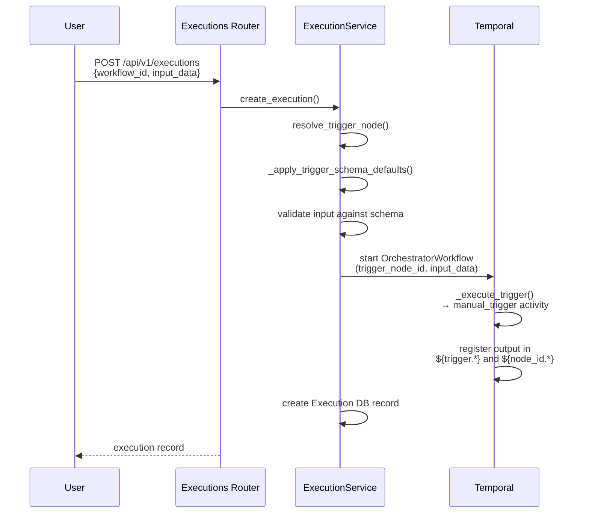

# Manual Trigger

The manual trigger is the default workflow entry point, activated when a user calls `POST /api/v1/executions`. It is the simplest trigger type — a pass-through that makes user-provided inputs available to downstream nodes via expression references.

For the shared trigger architecture (output mapping, namespace registration, dynamic dispatch), see [Trigger System Overview](overview.md).

## How It Works

1. User calls `POST /api/v1/executions` with `workflow_id` and optional `input_data`
2. `resolve_trigger_node()` selects which trigger to activate (see [Trigger Resolution](#trigger-resolution) below)
3. `_apply_trigger_schema_defaults()` applies JSON Schema defaults from the trigger's `input_schema` and validates input against it
4. Temporal workflow starts with the validated `input_data` and resolved `trigger_node_id`
5. `_execute_trigger()` dispatches to the `manual_trigger` activity, which applies output mapping
6. Output is registered in resolver namespaces for downstream node access

Schema validation and default application happen **before** the Temporal workflow starts. If validation fails, no workflow execution is created.

## Trigger Resolution

When `trigger_node_id` is omitted from the API request, `resolve_trigger_node()` defaults to the **first manual trigger** in the definition. This means single-trigger workflows don't need to specify `trigger_node_id` at all. See [Trigger System Overview — Multi-Trigger Workflows](overview.md#multi-trigger-workflows) for the full resolution algorithm.

## Design Decisions

**No database model.** Unlike webhook and EDA triggers, manual triggers have no lookup table. They are resolved directly from the workflow definition at execution time. There is nothing to sync or register externally.

**No dedicated service.** Manual trigger execution goes directly through `ExecutionService.create_execution()` — there is no `ManualTriggerService`. The trigger node's configuration lives entirely in the workflow definition.

## Trigger Output

Manual triggers pass through the user-provided `input_data` as their output. Downstream nodes access it as `${trigger.field_name}` or `${trigger_node_id.field_name}`. See [Trigger System Overview — How Trigger Output Flows](overview.md#how-trigger-output-flows-to-downstream-nodes) for the full namespace and output mapping explanation.

## Configuration

Manual trigger parameters are defined by the JSON Schema at `src/syntara/schemas/workflows/v2/triggers/manual.schema.json`. The only configurable field is `input_schema` (JSON Schema Draft-07), which defines validation and defaults for user-provided input (with `$ref`/ReDoS protections — see [overview](overview.md#validation-happens-before-temporal)).

## Key Files

| File | Purpose |
|------|---------|
| `src/syntara/workflows/workflow_engine/activities/manual_trigger.py` | Activity: applies output mapping to user input |
| `src/syntara/workflows/workflow_engine/models/workflow_definition.py` | `resolve_trigger_node()` for trigger selection |
| `src/syntara/workflows/services/execution_service.py` | Execution creation, schema defaults, validation |
| `src/syntara/schemas/workflows/v2/triggers/manual.schema.json` | JSON Schema for trigger configuration |

## Related Documentation

- [Trigger System Overview](overview.md) — shared architecture, output flow, adding new trigger types
- [Webhook Triggers](webhook-triggers.md) — HTTP webhooks and EDA events
- [Scheduled Trigger](scheduled-trigger.md) — cron and interval schedules
- [Workflow Definition Guide](../workflow-definition-guide.md) — complete guide to defining V2 workflows
