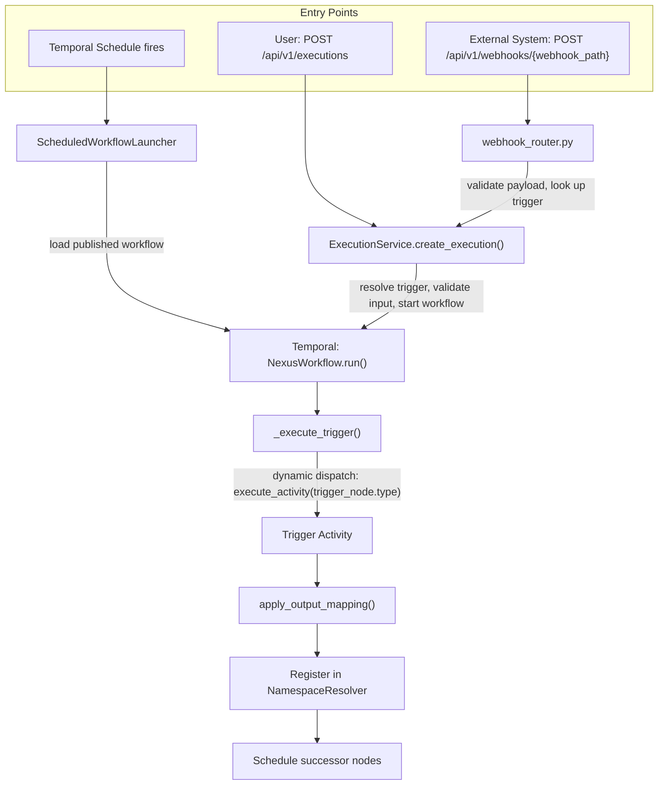

# Trigger System Architecture

Triggers are the entry points that start workflow executions. Every workflow has at least one trigger node, and the trigger type determines how the workflow is activated — by a user, an HTTP request, or a schedule.

All four trigger types (manual, webhook, EDA, scheduled) converge on the same execution path once they enter the workflow engine. This document explains that shared architecture. Per-trigger-type details are in the companion docs:

- [Manual Trigger](manual-trigger.md) — user-initiated via API
- [Webhook Triggers](webhook-triggers.md) — HTTP webhooks and EDA events
- [Scheduled Trigger](scheduled-trigger.md) — cron and interval schedules

## How a Trigger Becomes an Execution

Three distinct entry paths converge at the same Temporal workflow:



**Manual and webhook/EDA paths** both flow through `ExecutionService.create_execution()`, which resolves the trigger node, validates input against the trigger's `input_schema`, starts the Temporal workflow, and then creates the `Execution` database record.

**Scheduled triggers** bypass `ExecutionService` because there's no incoming request — the Temporal Schedule directly starts a launcher workflow (`ScheduledWorkflowLauncher`) whose activity replicates the same create-execution logic.

Once inside the Temporal workflow, all triggers follow the same path through `_execute_trigger()` in `dynamic_workflow.py`.

## Key Design Decisions

### Validation happens before Temporal

All input validation (JSON Schema, payload size checks) runs in the API/router layer *before* the Temporal workflow starts. The trigger activities themselves are pure pass-throughs — they receive pre-validated input and apply output mapping. This keeps activities simple and idempotent.

Any trigger type can define an `input_schema` (JSON Schema Draft-07) to validate incoming data. The schema validator (in `json_schema_validation.py`) rejects schemas containing `$ref` references (SSRF prevention — arbitrary URLs could be fetched during validation) and ReDoS-vulnerable regex patterns in `pattern` fields.

### Two-phase execution creation

Execution records are created in two phases: the Temporal workflow is started *first*, then the database `Execution` record is created *second*. This prevents orphaned database records if Temporal rejects the workflow. Both systems share a pre-generated UUID so the execution ID is consistent.

### Activities are pass-throughs

Every trigger activity follows the same pattern:

```
(input_config, output_config) → apply_output_mapping(input_config, output_config) → {"output": {...}}
```

The trigger activity exists so that the trigger node appears in Temporal's activity history and produces namespace-registered output. No trigger activity performs validation, external I/O, or side effects.

### Dynamic dispatch via activity name matching

`_execute_trigger()` dispatches to the correct activity dynamically:

```python
workflow.execute_activity(trigger_node.type, ...)
```

This works because `ActivityName` enum values match `NodeType` enum values for triggers (both use `"manual_trigger"`, `"webhook_trigger"`, etc.). An `ALLOWED_TRIGGER_TYPES` allowlist in `dynamic_workflow.py` acts as a security boundary — only registered trigger types can be dispatched.

## How Trigger Output Flows to Downstream Nodes

After a trigger activity completes, its output is registered in the `NamespaceResolver` under two keys:

1. **`"trigger"`** — the canonical namespace, accessible as `${trigger.field_name}`
2. **The trigger's node ID** — accessible as `${my_trigger_id.field_name}`

Both resolve to the same data. Use `${trigger.*}` for single-trigger workflows. Use `${node_id.*}` when a workflow has multiple triggers and you need to distinguish between them.

**Output mapping** in the trigger node's `outputs` block reshapes the raw trigger data before namespace registration. Expressions like `${result.field_name}` reference fields from the raw activity output.

For details on the resolver, see `NamespaceResolver` in `src/syntara/workflows/utils/namespace_resolver.py`. For output mapping, see `apply_output_mapping()` in `src/syntara/workflows/utils/output_mapping.py`.

## Multi-Trigger Workflows

A workflow can define multiple trigger nodes. When an execution starts, only the selected trigger runs — `_skip_unselected_triggers()` marks all other trigger nodes as skipped and propagates the skip state downstream through their exclusive branches.

Trigger selection is handled by `resolve_trigger_node()` in `workflow_definition.py`:

1. If `trigger_node_id` is provided in the request, that specific trigger is selected
2. If `trigger_node_id` is omitted, the **first manual trigger** in the definition is used as the default
3. If no matching trigger is found, `SafeValueError` is raised before the workflow starts

## Adding a New Trigger Type

To add a new trigger type, you need to touch these areas:

1. **Activity** — Create a new file in `src/syntara/workflows/workflow_engine/activities/` following the pass-through pattern (receive input, call `apply_output_mapping`, return `{"output": ...}`). Register it with `@activity.defn(name=ActivityName.YOUR_TRIGGER)`.

2. **Registration** — Add the new type to:
   - `ActivityName` enum in `workflow_definition.py`
   - `NodeType` enum in `workflow_definition.py`
   - `ALLOWED_TRIGGER_TYPES` in `dynamic_workflow.py`

3. **Config model** (if the trigger has parameters beyond `input_schema`) — Add a config class in `workflow_definition.py` extending `TemplateAwareBaseModel`.

4. **JSON Schema** — Add a schema file in `src/syntara/schemas/workflows/v2/triggers/`.

5. **Service and DB model** (if the trigger needs external state) — Only needed if the trigger requires a lookup table (like webhook triggers) or external system registration (like scheduled triggers). Manual triggers need neither.

6. **Router** (if the trigger is externally invoked) — Add a FastAPI router following the `*/*router.py` auto-discovery pattern.

7. **Frontend** — The workflow designer's node catalog may need updating if the new trigger type should appear in the builder palette.

The shared infrastructure you get for free: output mapping, namespace registration, multi-trigger skip propagation, error handling, and Temporal activity retry policies.

## Related Documentation

- [Workflow Engine Architecture](../workflow-engine-overview.md) — the shared graph/dispatch engine trigger nodes hand off into
- [Manual Trigger](manual-trigger.md) — user-initiated via the executions API
- [Webhook Triggers](webhook-triggers.md) — HTTP webhooks and EDA events
- [Scheduled Trigger](scheduled-trigger.md) — cron and interval schedules
- [Workflow Definition Guide](../workflow-definition-guide.md) — complete guide to defining V2 workflows
