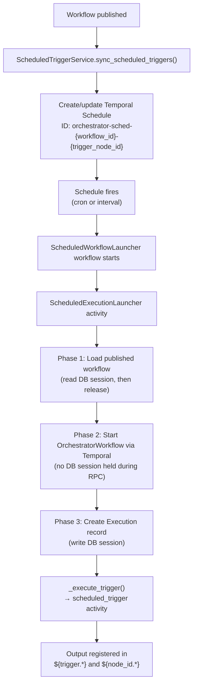

# Scheduled Trigger

Scheduled triggers activate workflows automatically on a time-based schedule using cron expressions or ISO 8601 intervals. The scheduling infrastructure is built entirely on Temporal Schedules — no database model is needed.

For the shared trigger architecture (output mapping, namespace registration, dynamic dispatch), see [Trigger System Overview](overview.md).

## How It Works

Scheduled triggers follow a publish-driven lifecycle. Temporal Schedules are created when the workflow is published, not when the trigger node is added to the definition.

**Activation flow:**

1. When a workflow is **published**, `ScheduledTriggerService.sync_scheduled_triggers()` creates or updates Temporal Schedules for each scheduled trigger node
2. When a schedule fires, Temporal starts a `ScheduledWorkflowLauncher` workflow
3. The launcher's `ScheduledExecutionLauncher` activity runs in three phases, deliberately releasing the DB session between reads and writes to avoid holding connections during Temporal RPCs
4. `_execute_trigger()` dispatches to the `scheduled_trigger` activity
5. The `ScheduledExecutionLauncher` captures schedule timing metadata (`scheduled_at`, `triggered_at`) from the Temporal activity context and passes it as `input_data` to the workflow. The `scheduled_trigger` activity then passes it through with output mapping like any other trigger.

## Design Decisions

### Deterministic schedule IDs — no database model

Schedule IDs follow the format `orchestrator-sched-{workflow_id}-{trigger_node_id}`. This deterministic convention eliminates the need for a database lookup table — the schedule can always be located by its ID. Cleanup uses a prefix scan on `orchestrator-sched-{workflow_id}-` to find all schedules for a workflow.

### Post-commit schedule creation

Temporal Schedules are synced *after* the database commit on publish. This prevents creating schedules for a publish that fails to commit. If the schedule sync fails, the publish still succeeds — schedules will be synced on the next publish.

### Three-phase launcher activity

The launcher activity deliberately splits DB and Temporal operations into separate phases:

1. **Read phase** — loads the published workflow (read session, then released)
2. **Temporal phase** — starts `OrchestratorWorkflow` (no DB session held during the RPC call)
3. **Write phase** — creates the `Execution` record

This avoids holding database connections during potentially slow Temporal RPCs.

### Cached Temporal client

`ScheduledTriggerService` uses a module-level cached Temporal client that reconnects automatically on connection errors, avoiding the overhead of creating a new connection for each schedule operation.

### Temporal unavailability graceful degradation

If Temporal is unreachable during `sync_scheduled_triggers()` or `delete_triggers_for_workflow()`, the service logs a warning and returns 0 (no-op). This prevents workflow publish from failing due to transient Temporal connectivity issues. Schedules will be synced on the next successful publish.

## Schedule Lifecycle

| Event | Action |
|-------|--------|
| Workflow published | `sync_scheduled_triggers()` creates or updates Temporal Schedules for each scheduled trigger node |
| Workflow re-published | Schedule configs are updated in place; stale schedules (trigger nodes removed from the definition) are deleted via prefix scan |
| Workflow unpublished | `delete_triggers_for_workflow()` removes all Temporal Schedules for the workflow. Already-running executions are not affected — only future firings are prevented. If schedule deletion fails (Temporal unavailable), the launcher will fail with `WorkflowNotPublishedError` on the next firing. |
| Workflow deleted | `delete_triggers_for_workflow()` removes all Temporal Schedules for the workflow |

## Execution Conflict Policy

Controls what happens when a schedule fires while a previous execution from the same schedule is still running. Each policy maps to a Temporal `ScheduleOverlapPolicy` and a catchup window (see `build_schedule_policy()` in `schedule_parser.py`).

| Policy | Overlap behavior | Catchup behavior | Use Case |
|--------|-----------------|-------------------|----------|
| `skip` (default) | If a previous execution is still running, the new firing is skipped | Firings missed during downtime are also skipped (1-second catchup window) | High-frequency checks where stale runs are not useful |
| `buffer_one` | If the current execution is still running, one additional execution is buffered | Missed firings within a 48-hour window trigger a single catch-up | Nightly jobs where you want at most one catch-up |
| `buffer_all` | All firings are buffered and run sequentially | All missed firings within a 48-hour window are caught up | Audit or compliance workflows where every scheduled run must be recorded |
| `allow_all` | Start immediately, even if previous runs are still in progress (concurrent) | Missed firings within a 48-hour window are caught up | Independent runs where concurrent execution is acceptable |
| `cancel_other` | Cancel the in-progress run and start a new one | Firings missed during downtime are skipped (1-second catchup window) | Only the latest scheduled run matters; stale runs should be cancelled |

**Warning**: `buffer_all` and `allow_all` can cause a burst of executions if the system was down for an extended period. Use them only when every missed firing must produce an execution record.

## Schedule Types

The trigger supports two schedule types: **cron** (standard 5-field expressions for clock-aligned schedules) and **interval** (ISO 8601 repeating intervals for fixed cadence). See `ScheduledTriggerConfig` in `workflow_definition.py` and `config_to_temporal_schedule()` in `schedule_parser.py` for format details and validation rules.

## Trigger Output

Scheduled triggers expose two timestamps: `scheduled_at` (when the schedule was supposed to fire) and `triggered_at` (when the launcher activity actually started). These are captured by `ScheduledExecutionLauncher` from the Temporal activity context and passed as `input_data` to the workflow. Downstream nodes access them as `${trigger.scheduled_at}` or `${trigger_node_id.triggered_at}`. See [Trigger System Overview — How Trigger Output Flows](overview.md#how-trigger-output-flows-to-downstream-nodes) for the full namespace and output mapping explanation.

## Key Files

| File | Purpose |
|------|---------|
| `src/syntara/workflows/services/scheduled_trigger_service.py` | Syncs triggers with Temporal Schedules; cached client |
| `src/syntara/workflows/workflow_engine/scheduled_launcher.py` | `ScheduledWorkflowLauncher` workflow and `ScheduledExecutionLauncher` activity |
| `src/syntara/workflows/workflow_engine/activities/scheduled_trigger.py` | Activity: pass-through with output mapping (timing metadata arrives via `input_data`) |
| `src/syntara/workflows/utils/schedule_parser.py` | `build_schedule_id()`, `config_to_temporal_schedule()` |
| `src/syntara/workflows/workflow_engine/models/workflow_definition.py` | `ScheduledTriggerConfig` model |
| `src/syntara/schemas/workflows/v2/triggers/scheduled.schema.json` | JSON Schema for trigger configuration |

## Related Documentation

- [Trigger System Overview](overview.md) — shared architecture, output flow, adding new trigger types
- [Manual Trigger](manual-trigger.md) — user-initiated via the executions API
- [Webhook Triggers](webhook-triggers.md) — HTTP webhooks and EDA events
- [Workflow Definition Guide](../workflow-definition-guide.md) — complete guide to defining V2 workflows
