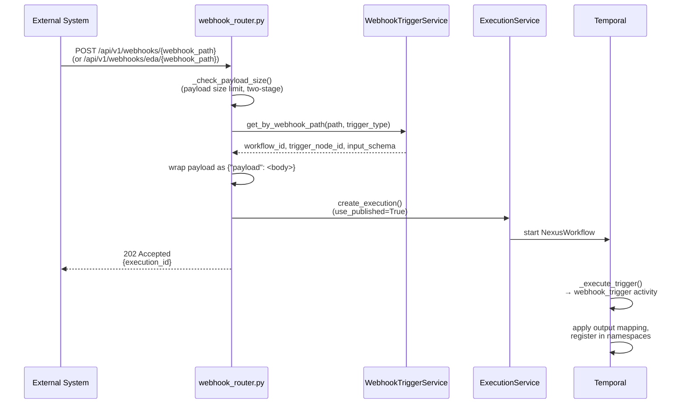
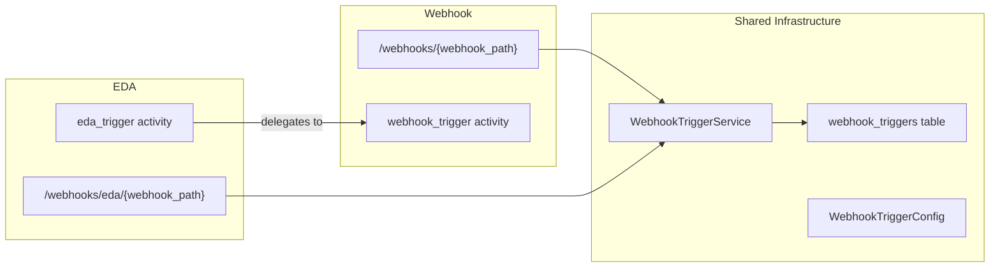

# Webhook Triggers

Webhook triggers activate workflows when external systems send HTTP POST requests to dedicated URLs. There are two variants that share the same infrastructure:

- **Webhook triggers** — general-purpose, at `/api/v1/webhooks/{webhook_path}`
- **EDA triggers** — Event-Driven Ansible integration, at `/api/v1/webhooks/eda/{webhook_path}`

Both use the same database table, service, config model, and execution logic. The differences are limited to URL namespace and Temporal activity registration (see [EDA Variant](#eda-variant) below).

For the shared trigger architecture (output mapping, namespace registration, dynamic dispatch), see [Trigger System Overview](overview.md).

## How It Works

1. External system sends HTTP POST to the webhook URL
2. `_check_payload_size()` enforces the payload size limit (defined by `WebhookLimits.PAYLOAD_MAX_BYTES` in `constants.py`) in two stages: Content-Length header check first, then streaming read abort if the header is missing or spoofed
3. `WebhookTriggerService.get_by_webhook_path()` looks up the trigger in the `webhook_triggers` table using the composite unique index on `(trigger_type, webhook_path)`
4. The request body is wrapped as `{"payload": <request_body>}` — this is why downstream expressions use `${trigger.payload.field}` rather than `${trigger.field}`
5. `ExecutionService.create_execution()` starts the workflow with `use_published=True`, ensuring the currently published version runs even if a draft exists
6. The endpoint returns `202 Accepted` immediately — workflow execution is asynchronous

The webhook endpoint is public (no authentication required). A system user is used as the execution's `created_by`.

## Design Decisions

### Two-stage payload size enforcement

The payload size limit (`WebhookLimits.PAYLOAD_MAX_BYTES`) is checked twice: first via the `Content-Length` header (if present), then via streaming read with an abort threshold. This prevents large payloads from consuming server memory even when `Content-Length` is missing or spoofed.

### Async 202-Accepted pattern

The webhook endpoint returns immediately after starting the Temporal workflow, without waiting for execution to complete. This keeps webhook response times predictable regardless of workflow complexity.

### `use_published=True`

Webhook-triggered executions always run the published version of the workflow definition. This prevents external events from accidentally triggering a draft version that may be incomplete or under development.

### Composite unique index for path lookup

The `webhook_triggers` table uses a composite unique index on `(trigger_type, webhook_path)`. This allows the same path slug to exist for different trigger types (a webhook trigger and an EDA trigger can both use `"deploy-notifications"`) while ensuring uniqueness within each type. The lookup is O(1).

### Sync on create/update/publish

Trigger rows in the `webhook_triggers` table are automatically synced from workflow definitions on create, update, and publish via `WebhookTriggerService.sync_webhook_triggers()`. Stale rows (trigger nodes removed from the definition) are deleted during sync.

## Trigger Output

Webhook payloads are wrapped as `{"payload": <body>}` before being passed to the activity. Downstream nodes access the data as `${trigger.payload.field_name}` or `${trigger_node_id.payload.field_name}`. See [Trigger System Overview — How Trigger Output Flows](overview.md#how-trigger-output-flows-to-downstream-nodes) for the full namespace and output mapping explanation.

## Configuration

Webhook trigger parameters are defined by the config model `WebhookTriggerConfig` in `workflow_definition.py` and the JSON Schemas at `src/syntara/schemas/workflows/v2/triggers/webhook.schema.json` (and `eda.schema.json`). Key fields are `webhook_path` (unique URL slug) and `input_schema` (optional JSON Schema for payload validation, with `$ref`/ReDoS protections — see [overview](overview.md#validation-happens-before-temporal)).

## EDA Variant

EDA (Event-Driven Ansible) triggers are architecturally a thin variant of webhook triggers. They exist as a separate trigger type for two reasons:

**Observability.** The `eda_trigger` activity is registered as a separate Temporal activity, so EDA and webhook executions are distinguishable in Temporal UI, metrics, and logs. The EDA activity implementation delegates entirely to the webhook trigger activity — the `eda_trigger.py` file is a one-line call to `webhook_trigger`.

**URL namespace separation.** EDA triggers use the `/api/v1/webhooks/eda/{webhook_path}` endpoint prefix. This separates the URL space so an EDA trigger and a general webhook trigger can use the same `webhook_path` slug without conflict (enforced by the composite unique index on `trigger_type + webhook_path`).

**Shared infrastructure.** EDA triggers use the same `webhook_triggers` database table (differentiated by `trigger_type` column), the same `WebhookTriggerService`, the same `WebhookTriggerConfig` model, and the same payload wrapping, validation, and execution flow. When working with EDA triggers in code, you're working with webhook infrastructure filtered by `trigger_type="eda_trigger"`.

## Key Files

| File | Purpose |
|------|---------|
| `src/syntara/workflows/webhook_router.py` | FastAPI router for both `/webhooks/{webhook_path}` and `/webhooks/eda/{webhook_path}` |
| `src/syntara/workflows/services/webhook_trigger_service.py` | Trigger lookup and sync for both types |
| `src/syntara/workflows/workflow_engine/activities/webhook_trigger.py` | Webhook activity (pass-through + output mapping) |
| `src/syntara/workflows/workflow_engine/activities/eda_trigger.py` | EDA activity (delegates to webhook) |
| `src/syntara/workflows/models/webhook_trigger.py` | `WebhookTrigger` SQLModel (shared DB table) |
| `src/syntara/workflows/workflow_engine/models/workflow_definition.py` | `WebhookTriggerConfig` model |

## Related Documentation

- [Trigger System Overview](overview.md) — shared architecture, output flow, adding new trigger types
- [Manual Trigger](manual-trigger.md) — user-initiated via the executions API
- [Scheduled Trigger](scheduled-trigger.md) — cron and interval schedules
- [Workflow Definition Guide](../workflow-definition-guide.md) — complete guide to defining V2 workflows
