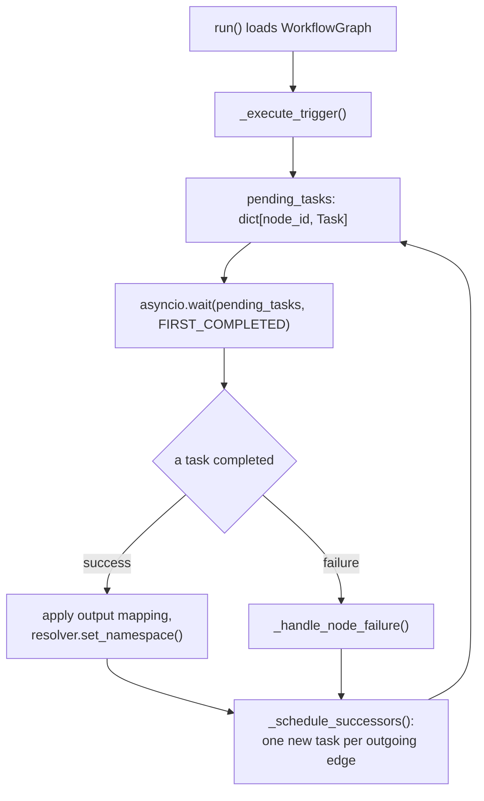
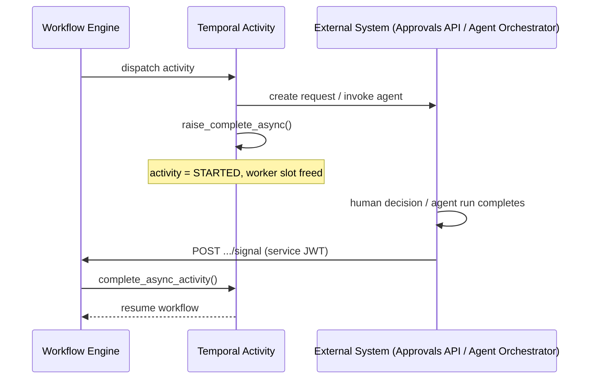
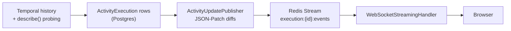
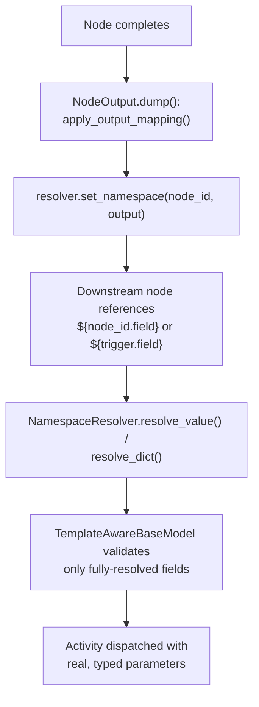

# Workflow Engine Architecture

Syntara compiles every user-defined workflow into the *same* Temporal workflow type. There is no per-workflow code generation — `OrchestratorWorkflow` (`dynamic_workflow.py`) interprets a workflow's nodes and edges as data at runtime. This document explains the engine mechanics shared by every node type: how the graph is walked, why certain nodes complete asynchronously, how the three-tier live-status pipeline works, how data flows between nodes, and what's involved in adding a new node type.

Per-node-type detail lives in the companion docs linked at the bottom. Read this one first.

## How the Engine Executes a Workflow Graph

`OrchestratorWorkflow.run()` (`dynamic_workflow.py`) loads a `WorkflowGraph` from the workflow definition, executes the trigger node (`_execute_trigger()`), then enters `_process_pending_tasks()` — an `asyncio.wait(pending_tasks, return_when=FIRST_COMPLETED)` loop over `pending_tasks: dict[node_id, asyncio.Task]`. Every time a task finishes, `_schedule_successors()` looks up the node's outgoing edges and creates one new `asyncio.create_task()` per successor, adding it back into `pending_tasks`.

### Parallel branches are implicit

There's no explicit "parallel" node type (see the module docstring in `dynamic_workflow.py`) — this was a day-one design choice, not something later removed. If a node's output port has multiple outgoing edges, `_schedule_successors()` simply schedules one task per edge; they run concurrently as ordinary entries in `pending_tasks`. Fan-*in* works symmetrically: a plain node with multiple incoming edges fires as soon as the **first** predecessor completes — the second predecessor's completion is silently ignored (the node is already running or finished). To *synchronize* fan-in — wait for all or N predecessors before proceeding — use a `converge` node, which checks `_are_predecessors_complete()` with `ALL`/`ANY` strategies. Note: there is currently no validation warning when a non-converge node has multiple incoming edges — the engine silently uses first-wins behavior.

## Dispatching to Activities

`_dispatch_node_to_executor()` is the single dispatch point every node passes through after credential injection. It splits into two shapes:

- **Map-dispatched nodes** (`script`, `http_request`, `condition`, `switch`, `agentic`, `aap_job_template`, `aap_workflow_job_template`) are looked up in `_EXECUTOR_ACTIVITY_MAP` (a `NodeType → ActivityName` mapping) and run through one generic path, `_execute_executor_node()`, which calls `workflow.execute_activity(activity_name, args=[params, outputs], activity_id=node.id, ...)`.
- **Custom-dispatched nodes** (`approval`, `wait`, `converge`, `loop`) need extra arguments or custom routing logic that the generic path doesn't support, so each gets its own handler method instead of going through the map.

Loop *control* activities use Temporal IDs `{loop_id}_iter_{n}`, or `{loop_id}_iter_{outer}_iter_{inner}` when that loop is itself inside another loop, so Temporal never reuses an activity ID when an inner loop resets on the next outer iteration. Approval nodes **inside** a loop body use that same suffix for the Temporal `activity_id` only. The Approvals API `approval_node_id` stays the canvas node ID; `loop_iteration_path` (outermost first) distinguishes iterations, and uniqueness is `(execution_id, approval_node_id, loop_iteration_path)`. The Temporal ID is persisted on the approval row as `temporal_activity_id` so decide/signal never recomputes it. `workflow.patched("loop-iteration-unique-ids")` keeps in-flight pre-upgrade executions on canvas Temporal IDs until those runs drain. Activity sync strips every `_iter_{n}` suffix back to the canvas node ID; only LOOP-typed nodes with that suffix are treated as loop control.

This dispatch axis is orthogonal to whether the activity completes synchronously or asynchronously — `agentic` is map-dispatched but uses async completion (see below), while `loop` and `converge` are custom-dispatched but complete synchronously.

## Why Async Completion via Signals (Approval, Agentic, Wait)

These three share a pattern because a plain synchronous Temporal activity would tie up a worker slot for as long as the node takes to resolve — potentially hours for a human approval or a long agent run. Instead, the activity does its setup and calls `activity.raise_complete_async()` (`approval_activity.py`, `agentic_activity.py`, `wait_activity.py`), which leaves the Temporal activity in `STARTED` state without holding a worker.

Completion happens out of band:

- **Approval / Agentic**: an external system calls `POST /executions/{execution_id}/activities/{activity_id}/signal` (`executions_router.py`) → `ExecutionService.handle_activity_callback()` (`execution_service.py`) → `TemporalExecutionService.complete_async_activity()` (`temporal_execution_service.py`) → `temporal_client.get_async_activity_handle(...).complete()`. The callback URL is built by `generate_activity_signal_url()` (`utils/url.py`); see [S2S Certificate Authentication](../s2s-cert-authentication.md) for how internal service calls are authenticated.
- **Wait**: completes on its own via a durable Temporal timer (`workflow.sleep()`) — no external signal involved.

## Why Fire-and-Poll for AAP Job Template

AAP has no outbound webhook/callback mechanism to signal Temporal back, so the async-completion pattern above isn't available to it. `execute_aap_job_template_activity()` (`aap_job_template_activity.py`) instead launches the job, immediately sends a heartbeat carrying partial output — job ID and URL — so that data is durably recorded *before* polling starts, then calls `poll_until_complete()` (`aap_common.py`), which polls AAP's REST API and heartbeats periodically until a terminal status. This is a single long-running *synchronous* activity: Temporal heartbeats provide liveness and cancellation here, not async completion.

## Three-Tier Live Status Sync: Temporal → DB → Redis → WebSocket

`ActivitySyncService` (`activity_sync_service.py`) reads Temporal history and writes `ActivityExecution` rows (`models/activity_execution.py`). Because Temporal defers `ACTIVITY_TASK_STARTED` events until an activity completes, the service also probes `describe()` for in-flight activities so they don't stay stuck showing `PENDING`. `ActivityUpdatePublisher` then publishes JSON-Patch diffs (`publish_activity_patch`) onto a Redis Stream keyed `execution:{id}:events` (`get_execution_stream_id`, in `execution_streaming_service.py`), which `WebSocketStreamingHandler` tails and forwards to connected clients.

This is three tiers, not two, for four reasons:

- **Reconnect/replay.** A client that drops and reconnects needs to replay events from a specific point. Redis Streams support this natively via consumer groups and stream IDs — this is what execution-runtime.md's `?replay=<stream-id>` parameter reads from. Temporal's own history replay doesn't fit this access pattern.
- **Redis was chosen over Postgres LISTEN/NOTIFY deliberately** — it's already in the stack, and has better fan-out/backpressure characteristics under many concurrent WebSocket connections.
- **The DB can't absorb live-push read load.** Polling Postgres directly from every open WebSocket connection doesn't scale; Redis absorbs that load instead.
- **Auditability.** The DB tier isn't just a hop en route to Redis — `ActivityExecution` rows are the durable audit/history record, and outlive the Redis stream (which is trimmed/TTL'd), independent of Temporal's own history retention.

## Data Flow Between Nodes

1. **Output mapping.** Every executor's output model subclasses `NodeOutput` (`workflow_definition.py`). `NodeOutput.dump(output_config)` calls `apply_output_mapping()` (`utils/output_mapping.py`) to filter/rename fields per the node's `outputs` config: `None` passes everything through, `{}` suppresses all output, `{field: expr}` selects specific fields.
2. **Namespace registration.** `_process_pending_tasks()` calls `resolver.set_namespace(node_id, output)` (`namespace_resolver.py`). `NamespaceResolver` keeps one dict-of-dicts keyed by node ID, plus the reserved `trigger`, `workflow_context`, and `loop` namespaces.
3. **Template resolution.** `${...}` expressions are resolved via `resolve_value()` / `resolve_dict()` (`namespace_resolver.py`), using a `TEMPLATE_PATTERN` regex and `_lookup_path()` to walk dotted paths like `trigger.url` or `my_node.result.field`. This runs once per node, immediately before dispatch, in `_resolve_node_parameters()` (`dynamic_workflow.py`).
4. **Deferred type validation.** Parameter models subclass `TemplateAwareBaseModel` (`workflow_engine/models/workflow_definition.py`), whose wrap-mode field validator (`allow_template_strings`) skips Pydantic validation entirely for any field whose raw string still contains a `${...}` template — only fully-resolved values get real type/constraint checking. This exists because template expressions have to pass Pydantic validation when a workflow definition is *saved*, long before their real value is known; full validation only happens once, post-resolution, inside the activity right before use.

For the full namespace/expression reference, see [Expression System](expression-system.md).

## Adding a New Node Type

Using AAP Job Template as a worked example, you'll touch:

1. **Activity** — a new file under `workflow_engine/activities/` with an `@activity.defn` function.
2. **Parameter/output models** — a `TemplateAwareBaseModel` subclass for parameters and a `NodeOutput` subclass for output, both in `workflow_engine/models/workflow_definition.py`; register the output model in `NODE_OUTPUT_MODELS`.
3. **Registries** — add entries to the `NodeType` and `ActivityName` enums, register the activity function in `activities/registry.py`, and add a `NodeType → ActivityName` entry to `_EXECUTOR_ACTIVITY_MAP` (`dynamic_workflow.py`) — or a custom dispatch branch in `_dispatch_node_to_executor()` if the node needs bespoke handling like Approval or Wait.
4. **JSON Schema** — a parameter schema under `schemas/workflows/v2/executors/<type>.schema.json`, plus the matching catalog/validator entry so the workflow definition validator accepts the new `type` at save time.

Shared infrastructure every node type gets for free, no per-node opt-in required:

- **Error handling** — `_handle_node_failure()` uniformly unwraps Temporal `ActivityError`/`ApplicationError`, extracts any `{"output": ...}` detail the activity attached, and records `status: "failed"` in the namespace.
- **Timeout margin** — the engine injects the resolved per-node timeout into the activity's own parameters (`ENGINE_TIMEOUT_SECONDS_KEY`) and separately adds a 10-second `_TEMPORAL_MARGIN` to Temporal's `start_to_close_timeout` for node types listed in `_EXECUTOR_TIMEOUT_MARGIN_TYPES` — so the activity's own timeout or poll loop can fire cleanly before Temporal force-cancels the attempt.
- **Credential injection lifecycle** — `_resolve_and_inject_credentials()` runs before every dispatch and `_scrub_activity_credentials()` runs after, in a `finally` block: credentials are available during execution and scrubbed from persisted parameters afterward.

## Related Documentation

- [Trigger System Overview](triggers/overview.md) — trigger nodes dispatch through this same graph; see there for trigger-specific detail
- [Agentic Node](agentic-node.md)
- [Switch Node](switch-node.md)
- [Wait Node](wait-node.md)
- [Converge Node](converge-node.md)
- [Node Settings](node-settings.md) — timeout and retry configuration resolution
- [Retry Policies](retry-policies.md) — retry behavior for transient failures
- [Workflow Definition Guide](workflow-definition-guide.md) — complete guide to defining V2 workflows
- [Expression System](expression-system.md) — full namespace and template syntax reference
