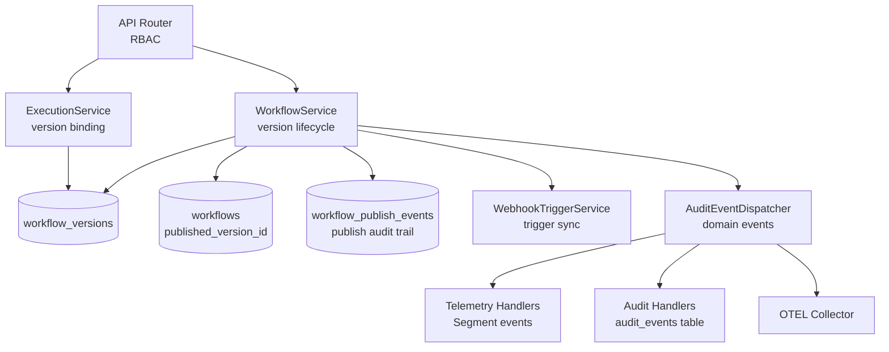
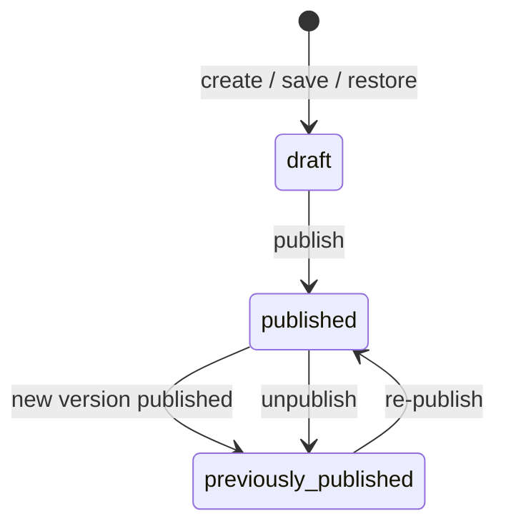
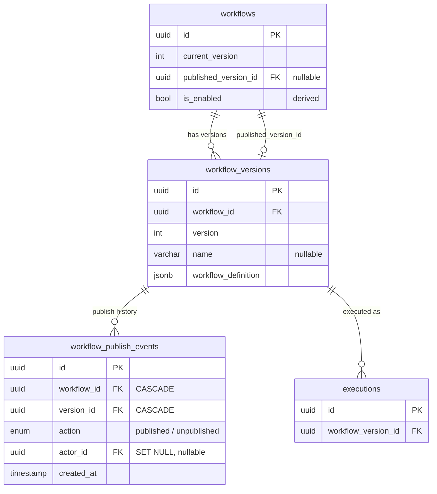
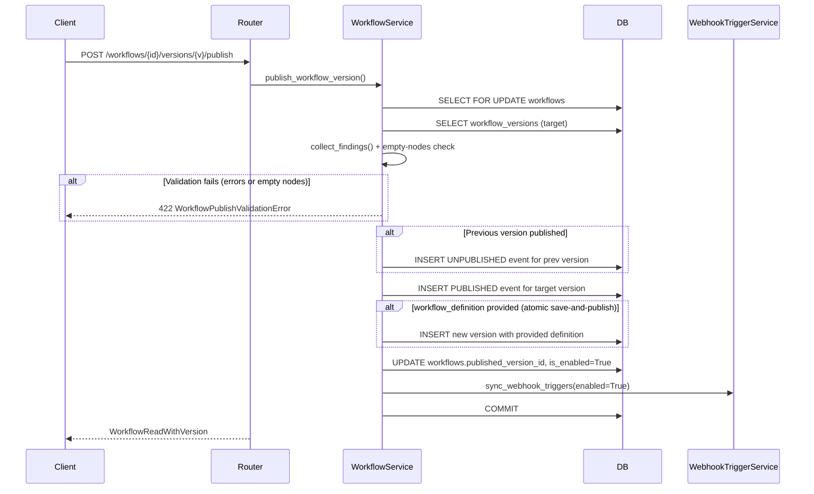

# Workflow Versioning, Publishing, and Portability

> **Developer Guide** — Understanding the Nexus workflow version lifecycle

## Table of Contents

- [Overview](#overview)
- [Architecture](#architecture)
- [Data Models](#data-models)
- [Publish Events](#publish-events)
- [Publish Flow](#publish-flow)
- [Unpublish Flow](#unpublish-flow)
- [Restore Flow](#restore-flow)
- [Export / Import](#export--import)
- [Execution Binding](#execution-binding)
- [Trigger Sync](#trigger-sync)
- [Telemetry](#telemetry)
- [Concurrent Edit Detection](#concurrent-edit-detection)
- [Run from Editor](#run-from-editor)
- [Run from Workflow List](#run-from-workflow-list)
- [API Reference](#api-reference)
- [Roadmap](#roadmap)
- [Open Questions](#open-questions)

---

## Overview

The workflow versioning system tracks every change to a workflow definition as an immutable, sequential version. Versions can be published to make them executable, restored to recover from mistakes, and exported for portability across environments.

Key properties:

- **Automatic versioning** — every save creates a new immutable version with a sequential number; no manual checkpoints needed
- **Three-state lifecycle** — versions are `draft`, `published`, or `previously_published`
- **Single published version** — only one version per workflow can be published at a time, enforced by the `published_version_id` FK pointer on the workflow
- **Indefinite retention** — all versions are retained with no automatic cleanup
- **Publish replaces enable/disable** — there is no separate enable/disable concept; `is_enabled` is derived from whether a published version exists
- **Publish events audit trail** — every publish and unpublish action is recorded in the `workflow_publish_events` table, enabling status derivation and contextual timestamps without storing mutable state on the version
- **Pointer-based publish** — publishing points `workflow.published_version_id` at the target version rather than creating a copy, keeping version numbers sequential
- **Publish-time validation** — empty workflows (no steps) cannot be published, enforcing that only runnable definitions go live
- **Portable definitions** — workflow definitions can be exported as JSON via a backend endpoint

---

## Architecture

- **Router** (`src/syntara/workflows/router.py`) — publish, unpublish, restore, export, list versions, get version endpoints with RBAC enforcement. Calls `WorkflowService.get_publish_context()` to compute version status and timestamps for responses.
- **WorkflowService** (`src/syntara/workflows/services/workflow_service.py`) — all version lifecycle business logic: publish (with empty-nodes validation and event creation), unpublish, restore, create version, export. The `get_publish_context()` method batch-queries `workflow_publish_events` to derive status and timestamps for version responses.
- **ExecutionService** (`src/syntara/workflows/services/execution_service.py`) — resolves the correct version at execution start time; exposes version metadata in list queries via `ExecutionsEnrichQueryMixin`
- **WebhookTriggerService** (`src/syntara/workflows/services/webhook_trigger_service.py`) — syncs webhook trigger registrations on publish/unpublish and draft updates (not on restore — see Restore Flow)
- **AuditEventDispatcher** (`src/syntara/audit/`) — dispatches domain events to registered handlers; events are stored in the `audit_events` table (same database) and routed to the OTEL Collector
- **Domain Events** (`src/syntara/workflows/audit/workflow_version.py`) — dataclasses for created, restored, published, unpublished, and exported events
- **Telemetry Handlers** (`src/syntara/telemetry/handlers/workflow_version_*.py`) — emit Segment events for all version lifecycle operations; auto-discovered at startup

---

## Data Models

### Version Status

Version status is **computed server-side**, not stored on the model. The computation uses the `published_version_id` pointer on the parent workflow and the `workflow_publish_events` table:

| Value | Derivation |
|-------|------------|
| `published` | `workflow.published_version_id == version.id` |
| `previously_published` | Version has at least one PUBLISHED event in `workflow_publish_events` but is not the current published version |
| `draft` | Version has never been published (no publish events) |

This logic lives in `deserialize_workflow_version()` (`src/syntara/workflows/utils/serialization.py`), which takes `workflow_published_version_id` and `ever_published_version_ids` (a set derived from the events table) as inputs.

### WorkflowVersion Table

For field-level details, see `WorkflowVersion` in `src/syntara/workflows/models/workflow_version.py`.

### Workflow Table (versioning fields)

| Field | Type | Description |
|-------|------|-------------|
| `current_version` | int | Latest version number (denormalized — always equals `MAX(version)`) |
| `published_version_id` | UUID FK (nullable) | FK to `workflow_versions.id` for the currently published version, or `NULL` |
| `is_enabled` | bool | Derived from publish state — `True` when `published_version_id` is set |

**Design note — `current_version` vs `published_version_id`**: `current_version` is a denormalized integer — while derivable as `MAX(version)`, it enables single-column joins in the execution path, powers the optimistic concurrency check (`expected_version`), and avoids subqueries on every save and execution start. `published_version_id` is a UUID FK pointing directly at the published `WorkflowVersion` row, enabling direct joins without a version-number lookup. Both fields are maintained atomically by the service layer within the same transaction that creates/publishes versions.

### Entity Relationships

### Database Constraints

| Constraint | Type | Purpose |
|------------|------|---------|
| `ck_workflows_is_enabled_published_version` | CHECK | Enforces `(published_version_id IS NULL) = (NOT is_enabled)` |
| `ix_workflow_versions_workflow_version` | Unique composite index | Prevents duplicate version numbers within a workflow (`workflow_id`, `version`) |
| `ix_workflow_versions_workflow_created` | Index | Optimizes version history queries (`workflow_id`, `created_at`) |
| `ix_wf_publish_events_workflow_id` | Index | Optimizes event queries by workflow |
| `ix_wf_publish_events_version_id` | Index | Optimizes event queries by version |
| `ix_wf_publish_events_actor_id` | Index | Optimizes event queries by actor |
| `workflow_publish_events_workflow_id_fkey` | FK (CASCADE) | Cascades workflow deletion to events |
| `workflow_publish_events_version_id_fkey` | FK (CASCADE) | Cascades version deletion to events |
| `workflow_publish_events_actor_id_fkey` | FK (SET NULL) | Preserves events when principals are deleted |

---

## Publish Events

The `workflow_publish_events` table (`src/syntara/workflows/models/workflow_publish_event.py`) provides an immutable audit trail of publish/unpublish actions. Each row records a single action with `PublishAction` enum (`PUBLISHED` or `UNPUBLISHED`).

**Why a separate events table instead of `published_at` on the version**: The original design stored `published_at` as a timestamp on `WorkflowVersion`. This had two problems: (1) it couldn't distinguish between "never published" and "published then unpublished" — both would have a null `published_at` once the pointer moved away, and (2) it lost history when a version was re-published. The events table captures the full lifecycle: first publish, unpublish, re-publish, with actor and timestamp for each action.

**Pointer-based publish**: Publishing does not create a copy of the version. Instead, `workflow.published_version_id` is a FK that points directly at the target `WorkflowVersion` row. This avoids duplicate version records and keeps version numbers sequential. The events table records when this pointer changed and why.

### Status and Timestamp Derivation

`WorkflowService.get_publish_context(version_ids)` batch-queries the events table, grouped by `(version_id, action)`, returning:

- `ever_published: set[UUID]` — version IDs that have at least one PUBLISHED event
- `timestamps: dict[UUID, VersionPublishTimestamps]` — most recent publish/unpublish timestamps per version

These are passed to `deserialize_workflow_version()` to compute the `status`, `last_published_at`, and `last_unpublished_at` response fields. The `last_unpublished_at` field is suppressed when a version is currently published (i.e., when `unpublished_at < published_at` or the version is the current published version).

### Implicit Unpublish

When publishing version B while version A is already published, the service automatically creates an `UNPUBLISHED` event for version A before creating the `PUBLISHED` event for version B. This means version A transitions from `published` to `previously_published` without an explicit unpublish call.

---

## Publish Flow

Publishing a version makes it the active executable definition. Only one version per workflow can be published at a time. Empty workflows (no steps/nodes) are rejected at publish time.

Steps (`WorkflowService.publish_workflow_version()`):

1. Acquire row lock on the workflow via `SELECT FOR UPDATE`
2. Resolve the target version from `workflow_versions`
3. If `workflow_definition` is provided (atomic save-and-publish for unsaved canvas state), create a new version with that definition first, then publish it
4. Run `collect_findings()` validation on the definition
5. **Publish-only gate**: reject if `nodes` is empty — saves are allowed with empty nodes (canvas-first), but publish requires at least one step. This check lives in the service method, not the validator, to preserve the save path.
6. If a different version is currently published — create an `UNPUBLISHED` event for it (implicit unpublish)
7. Create a `PUBLISHED` event for the target version; update `workflow.published_version_id` and `is_enabled = True`
8. Sync webhook triggers using the published version's definition
9. Atomic commit

**Pointer-based publish (no copy)**: Publishing points `workflow.published_version_id` at the target version's row — it does not create a copy. The original design created a new `WorkflowVersion` row on publish to give it a fresh `created_at` for sorting in the version history panel. The pointer-based approach avoids duplicate rows and keeps version numbers sequential. The frontend sorts by `created_at` and uses the `last_published_at` timestamp (from publish events) for display.

**Frontend enforcement**: The Publish button in the builder toolbar is disabled when the workflow has no steps, with a tooltip "Complete your workflow before publishing". The `validateMinimumWorkflow()` rule also runs in the verify flow as a second gate before opening the publish dialog.

---

## Unpublish Flow

Unpublishing removes the active version and disables triggered execution.

Steps (`WorkflowService.unpublish_workflow()`):

1. Acquire row lock
2. Verify a published version exists (raises `WorkflowNotPublishedError` otherwise)
3. Create an `UNPUBLISHED` event for the currently published version
4. Set `workflow.published_version_id = None`, `is_enabled = False`
5. Sync webhook triggers with `is_enabled=False` — triggers are **disabled but not deleted**, so webhook path registrations remain and can be re-enabled on next publish
6. Atomic commit

---

## Restore Flow

Restoring creates a new draft version by copying an old version's definition. It does **not** change the currently published version.

Steps (`WorkflowService.restore_workflow_version()`):

1. Acquire row lock
2. Resolve the target version
3. Call `_create_version_record()` with the target's `workflow_definition` and `change_description = "Restored from {source_label}"` (where `source_label` is `target_version.name` if set, otherwise `"v{version}"`)
4. The new version is created as `draft` (default status)
5. If the target definition is identical to the current version, no new version is created (change detection optimization)
6. **No trigger sync** — restore only creates a draft; it does not change the published version. Trigger sync resolves to the published version's definition (unaffected by restore). Syncing here would be a no-op that adds data-loss risk, since `WebhookTriggerService.sync_webhook_triggers` calls `session.rollback()` on `IntegrityError`, which could discard the uncommitted restore.
7. **No re-validation** — the restored definition was validated when originally saved. Skipping validation ensures old versions remain restorable even if validation rules tighten.
8. Atomic commit

---

## Export / Import

### Export

Export uses a backend endpoint that returns the workflow definition as a JSON download with a server-generated filename.

- **Endpoint**: `GET /api/v1/workflows/{id}/versions/{version}/export`
- **Response**: JSON file with `Content-Disposition: attachment; filename="<name>.json"` header
- **Filename**: derived from the workflow name, sanitized to ASCII-only characters (RFC 6266 compliance) via `_sanitize_filename()` in the router
- **Access points**: builder kebab menu ("Export workflow") and version history panel kebab menu
- **Frontend**: `downloadWorkflowExport.ts` → `fetchExportBlob()` uses the backend endpoint; filename extracted from `Content-Disposition` header
- **Audit**: `WorkflowVersionExportedEvent` dispatched on export, routed to both audit log and Segment telemetry

### Import

Import loads a JSON workflow definition into the builder canvas without saving. The user must click Save to create a new version.

- **Builder kebab menu** → "Import workflow" → loads the definition into the editor canvas; the user reviews and saves manually
- **Workflow list page** → "Import workflow" button → creates a **new workflow** via `POST /workflows` (`ImportWorkflowDialog.tsx`)
- Validation on import: JSON parsing, file size check, name truncation to 255 chars, description truncation to 1024 chars

**Why import has no dedicated backend endpoint or Segment event**: Import is a client-side operation — the frontend reads the JSON file, parses it, and either loads it into the canvas (builder import) or posts it via the existing `POST /workflows` endpoint (list page import). There is no server-side import endpoint because the workflow definition is validated and persisted through the same save/create paths used by manual editing. The `workflow_version_created` Segment event fires when the user saves the imported definition, so import activity is captured indirectly. A separate `workflow_imported` event was considered but deferred since it would require a client-side telemetry call with no backend involvement, which is outside the current telemetry architecture (all Segment events are dispatched server-side via `AuditEventDispatcher`).

**Import validation (GA scope)**: For GA, import validates JSON syntax, file size limits, and field length constraints (name ≤ 255 chars, description ≤ 1024 chars). Schema conformance validation (e.g., required fields, valid node types) is performed by the existing save path when the user saves the imported definition. Out of scope for GA: validating that referenced credentials, integrations, or step types exist in the target environment.

---

## Execution Binding

Executions are bound to a specific version at start time:

- `Execution.workflow_version_id` is a foreign key to `workflow_versions.id`
- **Webhook-triggered** executions and **workflow list runs** resolve the version via `Workflow.published_version_id` (`use_published=True`)
- **Manual/test** executions from the editor resolve via `Workflow.current_version` (`use_published=False`)
- `use_published` is a boolean field on `ExecutionCreate` — see [Run from Workflow List](#run-from-workflow-list) and [Run from Editor](#run-from-editor)
- The full `workflow_definition` is passed to Temporal at execution start — in-flight executions are unaffected by subsequent publish/unpublish operations
- Versions are never deleted (soft delete only), so the FK reference remains valid indefinitely

### Version Display in Runs

The version is surfaced in two places:

- **Workflow Runs table** (`Executions.tsx`) — Version column after Status, showing the publish name or formatted creation date. Filterable by version.
- **Run History panel** (`WorkflowHistoryCard.tsx`) — Version displayed as a link to the builder with that version selected. Filterable by version.

Version metadata is eager-loaded via `ExecutionsEnrichQueryMixin` (selectinload on `Execution.workflow_version`), exposing `workflow_version`, `workflow_version_publish_name`, and `workflow_version_created_at` in `ExecutionRead`.

---

## Trigger Sync

`WebhookTriggerService.sync_webhook_triggers()` is called during publish, unpublish, and draft updates to keep webhook trigger registrations consistent with the workflow state. It is **not** called during restore (see Restore Flow).

- **On publish** — triggers are synced from the published version's definition with `is_enabled=True`
- **On unpublish** — triggers are synced with `is_enabled=False` (disabled, not deleted)
- **On draft updates** — webhook sync uses the published version's definition if one exists, falling back to the current version's definition
- **On restore** — no trigger sync (restore only creates a draft; the published version is unaffected)
- Trigger types: `webhook_trigger`, `eda_trigger` (from `WEBHOOK_TRIGGER_TYPES`)
- Disabled triggers retain their webhook path registration and can be re-enabled without reconfiguration

---

## Telemetry

### Segment Events (Adoption Tracking)

Segment telemetry tracks feature adoption and usage patterns.

| Event | Trigger | Key Fields |
|-------|---------|------------|
| `workflow_version_created` | New version saved | `workflow_id`, `version` |
| `workflow_version_restored` | Version restored | `workflow_id`, `restored_from_version`, `new_version` |
| `workflow_version_published` | Version published | `workflow_id`, `version`, `workflow_name`, `project_id`, `error_type` |
| `workflow_version_unpublished` | Workflow unpublished | `workflow_id`, `version`, `workflow_name`, `project_id`, `error_type` |
| `workflow_version_exported` | Version exported | `workflow_id`, `version`, `workflow_name` |

All events include `entitlement_id` from the telemetry registry.

**Note — no import event**: Import is a client-side operation that flows through existing save/create endpoints. Import activity is captured by the `workflow_version_created` event when the user saves. See [Import](#import) for details.

### Adding New Telemetry Events

All version lifecycle operations dispatch audit events via `AuditEventDispatcher`. See `docs/standards/observability.md` for the event framework and handler pattern. Event names and fields are authoritative in the handler files under `src/syntara/telemetry/handlers/workflow_version_*.py`.

---

## Concurrent Edit Detection

The builder uses optimistic concurrency control to detect when another user has saved a newer version while you are editing.

### How it works

1. When the builder loads a workflow, it records `loadedVersion = workflow.current_version`
2. On save, the frontend sends `expected_version` in the `PATCH /workflows/{id}` request body
3. The backend's `_check_expected_version()` compares `expected_version` against `workflow.current_version`
4. If `expected_version < current_version`, the save is rejected with `409 WorkflowVersionConflictError`, which includes `current_version`, `expected_version`, and `created_by_username` (who made the conflicting save)

### Frontend resolution (`useBuilderConflict`)

When a 409 conflict is detected, the builder shows a `VersionConflictDialog` with three resolution paths:

- **Save as newest** — retries the save with `expectedVersionOverride` set to the server's `current_version`, accepting that the other user's changes will be superseded
- **Duplicate** — creates a copy of the current canvas as a new workflow, preserving both users' work
- **Refresh** — reloads the workflow from the server, discarding the local changes

The conflict dialog also fires for publish and run operations that require a save.

---

## Run from Editor

Running a workflow from the builder forces a save before execution to ensure the latest canvas state is what gets run.

### Flow

1. User clicks **Run** in the builder toolbar
2. The builder saves unconditionally via the same `handleSaveWorkflow` path (including optimistic concurrency check). The `isDirty` flag only affects the dialog text ("Save and run" vs "Run now"), not whether a save occurs. The save-before-run guarantee is stronger than conditional on `isDirty`
3. If the save triggers a version conflict (409), the `VersionConflictDialog` opens with the "run" action context — in addition to the standard resolution paths, this context offers **"Create duplicate workflow with this version and run"**, which creates a non-published copy of the workflow and immediately runs that version
4. On successful save, the execution is created via `POST /executions` with the workflow's `current_version`
5. Manual/test executions resolve via `Workflow.current_version` (`use_published=False`), so the just-saved version is always what runs

---

## Run from Workflow List

Running a workflow from the workflow list page uses the published version, unlike running from the editor (which uses the current draft).

- **Label**: "Run published version" in the kebab menu
- **Disabled state**: When `published_version_id` is null, the action is disabled with tooltip: "No published version. Go to the workflow editor to run the current version."
- **Execution**: `POST /executions` with `use_published: true`
- **Version resolution**: The execution service resolves `workflow.published_version_id` (not `current_version`)

This enforces the distinction: the workflow list is for operators running tested, published automations, while the editor is for developers iterating on drafts.

---

## API Reference

| Method | Path | Operation | Permission |
|--------|------|-----------|------------|
| GET | `/api/v1/workflows/{id}/versions` | List versions | `workflow:read` |
| GET | `/api/v1/workflows/{id}/versions/{version}` | Get version | `workflow:read` |
| GET | `/api/v1/workflows/{id}/versions/{version}/export` | Export version as JSON | `workflow:read` |
| POST | `/api/v1/workflows/{id}/versions/{version}/publish` | Publish version | `workflow:update` |
| POST | `/api/v1/workflows/{id}/unpublish` | Unpublish workflow | `workflow:update` |
| POST | `/api/v1/workflows/{id}/versions/{version}/restore` | Restore version | `workflow:update` |

---

## Roadmap

All GA versioning work has been delivered and merged.

---

## Open Questions

1. **Version history pagination** — The version list endpoint returns all versions with no pagination. A heavily-edited workflow could accumulate thousands of versions. Pagination should be added to align with the standard `ResourcesResponse` pattern used by other list endpoints.

2. **`is_enabled` redundancy** — `is_enabled` is fully derived from `published_version_id IS NOT NULL` and enforced by the `ck_workflows_is_enabled_published_version_id` CHECK constraint. It could be replaced with a SQL expression column or removed entirely in favor of `published_version_id IS NOT NULL` checks. However, it is currently used in: the scheduled launcher query, webhook trigger service queries, workflow list filtering, and composite indexes (`ix_workflows_created_by_enabled`). Removing it requires updating all these consumers and verifying query plan performance. Tracked for a follow-up refactor.
