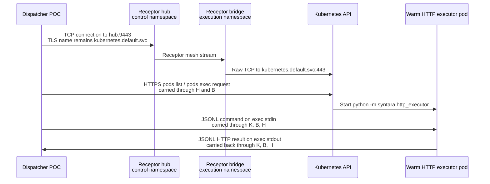

# How Receptor bridges the Kubernetes API

This proof of concept sends a Kubernetes API `pods/exec` connection through a
Receptor TCP bridge. Receptor is not a Kubernetes API client and does not
understand the HTTP executor payload. It forwards the TCP bytes between the
Dispatcher and the Kubernetes API server.



## 1. Dispatcher chooses the Receptor TCP door

The Dispatcher loads ordinary in-cluster Kubernetes configuration. It leaves
the configured API host as `kubernetes.default.svc`, which preserves the API
server hostname for TLS SNI and certificate validation. It replaces only the
TCP dial function:

```go
config.Dial = receptorDialer(receptorAddress)
```

`receptorDialer` disregards client-go's requested socket destination and dials
`receptor-hub.syntara-control-poc.svc:9443`. See
[`dispatcher-poc/main.go`](dispatcher-poc/main.go).

## 2. Hub turns its TCP port into a Receptor mesh stream

The hub's Receptor configuration accepts a local connection on port 9443 and
forwards it to the `kubeapi` service on the execution-side bridge:

```yaml
- tcp-server:
    port: 9443
    remotenode: execution-bridge
    remoteservice: kubeapi
```

The `tcp-server` is the control-side entry point. The client connection remains
one continuous byte stream; Receptor does not terminate the Kubernetes API TLS
connection.

## 3. Bridge turns the mesh stream into a Kubernetes API connection

The execution-side bridge owns the matching named service:

```yaml
- tcp-client:
    address: kubernetes.default.svc:443
    service: kubeapi
```

When the hub sends a stream to `kubeapi`, the bridge opens a raw TCP connection
to its cluster-local Kubernetes API on port 443 and copies data between it and
the Receptor stream. See
[`receptor-bridge.yaml`](receptor-bridge.yaml).

At this point the Dispatcher has a normal TLS connection to the Kubernetes API
server. Its packets took this physical path:

```text
Dispatcher TCP socket -> hub :9443 -> Receptor mesh -> bridge -> Kubernetes API :443
```

## 4. Kubernetes performs pods/exec

The Dispatcher first lists the sole running pod matching
`app=http-executor-worker`, then requests:

```text
POST /api/v1/namespaces/syntara-execution-poc/pods/<worker>/exec
```

The request specifies `python -m syntara.http_executor` and enables stdin,
stdout, and stderr without a TTY. Kubernetes upgrades the connection for the
exec streams and starts that command in the target container.

The worker deployment normally runs `sleep infinity`. This keeps the container
warm while ensuring the executor starts only through the Kubernetes API exec
request. See [`http-executor-worker.yaml`](http-executor-worker.yaml).

## 5. JSONL payload and result take the exec streams

The Dispatcher writes exactly one HTTP executor request JSON object plus a
newline to exec stdin. For the smoke test, that request is:

```json
{"method":"GET","url":"https://example.com","timeout_seconds":10}
```

The HTTP executor performs the request and writes one JSON result line to
stdout. Kubernetes carries that stdout over the exec connection, which flows
back through the bridge, Receptor mesh, and hub to the Dispatcher. The
Dispatcher rejects stderr output, malformed JSON, or anything other than one
stdout JSON line.

The resulting return path is:

```text
HTTP executor stdout -> Kubernetes exec stream -> bridge -> Receptor mesh -> hub -> Dispatcher
```

## What this proves

The Dispatcher has no direct TCP connection to the Kubernetes API or worker.
Its NetworkPolicy permits DNS and the hub TCP door only. The bridge is the
component that establishes the actual Kubernetes API TCP connection, while the
Kubernetes API's TLS identity remains end to end between the Dispatcher and API
server.
