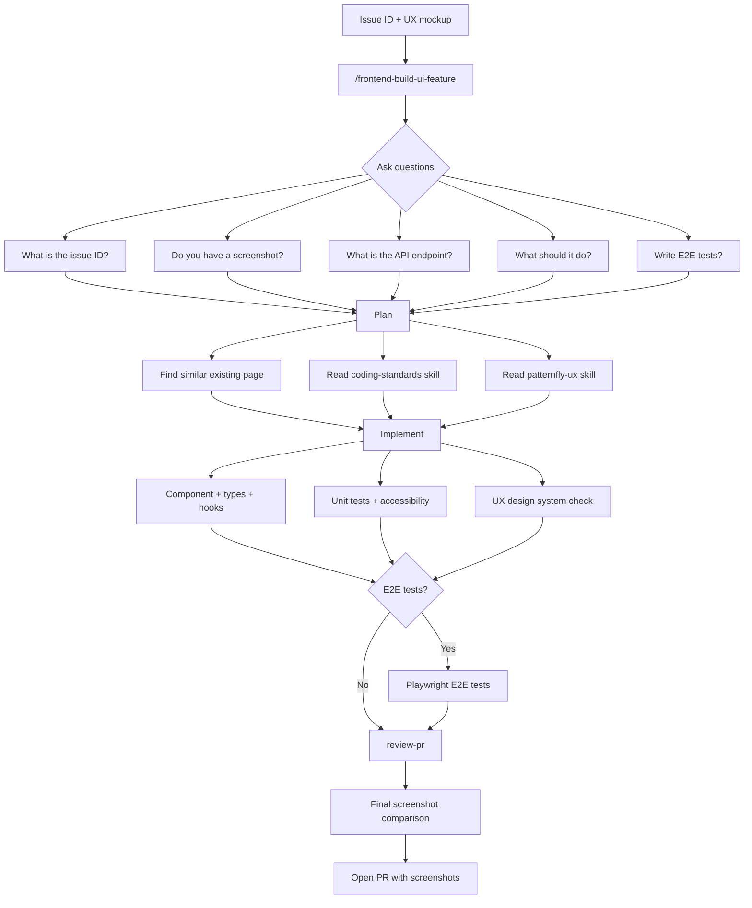

# AI-Assisted Development Workflow

Use AI agents (Claude Code, Cursor, or any tool that reads `.claude/skills/`) to implement, review, and test UI features. The agent handles React, PatternFly, and project conventions.

**You provide:** the API endpoint, what the page should do, and optionally a mockup screenshot.
**The agent handles:** component selection, TypeScript types, form validation, tests, and design tokens.

---

## Table of Contents

1. [Quick Start](#quick-start--copy-this-prompt)
2. [Mental Model](#1-mental-model)
3. [Bring Your Screenshots (Optional)](#2-bring-your-screenshots-optional)
4. [Implement a Feature](#3-implement-a-feature)
5. [Review Locally](#4-review-your-changes-locally)
6. [Code Review](#5-code-review-pr-review)
7. [E2E Tests](#6-e2e-tests-playwright)
8. [UX Design System Check](#7-ux-design-system-check)
9. [Quality Gates](#8-quality-gates-before-opening-a-pr)
10. [Fixing Guideline Violations](#9-fixing-guideline-violations)
11. [Quick-Reference Checklist](#10-quick-reference-for-new-contributors)
12. [Skills & Commands Reference](#11-skills--commands-reference)
13. [Verify with a Final Screenshot](#12-verify-with-a-final-screenshot)
14. [/frontend-build-ui-feature](#13-frontend-build-ui-feature)

---

## How the workflow fits together



---

## Quick Start — Copy This Prompt

Paste this into your AI agent and replace the placeholders:

```text
I need to implement [feature name — e.g. "a Credentials list page"].

[PASTE THE UX MOCKUP SCREENSHOT HERE]

API context:
- Endpoint: [e.g. GET /api/v1/credentials]
- Response fields: [e.g. id, name, type, created_by, created_at]
- Client: [e.g. credentialsClient in src/client.tsx]

What this page should do:
- [e.g. Show a table of credentials with name, type, created-by, and created-at]
- [e.g. A "Create credential" button opens a modal with name and type fields]
- [e.g. Kebab menu on each row: Edit, Delete]
- [e.g. Delete asks for confirmation before deleting]

---
Step 1 — PLAN
Before writing code, research the codebase and create an implementation plan.
Find the most similar existing page as a reference pattern.

Step 2 — IMPLEMENT
Follow the project skills (frontend-coding-standards, frontend-testing-guidelines, frontend-patternfly-ux).
Include unit tests covering happy path, all three empty states, the delete flow,
and accessibility (toHaveNoViolations).

Step 3 — REVIEW LOCALLY
Run npm start, open http://localhost:5173, test every state in the browser.

Step 4 — CODE REVIEW
Type /frontend-review-pr. Fix all Blocking issues.

Step 5 — UX CHECK
Use the frontend-patternfly-ux skill + paste a screenshot.
Fix any visual divergences.

Step 6 — E2E TESTS
Use the frontend-playwright-e2e skill. Dev server at http://localhost:5173.
```

---

## 1. Mental Model

Give the agent a **goal** and a **skill name**. A **screenshot** is optional — without one the agent uses PatternFly conventions to pick the layout. With one, it maps your intent to the exact components and tokens from the mockup.

```text
Good: "Implement a credentials list page matching the attached screenshot.
      Follow the coding standards and UX design system skills."

Weak: "Add a page that lists credentials."
```

---

## 2. Bring Your Screenshots (Optional)

If you have a mockup, gather before starting:

- **Design screenshot** — Figma export (PNG at 2x), Zeplin, or a browser screenshot of a similar page
- **Empty / error states** — screenshots or just describe them; the agent knows the patterns

Drag images directly into the agent chat. If you don't have a mockup, the agent will follow PatternFly conventions and you can refine after seeing the result.

### Side-by-side comparison (for refinement)

After the agent builds the feature, screenshot your page next to the mockup and paste it back:

```text
Left: Figma design. Right: my implementation.
Fix: the spacing between the header and table is too large,
and the empty state icon is missing.
```

Takes 1-2 iterations. Describe what you see — the agent finds the right props.

---

## 3. Implement a Feature

Use for: new pages, list views, dialogs, forms, hooks, or refactors.

### Ask for a plan first (recommended)

Tell the agent: "Plan this feature before writing any code." It finds a similar existing page, asks clarifying questions, and writes a plan for your approval before generating code.

**Always follow existing codebase patterns and standards.** The coding standards skill ([`.claude/skills/frontend-coding-standards/SKILL.md`](../../.claude/skills/frontend-coding-standards/SKILL.md)) and UX design system skill ([`.claude/skills/frontend-patternfly-ux/SKILL.md`](../../.claude/skills/frontend-patternfly-ux/SKILL.md)) are the authoritative guidelines — match what already exists in the codebase rather than inventing new patterns.

### Prompt template

```text
Goal: [1–2 sentence description]

[PASTE SCREENSHOT — optional, but helps match the mockup]

API shape:
- Endpoint: [e.g. GET /api/v1/credentials]
- Key fields: [e.g. id, name, type, created_by, created_at]
- Client: [e.g. credentialsClient in src/client.tsx]

Acceptance criteria:
- [Criterion 1]
- [Criterion 2]

Include vitest-axe accessibility tests and 80%+ coverage.
```

### What the agent produces

1. Component file with PatternFly markup
2. Test file (`*.test.tsx`) — happy path, empty states, delete flow, accessibility
3. Mock handler in `packages/syntara-mock-api/src/handlers.ts` if needed

If the result differs from the mockup, use the side-by-side technique from [§2](#2-bring-your-screenshots-optional). Then run:

```bash
npm run check   # static analysis (lint, tsc, format, knip, mermaid)
npm run test:ui # unit tests with coverage
```

### Validate before opening a PR

Run two checks after implementation:

**1. Code quality** — type `/frontend-review-pr` in the agent chat. It scans changed files against the [quality checklist](../AGENTS.md) and returns Blocking/Suggestion/Nitpick issues. See [§9](#9-fixing-guideline-violations) for common violations.

**2. Visual / UX** — paste a screenshot and ask the agent to verify against the `frontend-patternfly-ux` skill.

```text
Implement → /frontend-review-pr (fix blockers) → UX skill + screenshot (fix visual gaps)
  → lint/tsc/coverage → Open PR with screenshots
```

---

## 4. Review Your Changes Locally

Always check in a browser before opening a PR. Run `npm start` (UI at http://localhost:5173, mock API at http://localhost:3000).

### Walk through every state

| State                  | How to trigger                       | What to check                              |
| ---------------------- | ------------------------------------ | ------------------------------------------ |
| **Loaded**             | Page loads normally                  | Layout matches mockup                      |
| **Empty (no data)**    | Return empty array from mock handler | "No [resources] yet" empty state           |
| **Empty (no results)** | Filter with no matches               | "No results found" + "Clear all filters"   |
| **Error**              | Stop mock API, reload                | `NxErrorState` with working "Retry" button |
| **Success toast**      | Create or delete an item             | Sentence-case title, bottom position       |
| **Error toast**        | Return 500 from mock handler         | Error message with retry                   |

### Also check

- **Console** (F12) — zero errors and warnings
- **Keyboard** — tab through all elements, Enter/Space activates buttons, modals trap focus
- **Screenshots** — capture each state for the PR description

---

## 5. Code Review (PR Review)

Use after implementing a feature, or when reviewing a teammate's PR. The agent validates against the [quality checklist](../AGENTS.md), flags missing tests, and produces a draft PR description.

```text
/frontend-review-pr
```

Or with focus areas:

```text
Use the frontend-pr-review skill.
Review branch [branch-name]. This PR [what it does].
Focus areas:
- [Specific concern]
```

Returns: **Blocking** (must fix), **Suggestion** (nice-to-have), **Nitpick** (style).

---

## 6. E2E Tests (Playwright)

Use for cross-route flows and full browser behavior. Default to Vitest for component-level tests.

```text
Use the frontend-playwright-e2e skill.

Feature to test: [1–2 sentence description]

Critical paths:
- [e.g. "user creates a credential, verifies it appears in the list"]
- [e.g. "user deletes a credential, verifies it disappears"]

[PASTE SCREENSHOT]

Dev server is running at http://localhost:5173.
```

```bash
npm run e2e             # All tests (mock API auto-started)
npm run e2e:ui          # Visual UI for debugging
```

---

## 7. UX Design System Check

Use when implementing any new page, form, dialog, or when unsure which PatternFly component to use.

```text
Use the frontend-patternfly-ux skill.
I am building [what]. Verify my implementation matches the design system.
[PASTE SCREENSHOT]
```

The full set of UX rules (table variants, form thresholds, modal sizes, alert casing, spacing tokens) lives in [`.claude/skills/frontend-patternfly-ux/SKILL.md`](../../.claude/skills/frontend-patternfly-ux/SKILL.md). The agent reads it automatically.

---

## 8. Quality Gates Before Opening a PR

```bash
npm run check   # all static analysis (tsc, lint, format, knip, mermaid) — mirrors CI Checks job
npm run test:ui # unit tests
npm run e2e     # Playwright integration tests
```

- Walk through all states in the browser ([§4](#4-review-your-changes-locally))
- The quality checklist lives in [`AGENTS.md`](../AGENTS.md) — "Common PR Mistakes"
- PR description guidelines are in the [PR template](../../.github/pull_request_template.md)

---

## 9. Fixing Guideline Violations

When `/frontend-review-pr` or a reviewer flags violations, here are the most common ones. You can also paste any violation into the agent and say "explain and fix this."

| Violation                           | How to fix                                                                                 |
| ----------------------------------- | ------------------------------------------------------------------------------------------ |
| **Raw `fetch()`**                   | Use a typed client from `src/client.tsx` (e.g. `credentialsClient.useQuery(...)`)          |
| **`useQueryState` bare string**     | Change to `useQueryState({ title: '...', onRetry: () => detachPromise(query.refetch()) })` |
| **Missing `toHaveNoViolations()`**  | Add accessibility test: `expect(await axe(container)).toHaveNoViolations()`                |
| **`fireEvent` in tests**            | Replace with `const user = userEvent.setup()` then `await user.click(...)`                 |
| **`getByTestId` / `querySelector`** | Use `getByRole('button', { name: 'Delete' })` or `getByLabelText('Name')`                  |
| **Raw error markup**                | Use `<NxErrorState error={error} onRetry={...} />`                                         |
| **Manual `useState` per field**     | Use Zod schema + `useForm({ resolver: zodResolver(schema) })`                              |
| **Missing `reset()` in modal**      | Add `useEffect(() => { reset(item); }, [isOpen, item, reset])`                             |
| **Hardcoded `px`**                  | Use `var(--pf-t--global--spacer--md)` — ask the agent which token to use                   |
| **Nested ternary**                  | Refactor to `if`/`else` or an intermediate variable                                        |
| **Alert title casing**              | Use sentence case: "Credential created", not "Credential Created"                          |

If a violation seems wrong, explain why on the PR. Do not suppress ESLint rules inline without discussing with a maintainer.

---

## 10. Quick-Reference for New Contributors

Shortest path from "I need to build this page" to an open PR:

1. **Get a screenshot** of the UX mockup (Figma, Zeplin, or screenshot of a similar page)
2. **Identify the API endpoint** and response fields
3. **Find the API client** in `src/client.tsx` (e.g. `credentialsClient`, `workflowClient`)
4. **Ask the agent to plan** before writing code
5. **Paste the [Quick Start prompt](#quick-start--copy-this-prompt)**, fill placeholders, drag in the screenshot
6. **Review the plan** — correct anything that looks wrong
7. **Let the agent implement** — it writes code + tests
8. **Review locally** — `npm start`, open http://localhost:5173, walk through every state ([§4](#4-review-your-changes-locally))
9. **Side-by-side screenshot** — paste your page + mockup back to fix visual gaps
10. **Run quality checks** -- `npm run check && npm run test:ui`
11. **`/frontend-review-pr`** — fix every Blocking issue ([§9](#9-fixing-guideline-violations) if unclear)
12. **UX skill + screenshot** — fix visual divergences
13. **Open the PR** with screenshots of every state (loaded, empty, error, success toast) following the PR template provided

### FAQ

**"Which client?"** — look in `src/client.tsx`, or tell the agent the endpoint path and it will find it.

**"Which empty states?"** — every list page needs three (no data, no filter results, API error). Just say "include all three empty states."

**"Doesn't match the mockup?"** — side-by-side screenshot + describe what differs. The agent figures out the right PatternFly props.

**"Review flagged something I don't understand?"** — paste the violation into the agent: "Explain and fix this."

---

## 11. Skills & Commands Reference

### Skills (`.claude/skills/`)

Skills are detailed reference guides the agent consults while working. You can also ask the agent to use a specific skill by name.

| Skill                           | File                                   | What it does                                                                                                                                                        | When to use it                                                                                                                               |
| ------------------------------- | -------------------------------------- | ------------------------------------------------------------------------------------------------------------------------------------------------------------------- | -------------------------------------------------------------------------------------------------------------------------------------------- |
| **Coding Standards**            | `frontend-coding-standards/SKILL.md`   | Patterns with code examples: typed API clients, `useQueryState`, Zod forms, error handling, design tokens, accessibility                                            | Every implementation task. The agent reads this automatically, but you can say "check against the coding standards skill" to force a review. |
| **Testing Guidelines**          | `frontend-testing-guidelines/SKILL.md` | Coverage requirements, query priority (`getByRole` > `getByLabelText` > `getByText`), `userEvent` over `fireEvent`, `vitest-axe` accessibility tests, mock patterns | Writing or reviewing tests. Say "use the frontend-testing-guidelines skill" to verify test quality.                                          |
| **PR Review**                   | `frontend-pr-review/SKILL.md`          | Structured review process: identify scope, read every changed file, categorize issues as Blocking/Suggestion/Nitpick, generate PR description                       | Before opening a PR. Type `/frontend-review-pr` and the agent runs the full checklist.                                                       |
| **Playwright E2E**              | `frontend-playwright-e2e/SKILL.md`     | E2E test writing: fixtures, selectors, mock API setup, waiting strategies, debugging, CI integration                                                                | Writing browser-level tests for user flows. Say "use the frontend-playwright-e2e skill" to write E2E tests.                                  |
| **PatternFly UX Design System** | `frontend-patternfly-ux/SKILL.md`      | PF6 component selection rules, table variants, form thresholds, modal sizes, alert casing, spacing tokens, color tokens                                             | Verifying that your UI matches the design system. Paste a screenshot and say "use the frontend-patternfly-ux skill to check this."           |
| **Frontend Specialist**         | `frontend-specialist/SKILL.md`         | React 19, TypeScript, PatternFly 6, and Vitest implementation standards, pre-submission checklist, quality gates, and implementation workflow                       | Any implementation, review, or refactoring task. Triggered automatically via AGENTS.md.                                                      |
| **Library References**          | `frontend-library-references/SKILL.md` | `llms.txt` URLs for React, Zod, Zustand, Vitest, Vite, and TanStack Query. Ensures current API docs are used instead of stale training data.                        | Before writing code that uses any of these libraries. Triggered automatically via AGENTS.md.                                                 |
| **Build UI feature**            | `frontend-build-ui-feature/SKILL.md`   | Guided wizard: asks what to build, then implements using project skills (optionally Playwright E2E)                                                                 | Type `/frontend-build-ui-feature` to walk through a new page or component.                                                                   |

### User-invocable skills

Type these in the agent chat. They live under `.claude/skills/` (this repository does not ship `.claude/commands/`).

| Command                      | What it does                                                                             |
| ---------------------------- | ---------------------------------------------------------------------------------------- |
| `/frontend-review-pr`        | Runs the full PR review skill against your current branch                                |
| `/frontend-build-ui-feature` | Guided wizard: asks what to build, then implements using project skills (optionally E2E) |
| `/frontend-run-e2e`          | Runs Playwright E2E tests with the project's runner and defaults                         |

### Typical flow for a new feature

```text
/frontend-build-ui-feature
    → asks what to build, plans, implements, tests, then /frontend-review-pr
```

You can skip the wizard. For a quick bug fix, describe the problem and let the agent fix it, then run `/frontend-review-pr` before opening the PR.

---

## 12. Verify with a Final Screenshot

After the agent finishes implementing, always take a screenshot of the running page. The agent should capture this automatically using browser tools (Chrome DevTools MCP or Playwright).

If an initial mockup was provided, the agent compares the final implementation against it side-by-side:

```text
Here is my final implementation screenshot.

[SCREENSHOT OF RUNNING PAGE — captured automatically or pasted manually]

Compare against the original mockup I provided at the start.

Check:
1. Does the layout match the mockup?
2. Are all states working? (loaded, empty, error, success toast)
3. Are PatternFly components and spacing tokens correct?
4. Is the page keyboard-navigable?

Use the frontend-patternfly-ux skill to verify.
List any differences and fix them.
```

If no mockup was provided, the agent still captures the final state and verifies it against PatternFly conventions using the UX skill.

This comparison usually takes 1-2 iterations. The agent maps visual differences to the right PatternFly props and fixes them.

### What to screenshot for your PR

Include these screenshots in the PR description so reviewers can verify without running the code:

| State                  | What to capture                                          |
| ---------------------- | -------------------------------------------------------- |
| **Loaded**             | Page with data, matching the mockup                      |
| **Empty (no data)**    | "No [resources] yet" empty state                         |
| **Empty (no results)** | Filtered with no matches, "Clear all filters" link       |
| **Error**              | API error with `NxErrorState` and working "Retry" button |
| **Success toast**      | After creating or deleting an item                       |
| **Mobile/responsive**  | If applicable, narrow viewport                           |

---

## 13. /frontend-build-ui-feature

Instead of copying prompts and chaining skills manually, type `/frontend-build-ui-feature`. It walks you through the full implementation in conversation.

### What it does

The skill asks you 5 questions, then handles the rest:

1. What are we building?
2. Do you have a screenshot or mockup?
3. Where does the data come from?
4. What should this page or component do?
5. Should I write E2E tests?

After collecting your answers, it runs the full workflow: finds a similar existing page as a reference, reads the coding standards and PatternFly UX skills, creates a plan for your approval, implements the component with unit tests and accessibility checks, verifies against the design system, optionally writes Playwright E2E tests, and finishes with `/frontend-review-pr`.

### Why a user-invocable skill

`/frontend-build-ui-feature` is a user-invocable skill: you type it to start a conversation. Reference skills (`frontend-coding-standards`, `frontend-patternfly-ux`, and so on) are documents the agent reads while working. This workflow is interactive: it needs to ask questions, wait for answers, show a plan, and get approval before writing code.

### Example

```text
You: /frontend-build-ui-feature

Claude: What is the issue ID or feature description?

You: Update destructive modals to match UX spec

Claude: Do you have a screenshot or mockup?

You: [pastes Figma screenshot]

Claude: What is the API endpoint?

You: This is a UI-only change, no new API calls needed. The NxConfirmationDialog
     component already exists.

Claude: What should this page or component do?

You: Update all delete modals to have a warning icon, checkbox confirmation,
     and the body text format from the UX spec.

Claude: Should I write E2E tests?

You: Yes, for the integration delete flow.

Claude: Here is my plan...
[shows plan, waits for approval, then implements]
```

### File location

The skill lives at [`.claude/skills/frontend-build-ui-feature/SKILL.md`](../../.claude/skills/frontend-build-ui-feature/SKILL.md). It uses `frontend-coding-standards`, `frontend-testing-guidelines`, `frontend-library-references`, `frontend-patternfly-ux`, and optionally `frontend-playwright-e2e`.

---

## Further Reading

| Topic                       | Document                                                                                                           |
| --------------------------- | ------------------------------------------------------------------------------------------------------------------ |
| Coding standards            | [`.claude/skills/frontend-coding-standards/SKILL.md`](../../.claude/skills/frontend-coding-standards/SKILL.md)     |
| Testing standards           | [`.claude/skills/frontend-testing-guidelines/SKILL.md`](../../.claude/skills/frontend-testing-guidelines/SKILL.md) |
| PR review process           | [`.claude/skills/frontend-pr-review/SKILL.md`](../../.claude/skills/frontend-pr-review/SKILL.md)                   |
| Playwright E2E              | [`.claude/skills/frontend-playwright-e2e/SKILL.md`](../../.claude/skills/frontend-playwright-e2e/SKILL.md)         |
| PatternFly UX design system | [`.claude/skills/frontend-patternfly-ux/SKILL.md`](../../.claude/skills/frontend-patternfly-ux/SKILL.md)           |
| Frontend specialist         | [`.claude/skills/frontend-specialist/SKILL.md`](../../.claude/skills/frontend-specialist/SKILL.md)                 |
| Library references          | [`.claude/skills/frontend-library-references/SKILL.md`](../../.claude/skills/frontend-library-references/SKILL.md) |
| Architecture overview       | [`architecture.md`](./architecture.md)                                                                             |
| Error handling              | [`error-handling.md`](./error-handling.md)                                                                         |
| Contributing                | [`CONTRIBUTING.md`](../CONTRIBUTING.md)                                                                            |
| PR template                 | [`.github/pull_request_template.md`](../../.github/pull_request_template.md)                                       |
