# UI Architecture (syntara-ui)

> **Reading time**: ~35 minutes  
> **Diagrams**: 20 Mermaid diagrams for visual learners  
> **Audience**: New team members joining the Syntara UI project

This document explains **how the Syntara UI is organized**, **how it fetches data from the backend**, and **how backend workflow activities become canvas steps** (implemented as React Flow **nodes**) on the builder.

---

## Table of Contents

1. [Prerequisites](#prerequisites)
2. [Key Terms (Glossary)](#key-terms-glossary)
3. [At a Glance (Mental Model)](#at-a-glance-mental-model)
4. [Core Architecture Principles](#core-architecture-principles)
5. [Technology Stack](#technology-stack)
6. [Diagrams](#diagrams)
7. [Your First Day](#your-first-day)
8. [Repository Layout](#repository-layout-monorepo)
9. [App Startup](#app-startup-where-everything-begins)
10. [Routing](#routing-wouter)
11. [State Management](#state-management)
12. [Backend Requests + Data Flow](#backend-requests--data-flow-tanstack-query--openapi-clients)
13. [Workflow Builder](#workflow-builder-backend-workflow--ui-graph-react-flow)
14. [React Flow Integration](#react-flow-integration-nodes-edges-and-layout)
15. [Where to Look for Common Changes](#where-to-look-for-common-changes)
16. [API Filtering Architecture](#api-filtering-architecture)
17. [Browser Tab Titles](#browser-tab-titles)
18. [Related Docs](#related-docs)

---

## Prerequisites

Before diving in, you should be comfortable with:

- **React 19** (or strong React fundamentals) — functional components, hooks, context
- **TypeScript** — generics, type inference
- **Basic state management concepts** — you don't need to know Zustand specifically yet

Nice to have (but we'll explain the basics):

- TanStack Query (React Query)
- React Flow

---

## Key Terms (Glossary)

| Term                  | What it is                                                                                                                  | Learn more                                                 |
| --------------------- | --------------------------------------------------------------------------------------------------------------------------- | ---------------------------------------------------------- |
| **Zustand**           | Lightweight state management library (like Redux but simpler). We use it for workflow editing state.                        | [Zustand docs](https://zustand-demo.pmnd.rs/)              |
| **TanStack Query**    | Server-state library that handles fetching, caching, and synchronizing backend data. Replaces manual `useEffect` + `fetch`. | [TanStack Query docs](https://tanstack.com/query/latest)   |
| **React Flow**        | Library for building node-based editors (like our workflow canvas). Nodes + edges = graph.                                  | [React Flow docs](https://reactflow.dev/)                  |
| **Wouter**            | Tiny router (~1KB). Like React Router but minimal.                                                                          | [Wouter docs](https://github.com/molefrog/wouter)          |
| **OpenAPI**           | Specification for REST APIs. We generate TypeScript types from the backend's OpenAPI spec.                                  | [OpenAPI spec](https://swagger.io/specification/)          |
| **Dagre**             | Graph layout algorithm. Automatically positions nodes so the workflow looks organized.                                      | [Dagre wiki](https://github.com/dagrejs/dagre/wiki)        |
| **useWebSocketStore** | Zustand store that manages WebSocket connections, reconnection, and message routing.                                        | [`websocket-architecture.md`](./websocket-architecture.md) |
| **Activity**          | A single step in a workflow (e.g., a task, condition, loop). Backend term.                                                  |                                                            |
| **Step**              | User-facing term for a workflow unit on the canvas. In code, each step is rendered as a React Flow **node**.                |                                                            |
| **Node**              | React Flow API term for a vertex on the graph (`Node`, `nodes[]`). Prefer **step** in UI copy and user-facing docs.         |                                                            |
| **Edge**              | React Flow term for a connection line between nodes (between workflow steps on the canvas).                                 |                                                            |
| **FilterBar**         | PatternFly toolbar that renders attribute search, standalone filters, and removable chips for API list filtering.           | [API Filtering](#api-filtering-architecture)               |
| **FilterConfig**      | In-memory filter: `{ key, operator?, value }` converted to API/URL query params.                                            | `src/types/filters.ts`                                     |

---

## At a Glance (Mental Model)

**Three things to remember:**

1. **Routing**: Wouter + a `navigationItems` tree → `AppRouter` maps it into routes.
2. **Backend data**: Typed OpenAPI clients (`openapi-react-query`) → TanStack Query cache.
3. **Workflow builder**:
   - API v2 uses **flat** nodes + edges (same as the builder's internal model)
   - `processExistingWorkflow()` receives a `WorkflowWithVersion` object, extracts `workflow.version!.workflow_definition!` (the nested v2 payload containing nodes and edges), and loads them into the store
   - `BuilderFlow` renders React Flow nodes/edges from the store
   - `buildWorkflowDefinition()` builds the v2 save payload

---

## Core Architecture Principles

- **Modular Monorepo**: Separated packages with distinct responsibilities
- **Type-Driven Development**: Strict TypeScript and generated OpenAPI types
- **Reactive Design**: Modern React patterns with compiler-driven optimizations

---

## Technology Stack

| Layer               | Technology                              | Notes                                         |
| ------------------- | --------------------------------------- | --------------------------------------------- |
| **UI Components**   | PatternFly 6                            | Enterprise UI component framework             |
| **Styling**         | PatternFly 6                            | Enterprise UI component framework             |
| **Forms**           | react-hook-form                         | Performant form handling                      |
| **Icons**           | PatternFly Icons (prefer RhUi-prefixed) | PatternFly icon library, prefer RhUi icons    |
| **Workflow Canvas** | React Flow (`@xyflow/react`)            | Step-based workflow editor (React Flow graph) |
| **State (Server)**  | TanStack Query                          | Caching, fetching, synchronizing API data     |
| **State (Client)**  | Zustand                                 | Lightweight store for workflow editing        |
| **WebSocket**       | Pure Zustand store                      | Real-time communication with backend          |
| **Routing**         | Wouter                                  | Minimal router (~1KB)                         |
| **Build**           | Vite                                    | Fast dev server and bundler                   |
| **Testing**         | Vitest + Testing Library                | Unit and component testing                    |

---

## Diagrams

### App startup + routing

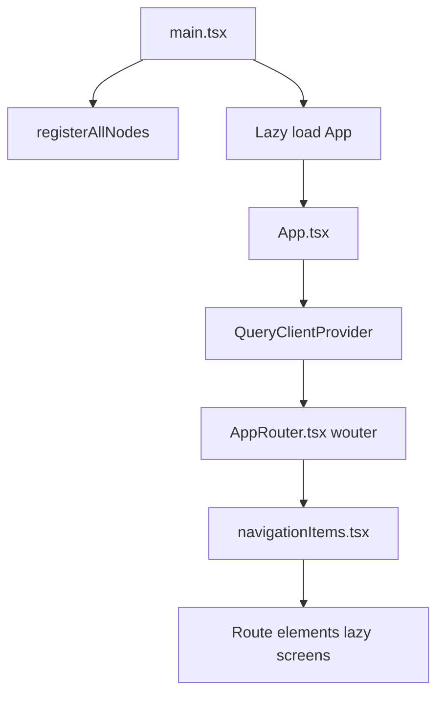

### Backend request flow (typical screen)

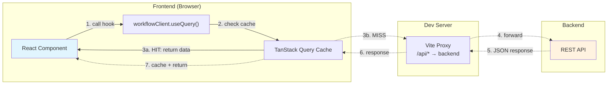

> **Solid lines** = cache hit (fast path) | **Dashed lines** = cache miss (network request)

### Workflow builder: backend workflow → UI graph

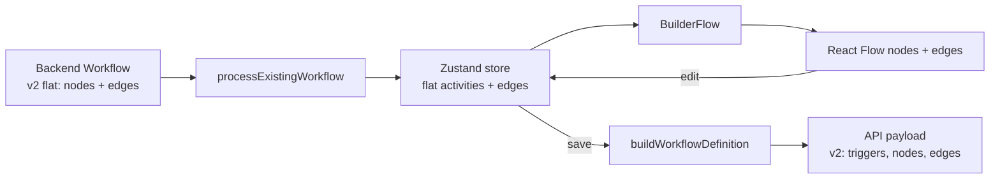

---

## Your First Day

Here's a suggested path to get oriented:

### 1. Run the app locally (5 min)

```bash
# From repo root
npm ci
npm start
```

Open http://localhost:5173 — you'll see the UI with mock data.

Notes:

- `npm start` (repo root) starts the UI and the mock API together.
- To point the UI at a real backend, set `VITE_API_URL` (see “Backend Requests + Data Flow” below).

### 2. Explore these 3 files (15 min)

| File                                                     | Why                                                    |
| -------------------------------------------------------- | ------------------------------------------------------ |
| `packages/syntara-ui/src/app/App.tsx`                    | Entry point — see how routing and providers are set up |
| `packages/syntara-ui/src/client.tsx`                     | How we make API calls — pattern you'll use everywhere  |
| `packages/syntara-ui/src/routes/builder/BuilderFlow.tsx` | The "big" file — workflow canvas rendering             |

### 3. Make a small change (10 min)

Let's add a console.log to understand the data flow:

**Task**: See what data flows through the workflow builder

1. **Open**: `packages/syntara-ui/src/routes/builder/BuilderFlow.tsx`
2. **Find**: The `BuilderFlow` function (around line 80)
3. **Add** this line at the top of the function:

   ```typescript
   console.log('🔍 BuilderFlow rendered with:', { nodeCount: nodes.length, edgeCount: edges.length })
   ```

4. **Go to**: <http://localhost:5173/workflows> in your browser
5. **Click** any workflow to open the builder
6. **Open DevTools** (F12 → Console tab)
7. **Watch** the console log appear when you interact with the canvas
8. **Remove** the console.log when done

**Success criteria**: ✅ You see console messages showing node/edge counts in browser DevTools

**Try also** (optional):

- Change the page title in `Workflows.tsx` (look for `SynPageHeader`)
- Add a `console.log` in `BuilderContent.tsx` inside the `useEffect` that loads the workflow

### 4. Read the workflow builder section below

The workflow builder is the most complex part. Understanding the flat ↔ nested transformation is key.

---

## Repository Layout (monorepo)

```
packages/
├── syntara-ui/           ← The actual web app (React + Vite)
├── syntara-contracts/    ← Generated TypeScript types from OpenAPI
└── syntara-mock-api/     ← Local mock server for development
```

### Package Dependency Graph

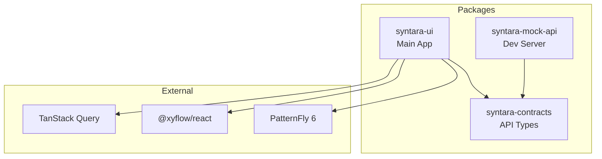

Within `packages/syntara-ui/src/`:

| Directory                                 | Purpose                                                                |
| ----------------------------------------- | ---------------------------------------------------------------------- |
| `app/`                                    | App shell, layout, routing                                             |
| `client.tsx`                              | Typed API clients (OpenAPI → TanStack Query hooks)                     |
| `routes/`                                 | Feature areas: builder, workflows, executions, configuration           |
| `stores/`                                 | Client state (Zustand) — workflow store                                |
| `lib/websocket/`                          | WebSocket infrastructure (store, hooks, types, utils)                  |
| `providers/`                              | Global React context providers — sources of shared app state           |
| `components/`                             | Global UI elements (layout, shared widgets) — no context or state here |
| `constants/`, `hooks/`, `utils/`, `test/` | Shared utilities (date formatting, error parsing, trigger formatting)  |

---

## App Startup (where everything begins)

**Entry**: `packages/syntara-ui/src/main.tsx`

```tsx
// Simplified view of main.tsx
registerAllNodes() // Auto-discovers and registers workflow step types (NodeRegistry)
const App = lazy(() => import('./app/App'))
createRoot(document.getElementById('root')!).render(<App />)
```

### How `registerAllNodes()` auto-discovers step types

`registerAllNodes()` is implemented in `packages/syntara-ui/src/routes/builder/registry/nodes/index.ts`.
It uses Vite's `import.meta.glob` to synchronously import all registration modules at startup:

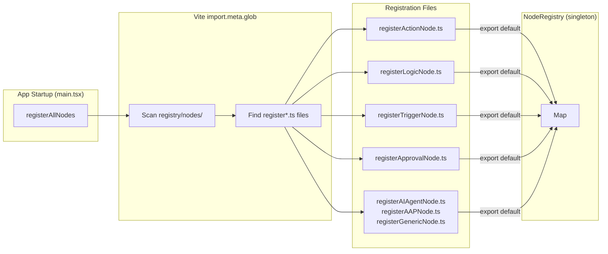

- **Directory**: `packages/syntara-ui/src/routes/builder/registry/nodes/`
- **Filename pattern**: `register*.ts`
- **Export contract**: each `register*.ts` file must `export default function registerXxx() { ... }`
- **When it runs**: `packages/syntara-ui/src/main.tsx` calls `registerAllNodes()` before rendering the app

This is why adding a new canvas step type is usually just "create a new `registerMyNode.ts` file with a default export"
—no central list to edit.

**App root**: `packages/syntara-ui/src/app/App.tsx`

- Imports the singleton `QueryClient` from `src/queryClient.ts` and provides it via `QueryClientProvider`
- Renders the global layout and mounts `AppRouter`

> The `QueryClient` is defined in `src/queryClient.ts` (not inline in `App.tsx`) so that `useAuthStore` can import it directly to call `queryClient.clear()` on logout, session expiry, and auth middleware failures — preventing stale permission cache from leaking across user sessions.

---

## Routing (Wouter)

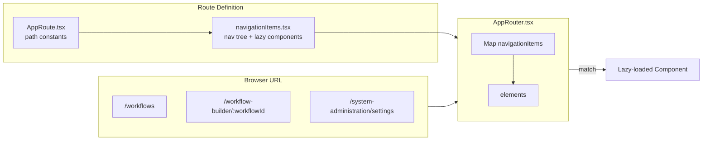

| File                      | Role                                                                       |
| ------------------------- | -------------------------------------------------------------------------- |
| `app/AppRoute.tsx`        | Route path constants (e.g., `/workflows`, `/workflow-builder/:workflowId`) |
| `app/navigationItems.tsx` | Defines nav tree + lazy-loaded route components                            |
| `app/AppRouter.tsx`       | Maps `navigationItems` into `<Route>` elements                             |

**Permission gating on routes:**

Each `TNavigationItem` in `navigationItems.tsx` supports two permission fields:

- `requiredPermissions` (array of `{ action, resourceType }`, OR logic): controls navigation visibility. The item is hidden if the user lacks ALL listed permissions. Consumed by `useFilteredNavigationItems`.
- `routePermission` (single `{ action, resourceType }`): wraps the route component in `ProtectedRoute`, which shows `EmptyStateAccessDenied` when the permission check fails. Used for create/edit routes.

See [`docs/permissions-rbac.md`](permissions-rbac.md) for the full permission gating architecture.

> **Note**: The `/dashboard` route is defined in `AppRoute.tsx` and appears in navigation, but has no component mounted (placeholder for future implementation).

**Common patterns:**

```tsx
// Navigate programmatically
const [, navigate] = useLocation()
navigate('/workflows')

// Read URL params
const { workflowId } = useParams()
```

**Routing strategy details:**

- Path params for entity selection and mode switching
- Query params for filtering and optional selections

**Page breadcrumbs (location hierarchy):**

- [`SynPageHeader`](packages/syntara-ui/src/components/layout/SynPageHeader.tsx) accepts a required string `title` (default `h1`), optional `breadcrumbs` (PatternFly `Breadcrumb` above the title when there are at least two items), optional `toolbar` for actions (laid out right-aligned via an internal spacer—callers should not add their own `FlexItem grow`), optional `projectSelector` and other title-row slots (`titleLeading`, `titleAddons`), and `titleSlot` for rare full-width custom title rows (e.g. the workflow builder).
- Trails are built with helpers in [`breadcrumbBuilders.ts`](packages/syntara-ui/src/app/breadcrumbBuilders.ts); links use `href` values from [`AppRoute.tsx`](packages/syntara-ui/src/app/AppRoute.tsx).
- **Visibility**: nothing is rendered unless there are **at least two** items. The **last** item omits `href` and represents the current page (including tab-specific labels on detail views).
- **Default tab**: On entity detail routes where the URL without a trailing segment is the same as the default tab (e.g. `…/projects/:id` and `…/projects/:id/details` both mean “Details”), the trail ends at the **entity name** so the parent link is not redundant with the current page.
- **Access management hub**: Visiting `/system-administration/access-management` triggers a client-side `replace` navigation to `/system-administration/access-management/users` (the default tab). Breadcrumbs are omitted on that Users hub view because the page title and tab bar already convey the location; other hub tabs still show `Access management > …`.
- **Settings (`/system-administration/settings`)**: The first category tab is the default view. Breadcrumbs are omitted (single-item trail). Selecting another tab shows `Settings > [category]` with **Settings** as a link so you can return to the default tab from the trail.
- **Link style**: [`index.css`](packages/syntara-ui/src/index.css) sets breadcrumb link **color**, **`TextDecorationColor`** (underline), and **hover** variants from `--pf-t--global--text--color--link--*` — PF’s default maps underline color to neutral decoration tokens; **`TextDecorationStyle`** is **solid** where globals use dotted — so links match [PatternFly breadcrumb](https://www.patternfly.org/components/breadcrumb/) styling.
- On **narrow viewports** (`max-width: 768px`), when there are two or more _middle_ segments, those segments collapse behind a dropdown toggle (badge count) per PatternFly’s breadcrumb dropdown pattern.

---

## State Management

| Type                | Technology                    | Purpose                                              |
| ------------------- | ----------------------------- | ---------------------------------------------------- |
| **Server State**    | TanStack Query                | All API data — fetching, caching, background updates |
| **Client State**    | React useState/useContext     | Local UI state (modals, forms, selections)           |
| **Workflow State**  | Zustand (`useWorkflowStore`)  | Builder workflow editing state                       |
| **WebSocket State** | Zustand (`useWebSocketStore`) | Real-time connection state and messages              |

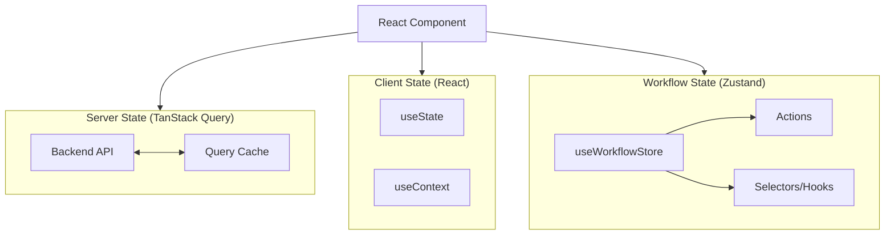

**Key characteristics:**

- Type-safe API interactions via `openapi-react-query`
- Automatic memoization through React Compiler

### WebSocket State

For real-time features, we use a pure Zustand architecture (no Context/Provider needed):

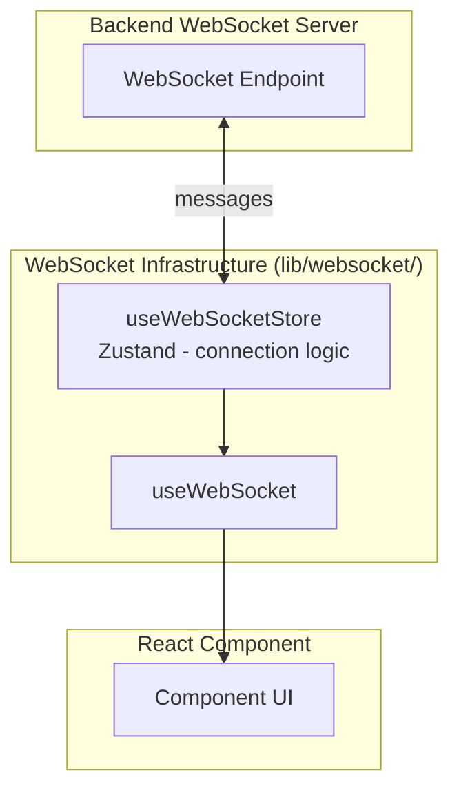

**Quick usage:**

```tsx
import { useWebSocket } from '../../lib/websocket'

function ChatComponent() {
  // Single hook for connect, send, and receive
  const { sendRaw, isConnected } = useWebSocket(
    { id: 'chat', path: '/ws/example/v1/chat' },
    { onMessage: (msg) => console.log('Received:', msg) }
  )

  return (
    <button onClick={() => sendRaw({ message: 'Hello' })} disabled={!isConnected}>
      Send
    </button>
  )
}
```

> 📚 **See [`docs/websocket-architecture.md`](./websocket-architecture.md) for comprehensive WebSocket documentation.**

### Zustand Quick Reference

> 📚 **See [docs/zustand-architecture.md](./zustand-architecture.md) for comprehensive documentation** on the Zustand store architecture, best practices, and usage patterns.

**Quick reference:**

- **Store location**: `packages/syntara-ui/src/stores/useWorkflowStore.ts`
- **Factory functions**: `packages/syntara-ui/src/stores/workflowFactories.ts`
- Use custom hooks (`useWorkflowVersion()`, `useActivities()`, etc.) for reading state
- Use `useWorkflowStoreActions()` for dispatching actions without re-renders
- Use atomic batch operations for coupled state changes

---

## Backend Requests + Data Flow (TanStack Query + OpenAPI clients)

### Making API calls

All backend calls go through typed clients in `src/client.tsx`:

```tsx
// Reading data
const { data, isLoading, error } = workflowClient.useQuery('get', '/workflows/{workflow_id}', {
  params: { path: { workflow_id: id } },
})

// Writing data
const mutation = workflowClient.useMutation('post', '/workflows')
mutation.mutate({ body: workflowPayload })
```

### Available clients

| Client              | Base URL                | Used for                                     |
| ------------------- | ----------------------- | -------------------------------------------- |
| `workflowClient`    | `/api/v1/`              | Workflow definitions and CRUD                |
| `executionsClient`  | `/api/v1/`              | Execution list, detail, and run              |
| `toolManagerClient` | `/api/v1/tool_manager/` | Tool manager (tools & providers unified API) |
| `approvalsClient`   | `/api/v1/`              | Approval requests and responses              |

**Note:** File uploads use a direct fetch call via the `useFileUploadWithProgress` hook (not a generated client) since `openapi-react-query` doesn't support upload progress tracking.

### Where does the backend URL come from?

- UI uses relative paths (`/api/v1/...`)
- Vite proxies `/api/*` to `VITE_API_URL` (or `localhost:3000` by default)
- See `packages/syntara-ui/vite.config.ts`

### Local ports (defaults)

- **UI (Vite dev server)**: `http://localhost:5173`
- **Mock API**: `http://localhost:3000`

---

## Workflow Builder: backend workflow → UI graph (React Flow)

> This is the most complex part of the codebase. Take your time here.

### The key insight: v2 flat format

With the v2 API, both the backend and builder use the **same flat format**: `{ triggers: [], nodes: [], edges: [] }`. No nested↔flat transformation is needed.

| Concept      | Description                                                      |
| ------------ | ---------------------------------------------------------------- |
| **Nodes**    | Flat array of all workflow activities (tasks, conditions, loops) |
| **Edges**    | Explicit connections between nodes (with ports for branching)    |
| **Triggers** | Workflow entry points (manual, scheduled, event-driven)          |

The builder edits nodes + edges directly in the Zustand store. On save, `buildWorkflowDefinition()` produces the v2 API payload.

### Builder entry points

| Route                           | File              | Purpose                |
| ------------------------------- | ----------------- | ---------------------- |
| `/workflow-builder/new`         | `BuilderNew.tsx`  | Create new workflow    |
| `/workflow-builder/:workflowId` | `BuilderEdit.tsx` | Edit existing workflow |

### Load path: API → store → canvas

```
1. Fetch workflow from API (v2 flat format: triggers, nodes, edges)
       ↓
2. processExistingWorkflow() maps API edges to React Flow edges
       ↓
3. loadWorkflowWithEdges() atomically updates Zustand store
       ↓
4. BuilderFlow converts store → React Flow nodes + edges
       ↓
5. React Flow renders the canvas
```

### Save path: canvas → store → API

```
1. User clicks Save
       ↓
2. Read flat activities + edges from Zustand
       ↓
3. Validate the graph
       ↓
4. buildWorkflowDefinition() builds v2 payload (triggers, nodes, edges)
       ↓
5. Submit to API via mutation
```

### Key files

| File                                              | Responsibility                                                                                                           |
| ------------------------------------------------- | ------------------------------------------------------------------------------------------------------------------------ |
| `BuilderContent.tsx`                              | Orchestrates load/save, wraps canvas                                                                                     |
| `BuilderFlow.tsx`                                 | Converts store → React Flow nodes/edges, handles layout                                                                  |
| `workflows/canvas/CanvasControls.tsx`             | Bottom canvas toolbar (zoom, fit, layout, expand/collapse) and toggle for the legend                                     |
| `workflows/canvas/CanvasLegend.tsx`               | Floating legend: step categories and approval branch colors                                                              |
| `workflows/canvas/semanticZoom.ts`                | Semantic zoom threshold (`SEMANTIC_ZOOM_MAX_SCALE`) and `semanticZoomActivityTitle()` for consistent empty-name tooltips |
| `workflows/canvas/semanticZoomTypes.ts`           | Shared `SemanticZoomBranchSource` type for branch handles at semantic zoom                                               |
| `workflows/canvas/nodes/hooks/useSemanticZoom.ts` | LOD flag via typed `useStore` selector + `updateNodeInternals` when crossing the zoom threshold                          |
| `workflows/canvas/nodes/common/NodeComponent.tsx` | Shared canvas step shell; semantic zoom swaps to color blocks + tooltips (title + type)                                  |
| `utils/processExistingWorkflow.ts`                | Load API workflow → flat store format (maps v2 edges to React Flow edges)                                                |
| `utils/workflowDefinitionBuilder.ts`              | Build v2 save payload (nodes, edges, triggers) with security validation                                                  |
| `utils/buildNestedStructure.ts`                   | Legacy wrapper (identity function in v2 — returns activities as-is)                                                      |
| `utils/validation/`                               | Validation rules                                                                                                         |

Floating canvas surfaces (controls, step legend, steps on the canvas, undo/redo) use [`SynPanel`](../packages/syntara-ui/src/components/layout/SynPanel.tsx) so they stay readable under the glass theme: compact overlays use `variant="raised"`; large flat panels (for example the step editor shell) use `opaqueFloatingFill` instead of raised chrome.

### Builder internals (advanced): registry, edges, and graph semantics

This section is the “how it really works” view of the builder. It’s here so newcomers can debug issues without spelunking `BuilderFlow.tsx` immediately.

#### Step registry — `NodeRegistry` (the "Add step" panel)

- **Goal**: decouple the "available step types + forms" list from the UI so new steps can be added without editing a central switch statement.
- **Core types**: `routes/builder/registry/NodeRegistry.ts` + helpers in `routes/builder/registry/helpers/`.
- **Registration flow**:
  - Registration modules live in `routes/builder/registry/nodes/`.
  - Any file matching **`register*.ts`** is loaded at startup (see "How `registerAllNodes()` auto-discovers step types" above).
  - Each registration module must export a **default** function that calls `NodeRegistry.register(...)`.
- **Templates**:
  - `createCustomNode(...)`: use this helper when you want shared registration ergonomics plus custom submit logic.
  - Or call `NodeRegistry.register(...)` directly for simple registrations without helper wrappers.
- **Categories**:
  - Categories are type-safe and provide UI metadata (ordering/grouping/search). See `routes/builder/registry/categories.ts`.

**Step registration system (code examples):**

```typescript
// Each canvas step type has its own registration file (e.g., registerTriggerNode.ts)
// Files matching register*.ts are automatically discovered and registered
// MUST export the registration function as default

// Simple registrations can call NodeRegistry.register() directly:
import { NodeRegistry } from '../NodeRegistry'

export default function registerApprovalNode() {
  NodeRegistry.register({
    id: 'approval',
    label: 'Approval',
    icon: RhUiUserCheckIcon,
    category: 'logic', // Type-safe - must be a valid NodeCategory
    description: 'Require human approval before continuing workflow',
    keywords: ['approve', 'approval', 'review', 'manual'],
    order: 50,
    formComponent: ApprovalNodeForm,
    onSubmit: (_data, onSuccess) => {
      onSuccess()
    },
  })
}

// Complex registrations (workflow store integration):
import { createCustomNode } from '../helpers/nodeTemplates'

export default function registerTriggerNode() {
  NodeRegistry.register(
    createCustomNode<TriggerFormData>(
      {
        id: 'trigger',
        label: 'Triggers',
        icon: PlayIcon,
        category: 'trigger', // Type-safe category
        description: 'Start workflow execution',
        keywords: ['start', 'begin', 'manual', 'schedule'],
        order: 10,
        formComponent: TriggerNodeForm,
      },
      (data, onSuccess, onError) => {
        // Custom submission logic
        const trigger = createManualTrigger(data.requiresApproval)
        useWorkflowStore.getState().addTrigger(trigger)
        onSuccess()
      }
    )
  )
}

// AUTO-REGISTRATION: registerAllNodes() automatically discovers and calls
// all registration functions - no manual imports needed!
```

**Adding new step types:**

1. Create a file matching `register*.ts` in `registry/nodes/`
2. Export your registration function as **default**
3. That's it! Auto-discovery handles the rest

**Available registration patterns:**

- `NodeRegistry.register({ ... })` - Good for direct/simple registrations
- `createCustomNode(config, onSubmit)` - Good for step types with shared helper behavior and custom submission logic

**Step categories (type-safe):**

Categories are defined in `registry/categories.ts` with full metadata:

| Category      | Description                            | Order |
| ------------- | -------------------------------------- | ----- |
| `trigger`     | Start workflow execution               | 1     |
| `action`      | Execute tasks or API calls             | 2     |
| `logic`       | Conditional branching and control flow | 3     |
| `integration` | External service integrations          | 4     |
| `approval`    | Human approval gates                   | 5     |
| `other`       | Miscellaneous step types               | 99    |

Access category metadata: `getCategoryMetadata('trigger')` or `CATEGORY_METADATA.trigger`

**Registry API:**

```typescript
NodeRegistry.register(definition) // Register a step type for the Add panel
NodeRegistry.get(id) // Get definition by registry id
NodeRegistry.getAll() // Get all enabled step types
NodeRegistry.search(query) // Search step types by label/keywords
NodeRegistry.getByCategory(cat) // Get step types by category
```

#### "Flat nodes + edges" is the canonical model (v2)

With the v2 API, both the backend and builder share the same flat representation:

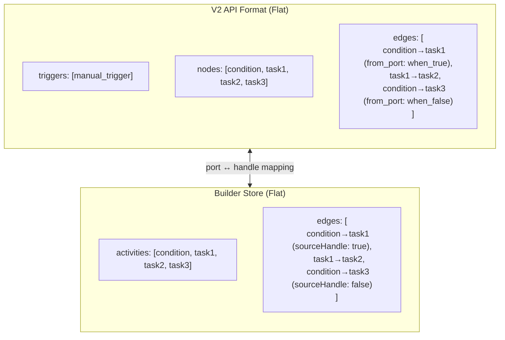

The only transformation between API and builder is **port name mapping** (e.g., `from_port: 'when_true'` ↔ `sourceHandle: 'true'`).

#### Load + save pipeline (v2)

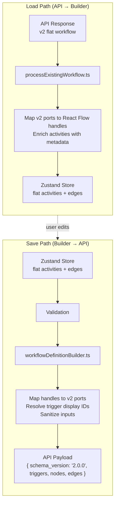

- **Load** (`processExistingWorkflow.ts`): Reads `workflowDef.nodes` and `workflowDef.edges` directly. Maps v2 port names (`when_true`, `iterate`) to React Flow handles (`true`, `loop`). Enriches activities with UI metadata.
- **Save** (`workflowDefinitionBuilder.ts`): Validates all IDs (security), maps React Flow handles back to v2 ports, resolves trigger display IDs (`trigger-0`) to definition IDs, sanitizes names, and produces the v2 payload.
- **Legacy wrapper** (`buildNestedStructure.ts`): The `buildNestedConditionStructure()` function is now an identity operation — it returns activities unchanged since v2 is already flat.

#### Edge synchronization (keeping store + React Flow consistent)

The builder maintains two representations of connections:

- **React Flow edges** (what you see + manipulate on the canvas)
- **Store edges** (what the builder saves/validates and uses for derived behavior)

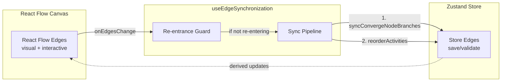

The synchronization logic lives in `routes/builder/hooks/useEdgeSynchronization.ts` and is designed to:

- avoid feedback loops (store updates triggering edge updates triggering store updates)
- keep derived structures up to date (like converge branches and activity ordering)

**Synchronization pipeline on edge changes:**

1. `syncConvergeNodeBranches()` - Updates the `branches` array on converge nodes with incoming activity IDs
2. `reorderActivitiesFromEdges()` - Topologically sorts activities based on edges

The hook uses a re-entrance guard to prevent infinite loops from workflow → edge updates.

**Note:** Unlike parallel containers (which are only created during API transformations), `syncConvergeNodeBranches()` only updates the `converge.branches` array during editing — it does not create `parallel_for_*` containers. Parallel containers exist only in the API format (nested structure), not during editing.

#### Button edges (interactive "+" edges)

Builder edges aren't purely visual. `ButtonEdge` is the "add a step here" affordance:

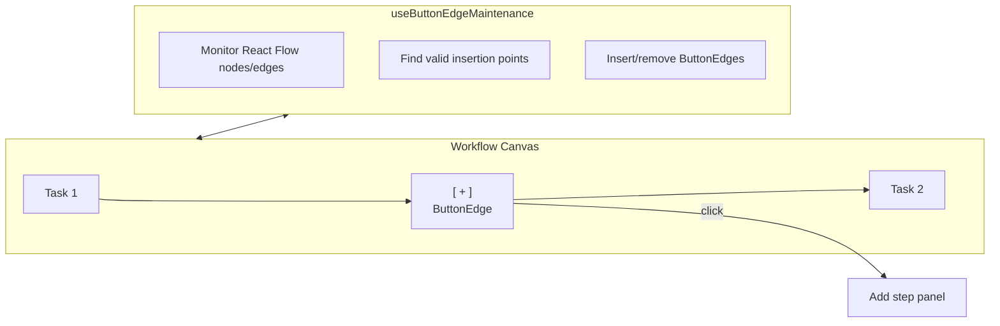

- **Edge type**: `routes/builder/edges/ButtonEdge.tsx`
- **Maintenance**: `routes/builder/hooks/useButtonEdgeMaintenance.ts`
- **Behavior**: as steps and edges change, the builder inserts/removes these button edges at valid insertion points so users always have a place to add the next step.

#### Converge steps (fan-in)

Converge steps (also called "join" steps) are "merge points" with special semantics:

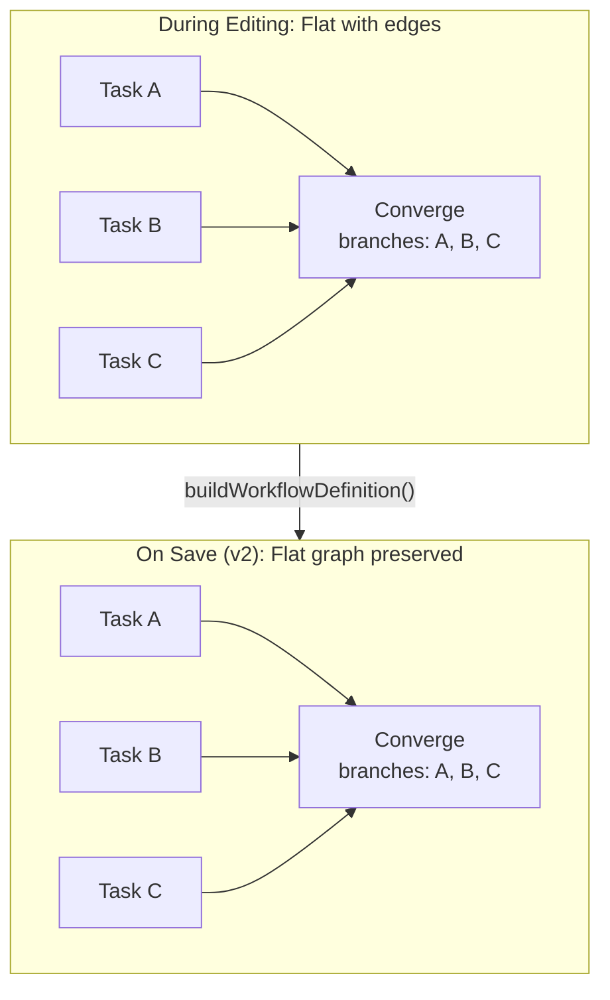

**During Editing:**

- Converge steps store incoming branch activity IDs in `converge.branches: string[]`
- `syncConvergeNodeBranches()` updates this array when edges change
- **No parallel containers are created** — only the `branches` array is updated
- Activities remain in the flat `activities` array

**On Save (v2):**

- `buildWorkflowDefinition()` sends flat nodes and edges directly
- Converge steps keep their `branches` array as-is — **no auto-generated parallel wrapper**
- Task A/B/C edges feed the Converge node in the saved payload the same way they do on the canvas

**On Load (v2):**

- `processExistingWorkflow()` reads flat nodes + edges from the API
- Converge steps are loaded directly with their `branches` array intact

#### Condition steps (branching) and source handles

Condition steps stay flat while editing; their branch structure is expressed by edges:

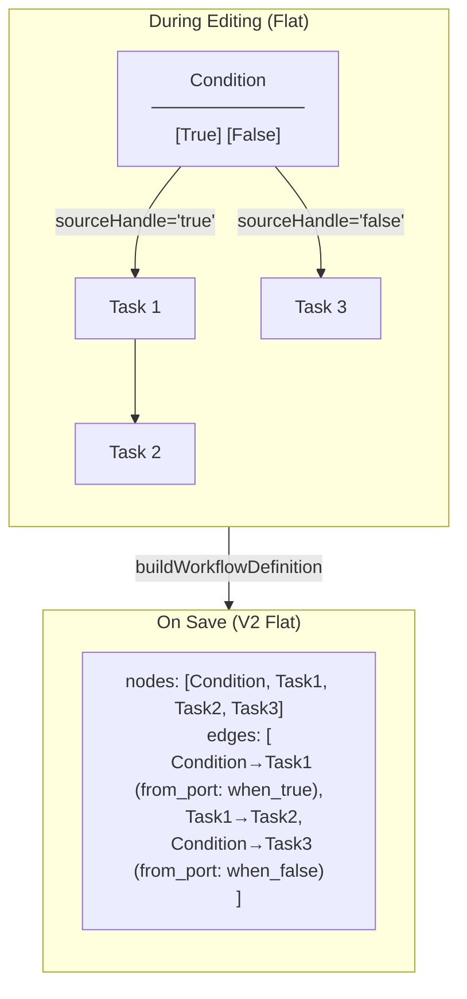

- Condition steps stay flat in both editing and save — v2 API uses the same flat format.
- Edges with `sourceHandle='true'` connect to true branch, `sourceHandle='false'` to false branch.
- Two handles on the step: "True" and "False" for branching connections.
- On save, `buildWorkflowDefinition()` maps `sourceHandle: 'true'` → `from_port: 'when_true'`.

#### Where to look when debugging "graph weirdness"

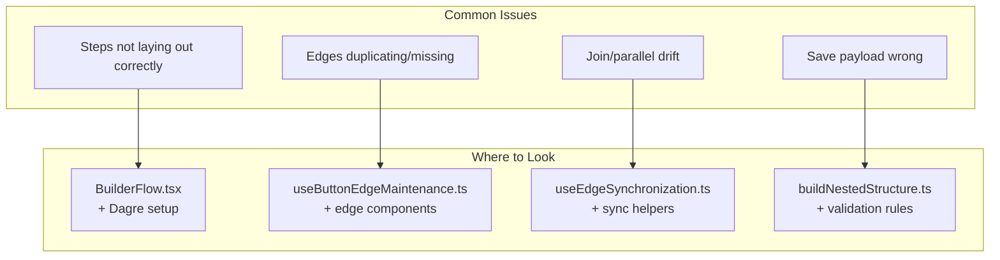

- **Steps not laying out correctly**: `BuilderFlow.tsx` layout + Dagre setup
- **Edges duplicating / missing button edges**: `useButtonEdgeMaintenance.ts` + edge type components
- **Join/parallel drift**: `useEdgeSynchronization.ts` (and any join/branch sync helpers it calls)
- **Save payload looks wrong**: `utils/buildNestedStructure.ts` and the validation rules

---

## React Flow Integration (nodes, edges, and layout)

### Canvas step types (React Flow `nodeTypes`)

Defined in `routes/workflows/canvas/nodes/NodeType.tsx`:

```tsx
const nodeTypes = {
  task: TaskNode,
  condition: ConditionNode,
  loop: LoopNode,
  converge: ConvergeNode,
  // ... etc
}
```

Builder adds extra types like `placeholder` for drop targets.

**Visual coding (builder canvas):**

- **Type-colored top bar + icon**: `routes/workflows/canvas/nodeTypeColors.ts` (`getNodeTypeColor`, `NODE_TYPE_COLORS`) maps node / executor types to PatternFly non-status tokens. `NodeComponent` accepts optional `topBarColor` for a 4px top border; when a node is **selected**, the full brand border replaces the top bar (same as nodes without a type bar). Icons use the same token via `renderNodeIcon(..., color)`.
- **Semantic zoom (Topology-style LOD)**: When the React Flow viewport `zoom` is at or below `SEMANTIC_ZOOM_MAX_SCALE` (defined in `semanticZoom.ts`), `NodeComponent` renders a compact horizontal block filled with the same accent as `topBarColor`, with a PatternFly `Tooltip` showing **title** (heading weight) and **type** (`semanticZoomSummary` from each node). For performance, LOD logic lives in **`useSemanticZoom`** (`nodes/hooks/useSemanticZoom.ts`): a **`useStore`** selector typed with **`ReactFlowState`** reads `transform[2]` (zoom) and returns a boolean so nodes re-render only when crossing the threshold—not on every pan/zoom frame like **`useViewport`** would (see [React Flow `useStore`](https://reactflow.dev/api-reference/hooks/use-store)). The primary title uses **`semanticZoomActivityTitle`** (trimmed name, else a stable fallback): structural nodes use **`Untitled ${metadata.label}`**; task-shaped nodes use **`Untitled task`** with the executor label on the second line. Tooltip copy uses **`--pf-t--global--text--color--inverse`** for both lines so it stays readable on PatternFly’s inverse tooltip surface (see `NodeSemanticZoomBody.tsx`). Branching nodes pass **`semanticZoomBranchSources`** so multiple source handles stay on the **same bar height** with **no branch labels** (handles on the right edge; `SemanticZoomBranchSourceHandles.tsx`). `useUpdateNodeInternals` runs when toggling so edge anchors stay correct. New semantic-zoom UI should include **`vitest-axe`** coverage per the **Accessibility Testing** section in `AGENTS.md`.
- **Add step panel**: `getAddNodePanelColor` uses registry ids; builder registry ids are centralized in `src/constants/registryNodeIds.ts` (`RegistryNodeId`, `RegistryNodeIdUnion`).
- **Approval branches**: `BranchHandle` and `EdgePath` / `DefaultEdge` / `ButtonEdge` color approved vs rejected handles and edges using success/danger tokens.

### Edge types

| Registry              | Location                                     |
| --------------------- | -------------------------------------------- |
| Canvas (read-only)    | `routes/workflows/canvas/edges/EdgeType.tsx` |
| Builder (interactive) | `routes/builder/edges/*.tsx`                 |

Builder edges include: `ButtonEdge`, `DefaultEdge`, `LoopBackEdge`, `LoopDoneEdge`, `LoopOutgoingEdge`.

### Layout (Dagre)

`BuilderFlow` uses Dagre to auto-position nodes. See `getLayoutedElements()` in `BuilderFlow.tsx`.

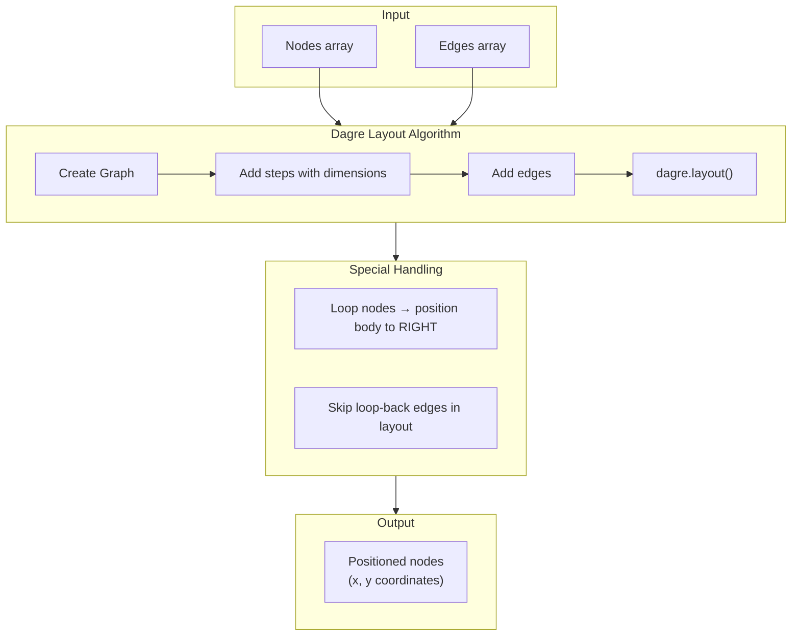

Special handling for loops: loop body nodes are positioned to the right (not below) to avoid circular layout issues.

**ReactFlow initialization details:**

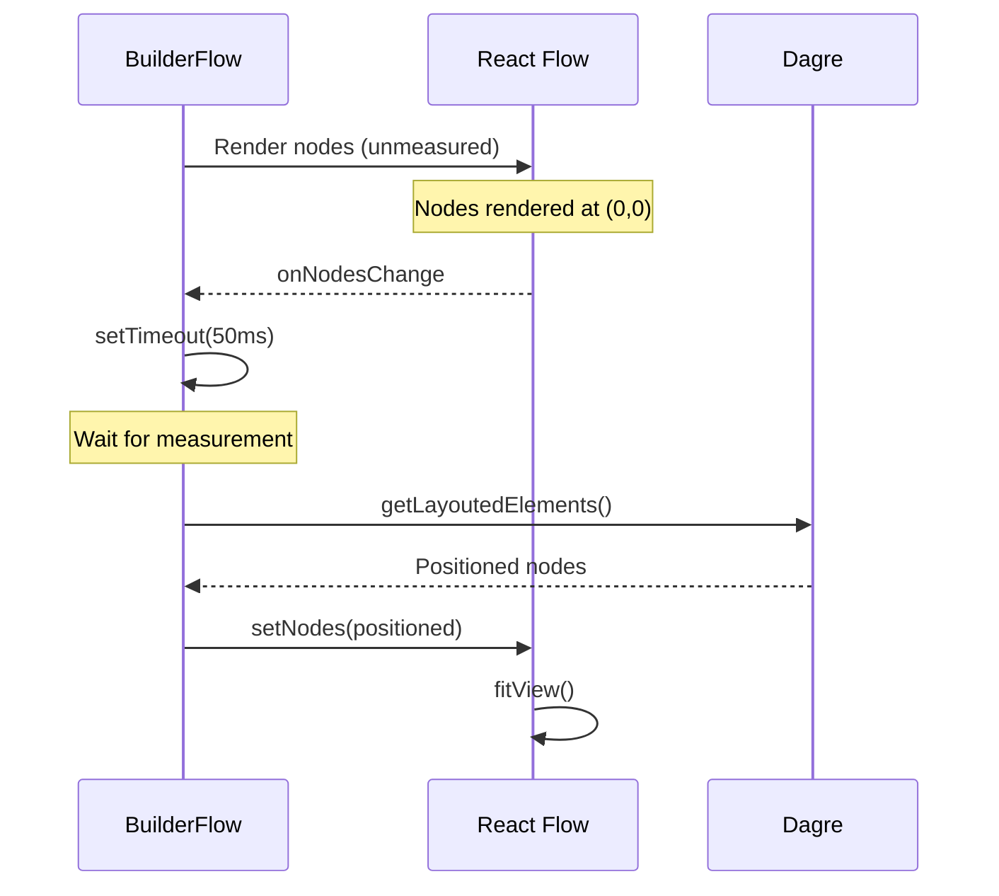

- Layout initialization uses dagre for automatic positioning.
- Separate initialization state from layout execution.
- Use `setTimeout(50ms)` to ensure nodes are measured before layout.
- `ReactFlowProvider` wraps the entire builder UI.

### Builder Component Pattern

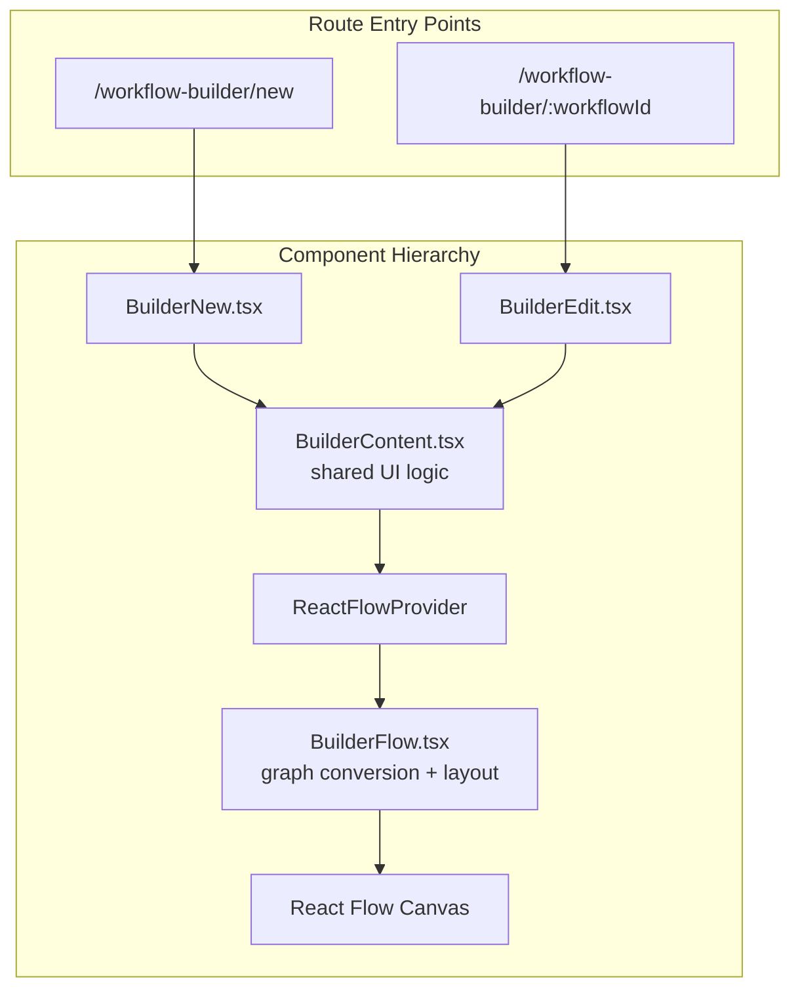

- Separate components for new (`BuilderNew.tsx`) and edit (`BuilderEdit.tsx`) workflows.
- `BuilderContent` component encapsulates all shared UI logic.
- `BuilderFlow.tsx` handles workflow → graph conversion and legacy detection.
- Routes: `/workflow-builder/new` (new) and `/workflow-builder/:workflowId` (edit).

---

## Where to Look for Common Changes

### Add a new screen/route

1. Add path constant in `app/AppRoute.tsx`
2. Add lazy route entry in `app/navigationItems.tsx`
3. `AppRouter.tsx` picks it up automatically

### Add a new API call

```tsx
// In your component
const { data } = workflowClient.useQuery('get', '/your-endpoint', { ... })

// After mutation, invalidate related queries
queryClient.invalidateQueries({ queryKey: ['get', '/workflows'] })
```

### Add a new workflow step type

1. Create `register*.ts` in `routes/builder/registry/nodes/`
2. `NodeRegistry` auto-discovers it at startup
3. Add/extend the React Flow node component in `routes/workflows/canvas/nodes/` (maps activities to canvas steps)

### Add filters to a list page

1. Define `FilterFieldDefinition[]` in a colocated `*Filters.ts` / `*FilterDefinitions.ts`
2. Use `useCursorPagination` for filters + cursor + `queryParams`
3. Render `FilterBar` (or `NxListPanelToolbar`) with those definitions
4. Pass `queryParams` into the typed client's `useQuery`
5. Use `SynEmptyStateFilter` when filters are active and the list is empty

See [API Filtering Architecture](#api-filtering-architecture) and [`docs/user-guides/filtering.md`](./user-guides/filtering.md).

---

## API Filtering Architecture

List pages filter **on the server** via OpenAPI query parameters. Filter state is synced to the URL so filtered views are shareable. Cursor pagination stays in component state (not the URL).

For end-user guidance (how to search, filter types, shareable URLs), see [`docs/user-guides/filtering.md`](./user-guides/filtering.md). For unit-test helpers, see [`docs/TEST_HELPERS_FILTER_TESTING.md`](./TEST_HELPERS_FILTER_TESTING.md).

### Filter flow

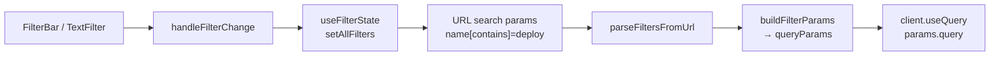

1. User applies a filter in `FilterBar` (attribute search or standalone control).
2. The page's `handleFilterChange` (from `useCursorPagination`) resets the cursor and writes filters to the URL.
3. `useFilterState` re-parses the URL into `FilterConfig[]`.
4. `buildFilterParams` converts configs into API query keys (`name[contains]=…`, `status=failed`, …).
5. The typed OpenAPI client fetches with those params.

### FilterBar component

**Location:** `packages/syntara-ui/src/components/filters/FilterBar.tsx`  
**Barrel:** `packages/syntara-ui/src/components/filters/index.ts`  
**List layout wrapper:** `NxListPanelToolbar` in `packages/syntara-ui/src/components/panels/list/NxListPanel.tsx`

```typescript
export type FilterBarProps = {
  fieldDefinitions: FilterFieldDefinition[]
  filters: FilterConfig[]
  onFilterChange: (filters: FilterConfig[]) => void
  showClearAll?: boolean
  clearAllFilters?: () => void
  isCompact?: boolean
  className?: string
  toolbarItemsAfterFilters?: ReactNode // refresh, etc. — not keyword search
  toolbarEnd?: ReactNode // primary actions
}
```

**How it renders:**

| Field types                        | UI control                                                      | Apply behavior                                                                                           |
| ---------------------------------- | --------------------------------------------------------------- | -------------------------------------------------------------------------------------------------------- |
| `text`, `select`, `daterange`      | Attribute search (`TextFilter`): field dropdown + value control | TEXT: **Enter** or **Apply filter** button; SELECT: on option select; DATERANGE: start/end → `gte`/`lte` |
| `boolean`, `multiselect`, `labels` | Standalone controls via `FilterTypeRenderer`                    | Immediate apply                                                                                          |

Active filters appear as removable chips (`ActiveFilterChips`). Clear-all calls `clearAllFilters` when provided, otherwise `onFilterChange([])`.

Related components live under `packages/syntara-ui/src/components/filters/`:

| File                     | Role                               |
| ------------------------ | ---------------------------------- |
| `TextFilter.tsx`         | Attribute selector + value control |
| `FilterTypeRenderer.tsx` | BOOLEAN / MULTISELECT / LABELS     |
| `BooleanFilter.tsx`      | Toggle                             |
| `DateRangeFilter.tsx`    | Start/end pickers                  |
| `MultiSelectFilter.tsx`  | Multi-value → `in`                 |
| `LabelFilter.tsx`        | Key/value labels                   |
| `ActiveFilterChips.tsx`  | Chip row                           |
| `filterBarUtils.ts`      | Add/remove/replace helpers         |

### Types and utilities

**Types** — `packages/syntara-ui/src/types/filters.ts`:

| Symbol                  | Purpose                                                                   |
| ----------------------- | ------------------------------------------------------------------------- |
| `FilterOperatorEnum`    | `eq`, `contains`, `starts_with`, `gt`/`gte`/`lt`/`lte`, `in`              |
| `FilterTypeEnum`        | `text`, `select`, `multiselect`, `date`, `daterange`, `boolean`, `labels` |
| `FilterConfig`          | `{ key, operator?, value }` — runtime filter                              |
| `FilterFieldDefinition` | UI field definition (label, type, options, `asyncOptions`, …)             |

**URL / API mapping** (`eq` omits brackets; others use `key[operator]=value`):

| Operator      | Example URL / API param                     |
| ------------- | ------------------------------------------- |
| `eq`          | `status=failed`                             |
| `contains`    | `name[contains]=deploy`                     |
| `starts_with` | `name[starts_with]=prod`                    |
| `gte` / `lte` | `created_at[gte]=2024-01-01T00:00:00.000Z`  |
| `in`          | `status[in]=running,failed`                 |
| labels        | `labels[env]=prod` (via `buildLabelParams`) |

**Utilities** — `packages/syntara-ui/src/utils/filterUtils.ts`:

- `buildFilterParams(filters)` → API/URL param object
- `parseFiltersFromUrl(searchParams)` → `FilterConfig[]`
- Reserved non-filter keys: `sort`, `page`, `perPage`, `cursor`

**State hooks:**

| Hook                        | Role                                                                                                                |
| --------------------------- | ------------------------------------------------------------------------------------------------------------------- |
| `useFilterState`            | URL ↔ `FilterConfig[]` (`setFilter`, `setAllFilters`, `clearAllFilters`)                                            |
| `useSortState`              | URL ↔ `SortConfig` via `sort` (`setSort`, `clearSort`, `toggleSort`)                                                |
| `useSortableTable`          | Standalone PatternFly sort helpers + `sortParam` (uses `useSortState`); prefer `useCursorPagination` on list pages  |
| `useColumnSortState`        | PatternFly table column sort ↔ URL `sort` (`getSortParams`, `sortParam`) — prefer `useCursorPagination` + `columns` |
| `createFilterChangeHandler` | Reset cursor + write filters (optional `transformFilters`)                                                          |
| `useCursorPagination`       | **Preferred for list pages** — filters + sort + cursor + `queryParams` + footer props (`defaultSort` / `columns`)   |
| `useFilteredQuery`          | Lower-level: builds filter params and calls `client.useQuery` (see below)                                           |

**Sorting utilities** — `packages/syntara-ui/src/utils/sortUtils.ts`:

- `buildSortParam(sort)` → API/URL value (`field` / `-field`) or `null`
- `parseSortParam(value)` → `SortConfig` or `null`
- `toggleSortDirection(direction)` → opposite `'asc'` / `'desc'`

### List page pattern (preferred)

Use `useCursorPagination` — do not hand-roll cursor + `useFilterState` + `useSortState` + `buildFilterParams`. Pass `defaultSort` / `columns` for API sort + PatternFly headers. Colocate field definitions in `*Filters.ts` / `*FilterDefinitions.ts`.

```typescript
// routes/workflows/workflowFilterDefinitions.ts
export const workflowFilterDefinitions: FilterFieldDefinition[] = [
  {
    key: 'name',
    label: 'Name',
    type: FilterTypeEnum.TEXT,
    operators: [FilterOperatorEnum.CONTAINS],
    defaultOperator: FilterOperatorEnum.CONTAINS,
    placeholder: 'Filter by name',
  },
  {
    key: 'is_enabled',
    label: 'State',
    type: FilterTypeEnum.SELECT,
    options: [
      { value: 'true', label: 'Enabled' },
      { value: 'false', label: 'Disabled' },
    ],
  },
]

// In the page (e.g. Workflows.tsx)
const transformIsEnabledFilter = (filters: FilterConfig[]) =>
  filters.map((filter) =>
    filter.key === 'is_enabled' && typeof filter.value === 'string'
      ? { ...filter, value: filter.value === 'true' }
      : filter
  )

const columns: SortableColumn[] = [
  { field: 'name', label: 'Name', isSortable: true },
  { field: 'created_at', label: 'Created', isSortable: true },
]

const {
  cursor,
  setCursor,
  filters,
  hasActiveFilters,
  queryParams,
  handleFilterChange,
  handleClearAllFilters,
  getFooterProps,
  getSortParams,
} = useCursorPagination({
  transformFilters: transformIsEnabledFilter,
  extraParams: projectExtraParams,
  defaultSort: { field: 'name', direction: 'asc' },
  columns,
})

const query = workflowClient.useQuery('get', '/workflows', {
  params: { query: queryParams }, // includes sort when set
})

// <Th sort={getSortParams('name')}>Name</Th>
```

Wire `filters` / `handleFilterChange` / `handleClearAllFilters` into `FilterBar` or `NxListPanelToolbar`. Use `SynEmptyStateFilter` when filters are active but the list is empty.

### Keyword search default behavior

There is **no separate free-standing keyword `SearchInput`** on `FilterBar`. “Keyword” in the product is a **TEXT** attribute filter (often labeled `"Keyword"` or `"Name"`) with `contains`:

```typescript
{
  key: 'name',
  label: 'Keyword',
  type: FilterTypeEnum.TEXT,
  operators: [FilterOperatorEnum.CONTAINS],
  defaultOperator: FilterOperatorEnum.CONTAINS,
  placeholder: 'Filter by keyword',
}
```

- TEXT values apply on **Enter** or the **Apply filter** control (or when cleared), not on every keystroke.
- Default operator for TEXT is `defaultOperator ?? 'contains'`.
- SELECT / MULTISELECT default to `eq` / `in` respectively unless overridden.

### `useFilteredQuery` (lower-level)

**Location:** `packages/syntara-ui/src/hooks/useFilteredQuery.ts`

Builds `buildFilterParams(filters)` plus sort/limit/cursor/`include_total`, then calls `client.useQuery` and wraps loading/error via `useQueryState`. Useful when you need a filtered query **without** the full list-page pagination orchestration.

```typescript
const { filters } = useFilterState()

const { data, queryState, refetch } = useFilteredQuery({
  client: workflowClient,
  method: 'get',
  path: '/workflows',
  filters,
  limit: 20,
  includeTotalCount: true,
  errorOptions: {
    title: 'Error loading workflows',
    onRetry: () => detachPromise(refetch()),
  },
})

if (queryState) return queryState
```

For new **list pages**, prefer `useCursorPagination` + `client.useQuery` (coding standards §14). Production list pages use that pattern today.

### Usage examples in the codebase

| Page                                      | Definitions                                             | Notes                                                    |
| ----------------------------------------- | ------------------------------------------------------- | -------------------------------------------------------- |
| Workflows                                 | `routes/workflows/workflowFilterDefinitions.ts`         | TEXT name + SELECT state with boolean `transformFilters` |
| Credentials                               | `routes/configuration/credentials/credentialFilters.ts` | Keyword TEXT → `name[contains]`                          |
| Executions                                | `routes/executions/executionFilters.ts`                 | Async SELECT for `workflow_id`; status SELECT            |
| Approvals / Integrations / Users / Groups | `*Filters.ts` under each route                          | Same FilterBar + `useCursorPagination` pattern           |
| Execution activity (builder)              | `routes/builder/activityFilterDefinitions.ts`           | **Client-side** filters (React state; not URL-synced)    |

### Shareable filtered URLs

Filters are the URL search string. Opening the same path + query restores filters (page 1 — cursor is not in the URL).

Examples:

- `/workflows?name[contains]=deploy&is_enabled=true`
- `/executions?workflow_id=<uuid>&status=failed`
- `/credentials?name[contains]=vault`

### Gotchas

1. Boolean SELECT options are **strings** (`'true'` / `'false'`) until `transformFilters` converts them for the API.
2. Prefer `daterange` in the UI; the `date` enum value has no dedicated control in current FilterBar usage.
3. Confirm the backend supports the operator you choose (`in`, AND date ranges, etc.) — some endpoints do not.
4. Put scoped params like `project_id` in `useCursorPagination({ extraParams })`, not as fake filters.
5. Filter chips / system badges use `NxLabel` (not raw PatternFly `Label`).

---

## Browser Tab Titles

React 19 natively hoists `<title>` elements rendered anywhere in the component tree to `<head>`. No third-party library (e.g. `react-helmet`) is needed.

### Pattern

Every top-level page component renders `<title>` as the first child of `<SynPage>`:

```tsx
import { toPageTitle } from '../../utils/toPageTitle'

export default function Workflows() {
  return (
    <SynPage>
      <title>{toPageTitle(['Workflows'])}</title>
      <SynPageHeader title="Workflows" ... />
    </SynPage>
  )
}
```

### `toPageTitle` utility (`src/utils/toPageTitle.ts`)

- Accepts an array of `string | null | undefined` segments (narrow → broad order)
- Filters out falsy/blank values; trims remaining segments
- Joins with `|` and appends the app title (from `VITE_APP_TITLE`, falls back to `'Syntara'`)
- Returns bare app title when all segments are empty

Examples:

- `toPageTitle(['Workflows'])` → `'Workflows | Syntara'`
- `toPageTitle(['admin', 'Users'])` → `'admin | Users | Syntara'`
- `toPageTitle([undefined])` → `'Syntara'`

### Dynamic pages

Detail pages use the entity name from API data as the first segment, falling back to a static label during loading:

```tsx
// Loading/error state:
<title>{toPageTitle(['Integration'])}</title>

// Loaded state:
<title>{toPageTitle([integration.name])}</title>
```

---

## Related Docs

| Doc                                                                       | Content                                                      |
| ------------------------------------------------------------------------- | ------------------------------------------------------------ |
| [`docs/zustand-architecture.md`](./zustand-architecture.md)               | Deep dive into workflow store, actions, and state management |
| [`docs/websocket-architecture.md`](./websocket-architecture.md)           | WebSocket infrastructure, hooks, and real-time patterns      |
| [`docs/user-guides/filtering.md`](./user-guides/filtering.md)             | How to use search and filters in the UI; shareable URLs      |
| [`docs/TEST_HELPERS_FILTER_TESTING.md`](./TEST_HELPERS_FILTER_TESTING.md) | Unit-test helpers for filter URL assertions                  |
| [`AGENTS.md`](../AGENTS.md)                                               | Quick reference for AI assistants and developers             |
