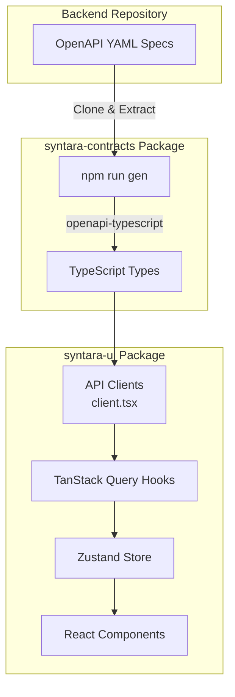
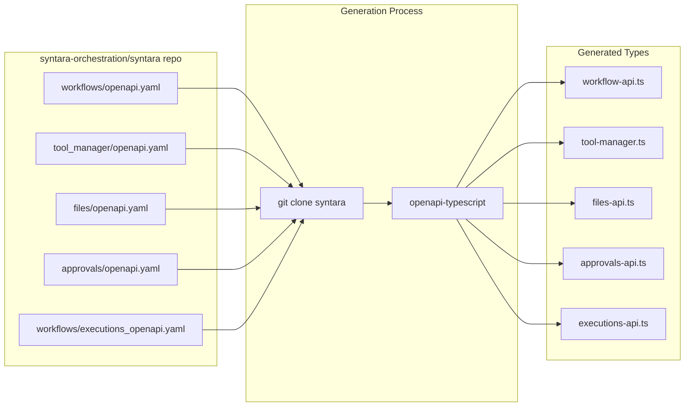
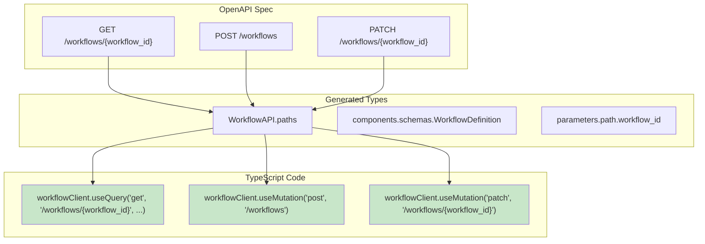
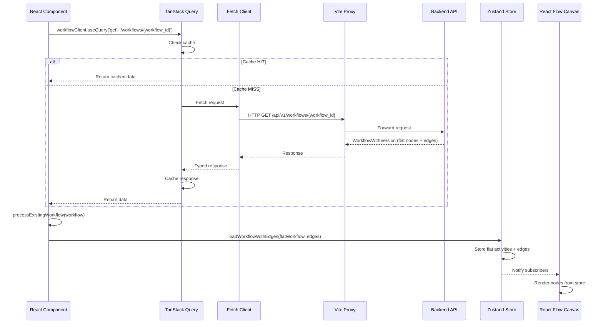
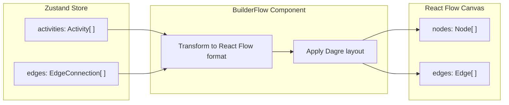
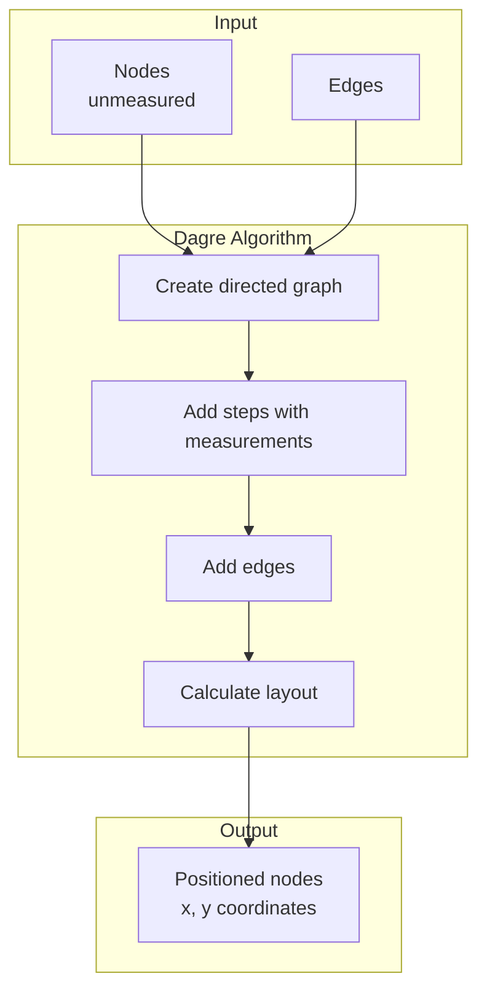
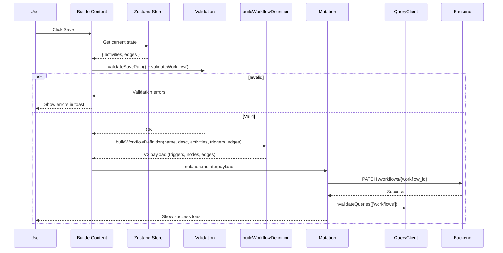

# Data Flow: From OpenAPI to Canvas Steps

> **Reading time**: ~15 minutes
> **Audience**: Developers working on the workflow builder or API integration

This document explains **how data flows from the backend API to the UI**, focusing on OpenAPI contract generation, type-safe API calls, and the transformation of backend workflow structures into **canvas steps** (each rendered as a React Flow **node** in code).

---

## Table of Contents

1. [Overview](#overview)
2. [OpenAPI Contract Generation](#openapi-contract-generation)
3. [Type-Safe API Clients](#type-safe-api-clients)
4. [Data Flow: Backend to UI](#data-flow-backend-to-ui)
5. [V2 Workflow Format](#v2-workflow-format)
6. [Canvas Rendering](#canvas-rendering)
7. [Saving: Building the V2 Payload](#saving-building-the-v2-payload)

---

## Overview

The Syntara UI follows a **type-driven architecture** where TypeScript types are automatically generated from the backend's OpenAPI specification. This ensures type safety from the API all the way to the UI components.



---

## OpenAPI Contract Generation

### The Generation Process

Types are generated from OpenAPI specs in the backend repository:



### How to Regenerate Types

When the backend API changes:

```bash
# From the repository root
npm run gen
```

**What happens:**

1. **Clone backend repo** - Downloads latest OpenAPI specs from `syntara-orchestration/syntara`
2. **Generate types** - Runs `openapi-typescript` on each YAML spec
3. **Create TypeScript files** - Outputs type definitions to `packages/syntara-contracts/src/`
4. **Copy examples** - Copies workflow examples for the mock API
5. **Clean up** - Removes cloned repository
6. **Format** - Runs prettier on generated files

### Location of Files

```text
packages/syntara-contracts/
├── package.json           # Generation scripts
└── src/
    ├── workflow-api.ts    # Generated workflow types
    ├── tool-manager.ts    # Generated tool manager types (unified tools & providers)
    ├── files-api.ts       # Generated files API types
    ├── approvals-api.ts   # Generated approvals types
    ├── authz-api.ts       # Generated authorization types (can_i, what_can_i)
    ├── interfaces.ts      # Shared interfaces and enum constants
    └── index.ts           # Exports all types
```

---

## Type-Safe API Clients

### Client Creation

The UI creates API clients using the generated types:

```typescript
// packages/syntara-ui/src/client.tsx

import type { ApprovalsAPI, ExecutionsAPI, ToolManagerAPI, WorkflowAPI } from '@syntara/contracts'
import createFetchClient from 'openapi-fetch'
import createClient from 'openapi-react-query'

// Workflow API client
const workflowFetchClient = createFetchClient<WorkflowAPI.paths>({
  baseUrl: '/api/v1/',
})
export const workflowClient = createClient(workflowFetchClient)

// Executions API client
const executionsFetchClient = createFetchClient<ExecutionsAPI.paths>({
  baseUrl: '/api/v1/',
})
export const executionsClient = createClient(executionsFetchClient)

// Tool Manager API client (unified tools & providers)
const toolManagerFetchClient = createFetchClient<ToolManagerAPI.paths>({
  baseUrl: '/api/v1/tool_manager/',
})
export const toolManagerClient = createClient(toolManagerFetchClient)

// Approvals API client
const approvalsFetchClient = createFetchClient<ApprovalsAPI.paths>({
  baseUrl: '/api/v1/',
})
export const approvalsClient = createClient(approvalsFetchClient)

// Settings API client
const settingsFetchClient = createFetchClient<SettingsAPI.paths>({
  baseUrl: '/api/v1/',
})
settingsFetchClient.use(authMiddleware)
export const settingsClient = createClient(settingsFetchClient)
```

The authorization API client is defined separately in `routes/access/accessClient.ts`:

```typescript
// Authorization API client (can_i, what_can_i)
const accessFetchClient = createFetchClient<AuthzAPI.paths>({
  baseUrl: '/api/v1/',
})
accessFetchClient.use(authMiddleware)
```

This client is consumed by `useCanI` (single permission check) and `usePermissionChecks` (batch checks for nav filtering). Permissions are cached with `staleTime: Infinity` and cleared on logout via `queryClient.clear()`. See [`docs/permissions-rbac.md`](permissions-rbac.md) for the full authorization data flow.

> **Note:** File uploads use a direct fetch call via the `useFileUploadWithProgress` hook (not a generated client), since `openapi-react-query` doesn't support upload progress tracking.

### Type Safety Benefits



**TypeScript will catch errors if:**

- Wrong HTTP method used
- Incorrect endpoint path
- Missing required parameters
- Wrong request body structure
- Invalid response handling

---

## Data Flow: Backend to UI

### Complete Flow Diagram



### Request Example

```typescript
// In a React component
function BuilderEdit() {
  const { workflowId } = useParams()

  // Type-safe query with auto-complete
  const {
    data: workflow,
    isLoading,
    error,
  } = workflowClient.useQuery('get', '/workflows/{workflow_id}', {
    params: {
      path: { workflow_id: workflowId },
    },
  })

  // workflow is fully typed as WorkflowWithVersion
  if (workflow) {
    // Process v2 flat format into store representation
    const { flattenedWorkflow, generatedEdges } = processExistingWorkflow(workflow)
    loadWorkflowWithEdges(flattenedWorkflow, generatedEdges)
  }
}
```

### Mutation Example

```typescript
// Saving a workflow
function handleSave() {
  // Note: Uses PATCH, not PUT
  const mutation = workflowClient.useMutation('patch', '/workflows/{workflow_id}')

  const workflow = useWorkflowStore.getState().currentWorkflow
  const edges = useWorkflowStore.getState().edges

  // Build v2 payload with security validation and port mapping
  const payload = buildWorkflowDefinition(
    workflow.name,
    workflow.description,
    workflow.activities,
    workflow.triggers,
    edges
  )

  mutation.mutate({
    params: {
      path: { workflow_id: workflow.id },
    },
    body: payload,
  })
}
```

**Note:** With the v2 API, workflows are already flat (nodes + edges). The save path uses `buildWorkflowDefinition()` to produce the v2 payload with security validation and port mapping.

---

## V2 Workflow Format

With the v2 API, the backend and builder share the same flat format. No nested↔flat transformation is needed.

### V2 API Format

```typescript
{
  schema_version: '2.0.0',
  triggers: [{ id: 'manual_trigger', type: 'manual_trigger', config: {} }],
  nodes: [
    { id: 'condition1', type: 'condition', config: { expression: '...' } },
    { id: 'task1', type: 'script', config: { language: 'python', code: '...' } },
    { id: 'task2', type: 'script', config: { ... } },
  ],
  edges: [
    { from: 'manual_trigger', to: 'condition1' },
    { from: 'condition1', to: 'task1', from_port: 'true' },
    { from: 'condition1', to: 'task2', from_port: 'false' },
  ]
}
```

### Port ↔ Handle Mapping

The only transformation between API and builder is port name mapping:

| V2 API Port (`from_port`) | React Flow Handle (`sourceHandle`) |
| ------------------------- | ---------------------------------- |
| `true`                    | `true`                             |
| `false`                   | `false`                            |
| `iterate`                 | `loop`                             |
| `complete`                | `done`                             |
| _(none)_                  | `source`                           |

This mapping is handled by `v2PortToHandle()` (load) and `handleToV2Port()` (save) in `edgeHelpers.ts`.

---

## Canvas Rendering

### From Store to React Flow

Once the workflow is in the Zustand store, `BuilderFlow` converts it to React Flow format:



### Activity type → React Flow component mapping

```typescript
// Each activity type maps to a React Flow node `type` string + component
const nodeTypes = {
  task: TaskNode,
  condition: ConditionNode,
  loop: LoopNode,
  converge: ConvergeNode,
  parallel: ParallelNode,
  // ... etc
}

// BuilderFlow creates React Flow nodes
const nodes = activities.map((activity) => ({
  id: activity.id,
  type: activity.type,
  data: activity,
  position: { x: 0, y: 0 }, // Set by Dagre layout
}))
```

### Layout with Dagre



Special handling:

- **Loop steps**: Body positioned to the right (not below) to avoid circular layout
- **Button edges**: Inserted between canvas steps (React Flow nodes) as "add a step here" affordances

---

## Saving: Building the V2 Payload

### Build Operation

When saving, `buildWorkflowDefinition()` produces the v2 API payload directly from the flat store state:

```typescript
// packages/syntara-ui/src/routes/builder/utils/workflowDefinitionBuilder.ts

export function buildWorkflowDefinition(
  workflowName: string,
  workflowDescription: string,
  activities: Activity[],
  triggers: Activity[],
  edges: EdgeConnection[]
) {
  // 1. Validate and sanitize all IDs (security)
  validateEntityIds(activities, triggers, edges)

  // 2. Build v2 payload
  return {
    schema_version: '2.0.0',
    name: sanitizedName,
    description: sanitizedDescription,
    triggers: triggers.map(t => ({ id: t.id, type: t.type, config: t.config ?? {} })),
    nodes: activities.map(a => ({ id: a.id, type: a.type, config: a.config ?? {}, ... })),
    edges: edges.map(e => ({
      from: resolveTriggerId(e.source, triggers),  // trigger-0 → real ID
      to: resolveTriggerId(e.target, triggers),
      ...(fromPort && { from_port: handleToV2Port(e.sourceHandle) }),  // loop → iterate
    })),
  }
}
```

### Save Flow



**Save flow details:**

1. **Validation**: `validateSavePath()` checks graph connectivity, `validateWorkflow()` checks data integrity
2. **Build v2 payload**: `buildWorkflowDefinition()` maps handles to v2 ports, resolves trigger IDs, sanitizes inputs, and produces `{ schema_version: '2.0.0', triggers, nodes, edges }`
3. **HTTP Method**: Uses `PATCH`, not `PUT`
4. **Cache invalidation**: After success, `queryClient.invalidateQueries()` refreshes the workflow list

---

## Summary

### Key Concepts

1. **OpenAPI Contracts** — Types generated from backend YAML specs
2. **Type-Safe Clients** — 10 authenticated API clients with full TypeScript support
3. **V2 Flat Format** — Both API and builder use flat nodes + edges (no transformation needed)
4. **Port ↔ Handle Mapping** — Only conversion: v2 port names to React Flow handles
5. **TanStack Query** — Manages server state, caching, mutations
6. **Zustand Store** — Holds workflow during editing (with undo/redo)
7. **React Flow** — Renders visual canvas

### Critical Files

| File                                                                                                                                                        | Purpose                   |
| ----------------------------------------------------------------------------------------------------------------------------------------------------------- | ------------------------- |
| [`packages/syntara-contracts/package.json`](../packages/syntara-contracts/package.json)                                                                     | Type generation scripts   |
| [`packages/syntara-ui/src/client.tsx`](../packages/syntara-ui/src/client.tsx)                                                                               | API client creation       |
| [`packages/syntara-ui/src/routes/builder/utils/processExistingWorkflow.ts`](../packages/syntara-ui/src/routes/builder/utils/processExistingWorkflow.ts)     | Load workflow from API    |
| [`packages/syntara-ui/src/routes/builder/utils/workflowDefinitionBuilder.ts`](../packages/syntara-ui/src/routes/builder/utils/workflowDefinitionBuilder.ts) | Build v2 save payload     |
| [`packages/syntara-ui/src/routes/builder/BuilderFlow.tsx`](../packages/syntara-ui/src/routes/builder/BuilderFlow.tsx)                                       | Canvas rendering          |
| [`packages/syntara-ui/src/stores/useWorkflowStore.ts`](../packages/syntara-ui/src/stores/useWorkflowStore.ts)                                               | Workflow state management |
| [`packages/syntara-ui/src/stores/useAuthStore.ts`](../packages/syntara-ui/src/stores/useAuthStore.ts)                                                       | Authentication state      |

### Data Flow Summary

```
Backend YAML Specs
    ↓ [npm run gen]
TypeScript Types
    ↓ [createClient]
API Clients (10 — each uses authMiddleware; see client.tsx)
    ↓ [useQuery/useMutation]
TanStack Query
    ↓ [processExistingWorkflow]
Zustand Store (flat nodes + edges)
    ↓ [BuilderFlow]
React Flow Canvas
    ↓ [User edits]
Zustand Store (updated)
    ↓ [buildWorkflowDefinition]
V2 API Payload
    ↓ [mutation]
Backend API
```
