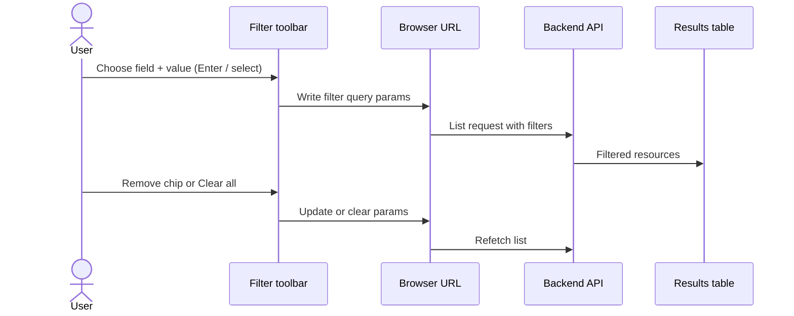

# Using search and filters

> **Audience**: End users, and contributors documenting filter UX  
> **Related**: [API Filtering Architecture](../architecture.md#api-filtering-architecture) · [Filter test helpers](../TEST_HELPERS_FILTER_TESTING.md)

List pages (Workflows, Credentials, Executions, Approvals, Integrations, Users, Groups, and others) support **server-side** search and filters. Applied filters update the table results and the browser URL so you can bookmark or share a filtered view.

---

## Toolbar layout

Typical list filter toolbar (Workflows list with the Name attribute search ready):

1. **Attribute search** — Choose a field (for example Name, Keyword, Status), enter or select a value, then apply (press **Enter** or use the apply control).
2. **Active filter chips** — Each applied filter appears as a removable chip under the inputs.
3. **Clear all filters** — Removes every chip and restores the unfiltered list (page 1).

Some pages also show standalone controls (toggles, multi-selects, or label editors) next to the attribute search.

When filters match nothing, the list shows a filtered empty state (not the “create first resource” empty state):

Credentials and other list pages use the same pattern (keyword/name text filter + chips + clear all):

---

## Keyword search behavior

“Keyword” (or “Name” on some pages) is a **text** filter over the resource name:

| Behavior        | Detail                                                                                    |
| --------------- | ----------------------------------------------------------------------------------------- |
| Match type      | Substring match (`contains`) — for example `deploy` matches `deploy-prod` and `my-deploy` |
| When it applies | Press **Enter** or click **Apply filter** (arrow) after typing — not on every keystroke   |
| URL form        | `name[contains]=your-text`                                                                |
| Clearing        | Delete the chip, use Clear all, or clear the text field and apply                         |

There is no separate always-on search box outside the filter toolbar. Keyword/Name is one of the attribute-search fields.

**Examples:**

- Credentials: filter field labeled **Keyword** → `/credentials?name[contains]=vault`
- Workflows: filter field labeled **Name** → `/workflows?name[contains]=deploy`

---

## Available filter types

| Type             | What you see                                                      | Typical use                                                                 |
| ---------------- | ----------------------------------------------------------------- | --------------------------------------------------------------------------- |
| **Text**         | Text field in attribute search                                    | Name / keyword substring match                                              |
| **Select**       | Dropdown of fixed or typeahead options                            | Status, enabled/disabled, workflow picker                                   |
| **Multi-select** | Standalone checkbox control (Select All / Clear All, count badge) | Multiple statuses/states when the API supports `in` (e.g. Approvals status) |
| **Date range**   | Start and end date controls                                       | Created/updated windows (`gte` / `lte`)                                     |
| **Boolean**      | Standalone toggle                                                 | True/false flags                                                            |
| **Labels**       | Key/value pairs                                                   | Resources tagged with labels                                                |

Not every list exposes every type. Fields are limited to what that API supports.

---

## Shareable filtered URLs

When you apply filters, the address bar updates. Copy the full URL to share the same view with a teammate (they land on page 1 of the filtered results).

| Page        | Example URL                                        |
| ----------- | -------------------------------------------------- |
| Workflows   | `/workflows?name[contains]=deploy&is_enabled=true` |
| Credentials | `/credentials?name[contains]=vault`                |
| Executions  | `/executions?workflow_id=<uuid>&status=failed`     |

**Notes:**

- Filter parameters are in the URL; the **pagination cursor is not** — shared links always start at the first page of results.
- Removing chips or Clear all updates (or clears) the query string.
- Opening a filtered URL restores those filters automatically.

---

## Common interactions

### Apply a text / keyword filter

1. Open a list page (for example **Workflows** or **Credentials**).
2. In the filter toolbar, select **Name** or **Keyword**.
3. Type part of the name and press **Enter** (or click the **Apply filter** arrow).
4. Confirm the table shows matching rows and a chip appears (for example `Name: vault` or `Keyword: vault`).
5. Confirm the URL includes `name[contains]=…`.

### Apply a select filter

1. Choose a select field (for example **State** or **Status**).
2. Pick an option from the dropdown.
3. The filter applies immediately; a chip appears and the table refreshes.

### Remove one filter

Click the **×** on that filter’s chip. Other filters stay active.

### Clear all filters

Click **Clear all filters**. All chips disappear, the URL loses filter params, and the full list returns.

### Empty filtered results

If no rows match, the page shows a filtered empty state with an action to clear filters (not the “create first resource” empty state).

---

## Where filters appear

| Area                                                    | Filtering style                                           |
| ------------------------------------------------------- | --------------------------------------------------------- |
| Most list pages (Workflows, Credentials, Executions, …) | Server-side + URL-synced                                  |
| Execution details **Activity** table                    | Client-side filters in the panel (not written to the URL) |
| Builder **Run history** panel                           | Panel-scoped filters for that workflow’s runs             |

---

## Capturing UI screenshots (contributors)

Images under `docs/user-guides/images/` were taken from the frontend visual-regression baselines (`workflows-list`, `workflows-list-empty-filter`, `credentials-list-empty-filter`). When filter UX changes:

1. Update visual-regression baselines (`npm run e2e:visual-regression:update` — see `packages/syntara-ui/VISUAL_REGRESSION.md`).
2. Refresh the copies in `docs/user-guides/images/` if the toolbar/empty-state appearance changed.
3. Prefer short screen recordings (GIF/WebM) in PR descriptions for apply → chip → clear flows.

Live filter toolbar examples also appear in Storybook under list panel stories (`SynListPanel`).

---

## For developers

- Architecture and component APIs: [API Filtering Architecture](../architecture.md#api-filtering-architecture)
- Adding filters to a new list page: [AGENTS.md — How do I add filters to a list page?](../../AGENTS.md#how-do-i-add-filters-to-a-list-page)
- Coding standards: `.claude/skills/frontend-coding-standards/SKILL.md` (`useCursorPagination`)
- Unit tests: [Filter test helpers](../TEST_HELPERS_FILTER_TESTING.md)
