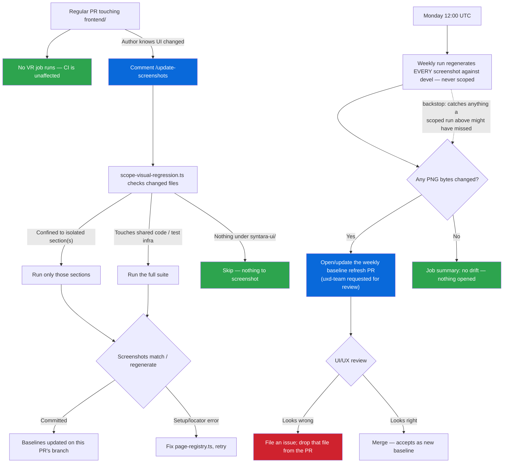

# Visual Regression Testing

Automated screenshot testing for every page in the application.

## System Overview — How This Should Work

There is **exactly one test suite** (`page-screenshots.spec.ts`, driven by the page registry) and **three ways it gets run.** Understanding those three is the whole mental model — everything else in this document is detail underneath them.

| #   | Mechanism                   | Trigger                            | Scope                                                                                                   | Who acts on the result                      |
| --- | --------------------------- | ---------------------------------- | ------------------------------------------------------------------------------------------------------- | ------------------------------------------- |
| 1   | **Nothing, automatically**  | A regular PR is opened/updated     | N/A — no job runs at all                                                                                | Nobody. This is intentional; see below.     |
| 2   | **`/update-screenshots`**   | PR author comments it, on demand   | Scoped to the pages the PR could plausibly affect, when that's provably safe — otherwise the full suite | The PR author, immediately                  |
| 3   | **Weekly baseline refresh** | `schedule` cron, Mondays 12:00 UTC | Always the full suite, no exceptions                                                                    | `uxd-team`, on a predictable weekly cadence |

Why it's built this way, in order:

1. **No per-PR CI job exists.** VR previously ran on every PR and was flaky enough (ReactFlow canvas non-determinism, CI-load timing) that it got ripped out entirely — see PR #305. Re-adding it as a blocking or even non-blocking-but-automatic per-PR check would reintroduce that risk. So there is no `visual-regression` job in `ci-frontend.yml` at all. A regular PR cannot be slowed down, blocked, or made flaky by VR, full stop.
2. **The PR author decides when they need it.** If you know your change touches UI, you ask for baselines with `/update-screenshots` and get them on your own branch, in your own PR, on your own timeline — not gated by CI, not something a reviewer has to wait on. See [Scoped `/update-screenshots` Runs](#scoped-update-screenshots-runs).
3. **Nobody else has to remember to ask.** If a PR touches UI but the author forgets (or doesn't realize the blast radius of a shared component change), the weekly job catches it within a week regardless — it always runs everything against `devel`, with no scoping and no opt-in required. This is the backstop that makes the whole system safe even when step 2 is skipped or wrong. See [Weekly Baseline Refresh](#weekly-baseline-refresh).

If you remember nothing else: **step 1 makes VR harmless, step 2 makes it convenient, step 3 makes it complete.** Any change to this system should preserve all three properties — in particular, nothing should ever make VR block a PR again, and nothing should ever remove the weekly full sweep, because it's the only thing guaranteeing that a scoping mistake in step 2 can't cause permanent drift.

## How It Works

- **Baselines** are Linux-generated PNGs committed in the repo under `e2e/visual-regression/page-screenshots.spec.ts-snapshots/`.
- **No per-PR gate.** Visual regression does **not** run automatically on individual PRs — there's no CI job in `ci-frontend.yml` for it, so it can't fail, block, or slow down a regular PR's review cycle.
- **Weekly baseline refresh** — every Monday at 12:00 UTC, VR runs against `devel` HEAD and opens (or updates) a PR containing only the screenshots that actually changed since last Monday. This is the primary drift-catching mechanism, owned by `uxd-team` on a predictable cadence — see [Weekly Baseline Refresh](#weekly-baseline-refresh) below.
- **`/update-screenshots`** is a PR comment command that regenerates baselines on Ubuntu and commits them to your branch. This is the manual, on-demand path: use it on your own PR when you know it changes the UI and want updated baselines immediately rather than waiting for Monday. It scopes itself to just the pages your PR could affect when that's safe to do — see [Scoped `/update-screenshots` Runs](#scoped-update-screenshots-runs).
- **Concurrency:** Only one `/update-screenshots` run is active per PR at a time (`cancel-in-progress: true`). Posting the command again before the current run finishes cancels it and restarts from scratch. A full run takes ~12-17 minutes; a scoped run is proportionally faster — post it once and wait.
- **Troubleshooting `/update-screenshots`:** The workflow only commits when Playwright actually writes new/changed PNGs.
  - If the PR comment says **"already up to date"**, the failure is often a **setup/locator error** (test never reached `toHaveScreenshot`), not a pixel diff — no PNGs change, so the bot has nothing to commit. Download the `frontend-update-baselines-results` artifact or check the **Update Visual Baselines** workflow log; look for `expect(locator).toBeVisible` failures in `page-registry.ts` `setup`/`waitFor`, not `toHaveScreenshot` mismatches.
  - If you deleted baselines and expected a regen, confirm **page-screenshots** tests ran (not skipped). Repository or organization Actions variables must **not** set `SYNTARA_E2E_SKIP_WEB_SERVER` to a random non-empty value — only `1` / `true` / `yes` skip mock webServer + snapshot tests. The baseline workflow forces this var off at the job level as a safeguard.
  - After fixing registry locators, comment `/update-screenshots` again (or run locally — see [Commands](#commands)).
- **macOS snapshots** are gitignored. Only Linux baselines are used in CI.
- **Explicit viewport** (1280x720) is set in `playwright.config.ts` so every screenshot uses identical dimensions regardless of the runner's display.
- **`fullPage: true`** captures the entire scrollable page, including content below the fold.
- **Pinned runner** — both the weekly workflow and `/update-screenshots` use `ubuntu-24.04` (not `ubuntu-latest`) to guarantee consistent font rendering and system libraries across runs.

## Workflow Overview



**Key points:**

- Visual regression **does not run automatically on PRs** — no CI job, nothing to block or slow down review
- Use `/update-screenshots` on your own PR when you intentionally changed the UI and want baselines updated now — it runs only the sections your change could affect when that's provably safe, otherwise the full suite (see [Scoped `/update-screenshots` Runs](#scoped-update-screenshots-runs))
- The **weekly refresh PR** (Mondays, 12:00 UTC) is the only automatic mechanism, always runs the full unscoped suite, and is a review/reporting artifact, not a CI gate — it's also the backstop that catches anything the scoped path above might miss

## Scoped `/update-screenshots` Runs

`/update-screenshots` doesn't always re-render all ~140 pages. `scripts/scope-visual-regression.ts` looks at exactly which files your PR changed and decides how much of the suite actually needs to run.

`update-visual-baselines.yml` (the workflow behind `/update-screenshots`) checks out `refs/pull/<N>/merge` — GitHub's own precomputed merge of your branch into its base — rather than your raw branch, so baselines are generated from the identical code `ci-frontend.yml` actually renders. That merge commit has two parents (the base branch tip, and your PR's real head), so diffing them gives exactly your PR's changed files, independent of how many commits are on the branch or whether it's been rebased.

**The rule is an allowlist, not a denylist — it only narrows the run when it can prove it's safe:**

| Your PR changed...                                                                                                                                                                                                             | What runs                                                                                                                                                                  | Why                                                                                                                                                                                                                                                                          |
| ------------------------------------------------------------------------------------------------------------------------------------------------------------------------------------------------------------------------------ | -------------------------------------------------------------------------------------------------------------------------------------------------------------------------- | ---------------------------------------------------------------------------------------------------------------------------------------------------------------------------------------------------------------------------------------------------------------------------- |
| Only files under an isolated route folder, e.g. `src/routes/workflows/**`                                                                                                                                                      | Just that section's tests (`--grep`)                                                                                                                                       | Nothing else in the app renders that code, so nothing else could need a new baseline                                                                                                                                                                                         |
| Files in two isolated folders, e.g. `src/routes/workflows/**` and `src/routes/approvals/**`                                                                                                                                    | Both sections' tests, nothing else                                                                                                                                         | Same reasoning, per changed folder                                                                                                                                                                                                                                           |
| A shared file — `src/components/`, `src/hooks/`, `src/providers/`, `src/stores/`, or the VR test infrastructure itself (`page-registry.ts`, `page-entries-interactive.ts`, `page-screenshots.spec.ts`, `stabilizeViewport.ts`) | The **full suite**                                                                                                                                                         | Shared code can affect pages in any section — there's no folder boundary to trust                                                                                                                                                                                            |
| Anything under `frontend/packages/syntara-mock-api/**` or `frontend/packages/syntara-contracts/**` (alone or with other UI files)                                                                                              | The **full suite**                                                                                                                                                         | Mock handlers and contract types can change what every page renders — scoping to one route would under-update                                                                                                                                                                |
| Nothing VR-relevant at all (e.g. a backend-only PR with no frontend package changes)                                                                                                                                           | **Nothing** — the job skips screenshot generation and Chromium install entirely                                                                                            | There's nothing to screenshot                                                                                                                                                                                                                                                |
| Anything under `src/routes/access-management/**`                                                                                                                                                                               | The **whole access-management bucket** (all `access-management/*` sections, plus `authentication` and `permission-gating`) — one combined group, never sub-divided further | Tab/panel components (role assignments, policies, check-access) are shared across users, groups, and projects, and `authentication`/`permission-gating` exercise those same shared permission hooks — see the comment in `scope-visual-regression.ts` for the full reasoning |

The PR comment posted by `/update-screenshots` always states which of these happened (scoped to specific sections, full run, or skipped), so it's never a silent guess — if you expected a scoped run and got a full one, check the comment for why before assuming something's broken.

**This is deliberately biased toward running more, not less.** Under-scoping (skipping a page that actually needed a new baseline) is a worse failure than over-scoping (running pages that didn't need it) — the former fails silently, the latter just costs a few extra CI minutes. Every ambiguous case defaults to a full run.

**The weekly cron is the backstop for this heuristic.** It never scopes — it always regenerates and diffs every single page against `devel`, unconditionally. So even if a rule in `scope-visual-regression.ts` is wrong or incomplete and a scoped `/update-screenshots` run misses a page that needed updating, that staleness is caught and surfaced to `uxd-team` on the very next Monday at the latest. No scoping bug in the manual path can cause permanent, undetected drift.

If you add a new top-level route folder under `src/routes/`, consider whether it should get its own entry in the `SCOPE_RULES` table at the top of `scripts/scope-visual-regression.ts` — if you don't, PRs touching that folder will simply always trigger a full run, which is correct-but-slower, never incorrect.

## Weekly Baseline Refresh

`.github/workflows/visual-regression-schedule.yml` runs every Monday at 12:00 UTC (also triggerable manually via `workflow_dispatch`):

1. Checks out `devel` HEAD and regenerates every screenshot with `--update-snapshots`.
2. Diffs the regenerated PNGs against what's checked in — Playwright rewrites every file it captures regardless of whether the pixels changed, so this diff (not Playwright's own pass/fail) is what determines which files are genuinely different.
3. If nothing changed, it writes a "no drift" job summary and stops — no PR, no noise.
4. If something changed, it opens a PR (branch `visual-regression/weekly-refresh`, base `devel`) containing only the changed/new PNGs, requests review from `uxd-team`, and lists the added/modified counts in the PR body.

**Reviewing the weekly PR:** open the **Files changed** tab. GitHub renders a native diff view for each changed PNG (2-up, swipe, or onion skin). For anything that looks like an unintended regression, file a follow-up issue and either drop that file from the PR (its previous baseline stays authoritative until the fix lands) or leave it if the fix is expected before next Monday.

**Merging the weekly PR** accepts every remaining image as the new baseline, used by `/update-screenshots` and by every future weekly run's diff.

The branch name is fixed and reused week to week: if last Monday's PR is still open when the job runs again, it pushes the latest diff to that same PR instead of opening a duplicate. Merging (or closing) it lets the following Monday's run start a fresh branch from current `devel`.

**Note:** GitHub's default `GITHUB_TOKEN` can't always request team review (`team-reviewers`) depending on org settings — if the reviewer request silently doesn't land, the PR is still opened and visible in the Actions job summary link; the review request is a convenience, not the only way `uxd-team` finds it.

## Three Flows

### Flow 1: Adding a New Page

1. Add your route to `AppRoute.tsx`
2. Add an entry to `e2e/visual-regression/page-registry.ts`:
   ```typescript
   {
     section: 'my-section',
     name: 'my-page',
     path: '/my-section/my-page',
     waitFor: async (page) => {
       await expect(page.getByRole('heading', { name: 'My Page' })).toBeVisible()
     },
   },
   ```
3. Comment `/update-screenshots` on the PR to generate Linux baselines
4. The workflow generates baselines and commits them to your branch

If the route is intentionally unimplemented, add it to `excludedUnimplemented` in `page-registry.ts` instead.

### Flow 2: Modifying an Existing Page

1. Make your UI changes
2. Comment `/update-screenshots` on the PR to regenerate baselines
3. Review the updated baseline PNGs in the PR's Files Changed tab

Baseline regeneration uses `--update-snapshots=all` so even sub-threshold diffs
(for example a masked nav logo of only a few hundred pixels under
`maxDiffPixelRatio: 0.005`) are rewritten into the committed PNGs.

### Flow 3: Removing a Page

1. Remove the route from `AppRoute.tsx`
2. Remove the entry from `page-registry.ts`
3. Delete the baseline PNG files from `e2e/visual-regression/page-screenshots.spec.ts-snapshots/`

The enforcement script warns about orphan baselines (PNG files with no matching registry entry), so step 3 is required.

## Canvas Pages (ReactFlow)

Pages that render a ReactFlow canvas (workflow builder, execution visualizer) use **masking** to produce deterministic screenshots.

- Set `perceptual: true` on any entry that renders `.react-flow` — this signals the test runner to mask the ReactFlow canvas with a solid rectangle (`#e8e8e8`) before comparison.
- Masking replaces the canvas area entirely, so node positions, edge routing, and `fitView()` floating-point output no longer affect the diff. The surrounding UI chrome (toolbar, side panels, breadcrumbs) is still pixel-compared and will catch real regressions.
- Set `maskCanvas: false` for step/trigger form entries that open `NodeEditorOverlay`. That overlay is `position: absolute; inset: 0` over the same box as `.react-flow`, so a canvas mask would paint solid grey over the form and `--update-snapshots` would commit empty baselines.
- The `CanvasPageEntry` type enforces `perceptual: true` for dedicated arrays (`builderInteractivePages`, etc.). A runtime check throws if any `workflows/` entry is missing it.
- `stabilizeReactFlowViewport` still runs before the screenshot — it ensures the canvas has finished rendering (and the surrounding UI has settled) before we capture, even though the canvas itself is usually masked.
- No `maxDiffPixelRatio` overrides are needed on canvas entries: since the canvas is masked (or covered by the node editor overlay), the only pixel differences are in the non-canvas chrome, which should be fully deterministic.

## Brand Chrome Masking

Every screenshot also masks **brand-variable chrome** with the same `#e8e8e8` fill (`brandMasks.ts`):

- Nav / masthead logos (`data-testid="brand-logo"`)
- Login brand art (`.vr-login-brand-logo`)
- Login title (`Log in to …`) and the login aside copy that embeds the app title
- IdP group-mapping copy that embeds `APP_TITLE` (column headers, helpers, select labels)

These baselines live in this repo. Masking keeps them focused on feature UI so
logo art and app-title strings do not thrash every screenshot when brand assets
or `APP_TITLE` change. Do **not** set `maskCanvas: false` thinking it disables
brand masks — canvas masking and brand masking are independent.

Collapsed nav logos are small enough that a logo-only pixel diff can sit under
`maxDiffPixelRatio: 0.005`. Masking still paints `#e8e8e8` into regenerated
baselines (via `--update-snapshots=all`) so reviews show consistent grey brand
chrome rather than a particular logo asset.

## Multiple States Per Page

A single page can have multiple registry entries for different visual states:

- **Empty/filtered state** — use `setup` to type a non-matching filter term
- **Modals/dialogs** — use `setup` to click the button that opens the modal
- **Kebab menu actions** — use `setup` to open a row's kebab and trigger a dialog
- **Detail pages** — use mock API IDs for `:id` parameters in the path
- **Form pages** — navigate directly to the create/edit route
- **Dropdown states** — use `setup` to open a dropdown and capture its expanded state

See existing entries in `page-registry.ts` for examples.

## CI vs Local

|                   | CI (GitHub Actions)                                              | Local development                  |
| ----------------- | ---------------------------------------------------------------- | ---------------------------------- |
| **App server**    | `vite build` + `vite preview`                                    | `vite` (dev server)                |
| **Why**           | Production build reads source files fresh — no transform caching | Dev server is faster for iteration |
| **Controlled by** | `process.env.CI` in `playwright.config.ts`                       | Absence of `CI` env var            |

The `playwright.config.ts` webServer command switches automatically: when `CI` is set (all GitHub Actions runners), it runs a full production build then serves the static output. Locally, it uses the Vite dev server. The mock API server is the same in both cases.

## Running Locally

From the **repo root** (uses `packages/syntara-ui` so `playwright.config.ts` and `webServer` start mock API + UI on **4173** / **3300**):

```bash
# Compare baselines (macOS — results will differ from CI baselines due to font rendering)
npm run e2e:visual-regression

# Update baselines locally (macOS — for local dev only; Linux PNGs are what CI uses)
npm run e2e:visual-regression:update

# Run the baseline enforcement check
npm run check:visual-baselines
```

> **Note:** macOS baselines are gitignored. Screenshots taken on macOS will not match Linux CI baselines — use the container workflow below to get pixel-identical results.

## Running in a Container (CI-Matching Screenshots)

macOS and Linux render fonts differently, so screenshots taken on macOS will not match the Linux baselines used in CI. The container workflow runs tests inside a Linux container that matches the CI runner exactly.

**Supports both Docker and Podman** — the script auto-detects whichever is installed.

### Prerequisites

**Podman (recommended on macOS):**

```bash
brew install podman
podman machine init --memory 4096
podman machine start
```

> The Podman machine needs at least **4 GB RAM** (checked automatically).

**Docker:**

```bash
# Install Docker Desktop from https://docs.docker.com/get-docker/
# Ensure Docker Desktop is running before using the container script
```

### Commands

**Compare baselines** (fail if screenshots differ from committed baselines):

```bash
npm run e2e:visual-regression:container
```

**Update baselines** (regenerate Linux PNGs and copy back to your working tree):

```bash
npm run e2e:visual-regression:container:update
```

After updating, review changes with:

```bash
git diff --stat frontend/packages/syntara-ui/e2e/visual-regression/page-screenshots.spec.ts-snapshots/
```

### What Happens Under the Hood

1. The script detects your container runtime (Podman → Docker fallback)
2. Extracts the Playwright version from `package-lock.json`
3. Pulls `mcr.microsoft.com/playwright:v<version>-noble` (Ubuntu 24.04, x86_64) — matches CI exactly
4. Copies source files into the container (excluding `node_modules` and `.git`)
5. Runs `npm ci` + `vite build` inside the container
6. Starts the mock API and preview server, then runs the visual regression tests
7. Updated snapshots are copied back to your working tree

**First run** takes 8-10 minutes (pulling image + `npm ci` + build). Subsequent runs skip the image pull (~3-4 minutes).

### Troubleshooting

| Problem                         | Solution                                                                                           |
| ------------------------------- | -------------------------------------------------------------------------------------------------- |
| `Podman machine is not running` | `podman machine start`                                                                             |
| `At least 4096MB is required`   | `podman machine stop && podman machine set --memory 4096 && podman machine start`                  |
| `Docker daemon is not running`  | Open Docker Desktop or `sudo systemctl start docker`                                               |
| Disk space                      | The Playwright image is ~2 GB. Use `podman system prune` or `docker system prune` to reclaim space |

## Reviewing Screenshot Diffs

### After `/update-screenshots` on Your Own PR

1. Wait for the **Update Visual Baselines** workflow to finish (~12-17 minutes for a full run, faster for a scoped one) and post its result comment
2. If it committed changes, open your PR's **Files changed** tab — GitHub renders a native diff view for each changed PNG (2-up, swipe, or onion skin)
3. Confirm the changed screenshots match what you expected from your code change; if something unrelated also changed, that's worth investigating before merging

### On the Weekly Refresh PR (drift on `devel`)

1. Open the PR from branch `visual-regression/weekly-refresh` (linked from the workflow's Job Summary, or search PRs for that branch)
2. Open the **Files changed** tab — review each PNG using GitHub's 2-up, swipe, or onion skin modes
3. File an issue for anything that looks like a regression; drop that file from the PR if you don't want to accept it as the new baseline yet
4. Merge to accept the remaining images as the new baseline
